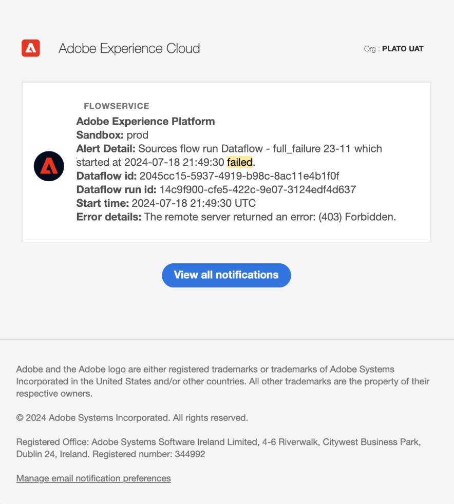
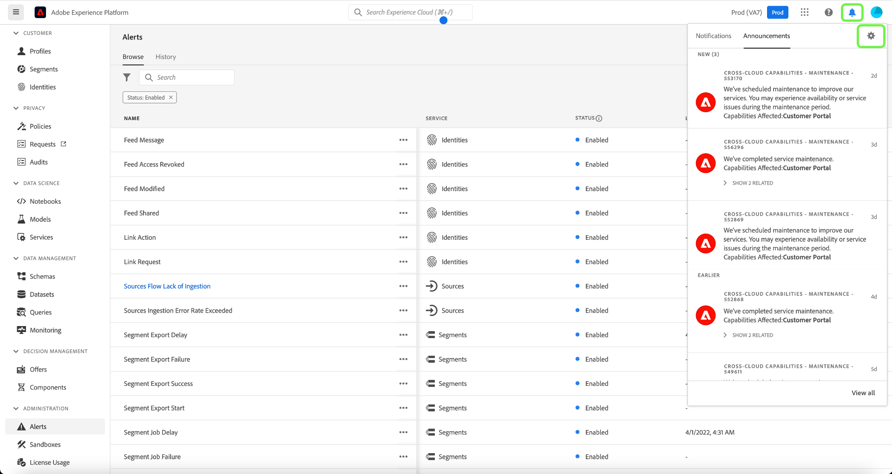

# Guía de IU de alertas

La interfaz de usuario de Adobe Experience Platform le permite ver un historial de alertas recibidas en función de las métricas reveladas por Adobe Experience Platform Observability Insights. La IU también le permite ver, habilitar, deshabilitar y suscribirse a las reglas de alerta disponibles.

>[!NOTE]
>
>Para ver una introducción a las alertas en Experience Platform, consulte la [descripción general de las alertas](./overview.md).

Para empezar, seleccione **[!UICONTROL Alertas]** en el panel de navegación izquierdo.

![Alertas que resaltan la página [!UICONTROL Alertas] en la navegación izquierda.](../images/alerts/ui/workspace.png)

## Administrar reglas de alerta {#manage-rules}

La ficha **[!UICONTROL Examinar]** enumera las reglas disponibles que pueden almacenar en déclencheur una alerta.

![Se muestra una lista de las alertas disponibles en la ficha [!UICONTROL Examinar].](../images/alerts/ui/rules.png)

Seleccione una regla de la lista para ver su descripción y sus parámetros de configuración en el carril derecho, incluidos el umbral y la gravedad.

Seleccione los puntos suspensivos (**...**) junto al nombre de una regla y aparecerá un menú desplegable con controles para habilitar o deshabilitar la alerta (según su estado actual) y para suscribirse o cancelar la suscripción a las notificaciones por correo electrónico de la alerta.

## Administrar suscriptores de alertas {#manage-subscribers}

>[!NOTE]
>
> Para asignar una alerta a un ID de usuario de Adobe, una dirección de correo electrónico externa o una lista de grupos de correo electrónico, debe ser administrador.

La ficha **[!UICONTROL Examinar]** enumera las reglas disponibles que pueden almacenar en déclencheur una alerta.

![Lista de reglas de alerta disponibles que se muestran en la ficha [!UICONTROL Examinar].](../images/alerts/ui/rules.png)

Seleccione los puntos suspensivos (**...**) junto al nombre de una regla y aparecerá un menú desplegable con los controles. Seleccione **[!UICONTROL Administrar suscriptores de alertas]**.

![Seleccione los puntos suspensivos para mostrar el menú desplegable. La opción [!UICONTROL Administrar suscriptores de alerta] está resaltada.](../images/alerts/ui/manage-alert-subscribers.png)

Aparecerá la página [!UICONTROL Administrar suscriptores de alertas]. Para asignar notificaciones a usuarios específicos, introduzca su ID de usuario de Adobe, su dirección de correo electrónico externa o una lista de grupos de correo electrónico y, a continuación, pulse Intro.

>[!NOTE]
>
>Para enviar este aviso a varios usuarios a la vez, proporcione una lista de ID de usuario o direcciones de correo electrónico separados por comas.

Las direcciones de correo electrónico aparecen en la lista de suscriptores actuales enumerados. Seleccione **[!UICONTROL Actualizar]**.

![La página de administración de suscriptores de alertas resalta a los suscriptores y [!UICONTROL actualiza].](../images/alerts/ui/manage-alert-subscribers-added-email.png)

Ha agregado correctamente usuarios a su lista de notificaciones de alerta. Los usuarios enviados recibirán ahora notificaciones por correo electrónico para esta alerta, tal como se ve en la siguiente imagen.

## Activar alertas de correo electrónico {#enable-email}

Las notificaciones de alerta se pueden enviar directamente al correo electrónico.

Seleccione el icono de campana () ubicado en la cinta superior a la derecha para mostrar notificaciones y anuncios. En el menú desplegable que aparece, seleccione el icono de engranaje () para acceder a la página de preferencias de Experience Cloud.

Se muestra la página **Perfil**. Seleccione **[!UICONTROL Notificaciones]** en el panel de navegación izquierdo para acceder a las preferencias de alertas por correo electrónico.

![La página Perfil que resalta [!UICONTROL Notificaciones] en la navegación izquierda.](../images/alerts/ui/profile.png)

Desplácese a la sección **Correos electrónicos** en la parte inferior de la página y seleccione **[!UICONTROL Notificaciones inmediatas]**

Las alertas a las que se haya suscrito ahora se enviarán a la dirección de correo electrónico conectada a la cuenta de Adobe ID.

## Personalizar umbral de alerta {#alert-threshold}

Los umbrales de alerta se pueden personalizar para los siguientes tipos de alerta:

| Tipo de alerta | Parámetro personalizado |
|---|---|
| Retraso de trabajo de segmento | Umbral de retraso |
| Retraso de exportación de segmentos | Umbral de retraso |
| Retraso de ejecución de flujo de destino | Umbral de retraso |
| Retraso de ejecución del flujo del servicio de identidad | Umbral de retraso |
| Retraso de ejecución de flujo de perfiles | Umbral de retraso |
| Retraso de ejecución de flujo de orígenes | Umbral de retraso |
| Retraso de ejecución de consulta | Umbral de retraso |
| Tasa de activación omitida superada | Umbral de error |
| Tasa de error de ingesta de orígenes superada | Umbral de error |

Seleccione los puntos suspensivos (**...**) junto al nombre de una regla y aparecerá un menú desplegable con los controles. Seleccione **[!UICONTROL Editar]**.

![La opción [!UICONTROL Editar] está resaltada para la regla seleccionada.](../images/alerts/ui/threshold-edit.png)

Aparecerá la página **[!UICONTROL Personalizar alerta]**. Actualice el umbral a los minutos que desee y luego seleccione **[!UICONTROL Confirmar]**.

![La página Personalizar alerta resalta [!UICONTROL Umbral] y [!UICONTROL Confirmar] opciones.](../images/alerts/ui/threshold-update.png)

Ha vuelto a la página **[!UICONTROL Alertas]**. Para ver la configuración de umbral de la alerta, seleccione la regla en la lista. Puede ver la configuración de umbral de la alerta en el carril derecho, incluidos detalles como el estado y la gravedad.

![Se resaltó una alerta que muestra detalles en el carril derecho y resalta [!UICONTROL Umbral].](../images/alerts/ui/threshold-view.png)

## Ver historial de alertas {#alert-history}

La ficha **[!UICONTROL Historial]** muestra el historial de alertas recibidas para su organización, incluida la regla que activó la alerta, la fecha desencadenada y la fecha resuelta (si corresponde).

![Se muestra una lista de las alertas recibidas en la ficha [!UICONTROL Historial].](../images/alerts/ui/history.png)

Seleccione una alerta de la lista y aparecerán más detalles en el carril derecho, incluido un breve resumen del evento que activó la alerta.

## Pasos siguientes

Este documento proporciona información general sobre cómo ver y administrar las alertas en la interfaz de usuario de Experience Platform. Consulte la descripción general de [Observability Insights](../home.md) para obtener más información sobre las capacidades del servicio.
