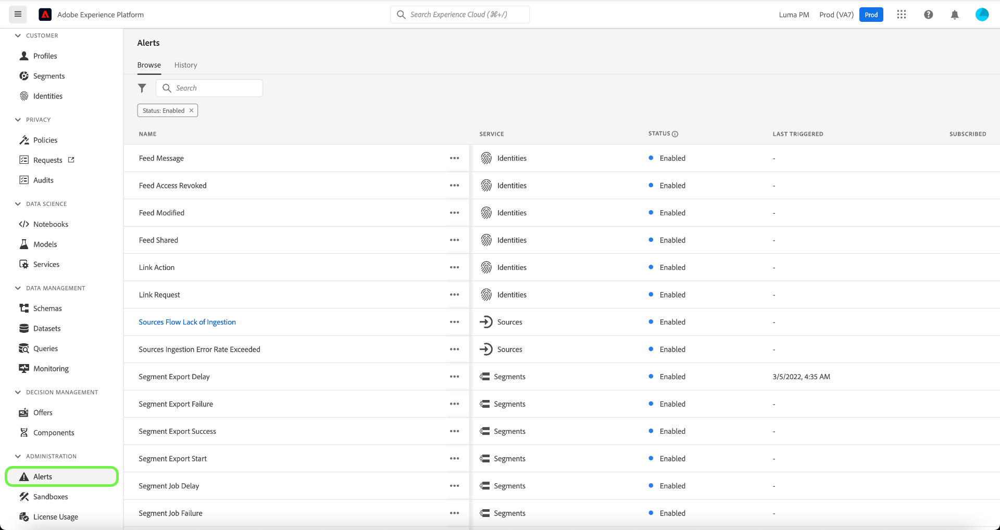

# Guía de IU de alertas

La interfaz de usuario de Adobe Experience Platform le permite ver un historial de alertas recibidas en función de las métricas reveladas por Adobe Experience Platform Observability Insights. La IU también le permite ver, habilitar, deshabilitar y suscribirse a las reglas de alerta disponibles.

>[!NOTE]
>
>Para ver una introducción a las alertas en Experience Platform, consulte la [información general sobre alertas](./overview.md).

Para empezar, seleccione **[!UICONTROL Alertas]** en el panel de navegación izquierdo.

## Administrar reglas de alerta

El **[!UICONTROL Examinar]** La pestaña enumera las reglas disponibles que pueden almacenar en déclencheur una alerta.

Seleccione una regla de la lista para ver su descripción y sus parámetros de configuración en el carril derecho, incluidos el umbral y la gravedad.

Seleccione los puntos suspensivos (**...**) junto al nombre de una regla, y una lista desplegable muestra controles para habilitar o deshabilitar la alerta (según su estado actual), y para suscribirse o cancelar la suscripción a las notificaciones por correo electrónico de la alerta.

## Activar alertas de correo electrónico

Las notificaciones de alerta se pueden enviar directamente al correo electrónico.

Seleccione el icono de campana (), que se encuentra en la cinta superior a la derecha, para mostrar las notificaciones y los anuncios. En la lista desplegable que aparece, seleccione el icono de engranaje () para acceder a la página preferencias de Experience Cloud.

El **Perfil** se muestra. Seleccione el **[!UICONTROL Notificaciones]** en la navegación de la izquierda para acceder a las preferencias de alertas por correo electrónico.

Desplácese hasta **Correos electrónicos** en la parte inferior de la página y seleccione **[!UICONTROL Notificaciones inmediatas]**

Las alertas a las que se haya suscrito ahora se enviarán a la dirección de correo electrónico conectada a la cuenta de Adobe ID.

## Ver historial de alertas

El **[!UICONTROL Historial]** Esta pestaña muestra el historial de alertas recibidas para su organización, incluida la regla que activó la alerta, la fecha activada y la fecha resuelta (si corresponde).

Seleccione una alerta de la lista y aparecerán más detalles en el carril derecho, incluido un breve resumen del evento que activó la alerta.

## Pasos siguientes

Este documento proporciona información general sobre cómo ver y administrar alertas en la IU de Platform. Consulte la información general sobre [Observability Insights](../home.md) para obtener más información sobre las capacidades del servicio.
