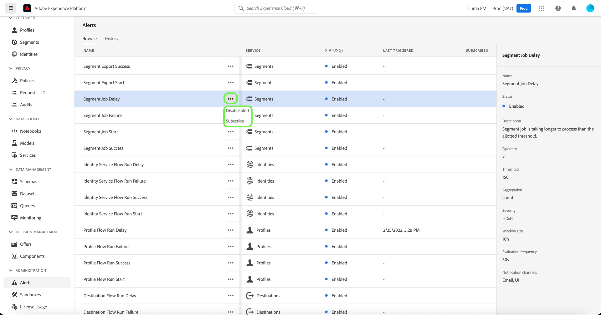

# Guía de la interfaz de usuario de alertas

La interfaz de usuario de Adobe Experience Platform le permite ver un historial de alertas recibidas en función de las métricas que revelan Perspectivas de la capacidad de observación de Adobe Experience Platform. La interfaz de usuario también le permite ver, habilitar, deshabilitar y suscribirse a las reglas de alerta disponibles.

>[!NOTE]
>
>Para obtener una introducción a las alertas en el Experience Platform, consulte la [descripción general de las alertas](./overview.md).

Para empezar, seleccione **[!UICONTROL Alerts]** en el panel de navegación izquierdo.

## Administrar reglas de alerta

La pestaña **[!UICONTROL Browse]** enumera las reglas disponibles que pueden generar el déclencheur de una alerta.

Seleccione una regla de la lista para ver su descripción y sus parámetros de configuración en el carril derecho, incluidos el umbral y la gravedad.

Seleccione los puntos suspensivos (**...**) al lado del nombre de una regla y un menú desplegable muestra los controles para habilitar o deshabilitar la alerta (dependiendo de su estado actual), y para suscribirse o cancelar la suscripción a las notificaciones de correo electrónico para la alerta.

## Ver el historial de alertas

La pestaña **[!UICONTROL History]** muestra el historial de alertas recibidas para su organización, incluida la regla que activó la alerta, la fecha de activación y la fecha de resolución (si corresponde).

Seleccione una alerta enumerada y aparecerán más detalles en el carril derecho, incluido un breve resumen del evento que activó la alerta.

## Pasos siguientes

Este documento proporciona información general sobre cómo ver y administrar alertas en la interfaz de usuario de Platform. Consulte la descripción general de [Observability Insights](../home.md) para obtener más información sobre las capacidades del servicio.
