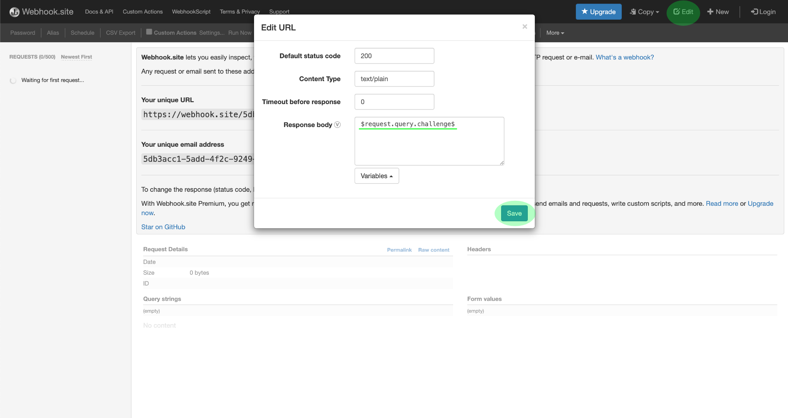

# Suscripción a las notificaciones de Evento de E/S de Adobe

[!DNL Observability Insights] le permite suscribirse a las notificaciones de Evento de E/S de Adobe relacionadas con actividades de Adobe Experience Platform. Estos eventos se envían a un enlace web configurado para facilitar la automatización eficaz del monitoreo de actividades.

Este documento proporciona los pasos para suscribirse a las notificaciones de evento de E/S de Adobe para los servicios de Adobe Experience Platform. También se proporciona información de referencia sobre los tipos de evento disponibles, junto con vínculos a documentación adicional sobre cómo interpretar los datos de evento devueltos para cada servicio aplicable [!DNL Platform] .

## Primeros pasos

Este documento requiere un conocimiento práctico de los enlaces web y de cómo conectar un enlace web de una aplicación a otra. Consulte la [[!DNL I/O Events] documentación](https://www.adobe.io/apis/experienceplatform/events/docs.html#!adobedocs/adobeio-events/master/intro/webhook_docs_intro.md) para obtener una introducción a los enlaces web.

## Creación de un gancho web

Para recibir [!DNL I/O Event] las notificaciones, debe registrar un enlace web especificando una URL de enlace web única como parte de los detalles de registro de evento.

Puede configurar su webgancho con el cliente que desee. Para que una dirección de webgancho temporal se utilice como parte de este tutorial, visite [Weblink.site](https://webhook.site/) y copie la dirección URL única proporcionada.

Durante el proceso de validación inicial, [!DNL I/O Events] envía un parámetro de `challenge` consulta en una solicitud de GET al enlace web. Debe configurar su webgancho para que devuelva el valor de este parámetro en la carga útil de respuesta. Si está utilizando Webhang.site, seleccione **[!DNL Edit]** en la esquina superior derecha y, a continuación, escriba `$request.query.challenge$` debajo **[!DNL Response body]** antes de seleccionar **[!DNL Save]**.

## Crear un nuevo proyecto en Adobe Developer Console

Vaya a [Adobe Developer Console](https://www.adobe.com/go/devs_console_ui) e inicie sesión con su Adobe ID. A continuación, siga los pasos descritos en el tutorial sobre la [creación de un proyecto](https://www.adobe.io/apis/experienceplatform/console/docs.html#!AdobeDocs/adobeio-console/master/projects-empty.md) vacío en la documentación de Adobe Developer Console.

## Suscripción a eventos

Una vez creado un nuevo proyecto, navegue a la pantalla de información general de dicho proyecto. Desde aquí, seleccione **[!UICONTROL Añadir evento]**.

Aparece un cuadro de diálogo que le permite agregar un proveedor de evento al proyecto:

* Si está suscrito a [!DNL Experience Platform] notificaciones, seleccione Notificaciones **[!UICONTROL de plataforma]**
* Si está suscrito a las notificaciones de Adobe Experience Platform [!DNL Privacy Service] , seleccione Eventos de **[!UICONTROL Privacy Service]**

Una vez que haya elegido un proveedor de evento, seleccione **[!UICONTROL Siguiente]**.

La siguiente pantalla muestra una lista de tipos de evento a los que suscribirse. Seleccione los eventos a los que desea suscribirse y, a continuación, seleccione **[!UICONTROL Siguiente]**.

>[!NOTE]
>
>Si no está seguro de a qué eventos suscribirse para el servicio con el que está trabajando, consulte la documentación de notificación específica del servicio:
>
>* [[!DNL Privacy Service] notificaciones](../../privacy-service/privacy-events.md)
>* [[!DNL Data Ingestion] notificaciones](../../ingestion/quality/subscribe-events.md)
>* [[!DNL Flow Service] (fuentes) notificaciones](../../sources/notifications.md)

La siguiente pantalla le solicita que cree un testigo web JSON (JWT). Tiene la opción de generar automáticamente un par de claves o cargar su propia clave pública generada en la terminal.

A efectos de este tutorial, se sigue la primera opción. Seleccione el cuadro de opciones para **[!UICONTROL Generar un par]** de claves y, a continuación, seleccione el botón **[!UICONTROL Generar par]** de claves en la esquina inferior derecha.

Cuando se genera el par de claves, el explorador lo descarga automáticamente. Debe almacenar el archivo usted mismo, ya que no se mantiene en la consola de desarrollador.

La siguiente pantalla le permite revisar los detalles del par de claves recién generado. Select **[!UICONTROL Next]** to continue.

En la siguiente pantalla, proporcione un nombre y una descripción para el registro de eventos en la sección de detalles [!UICONTROL del registro de] Eventos. Lo mejor es crear un nombre único y fácilmente identificable para ayudar a diferenciar este registro de eventos de otros en el mismo proyecto.

Más abajo en la misma pantalla en la sección [!UICONTROL Cómo recibir eventos] , puede configurar de forma opcional cómo recibir eventos. **[!UICONTROL Webhang]** le permite proporcionar una dirección de webgancho personalizada para recibir eventos, mientras que la acción **** Runtime le permite hacer lo mismo con [Adobe I/O Runtime](https://www.adobe.io/apis/experienceplatform/runtime/docs.html).

Para este tutorial, seleccione **[!UICONTROL Webgancho]** y proporcione la URL del webgancho que ha creado anteriormente. Una vez que haya terminado, seleccione **[!UICONTROL Guardar eventos]** configurados para completar el registro de eventos.

Aparece la página de detalles del registro de evento recién creado, donde puede editar su configuración, revisar eventos recibidos, realizar un seguimiento de depuración y agregar nuevos proveedores de evento.

## Pasos siguientes

Siguiendo este tutorial, ha registrado un enlace web para recibir [!DNL I/O Event] notificaciones de [!DNL Experience Platform] y/o [!DNL Privacy Service]. Para obtener más información sobre los eventos disponibles y cómo interpretar las cargas de notificación para cada servicio, consulte la siguiente documentación:

* [[!DNL Privacy Service] notificaciones](../../privacy-service/privacy-events.md)
* [[!DNL Data Ingestion] notificaciones](../../ingestion/quality/subscribe-events.md)
* [[!DNL Flow Service] (fuentes) notificaciones](../../sources/notifications.md)

Consulte la [[!DNL Observability Insights] información general](../home.md) para obtener más información sobre cómo puede supervisar sus actividades [!DNL Experience Platform] y [!DNL Privacy Service].