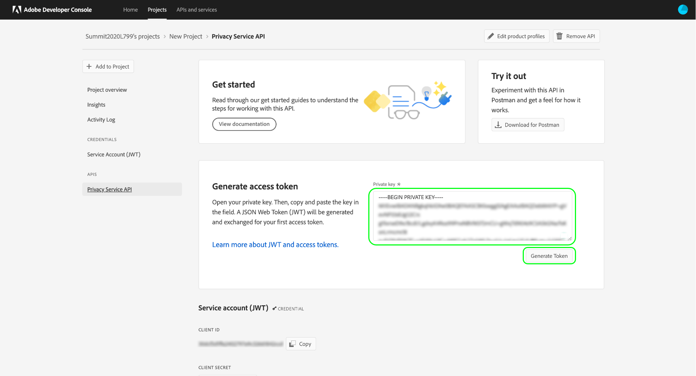

# [!DNL Privacy Service] guía para desarrolladores

Adobe Experience Platform [!DNL Privacy Service] proporciona una API RESTful y una interfaz de usuario que le permiten administrar (acceder y eliminar) los datos personales de los sujetos de datos (clientes) en todas las aplicaciones de Adobe Experience Cloud. [!DNL Privacy Service] también proporciona un mecanismo central de auditoría y registro que le permite acceder al estado y los resultados de los trabajos que involucran  [!DNL Experience Cloud] aplicaciones.

Esta guía explica cómo utilizar la API [!DNL Privacy Service]. Para obtener más información sobre cómo utilizar la interfaz de usuario, consulte la [descripción general de la interfaz de usuario del Privacy Service](../ui/overview.md). Para obtener una lista completa de todos los extremos disponibles en la API [!DNL Privacy Service], consulte la [referencia de API](https://www.adobe.io/apis/experienceplatform/home/api-reference.html#!acpdr/swagger-specs/privacy-service.yaml).

## Primeros pasos {#getting-started}

Esta guía requiere comprender las siguientes [!DNL Experience Platform] funciones:

* [[!DNL Privacy Service]](../home.md):: Proporciona una API de RESTful y una interfaz de usuario que le permiten administrar las solicitudes de acceso y eliminación de los temas de datos (clientes) en todas las aplicaciones de Adobe Experience Cloud.

Las siguientes secciones proporcionan información adicional que deberá conocer para realizar llamadas exitosas a la API de Privacy Service.

### Leer llamadas de API de muestra

Este tutorial proporciona ejemplos de llamadas a API para mostrar cómo dar formato a las solicitudes. Estas incluyen rutas, encabezados requeridos y cargas de solicitud con el formato adecuado. También se proporciona el JSON de muestra devuelto en las respuestas de API. Para obtener más información sobre las convenciones utilizadas en la documentación de las llamadas de API de muestra, consulte la sección sobre [cómo leer llamadas de API de ejemplo](../../landing/troubleshooting.md) en la guía de solución de problemas [!DNL Experience Platform].

## Recopilar valores para encabezados necesarios

Para realizar llamadas a la API [!DNL Privacy Service], primero debe recopilar las credenciales de acceso para utilizarlas en los encabezados necesarios:

* Autorización: Portador `{ACCESS_TOKEN}`
* x-api-key: `{API_KEY}`
* x-gw-ims-org-id: `{IMS_ORG}`

Esto implica obtener permisos de desarrollador para [!DNL Experience Platform] en Adobe Admin Console y, a continuación, generar las credenciales en Adobe Developer Console.

### Obtener acceso de los desarrolladores a [!DNL Experience Platform]

Para obtener acceso del desarrollador a [!DNL Platform], siga los pasos iniciales en el [tutorial de autenticación del Experience Platform](https://www.adobe.com/go/platform-api-authentication-en). Una vez que llegue al paso &quot;Generar credenciales de acceso en Adobe Developer Console&quot;, vuelva a este tutorial para generar las credenciales específicas de [!DNL Privacy Service].

### Generar credenciales de acceso

Con Adobe Developer Console, debe generar las tres credenciales de acceso siguientes:

* `{IMS_ORG}`
* `{API_KEY}`
* `{ACCESS_TOKEN}`

Sus `{IMS_ORG}` y `{API_KEY}` sólo deben generarse una vez y pueden reutilizarse en futuras llamadas de API. Sin embargo, su `{ACCESS_TOKEN}` es temporal y debe regenerarse cada 24 horas.

Los pasos para generar estos valores se explican detalladamente a continuación.

#### Configuración única

Vaya a [Adobe Developer Console](https://www.adobe.com/go/devs_console_ui) e inicie sesión con su Adobe ID. A continuación, siga los pasos descritos en el tutorial sobre [la creación de un proyecto vacío](https://www.adobe.io/apis/experienceplatform/console/docs.html#!AdobeDocs/adobeio-console/master/projects-empty.md) en la documentación de Adobe Developer Console.

Una vez creado un nuevo proyecto, seleccione **[!UICONTROL Añadir API]** en la pantalla **[!UICONTROL Información general del proyecto]**.

Aparece la pantalla **[!UICONTROL Añadir una API]**. Seleccione **[!UICONTROL API de Privacy Service]** en la lista de API disponibles antes de seleccionar **[!UICONTROL Siguiente]**.

Aparece la pantalla **[!UICONTROL Configurar API]**. Seleccione la opción para **[!UICONTROL Generar un par de claves]** y luego seleccione **[!UICONTROL Generar par de claves]** en la esquina inferior derecha.

El par de claves se genera automáticamente y se descarga un archivo ZIP con una clave privada y un certificado público en el equipo local (para utilizarlo en un paso posterior). Seleccione **[!UICONTROL Guardar API configurada]** para completar la configuración.

Una vez que se ha agregado la API al proyecto, la página del proyecto vuelve a aparecer en la página **información general de la API de Privacy Service**. Desde aquí, desplácese hacia abajo hasta la sección **[!UICONTROL Service Account (JWT)]**, que proporciona las siguientes credenciales de acceso requeridas en todas las llamadas a la API [!DNL Privacy Service]:

* **[!UICONTROL ID]** DEL CLIENTE: El ID de cliente es el requerido  `{API_KEY}` para ello debe proporcionarse en el encabezado x-api-key.
* **[!UICONTROL ID]** DE ORGANIZACIÓN: El identificador de organización es el  `{IMS_ORG}` valor que debe utilizarse en el encabezado x-gw-ims-org-id.

#### Autenticación para cada sesión

La credencial requerida final que debe recopilar es su `{ACCESS_TOKEN}`, que se utiliza en el encabezado Autorización. A diferencia de los valores para `{API_KEY}` y `{IMS_ORG}`, se debe generar un nuevo token cada 24 horas para continuar usando las API [!DNL Platform].

Para generar un nuevo `{ACCESS_TOKEN}`, abra la clave privada descargada anteriormente y pegue su contenido en el cuadro de texto junto a **[!UICONTROL Generar token de acceso]** antes de seleccionar **[!UICONTROL Generar token]**.

Se genera un nuevo token de acceso y se proporciona un botón para copiar el token en el portapapeles. Este valor se utiliza para el encabezado de Autorización requerido y debe proporcionarse con el formato `Bearer {ACCESS_TOKEN}`.

## Pasos siguientes

Ahora que comprende qué encabezados usar, está listo para empezar a realizar llamadas a la API [!DNL Privacy Service]. El documento en [trabajos de privacidad](privacy-jobs.md) explora las distintas llamadas de API que puede realizar mediante la API [!DNL Privacy Service]. Cada llamada de ejemplo incluye el formato de API general, una solicitud de ejemplo que muestra los encabezados necesarios y una respuesta de ejemplo.
