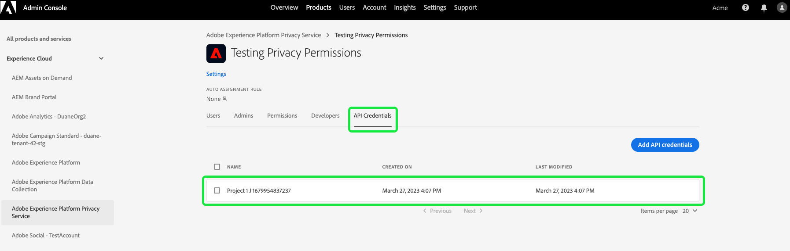

# Administración de permisos para Privacy Service

El acceso a [Adobe Experience Platform Privacy Service](./home.md) se controla mediante permisos granulares basados en funciones en Adobe Admin Console. Al crear perfiles de producto que asignan permisos a grupos de usuarios, puede determinar quién tiene acceso a qué funciones de la [IU](./ui/overview.md) y [API](./api/overview.md) de Privacy Service.

>[!NOTE]
>
>Al crear una integración para la API de Privacy Service, debe seleccionar un perfil de producto existente para determinar para qué funciones o acciones tiene permisos esa integración. Consulte la guía de [introducción a la API de Privacy Service](./api/getting-started.md) para obtener más información.

Esta guía muestra cómo administrar permisos para Privacy Service.

## Introducción

Para configurar el control de acceso de Privacy Service, debe tener privilegios de administrador en una organización que tenga una integración de productos con Adobe Experience Platform Privacy Service. La función mínima que puede conceder o retirar permisos es la de **administrador de perfil de producto**. Otras funciones de administrador que pueden administrar permisos son **administradores de productos** (puede administrar todos los perfiles de un producto) y **administradores del sistema** (sin restricciones). Consulte el artículo sobre [funciones administrativas](https://helpx.adobe.com/enterprise/using/admin-roles.html) en la Guía de administración de Adobe Enterprise para obtener más información.

En esta guía se asume que está familiarizado con los conceptos básicos de Admin Console, como los perfiles de producto y la forma en que se conceden los permisos de producto a los usuarios y grupos individuales. Para obtener más información, consulte la [Guía del usuario de Admin Console](https://helpx.adobe.com/es/enterprise/using/admin-console.html).

## Permisos disponibles

En la tabla siguiente se detallan los permisos disponibles para Privacy Service y las descripciones de las funciones específicas a las que concede acceso.

>[!NOTE]
>
>Todos los permisos de Privacy Service y [!UICONTROL exclusión de venta] son distintos y están separados entre sí sin superposición funcional. Esto es posible, ya que la API de Privacy Service se considera idempotente.

| Categoría | Permiso | Descripción |
| --- | --- | --- |
| [!UICONTROL Permisos de Privacy Service] | [!UICONTROL Permiso de lectura de Privacy] | Determina si el usuario puede ver las solicitudes de acceso y de eliminación existentes, junto con los detalles. |
| [!UICONTROL Permisos de Privacy Service] | [!UICONTROL Permiso de escritura de Privacy] | Determina si un usuario puede crear solicitudes de acceso y eliminación nuevas. |
| [!UICONTROL Permisos de Privacy Service] | [!UICONTROL Permiso de lectura (acceso) de entrega de contenido] | Cuando Privacy Service procesa una solicitud de acceso, se envía al cliente que lo solicite un archivo ZIP que contiene sus datos. Cuando se buscan los detalles de una solicitud de acceso, este permiso determina si el usuario puede acceder al vínculo de descarga del archivo ZIP solicitado. |
| [!UICONTROL Permisos de exclusión de venta] | [!UICONTROL Permiso de lectura para exclusión de venta] | Determina si el usuario puede ver las solicitudes de exclusión de la venta existentes, junto con sus detalles. |
| [!UICONTROL Permisos de exclusión de venta] | [!UICONTROL Permiso de escritura para exclusión de venta] | Determina si un usuario puede crear nuevas solicitudes de exclusión de venta. |

{style="table-layout:auto"}

## Administración de permisos {#manage}

Para administrar permisos de Privacy Service, inicie sesión en [Admin Console](https://adminconsole.adobe.com/) y seleccione **[!UICONTROL Productos]** desde la barra de navegación superior. Desde aquí, seleccione **[!UICONTROL Adobe Experience Platform Privacy Service]**.

### Seleccione o cree un perfil de producto

La siguiente pantalla muestra una lista de perfiles de producto disponibles para los Privacy Service de su organización. Si no existen perfiles de producto, seleccione **[!UICONTROL Nuevo perfil]** para crear uno. Si tiene varias funciones o grupos de usuarios en su organización que requieren diferentes niveles de acceso, debe crear un perfil de producto independiente para cada uno de ellos.

Después de seleccionar un perfil de producto, puede usar la pestaña **[!UICONTROL Permisos]** para iniciar [editar permisos](#edit-permissions) para el perfil o seleccionar la pestaña **[!UICONTROL Usuarios]** para iniciar la [asignación de usuarios](#assign-users) al perfil.

### Edición de permisos para el perfil {#edit-permissions}

En la pestaña **[!UICONTROL Permisos]**, seleccione cualquiera de las categorías de permisos mostradas para acceder a la vista de edición de permisos.

Al editar permisos para un perfil, los permisos disponibles se incluyen en la columna izquierda, mientras que los que se incluyen en el perfil se incluyen en la columna derecha. Seleccione los permisos de la lista para moverlos entre cualquiera de las columnas.

Los permisos se organizan en categorías. Para cambiar entre categorías, seleccione la que desee en el panel de navegación izquierdo.

![El [!UICONTROL Desactivar la venta] sección en permisos.](./images/permissions/switch-category.png)

Seleccionar **[!UICONTROL Guardar]** una vez que haya terminado de configurar los permisos.

La vista de perfil de producto vuelve a aparecer con los permisos añadidos reflejados.

### Asignación de usuarios al perfil {#assign-users}

Para asignar usuarios al perfil de producto (y concederles los permisos configurados del perfil), seleccione la pestaña **[!UICONTROL Usuarios]**, y a continuación **[!UICONTROL Agregar usuario]**.

Para obtener más información sobre la administración de usuarios para un perfil de producto, consulte la [Documentación de Admin Console](https://helpx.adobe.com/es/enterprise/using/manage-product-profiles.html).

### Migración de credenciales de la API heredadas al perfil {#migrate-tech-accounts}

>[!NOTE]
>
>Esta sección solo se aplica a las credenciales de API existentes que se crearon antes de que los permisos de Privacy Service se integraran en Adobe Admin Console. Para las nuevas credenciales, los perfiles de producto (y sus permisos) se asignan mediante [Proyectos de la consola Adobe Developer](https://developer.adobe.com/developer-console/docs/guides/projects/) en su lugar.  Consulte la sección sobre [asignación de perfiles de producto a un proyecto](./api/getting-started.md#product-profiles) en la Guía de introducción a la API de Privacy Service para obtener más información.

Anteriormente, las cuentas técnicas no requerían un perfil de producto para la integración y los permisos. Sin embargo, debido a las recientes mejoras en los permisos de Privacy Service, ahora es necesario migrar las credenciales de API heredadas al perfil del producto. Esta actualización permite conceder permisos granulares a los titulares de cuentas técnicas. Siga los pasos proporcionados a continuación para actualizar los permisos de cuenta técnica para Privacy Service.

#### Actualizar permisos de cuenta técnica {#update-tech-account-permissions}

El primer paso para asignar un conjunto de permisos a la cuenta técnica es ir a [Adobe Admin Console](https://adminconsole.adobe.com/) y crear un nuevo perfil de producto para Privacy Service.

En la interfaz de usuario del Admin Console, seleccione **Productos** en la barra de navegación, seguido de **[!UICONTROL Experience Cloud]** y **[!UICONTROL Adobe Experience Platform Privacy Service]** en la barra lateral izquierda. Aparece la pestaña [!UICONTROL Perfiles de producto]. Seleccionar **Nuevo perfil** para crear un perfil de producto nuevo para Privacy Service.

Aparece el cuadro de diálogo [!UICONTROL Crear un nuevo perfil de producto]. Puede encontrar instrucciones completas sobre cómo crear un perfil de producto en la [Guía de IU para crear perfiles](../access-control/ui/create-profile.md).

Una vez guardado el nuevo perfil de producto, vaya a [Adobe Developer Console](https://developer.adobe.com/console/home) e inicie sesión en ese producto o proyecto. Seleccione **[!UICONTROL Proyectos]** desde la barra de navegación superior, seguida de la tarjeta del proyecto.

>[!NOTE]
>
>Es posible que tenga que borrar la caché o esperar un poco para que el nuevo proyecto aparezca en la lista de proyectos de Developer Console.

Después de iniciar sesión en el proyecto, seleccione la integración **[!UICONTROL API de Privacy Service]** desde la barra lateral izquierda.

Aparecerá el panel Integración de API de Privacy Service. Desde este panel, puede editar el perfil de producto asociado a ese proyecto. Seleccione **[!UICONTROL Editar perfiles de producto]** para comenzar el proceso. Aparece el cuadro de diálogo [!UICONTROL Configurar API].

El cuadro de diálogo [!UICONTROL Configurar API] muestra los perfiles de producto disponibles actualmente en el servicio. Se correlacionan con los perfiles de producto creados en Admin Console. En la lista de perfiles de producto disponibles, active la casilla de verificación del nuevo perfil de producto que creó para la cuenta técnica en Admin Console. Esto asocia automáticamente esta cuenta técnica con los permisos en el perfil de producto seleccionado. Seleccione **[!UICONTROL Guardar API configurada]** para confirmar la configuración.

>[!NOTE]
>
>Si una cuenta técnica ya está asociada a un perfil de producto, una de las casillas de verificación de la lista de perfiles de producto disponibles ya estará seleccionada.

#### Confirme que se ha aplicado la configuración {#confirm-applied-settings}

Para confirmar que la configuración se ha aplicado a la cuenta. Vuelva a la [Admin Console](https://adminconsole.adobe.com/) y vaya al perfil de producto recién creado. Seleccione la pestaña **[!UICONTROL Credenciales de API]** para ver una lista de los proyectos asociados. El proyecto utilizado en Developer Console donde asignó el perfil de producto a la cuenta técnica se muestra en la lista de credenciales. El nombre de cada credencial de la API está compuesto por el nombre del proyecto con un número generado aleatoriamente con el sufijo al final. Seleccione una credencial para abrir el panel [!UICONTROL Detalles].

El panel [!UICONTROL Detalles] contiene información sobre la credencial de la API, incluido el ID técnico asociado, la clave de la API, la fecha de creación y la última modificación, así como los productos de Adobe asociados.

## Pasos siguientes

Esta guía abarcaba los permisos disponibles para Privacy Service y cómo administrarlos mediante Admin Console.

Para ver los pasos sobre cómo crear una nueva integración de API después de configurar perfiles de producto, consulte la [guía de introducción para la API de Privacy Service](./api/getting-started.md). Para obtener más información sobre la administración de permisos para otras funcionalidades de Adobe Experience Platform, consulte la [documentación de control de acceso](../access-control/home.md).
