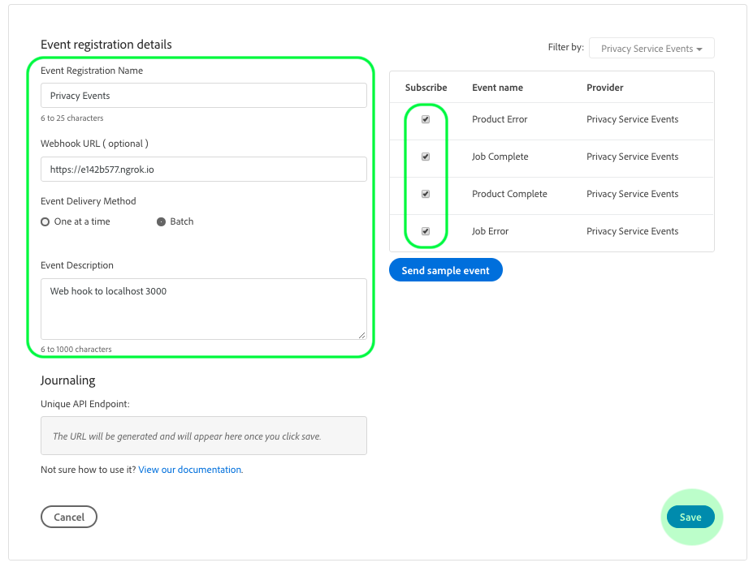

# Suscripción a Eventos de privacidad

Los Eventos de privacidad son mensajes proporcionados por Adobe Experience Platform Privacy Service, que aprovechan los Eventos de Adobe I/O enviados a un enlace web configurado para facilitar una automatización eficaz de las solicitudes de trabajo. Reducirán o eliminarán la necesidad de sondear la API de Privacy Service para comprobar si se ha completado un trabajo o si se ha alcanzado un determinado hito en un flujo de trabajo.

Actualmente existen cuatro tipos de notificaciones relacionadas con el ciclo vital de la solicitud de trabajo de privacidad:

| Tipo | Descripción |
--- | ---
| Trabajo completado | Todas las soluciones de Experience Cloud han informado y el estado global o general del trabajo se ha marcado como completado. |
| Error de trabajo | Una o más soluciones han informado de un error al procesar la solicitud. |
| Producto completado | Una de las soluciones asociadas con este trabajo ha completado su trabajo. |
| Error del producto | Una de las soluciones informó de un error al procesar la solicitud. |

Este documento proporciona los pasos para configurar una integración de las notificaciones de Privacy Service en Adobe I/O. Para obtener información general de alto nivel sobre Privacy Service y sus funciones, consulte la información general sobre [Privacy Service](home.md).

## Primeros pasos

Este tutorial utiliza **ngrok**, un producto de software que expone los servidores locales a la Internet pública a través de túneles seguros. Por favor, [instale ngrok](https://ngrok.com/download) antes de comenzar este tutorial para poder seguir y crear un weblink en su equipo local. Esta guía también requiere que descargue un repositorio GIT que contenga un servidor simple escrito en [Node.js](https://nodejs.org/).

## Crear un servidor local

El servidor Node.js debe devolver un `challenge` parámetro enviado por una solicitud al extremo raíz (`/`). Configure el `index.js` archivo con el siguiente JavaScript para lograr esto:

```js
var express = require('express')
var app = express()

app.set('port', (process.env.PORT || 3000))
app.use(express.static(__dirname + '/public'))

app.get('/', function(request, response) {
  response.send(request.originalUrl.split('?challenge=')[1]);
})

app.listen(app.get('port'), function() {
  console.log("Node app is running at localhost:" + app.get('port'))
})
```

Con la línea de comandos, navegue al directorio raíz del servidor Node.js. A continuación, escriba los siguientes comandos:

1. `npm install`
1. `npm start`

Estos comandos instalan todas las dependencias e inicializan el servidor. Si tiene éxito, puede encontrar el servidor en ejecución en http://localhost:3000/.

## Creación de un gancho web con ngrok

En el mismo directorio y en una nueva ventana de línea de comandos, escriba el siguiente comando:

```shell
ngrok http -bind-tls=true 3000
```

Una salida correcta es similar a la siguiente:


Tenga en cuenta la `Forwarding` dirección URL (`https://e142b577.ngrok.io`), ya que se utilizará para identificar el enlace web en el siguiente paso.

## Crear una nueva integración con la consola de Adobe I/O

Inicie sesión en la consola [de E/S de](https://console.adobe.io) Adobe y haga clic en la ficha **Integraciones** . Aparece la ventana _Integraciones_ . Desde aquí, haga clic en **Nueva integración**.


Aparece la ventana *Crear una nueva integración* . Seleccione **Recibir eventos en tiempo real** cercanos y haga clic en **Continuar**.


La siguiente pantalla ofrece opciones para crear integraciones con diferentes eventos, productos y servicios disponibles para su organización en función de sus suscripciones, derechos y permisos. Para esta integración, seleccione Eventos **de** Privacy Service y, a continuación, haga clic en **Continuar**.


Aparece el formulario Detalles *de la* integración, que requiere que proporcione un nombre y una descripción para la integración, así como un certificado de clave pública.


Si no tiene un certificado público, puede generar uno mediante el siguiente comando terminal:

```shell
openssl req -x509 -sha256 -nodes -days 365 -newkey rsa:2048 -keyout private.key -out certificate_pub
```

Una vez que haya generado un certificado, arrastre y suelte el archivo en el cuadro Certificados **de claves** públicas o haga clic en **Seleccionar un archivo** para examinar el directorio de archivos y seleccionar el certificado directamente.

Después de agregar el certificado, aparece la opción Registro *de* Evento. Haga clic en **Añadir registro** de Evento.


El cuadro de diálogo se expande para mostrar controles adicionales. Aquí puede seleccionar los tipos de evento que desee y registrar su enlace web. Escriba un nombre para el registro en el evento, la URL del enlace web (la `Forwarding` dirección devuelta cuando [creó el enlace web](#create-a-webhook-using-ngrok)por primera vez), así como una breve descripción. Finalmente, seleccione los tipos de evento a los que desea suscribirse y haga clic en **Guardar**.



Una vez completado el formulario de registro de Evento, haga clic en **Crear integración** y se completará la integración de E/S.


## Datos de evento de Vista

Una vez que haya creado los trabajos de privacidad e integración de E/S, puede realizar la vista de las notificaciones recibidas para esa integración. En la ficha **Integraciones** de la consola de E/S, vaya a la integración y haga clic en **Vista**.


Aparece la página de detalles de la integración. Haga clic en **Eventos** para vista de los registros de evento para la integración. Busque el registro de Eventos de privacidad y haga clic en **Vista**.


Aparece la ventana Detalles *del* Evento, que le permite vista de más información sobre el registro, editar su configuración o vista de los eventos reales recibidos desde que activó el enlace web. Puede vista de los detalles del evento y navegar hasta la opción **Depurar seguimiento** .


La sección **Carga útil** proporciona detalles sobre el evento seleccionado, incluido su tipo de evento (`"com.adobe.platform.gdpr.productcomplete"`), como se indica en el ejemplo anterior.

## Pasos siguientes

Puede repetir los pasos anteriores para agregar nuevas integraciones para distintas direcciones de enlace web según sea necesario.