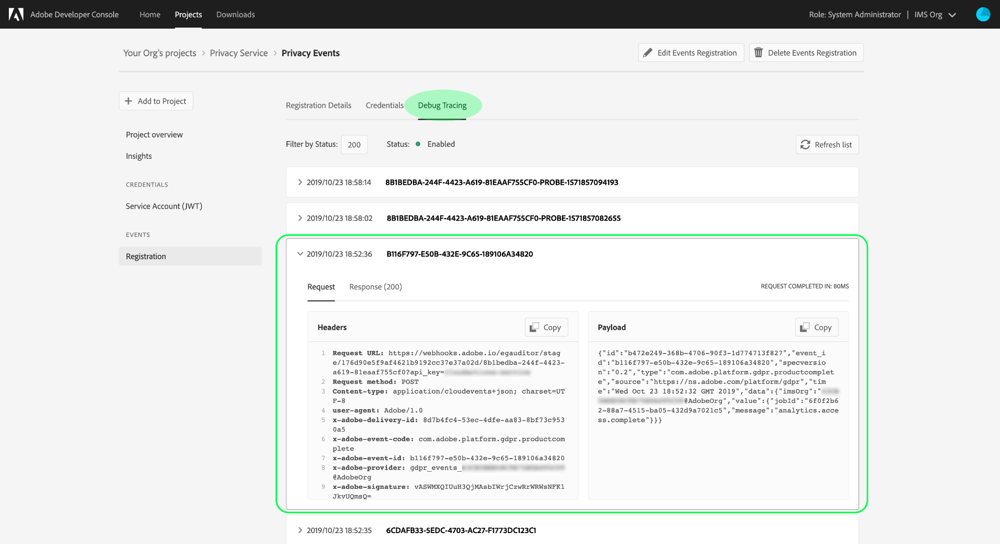

# Suscribirse a [!DNL Privacy Service Events]

[!DNL Privacy Service Events] son mensajes proporcionados por Adobe Experience Platform  [!DNL Privacy Service], que aprovechan los eventos de Adobe I/O enviados a un enlace web configurado para facilitar la automatización eficaz de las solicitudes de trabajo. Reducen o eliminan la necesidad de sondear la API [!DNL Privacy Service] para comprobar si un trabajo se ha completado o si se ha alcanzado un hito determinado dentro de un flujo de trabajo.

Actualmente existen cuatro tipos de notificaciones relacionadas con el ciclo de vida de la solicitud de trabajo de privacidad:

| Tipo | Descripción |
| --- | --- |
| Trabajo completado | Todas las aplicaciones [!DNL Experience Cloud] han informado y el estado general o global del trabajo se ha marcado como completado. |
| Error de trabajo | Una o más aplicaciones han informado de un error al procesar la solicitud. |
| Finalización del producto | Una de las aplicaciones asociadas con este trabajo ha completado su trabajo. |
| Error del producto | Una de las aplicaciones informó de un error al procesar la solicitud. |

Este documento proporciona los pasos para configurar un registro de eventos para las notificaciones [!DNL Privacy Service] y cómo interpretar las cargas de notificaciones.

## Primeros pasos

Consulte la siguiente documentación del Privacy Service antes de iniciar este tutorial:

* [Información general del Privacy Service](./home.md)
* [Guía para desarrolladores de API de Privacy Service](./api/getting-started.md)

## Registre un enlace web en [!DNL Privacy Service Events]

Para recibir [!DNL Privacy Service Events], debe utilizar Adobe Developer Console para registrar un enlace web en la integración de [!DNL Privacy Service].

Siga el tutorial sobre [suscribirse a [!DNL I/O Event] notifications](../observability/alerts/subscribe.md) para conocer los pasos detallados sobre cómo hacerlo. Asegúrese de elegir **[!UICONTROL Eventos de Privacy Service]** como proveedor de eventos para acceder a los eventos enumerados arriba.

## Recibir [!DNL Privacy Service Event] notificaciones

Una vez que haya registrado correctamente sus trabajos de weblock y privacy, puede empezar a recibir notificaciones de eventos. Estos eventos se pueden ver mediante el propio enlace web o seleccionando la pestaña **[!UICONTROL Seguimiento de depuración]** en la descripción general del registro de eventos del proyecto en Adobe Developer Console.



El siguiente JSON es un ejemplo de una carga útil de notificación [!DNL Privacy Service Event] que se enviaría a su enlace web cuando una de las aplicaciones asociadas a un trabajo de privacidad haya completado su trabajo:

```json
{
  "id":"b472e249-368b-4706-90f3-1d774713f827",
  "event_id":"b116f797-e50b-432e-9c65-189106a34820",
  "specversion":"0.2",
  "type":"com.adobe.platform.gdpr.productcomplete",
  "source":"https://ns.adobe.com/platform/gdpr",
  "time":"Wed Oct 23 18:52:32 GMT 2019",
  "data":{
    "imsOrg":"{IMS_ORG}",
    "value":{
      "jobId":"6f0f2b62-88a7-4515-ba05-432d9a7021c5",
      "message":"analytics.access.complete"
    }
  }
}
```

| Propiedad | Descripción |
| --- | --- |
| `id` | Un ID único generado por el sistema para la notificación. |
| `type` | Tipo de notificación que se envía, dando contexto a la información proporcionada en `data`. Los valores posibles incluyen: <ul><li>`com.adobe.platform.gdpr.jobcomplete`</li><li>`com.adobe.platform.gdpr.joberror`</li><li>`com.adobe.platform.gdpr.productcomplete`</li><li>`com.adobe.platform.gdpr.producterror`</li></ul> |
| `time` | Marca de tiempo del momento en que se produjo el evento. |
| `data.value` | Contiene información adicional sobre lo que activó la notificación: <ul><li>`jobId`: ID del trabajo de privacidad que activó la notificación.</li><li>`message`: Un mensaje con respecto al estado específico del trabajo. Para las notificaciones `productcomplete` o `producterror` , este campo indica la aplicación de Experience Cloud en cuestión.</li></ul> |

## Pasos siguientes

Este documento abarcaba cómo registrar eventos de Privacy Service en un enlace web configurado y cómo interpretar las cargas de notificación. Para obtener información sobre cómo rastrear trabajos de privacidad mediante la interfaz de usuario, consulte la [guía del usuario del Privacy Service](./ui/user-guide.md).
