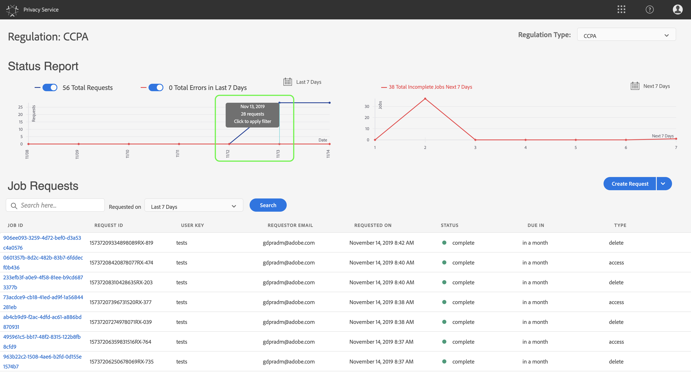
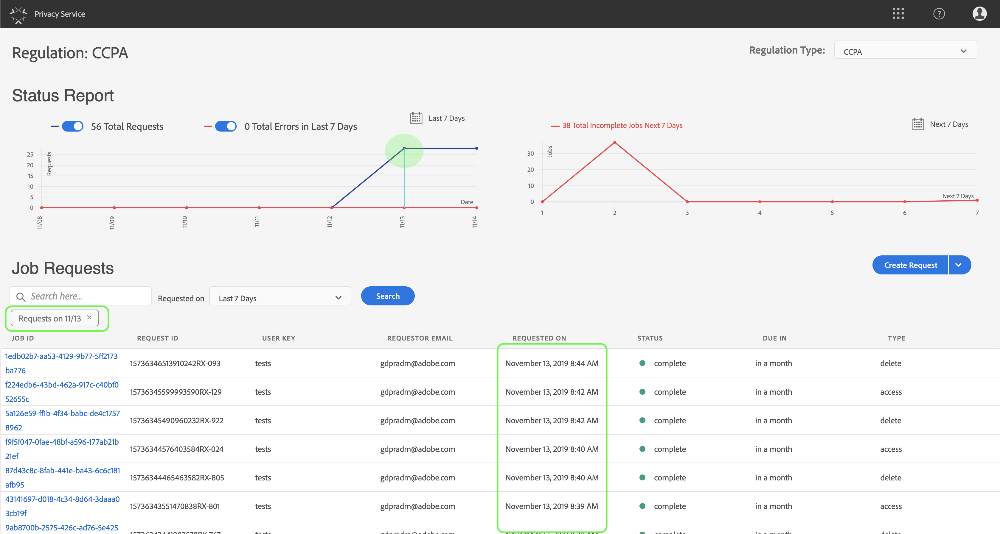
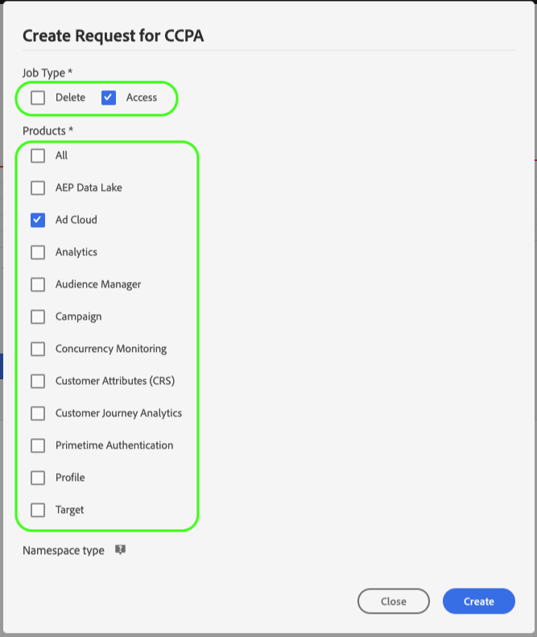

# [!DNL Privacy Service] guía del usuario

Este documento proporciona los pasos para crear y administrar solicitudes de privacidad mediante la interfaz de [!DNL Privacy Service] usuario.

## Examinar el panel de la [!DNL Privacy Service] IU

El panel de la [!DNL Privacy Service] interfaz de usuario proporciona dos utilidades que le permiten realizar vistas del estado de sus trabajos de privacidad: &quot;Informede estado&quot; y &quot;Solicitudes[!UICONTROL de]trabajo&quot;. El panel también muestra la regulación seleccionada actual para los trabajos mostrados.

### Tipo de regulación

[!DNL Privacy Service] admite solicitudes de trabajo para cuatro tipos de regulación:

* La Unión Europea [!DNL General Data Protection Regulation] ([!UICONTROL RGPD])
* El [!DNL California Consumer Privacy Act] ([!UICONTROL CCPA])
* Brasil [!DNL Lei Geral de Proteção de Dados] ([!UICONTROL LGPD_BRA])
* Tailandia [!DNL Personal Data Protection Act] ([!UICONTROL PDPA_THA])

Los trabajos para cada tipo de regulación se rastrean por separado. Para cambiar entre tipos de regulación, haga clic en el menú desplegable Tipo **[!UICONTROL de]** regulación y seleccione la regulación deseada en la lista.

Al cambiar el tipo de regulación, el panel se actualiza para mostrar todas las operaciones, filtros, utilidades y diálogos de creación de empleo que se aplican a la regulación seleccionada.

### Informe de estado

El gráfico de la parte izquierda del widget de informe de estado realiza un seguimiento de los trabajos enviados en relación con cualquier trabajo que haya informado de errores. El gráfico de la derecha rastrea los trabajos cerca del final de la ventana de cumplimiento de 30 días.

Haga clic en uno de los dos botones de alternancia que hay encima del gráfico para mostrar u ocultar sus métricas respectivas.

Puede vista el número exacto de trabajos asociados con cualquier punto de datos de los gráficos pasando el ratón sobre el punto de datos en cuestión.

Para vista de más detalles sobre un punto de datos determinado, haga clic en el punto de datos en cuestión para mostrar los trabajos asociados en la utilidad Solicitudes de trabajo. Tenga en cuenta el filtro que se aplica justo encima de la lista de trabajo.

>[!NOTE]
>
>Cuando se ha aplicado un filtro al widget de solicitudes de trabajo, puede eliminarlo haciendo clic en la **X** de la píldora de filtro. Las solicitudes de trabajo luego vuelven a la lista de seguimiento predeterminada.

### Solicitudes de trabajo

El widget de solicitudes de trabajo lista todas las solicitudes de trabajo disponibles en la organización, incluidos detalles como el tipo de solicitud, el estado actual, la fecha de vencimiento y el correo electrónico del solicitante.

>[!NOTE]
>
>Los datos de los trabajos creados anteriormente solo son accesibles durante 30 días después de la fecha de finalización.

Puede filtrar la lista escribiendo las palabras clave en la barra de búsqueda debajo del título de las solicitudes de trabajo. La lista filtros automáticamente a medida que escribe, mostrando las solicitudes que contienen valores que coinciden con los términos de búsqueda. También puede utilizar el menú desplegable **[!UICONTROL Solicitado en]** para seleccionar un intervalo de tiempo para los trabajos enumerados.

Para vista de los detalles de una solicitud de trabajo concreta, haga clic en la ID de trabajo de la solicitud en la lista para abrir la página Detalles **[!UICONTROL del]** trabajo.

Este cuadro de diálogo contiene información de estado sobre cada [!DNL Experience Cloud] solución y su estado actual en relación con el trabajo general. Dado que cada trabajo de privacidad es asincrónico, la página muestra la fecha y hora de comunicación más reciente (GMT) de cada solución, ya que algunos requieren más tiempo que otros para procesar la solicitud.

Si una solución ha proporcionado datos adicionales, se puede ver en este cuadro de diálogo. Puede vista de estos datos haciendo clic en filas de productos individuales.

Para descargar los datos completos del trabajo como archivo CSV, haga clic en **[!UICONTROL Exportar a CSV]** en la parte superior derecha del cuadro de diálogo.

## Crear una nueva solicitud de trabajo de privacidad

>[!NOTE]
>
>Para crear una solicitud de trabajo de privacidad, debe proporcionar información de identidad para los clientes específicos cuyos datos se van a obtener o eliminar. Consulte el documento sobre los datos de [identidad para las solicitudes](../identity-data.md) de privacidad antes de continuar con esta sección.

La [!DNL Privacy Service] interfaz de usuario proporciona dos métodos para crear nuevas solicitudes de trabajo:

* [Uso del Generador de solicitudes](#request-builder)
* [Cargar un archivo JSON](#json)

Los pasos para utilizar cada uno de estos métodos se proporcionan en las siguientes secciones.

### Uso del Generador de solicitudes {#request-builder}

Con el Creador de solicitudes, puede crear manualmente una nueva solicitud de trabajo de privacidad en la interfaz de usuario. El Generador de solicitudes se utiliza mejor para conjuntos de solicitudes más simples y pequeños, ya que el Generador de solicitudes limita las solicitudes para que solo tengan un tipo de ID por usuario. Para solicitudes más complicadas, es mejor [cargar un archivo](#json) JSON.

Para realizar inicios con el creador de solicitudes, haga clic en **[!UICONTROL Crear solicitud]** debajo del widget de informe de estado en la parte derecha de la pantalla.

Se abre el cuadro de diálogo **[!UICONTROL Crear solicitud]** , que muestra las opciones disponibles para enviar una solicitud de trabajo de privacidad para el tipo de regulación seleccionado actualmente.

 

Seleccione el tipo **[!UICONTROL de]** trabajo de la solicitud (&quot;Eliminar&quot; o &quot;Acceso&quot;) y uno o más productos disponibles de la lista.

 

En Tipo **[!UICONTROL de]**&#x200B;Área de nombres, seleccione el tipo de Área de nombres correspondiente para los ID de cliente que se envían a [!DNL Privacy Service].

 

Cuando utilice el tipo de Área de nombres estándar, seleccione una Área de nombres en el menú desplegable (correo electrónico, ECID o AAID) y, a continuación, escriba los valores de ID en el cuadro de texto a la derecha; para agregar los valores a la lista, presione **\&lt;enter>** para cada ID.

 

Al utilizar el tipo de Área de nombres personalizada, debe escribir manualmente la Área de nombres antes de proporcionar los valores de ID siguientes.

 

When finished, click **[!UICONTROL Create]**.

 

El cuadro de diálogo desaparece y el nuevo trabajo (o trabajos) aparece en la utilidad Solicitudes de trabajo junto con su estado de procesamiento actual.

### Cargar un archivo JSON {#json}

Al crear solicitudes más complicadas, como las que utilizan varios tipos de ID para cada asunto de datos que se está procesando, puede crear una solicitud cargando un archivo JSON.

Haga clic en la flecha situada junto a **[!UICONTROL Crear solicitud]**, debajo del widget de informe de estado en el lado derecho de la pantalla. En la lista de opciones que aparece, seleccione **[!UICONTROL Cargar JSON]**.

Aparece el cuadro de diálogo **[!UICONTROL Cargar JSON]** , que proporciona una ventana para arrastrar y soltar el archivo JSON.

 

Si no tiene un archivo JSON para cargar, haga clic en **[!UICONTROL Descargar Adobe-GDPR-Request.json]** para descargar una plantilla que puede rellenar según los valores recopilados de los temas de datos.

 

Busque el archivo JSON en el equipo y arrástrelo a la ventana de diálogo. Si la carga se realiza correctamente, el nombre del archivo aparecerá en el cuadro de diálogo. Puede seguir agregando más archivos JSON según sea necesario arrastrándolos y soltándolos en el cuadro de diálogo.

When finished, click **[!UICONTROL Create]**. El cuadro de diálogo desaparece y el nuevo trabajo (o trabajos) aparece en la utilidad Solicitudes de trabajo junto con su estado de procesamiento actual.

### Pasos siguientes

Al leer este documento, ha aprendido a usar la interfaz de usuario para crear un trabajo de privacidad, vista de los detalles de un trabajo, supervisión de su estado de procesamiento y descarga los resultados una vez que se haya completado. [!DNL Privacy Service]

Para ver los pasos sobre cómo realizar estas operaciones mediante programación mediante la [!DNL Privacy Service] API, consulte la guía [para](../api/getting-started.md)desarrolladores.