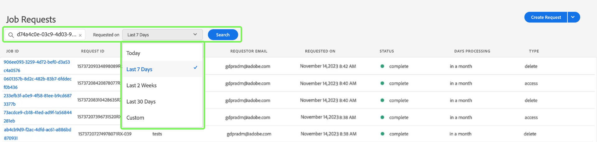

# Administración de trabajos de privacidad en la IU de Privacy Service {#user-guide}

>[!CONTEXTUALHELP]
>id="platform_privacyConsole_requests_description"
>title="Cumplimiento de las solicitudes de privacidad de los interesados"
>abstract="<h2>Descripción</h2>
Adobe Experience Platform Privacy Service le permite crear y administrar solicitudes de privacidad en nombre de clientes que desean acceder a sus datos personales o eliminarlos de acuerdo con las regulaciones de privacidad.
"

Este documento proporciona los pasos para crear y administrar solicitudes de privacidad mediante la interfaz de usuario [!DNL Privacy Service].

>[!IMPORTANT]
>
>Privacy Service solo está diseñado para solicitudes de derechos de los interesados y consumidores. No se admite ni permite ningún otro uso de Privacy Service para la limpieza o el mantenimiento de datos. Adobe tiene la obligación legal de cumplirlos a tiempo. Como tal, no se permiten las pruebas de carga en Privacy Service, ya que es un entorno de solo producción y crea un registro de asuntos pendientes innecesario de solicitudes de privacidad válidas.
>
>Ahora se establece un límite diario de carga estricto para ayudar a evitar el abuso del servicio. Si se detecta que algún usuario abusa del sistema, se deshabilitará el acceso al servicio. A continuación, se celebrará una reunión posterior con ellos para abordar sus acciones y discutir el uso aceptable de Privacy Service.

## Examinar el panel de IU [!DNL Privacy Service]

El panel de la interfaz de usuario de [!DNL Privacy Service] proporciona dos widgets que le permiten ver el estado de sus trabajos de privacidad: &quot;[!UICONTROL Informe de estado]&quot; y &quot;[!UICONTROL Solicitudes de trabajo]&quot;. El panel también muestra la regulación seleccionada actual para los trabajos mostrados.

### Tipo de regulación

[!DNL Privacy Service] admite solicitudes de trabajo para varias regulaciones de privacidad. En la tabla siguiente se enumeran las regulaciones admitidas y su etiqueta correspondiente tal como se representa en la interfaz de usuario:

| Etiqueta de IU | Regulación |
|-------------------------------------|------------------------|
| [!UICONTROL APA_AUS (Australia)] | El [!DNL Australia Privacy Act] |
| [!UICONTROL CCPA (California)] | El [!DNL California Consumer Privacy Act] |
| [!UICONTROL CPA_USA (Colorado)] | El [!DNL Colorado Privacy Act] |
| [!UICONTROL CPRA_USA (California)] | El [!DNL California Consumer Privacy Rights Act (CPRA)] |
| [!UICONTROL CTDPA_USA (Connecticut)] | El [!DNL Connecticut Data Privacy Act] |
| [!UICONTROL DPDPA_USA (Delaware)] | El [!DNL Delaware Personal Data Privacy Act] |
| [!UICONTROL FDBR_USA (Florida)] | El [!DNL Florida Digital Bill of Rights] |
| [!UICONTROL RGPD (Unión Europea)] | [!DNL General Data Protection Regulation] de la Unión Europea |
| [!UICONTROL HIPPA_USA (Estados Unidos)] | El [!DNL Health Insurance Portability and Accountability Act] |
| [!UICONTROL ICDPA_USA] (Iowa) | El [!DNL Iowa Consumer Data Protection Act] |
| [!UICONTROL LGPD_BRA (Brasil)] | &quot;[!DNL General Data Protection Law]&quot; [!DNL Lei Geral de Proteção de Dados] de Brasil |
| [!UICONTROL MHMDA_USA (Washington)] | El [!DNL Washington My Health My Data Act] |
| [!UICONTROL MCDPA_USA (Montana)] | El [!DNL Montana Consumer Data Privacy Act] |
| [!UICONTROL NDPA_USA (Nebraska)] | El [!DNL Nebraska Data Protection Act] |
| [!UICONTROL NZPA_NZL (Nueva Zelanda)] | [!DNL Privacy Act] de Nueva Zelanda |
| [!UICONTROL NHPA_USA (Nuevo Hampshire)] | El [!DNL New Hampshire Privacy Act] |
| [!UICONTROL NJDPA_USA (Nueva Jersey)] | El [!DNL New Jersey Data Protection Act] |
| [!UICONTROL OCPA USA (Oregón)] | El [!DNL Oregon Consumer Privacy Act] |
| [!UICONTROL PDPA_THA (Tailandia)] | [!DNL Personal Data Protection Act] de Tailandia |
| [!UICONTROL QL25_CAN (Quebec)] | [!DNL Quebec Law 25] |
| [!UICONTROL TDPSA USA (Texas)] | El [!DNL Texas Data Privacy and Security Act] |
| [!UICONTROL UCPA_USA (Utah)] | El [!DNL Utah Consumer Privacy Act] |
| [!UICONTROL VCDPA_USA (Virginia)] | El [!DNL Virginia Consumer Data Protection Act] |

{style="table-layout:auto"}

<!-- 
Waiting:
| **[!UICONTROL PIPA_KOR]**  ?        | South Korea [!DNL Personal Information Privacy Act] |
 -->

>[!NOTE]
>
>Consulte la descripción general de [regulaciones de privacidad admitidas](../regulations/overview.md) para obtener más información sobre el contexto legal de cada regulación.

Los trabajos de cada tipo de regulación se rastrean por separado. Para cambiar entre tipos de regulación, seleccione el menú desplegable **[!UICONTROL Tipo de regulación]** y elija la regulación que desee en la lista.

Al cambiar el tipo de regulación, el panel se actualiza para mostrar todas las operaciones, filtros, widgets y cuadros de diálogo de creación de trabajos que se aplican a la regulación seleccionada.

### Informe de estado

El gráfico de la izquierda del widget Informe de estado rastrea los trabajos enviados con cualquier trabajo que pueda haber informado con errores. El gráfico de la derecha rastrea los trabajos que se acercan al final del período de cumplimiento de 30 días.

Seleccione uno de los dos botones de alternancia situados encima del gráfico para mostrar u ocultar sus métricas respectivas.

Para ver el número exacto de trabajos asociados a cualquier punto de datos en los gráficos, pase el ratón sobre el punto de datos en cuestión.

Para ver más detalles sobre un punto de datos determinado, seleccione el punto de datos en cuestión para mostrar los trabajos asociados en el widget Solicitudes de trabajo. Tome nota del filtro que se aplica justo encima de la lista de trabajos.

>[!NOTE]
>
>Cuando se haya aplicado un filtro al widget Solicitudes de trabajo, puede eliminar el filtro seleccionando **X** en la píldora de filtro. Las solicitudes de trabajo vuelven a la lista de seguimiento predeterminada.

### Solicitudes de trabajo {#job-requests}

El área de trabajo [!UICONTROL Solicitudes de trabajo] enumera detalles sobre las solicitudes de trabajo recientes en su organización. Los detalles incluyen el tipo de solicitud, el estado actual, la fecha de vencimiento, el correo electrónico del solicitante, etc. Se cargan conjuntos de 100 registros a la vez. De forma predeterminada, los trabajos creados más recientemente se muestran en la parte superior con más conjuntos de registros cargados a medida que se desplaza hacia abajo para examinar.

>[!NOTE]
>
>Los datos de los trabajos creados anteriormente solo son accesibles durante 30 días después de la fecha de finalización.

Puede filtrar la lista escribiendo palabras clave en la barra de búsqueda debajo del título [!UICONTROL Solicitudes de trabajo]. La lista se filtra automáticamente a medida que escribe y muestra solicitudes que contienen valores que coinciden con los términos de búsqueda. El campo de búsqueda realiza una búsqueda &quot;rápida&quot; que hace coincidir los ID de trabajo de privacidad con los trabajos representados o cargados actualmente en la interfaz de usuario. No es una búsqueda completa de todos los trabajos enviados. En su lugar, es un filtro aplicado a los resultados cargados. Use la API de Privacy Service para [devolver trabajos basados en una regulación específica, intervalos de fechas o un solo trabajo](../api/privacy-jobs.md#list).

>[!TIP]
>
>Para cargar registros en la interfaz de usuario de los últimos 30 días, debe desplazarse hacia abajo en la tabla y cargar más lotes de registros.

También puede utilizar el botón de búsqueda para realizar una consulta de trabajo de privacidad que abarque un intervalo de fechas determinado. Esta acción devuelve todos los trabajos de privacidad enviados por su organización durante el lapso de tiempo determinado. Seleccione el menú desplegable **[!UICONTROL Solicitado el]** para elegir una fecha de inicio y de fin para la consulta. Las opciones disponibles incluyen [!UICONTROL Hoy], [!UICONTROL Últimos 7 días], [!UICONTROL Últimas 2 semanas], [!UICONTROL Últimos 30 días] o [!UICONTROL Personalizado]. Cuando se usa con la opción [!UICONTROL Solicitado el &#x200B;], la característica de búsqueda solo muestra las solicitudes de trabajo que se enviaron entre los intervalos de fechas seleccionados.

Para ver los detalles de una solicitud de trabajo determinada, seleccione el ID de trabajo de la solicitud en la lista para abrir la página **[!UICONTROL Detalles del trabajo]**.

Este cuadro de diálogo contiene información de estado sobre cada solución [!DNL Experience Cloud] y su estado actual en relación con el trabajo general. Como cada trabajo de privacidad es asincrónico, la página muestra la última fecha y hora de comunicación (GMT) de cada solución, ya que algunos requieren más tiempo que otros para procesar la solicitud.

Si una solución ha proporcionado datos adicionales, se pueden ver en este cuadro de diálogo. Puede ver estos datos seleccionando filas de producto individuales.

Para descargar todos los datos de trabajo como un archivo CSV, seleccione **[!UICONTROL Exportar a CSV]** en la parte superior derecha del cuadro de diálogo.

## Crear una nueva solicitud de trabajo de privacidad {#create-a-new-privacy-job-request}

>[!CONTEXTUALHELP]
>id="platform_privacyConsole_requests_instructions"
>title="Instrucciones"
>abstract="<ul><li>Seleccione <a href="https://experienceleague.adobe.com/docs/experience-platform/privacy/ui/overview.html?lang=es#logging-in-from-experience-platform">Solicitudes</a> en la navegación izquierda para abrir la lU de privacidad y, a continuación, <b>Crear solicitud</b>.</li><li>Desde aquí puede utilizar el generador de solicitudes o cargar un archivo JSON de interesados.</li><li>Si utiliza el generador de solicitudes, seleccione el tipo de trabajo (acceso o eliminación) y, a continuación, elija el tipo de identidad que va a proporcionar (correo electrónico, ECID o AAID), o introduzca un espacio de nombres de identidad personalizado. Introduzca los valores de identidad adecuados para los clientes y seleccione <b>Crear</b> cuando termine.</li><li>Si carga un archivo JSON, seleccione la flecha situada junto a Crear solicitud. En la lista de opciones, seleccione <b>Cargar JSON</b> y suba el archivo. Si no tiene un archivo JSON que cargar, seleccione <b>Descargar Adobe-GDPR-Request.json</b> para obtener una plantilla que puede rellenar. Cargue el JSON y seleccione <b>Crear</b> cuando termine.</li><li>Para obtener más ayuda sobre esta función, consulte la sección <a href="https://experienceleague.adobe.com/docs/experience-platform/privacy/ui/user-guide.html?lang=es">Guía del usuario de Privacy Service</a> en Experience League.</li></ul>"

>[!NOTE]
>
>Para crear una solicitud de trabajo de privacidad, debe proporcionar información de identidad para los clientes específicos a los que se va a acceder o eliminar dichos datos. Revise el documento sobre [datos de identidad para solicitudes de privacidad](../identity-data.md) antes de continuar con esta sección.

La interfaz de usuario [!DNL Privacy Service] proporciona dos métodos para crear nuevas solicitudes de trabajo:

* [Uso del Generador de solicitudes](#request-builder)
* [Cargar un archivo JSON](#json)

Los pasos para utilizar cada uno de estos métodos se describen en las secciones siguientes.

### Uso del Generador de solicitudes {#request-builder}

Con el Generador de solicitudes, puede crear manualmente una nueva solicitud de trabajo de privacidad en la interfaz de usuario. El Generador de solicitudes se utiliza mejor para conjuntos de solicitudes más simples y pequeños, ya que el Generador de solicitudes limita las solicitudes a tener solo tipo de ID por usuario. Para solicitudes más complicadas, es mejor [cargar un archivo JSON](#json).

Para empezar a usar el Generador de solicitudes, seleccione **[!UICONTROL Crear solicitud]** debajo del widget Informe de estado en el lado derecho de la pantalla.

Se abre el cuadro de diálogo **[!UICONTROL Crear solicitud]**, que muestra las opciones disponibles para enviar una solicitud de trabajo de privacidad para el tipo de regulación seleccionado actualmente.

{width=500}

Seleccione el **[!UICONTROL Tipo de trabajo]** de la solicitud (&quot;Eliminar&quot; o &quot;Acceso&quot;) y uno o más productos disponibles de la lista.

Privacy Service admite dos tipos de solicitudes de trabajo para datos personales: [!UICONTROL Acceso] (lectura) o [!UICONTROL Eliminar]. Puede enviar una solicitud para recibir toda la información contenida en el producto que se relaciona con el sujeto de la consulta, o solicitar que se elimine toda la información relacionada con el sujeto de la consulta.

{width=500}

En **[!UICONTROL Tipo de área de nombres]**, seleccione el tipo de área de nombres adecuado para los ID de cliente que se envían a [!DNL Privacy Service].

{width=500}

Al utilizar el tipo de área de nombres estándar, seleccione un área de nombres en el menú desplegable (correo electrónico, ECID o AAID) y, a continuación, escriba los valores de ID en el cuadro de texto de la derecha y presione **\&lt;enter>** para que cada ID la añada a la lista.

{width=500}

Cuando utilice el tipo de área de nombres personalizada, debe escribir manualmente el área de nombres antes de proporcionar los valores de ID siguientes.

{width=500}

Cuando termine, seleccione **[!UICONTROL Crear]**.

{width=500}

El cuadro de diálogo desaparece y los nuevos trabajos (o trabajos) se enumeran en el widget Solicitudes de trabajo junto con su estado de procesamiento actual.

### Cargar un archivo JSON {#json}

Al crear solicitudes más complejas, como las que utilizan varios tipos de ID para cada interesado que se procesa, puede crear una solicitud cargando un archivo JSON.

Seleccione la flecha situada junto a **[!UICONTROL Crear solicitud]**, debajo del widget Informe de estado en el lado derecho de la pantalla. En la lista de opciones que aparece, seleccione **[!UICONTROL Cargar JSON]**.

Aparecerá el cuadro de diálogo **[!UICONTROL Cargar JSON]**, que proporciona una ventana para que arrastre y suelte el archivo JSON en.

{width=500}

Si no tiene un archivo JSON para cargar, seleccione **[!UICONTROL Descargar Adobe-GDPR-Request.json]** para descargar una plantilla que pueda rellenar según los valores que haya recopilado de sus interesados.

{width=500}

Busque el archivo JSON en el equipo y arrástrelo a la ventana de diálogo. Si la carga se realiza correctamente, el nombre del archivo aparecerá en el cuadro de diálogo. Puede continuar agregando más archivos JSON según sea necesario arrastrándolos y soltándolos en el cuadro de diálogo.

Cuando termine, seleccione **[!UICONTROL Crear]**. El cuadro de diálogo desaparece y los nuevos trabajos (o trabajos) se enumeran en el widget Solicitudes de trabajo junto con su estado de procesamiento actual.

### Pasos siguientes

Al leer este documento, ha aprendido a utilizar la interfaz de usuario de [!DNL Privacy Service] para crear un trabajo de privacidad, ver los detalles de un trabajo y supervisar su estado de procesamiento, y descargar los resultados una vez que se ha completado.

Para obtener información sobre cómo realizar estas operaciones mediante programación usando la API [!DNL Privacy Service], consulte la [guía de API](../api/overview.md).
