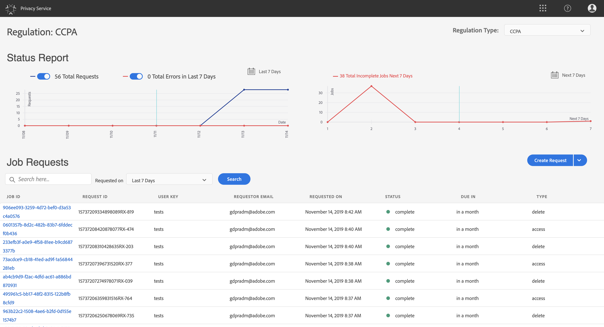

# Administración de trabajos de privacidad en la interfaz de usuario del Privacy Service {#user-guide}

>[!CONTEXTUALHELP]
>id="platform_privacyConsole_requests_description"
>title="Descripción"
>abstract=""

Este documento proporciona los pasos para crear y administrar solicitudes de privacidad mediante el uso de [!DNL Privacy Service] interfaz de usuario.

>[!IMPORTANT]
>
>Privacy Service solo está diseñado para el interesado y las solicitudes de derechos del consumidor. No se admite ni permite ningún otro uso de Privacy Service para la limpieza o el mantenimiento de datos. El Adobe tiene la obligación jurídica de cumplirlos a su debido tiempo. Por lo tanto, no se permite la prueba de carga en el Privacy Service, ya que se trata de un entorno de solo producción y crea un atraso innecesario en las solicitudes de privacidad válidas.
>
>Ahora existe un límite de carga diaria estricto para ayudar a evitar el uso indebido del servicio. Los usuarios a los que se descubra que abusan del sistema tendrán deshabilitado su acceso al servicio. Posteriormente se celebrará una reunión con ellos para abordar sus actividades y examinar el uso aceptable de los Privacy Service.

## Examine la [!DNL Privacy Service] Panel de IU

El tablero para la variable [!DNL Privacy Service] La interfaz de usuario de proporciona dos utilidades que le permiten ver el estado de sus trabajos de privacidad: &quot;[!UICONTROL Informe de estado]&quot; y &quot;[!UICONTROL Solicitudes de trabajo]&quot;. El tablero también muestra la regulación seleccionada actualmente para los trabajos mostrados.

### Tipo de regulación

[!DNL Privacy Service] admite solicitudes de empleo para varias regulaciones de privacidad. En la tabla siguiente se enumeran las regulaciones compatibles y su etiqueta correspondiente tal y como se representa en la IU:

| Etiqueta de la interfaz de usuario | Reglamento |
| --- | --- |
| [!UICONTROL CCPA] | Las [!DNL California Consumer Privacy Act] |
| [!UICONTROL RGPD] | La [!DNL General Data Protection Regulation] |
| [!UICONTROL PDPA_THA] | El [!DNL Personal Data Protection Act] |
| [!UICONTROL LGPD_BRA] | El [!DNL Lei Geral de Proteção de Dados] |
| [!UICONTROL NZPA_NZL] | Nueva Zelanda [!DNL Privacy Act] |
| [!UICONTROL VCDPA_USA] | Las [!DNL Virginia Consumer Data Protection Act] |
| [!UICONTROL CPRA_USA] | Las [!DNL California Consumer Privacy Rights Act (CPRA)] |
| [!UICONTROL APA_AUS] | Las [!DNL Australia Privacy Act (Privacy Act)] |
| [!UICONTROL HIPAA_AUS] | Las [!DNL Health Insurance Portability and Accountability Act] |

{style="table-layout:auto"}

>[!NOTE]
>
>Consulte la descripción general sobre [regulaciones de privacidad compatibles](../regulations/overview.md) para más información sobre el contexto jurídico de cada reglamento.

Los trabajos de cada tipo de regulación se rastrean por separado. Para cambiar entre tipos de regulación, seleccione la opción **[!UICONTROL Tipo de regulación]** menú desplegable y seleccione la regulación que desee en la lista.

Al cambiar el tipo de regulación, el tablero se actualiza para mostrar todos los cuadros de diálogo de operaciones, filtros, utilidades y creación de trabajos que se aplican a la regulación seleccionada.

### Informe de estado

El gráfico del lado izquierdo del widget Informe de estado realiza un seguimiento de los trabajos enviados con cualquier trabajo que pueda haber informado con errores. El gráfico del lado derecho rastrea los trabajos que se acercan al final de la ventana de cumplimiento de 30 días.

Seleccione uno de los dos botones de alternancia situados encima del gráfico para mostrar u ocultar sus métricas respectivas.

Puede ver el número exacto de trabajos asociados con cualquier punto de datos en los gráficos pasando el ratón sobre el punto de datos en cuestión.

Para ver más detalles sobre un punto de datos determinado, seleccione el punto de datos en cuestión para mostrar los trabajos asociados en el widget Solicitudes de Trabajo. Tome nota del filtro que se aplica justo encima de la lista de trabajos.

>[!NOTE]
>
>Cuando se ha aplicado un filtro al widget de solicitudes de trabajo, puede eliminarlo seleccionando la opción **X** en la píldora de filtro. Solicitudes de trabajo y vuelva a la lista de seguimiento predeterminada.

### Solicitudes de trabajo

El widget Solicitudes de Trabajo enumera todas las solicitudes de trabajo disponibles en su organización, incluidos detalles como el tipo de solicitud, el estado actual, la fecha de vencimiento y el correo electrónico del solicitante.

>[!NOTE]
>
>Solo se puede acceder a los datos de los trabajos creados anteriormente durante 30 días después de la fecha de finalización.

Puede filtrar la lista escribiendo palabras clave en la barra de búsqueda debajo del título Solicitudes de trabajo. La lista filtra automáticamente a medida que escribe, mostrando las solicitudes que contienen valores que coinciden con los términos de búsqueda. También puede usar la variable **[!UICONTROL Solicitado el]** menú desplegable para seleccionar un intervalo de tiempo para los trabajos enumerados.

Para ver los detalles de una solicitud de trabajo en particular, seleccione el ID de trabajo de la solicitud en la lista para abrir el **[!UICONTROL Detalles del trabajo]** página.

Este cuadro de diálogo contiene información de estado sobre cada [!DNL Experience Cloud] y su estado actual en relación con el trabajo general. Como cada trabajo de privacidad es asincrónico, la página muestra la última fecha y hora de comunicación (GMT) de cada solución, ya que algunas requieren más tiempo que otras para procesar la solicitud.

Si una solución ha proporcionado datos adicionales, estos se pueden ver en este cuadro de diálogo. Para ver estos datos, seleccione filas de productos individuales.

Para descargar los datos completos del trabajo como archivo CSV, seleccione **[!UICONTROL Exportar a CSV]** en la parte superior derecha del cuadro de diálogo.

## Crear una nueva solicitud de trabajo de privacidad {#create-a-new-privacy-job-request}

>[!CONTEXTUALHELP]
>id="platform_privacyConsole_requests_instructions"
>title="Instrucciones"
>abstract=""

>[!NOTE]
>
>Para crear una solicitud de trabajo de privacidad, debe proporcionar información de identidad para los clientes específicos cuyos datos se van a acceder o eliminar. Revise el documento en [datos de identidad para solicitudes de privacidad](../identity-data.md) antes de continuar con esta sección.

La variable [!DNL Privacy Service] La interfaz de usuario proporciona dos métodos para crear nuevas solicitudes de trabajo:

* [Uso del Creador de solicitudes](#request-builder)
* [Cargar un archivo JSON](#json)

Los pasos para utilizar cada uno de estos métodos se describen en las secciones siguientes.

### Uso del Creador de solicitudes {#request-builder}

Con el Creador de solicitudes, puede crear manualmente una nueva solicitud de trabajo de privacidad en la interfaz de usuario. El Creador de solicitudes es más adecuado para conjuntos de solicitudes más simples y pequeños, ya que este limita las solicitudes para que solo tengan el tipo de ID por usuario. Para solicitudes más complicadas, puede que sea mejor [cargar un archivo JSON](#json) en su lugar.

Para empezar a utilizar el Creador de solicitudes, seleccione **[!UICONTROL Crear solicitud]** debajo del widget Informe de estado en el lado derecho de la pantalla.

La variable **[!UICONTROL Crear solicitud]** se abre el cuadro de diálogo, que muestra las opciones disponibles para enviar una solicitud de trabajo de privacidad para el tipo de regulación seleccionado actualmente.

 

Seleccione el **[!UICONTROL Tipo de trabajo]** de la solicitud (&quot;Eliminar&quot; o &quot;Acceso&quot;) y uno o más productos disponibles de la lista.

 

En **[!UICONTROL Tipo de área de nombres]**, seleccione el tipo de área de nombres apropiado para los ID de cliente a los que se envían [!DNL Privacy Service].

 

Al utilizar el tipo de área de nombres estándar, seleccione un área de nombres en el menú desplegable (correo electrónico, ECID o AAID) y, a continuación, escriba los valores de ID en el cuadro de texto a la derecha, presionando **\&lt;enter>** para que cada ID lo añada a la lista.

 

Al utilizar el tipo de espacio de nombres personalizado, debe escribir manualmente en el espacio de nombres antes de proporcionar los valores de ID siguientes.

 

Cuando termine, seleccione **[!UICONTROL Crear]**.

 

El cuadro de diálogo desaparece y el nuevo trabajo (o trabajos) se muestra en el widget Solicitudes de trabajo junto con su estado de procesamiento actual.

### Cargar un archivo JSON {#json}

Al crear solicitudes más complicadas, como las que utilizan varios tipos de ID para cada interesado que se procesa, puede crear una solicitud cargando un archivo JSON.

Seleccione la flecha situada junto a **[!UICONTROL Crear solicitud]**, debajo del widget Informe de estado en el lado derecho de la pantalla. En la lista de opciones que aparece, seleccione **[!UICONTROL Cargar JSON]**.

La variable **[!UICONTROL Cargar JSON]** , proporcionando una ventana para que arrastre y suelte su archivo JSON en.

 

Si no tiene un archivo JSON para cargar, seleccione **[!UICONTROL Descargar Adobe-GDPR-Request.json]** para descargar una plantilla que pueda rellenar según los valores recopilados de sus interesados.

 

Busque el archivo JSON en su equipo y arrástrelo a la ventana de diálogo. Si la carga se realiza correctamente, el nombre del archivo aparecerá en el cuadro de diálogo. Puede seguir añadiendo más archivos JSON según sea necesario arrastrándolos y soltándolos en el cuadro de diálogo.

Cuando termine, seleccione **[!UICONTROL Crear]**. El cuadro de diálogo desaparece y el nuevo trabajo (o trabajos) se muestra en el widget Solicitudes de trabajo junto con su estado de procesamiento actual.

### Pasos siguientes

Al leer este documento, ha aprendido a usar la variable [!DNL Privacy Service] La interfaz de usuario de para crear un trabajo de privacidad, ver los detalles de un trabajo, supervisar su estado de procesamiento y descargar los resultados una vez que se haya completado.

Para ver los pasos sobre cómo realizar estas operaciones mediante programación usando la variable [!DNL Privacy Service] API, consulte la [Guía de API](../api/overview.md).
