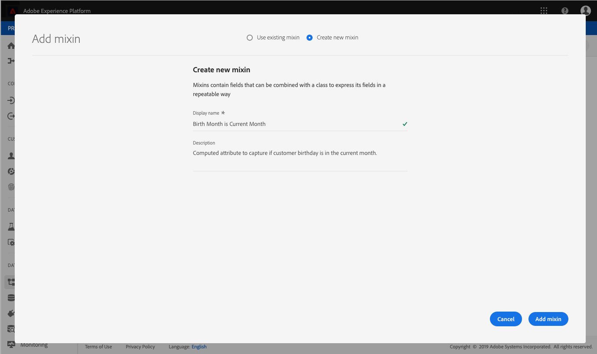

# (Alfa) Configure un campo de atributo calculado en la interfaz de usuario

>[!IMPORTANT]
>
>Actualmente, la funcionalidad de atributos calculados está en formato alfa y no está disponible para todos los usuarios. La documentación y las funciones están sujetas a cambios.

Para configurar un atributo calculado, primero debe identificar el campo que contendrá el valor del atributo calculado. Este campo se puede crear utilizando un grupo de campos de esquema para añadir el campo a un esquema existente o seleccionando un campo que ya haya definido dentro de un esquema.

>[!NOTE]
>
>Los atributos calculados no se pueden agregar a campos dentro de grupos de campos definidos por el Adobe. El campo debe estar dentro de `tenant` namespace, lo que significa que debe ser un campo que defina y agregue a un esquema.

Para definir correctamente un campo de atributo calculado, el esquema debe estar habilitado para [!DNL Profile] y aparecen como parte del esquema de unión para la clase en la que se basa el esquema. Para obtener más información sobre [!DNL Profile]esquemas y uniones habilitados para, revise la sección de la [!DNL Schema Registry] sección de la guía para desarrolladores sobre [activación de un esquema para perfiles y visualización de esquemas de unión](../../xdm/api/getting-started.md). También se recomienda revisar el [sección sobre uniones](../../xdm/schema/composition.md) en la documentación de conceptos básicos de la composición de esquemas.

El flujo de trabajo de este tutorial utiliza un [!DNL Profile]-enabled y sigue los pasos para definir un nuevo grupo de campos que contenga el campo de atributo calculado y garantizar que sea el área de nombres correcta. Si ya tiene un campo en el área de nombres correcta dentro de un esquema con perfil habilitado, puede continuar directamente con el paso para [creación de un atributo calculado](#create-a-computed-attribute).

## Ver un esquema

Los pasos siguientes utilizan la interfaz de usuario de Adobe Experience Platform para localizar un esquema, agregar un grupo de campos y definir un campo. Si prefiere usar la variable [!DNL Schema Registry] API, consulte la [Guía para desarrolladores de Schema Registry](../../xdm/api/getting-started.md) para ver los pasos sobre cómo crear un grupo de campos, agregue un grupo de campos a un esquema y habilite un esquema para utilizarlo con [!DNL Real-Time Customer Profile].

En la interfaz de usuario, haga clic en **[!UICONTROL Esquemas]** en el carril izquierdo y utilice la barra de búsqueda de la **[!UICONTROL Examinar]** para encontrar rápidamente el esquema que desea actualizar.

Una vez localizado el esquema, haga clic en su nombre para abrir [!DNL Schema Editor] donde puede realizar modificaciones en el esquema.

## Creación de un grupo de campos

Para crear un nuevo grupo de campos, haga clic en **[!UICONTROL Añadir]** junto a **[!UICONTROL Grupos de campos]** en el **[!UICONTROL Composición]** en la parte izquierda del editor. Esto abre el **[!UICONTROL Agregar grupo de campos]** donde puede ver los grupos de campos existentes. Haga clic en el botón de opción para **[!UICONTROL Crear nuevo grupo de campos]** para definir el nuevo grupo de campos.

Asigne un nombre y una descripción al grupo de campos y haga clic en **[!UICONTROL Agregar grupo de campos]** cuando se complete.

## Añadir un campo de atributo calculado al esquema

El nuevo grupo de campos debe aparecer ahora en la sección &quot;[!UICONTROL Grupos de campos]&quot; sección bajo &quot;[!UICONTROL Composición]&quot;. Haga clic en el nombre del grupo de campos y en varios **[!UICONTROL Añadir campo]** Los botones aparecerán en la **[!UICONTROL Estructura]** de la sección del editor.

Seleccionar **[!UICONTROL Añadir campo]** junto al nombre del esquema para añadir un campo de nivel superior, o puede seleccionar añadir el campo en cualquier lugar dentro del esquema que prefiera.

Después de hacer clic **[!UICONTROL Añadir campo]** se abre un nuevo objeto, llamado por su ID de inquilino, que muestra que el campo está en el área de nombres correcta. Dentro de ese objeto, una **[!UICONTROL Nuevo campo]** aparece. Este es el campo en el que se define el atributo calculado.

## Configuración del campo

Uso del **[!UICONTROL Propiedades del campo]** en la parte derecha del editor, proporcione la información necesaria para el nuevo campo, incluido su nombre, nombre para mostrar y tipo.

>[!NOTE]
>
>El tipo del campo debe ser el mismo tipo que el valor del atributo calculado. Por ejemplo, si el valor de atributo calculado es una cadena, el campo que se define en el esquema debe ser una cadena.

Cuando termine, haga clic en **[!UICONTROL Aplicar]** y el nombre del campo, así como su tipo, aparecerán en el **[!UICONTROL Estructura]** de la sección del editor.

## Habilitar esquema para [!DNL Profile]

Antes de continuar, asegúrese de que el esquema se ha habilitado para [!DNL Profile]. Haga clic en el nombre del esquema en la **[!UICONTROL Estructura]** del editor para que la variable **[!UICONTROL Propiedades del esquema]** aparece la pestaña. Si la variable **[!UICONTROL Perfil]** el control deslizante es azul, el esquema se ha habilitado para [!DNL Profile].

>[!NOTE]
>
>Activación de un esquema para [!DNL Profile] no se puede deshacer, por lo que si hace clic en el control deslizante una vez que se ha activado, no tiene que arriesgarse a desactivarlo.

Ahora puede hacer clic en **[!UICONTROL Guardar]** para guardar el esquema actualizado y continuar con el resto del tutorial utilizando la API.

## Pasos siguientes

Ahora que ha creado un campo en el que se almacenará el valor de atributo calculado, puede crear el atributo calculado mediante la variable `/computedattributes` Extremo de API. Para ver los pasos detallados para crear un atributo calculado en la API, siga los pasos que se proporcionan en la [guía de extremo de API de atributos calculados](ca-api.md).