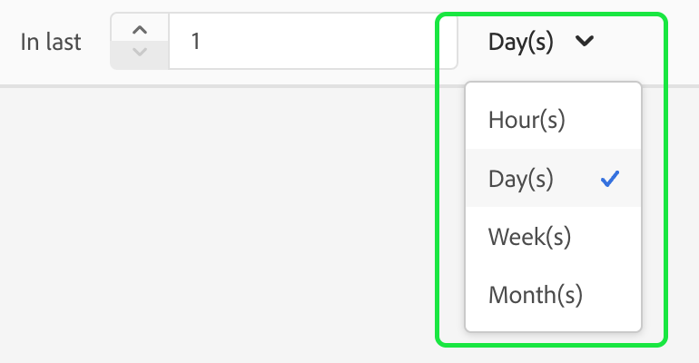

# Guía de IU de atributos calculados

>[!IMPORTANT]
>
>Atributos calculados actualmente en **beta** y es **no** disponible para todos los usuarios.

En Adobe Experience Platform, los atributos calculados son funciones que se utilizan para agregar datos de nivel de evento en atributos de nivel de perfil. Estas funciones se calculan automáticamente para que se puedan utilizar en la segmentación, activación y personalización.

Este documento proporciona una guía sobre cómo crear y actualizar atributos calculados mediante la interfaz de usuario de Adobe Experience Platform.

## Primeros pasos

Esta guía de la interfaz de usuario requiere una comprensión de las distintas [!DNL Experience Platform] servicios relacionados con la gestión de [!DNL Real-Time Customer Profiles]. Antes de leer esta guía o de trabajar en la interfaz de usuario de, consulte la documentación de los siguientes servicios:

- [[!DNL Real-Time Customer Profile]](../home.md): Proporciona un perfil de consumidor unificado y en tiempo real basado en los datos agregados de varias fuentes.
- [[!DNL Experience Data Model (XDM) System]](../../xdm/home.md): El marco estandarizado mediante el cual [!DNL Experience Platform] organiza los datos de experiencia del cliente.

## Ver atributos calculados {#view}

En la IU del Experience Platform, seleccione **[!UICONTROL Perfiles]** en el panel de navegación izquierdo, seguido de **[!UICONTROL Atributos calculados]** para ver una lista de los atributos calculados disponibles para su organización. Esto incluye información sobre el nombre, la descripción, la última fecha de evaluación y el último estado de evaluación del atributo calculado.

![El [!UICONTROL Perfil] y la sección [!UICONTROL Atributos calculados] Las pestañas se resaltan y muestran a los usuarios cómo acceder a la página de exploración atributos calculados.](./images/ui/browse.png)

Para seleccionar qué campos están visibles, puede seleccionar  para agregar o quitar los campos que desea mostrar.

| Campo | Descripción |
| ----- | ----------- |
| [!UICONTROL Nombre] | El nombre para mostrar del atributo calculado. |
| [!UICONTROL Descripción] | La descripción del atributo calculado. |
| [!UICONTROL Método de evaluación] | El método de evaluación para el atributo calculado. En este momento, solo **lote** es compatible. |
| [!UICONTROL Última evaluación] | Esta marca de tiempo representa la última ejecución correcta de la evaluación. Solo los eventos que se produjeron **antes** esta marca de tiempo se tiene en cuenta en la última evaluación correcta. |
| [!UICONTROL Último estado de evaluación] | El estado que indica si el atributo calculado se calculó correctamente o no en la última ejecución de evaluación. Los valores posibles incluyen **[!UICONTROL Correcto]** o **[!UICONTROL Error]**. |
| [!UICONTROL Frecuencia de actualización] | Una indicación de la frecuencia con la que se espera actualizar el atributo calculado. Los valores posibles incluyen horaria, diaria, semanal o mensual. |
| [!UICONTROL Actualización rápida] | Valor que muestra si la actualización rápida está habilitada o no para este atributo de cálculo. Si la actualización rápida está habilitada, esto permite que el atributo calculado se actualice diariamente, en lugar de cada semana, cada dos semanas o mensualmente. Este valor solo es aplicable a atributos calculados con un periodo retroactivo bueno a una base semanal. |
| [!UICONTROL Estado del ciclo vital] | El estado actual del atributo calculado. Hay tres estados posibles: <ul><li>**[!UICONTROL Borrador]:** El atributo calculado sí **no** aún tiene un campo creado en el esquema. En este estado, se puede editar el atributo calculado. </li><li>**[!UICONTROL Publicado]:** El atributo calculado tiene un campo creado en el esquema y está listo para utilizarse. En este estado, el atributo calculado **no puede** no se puede editar.</li><li>**[!UICONTROL Inactivo]:** El atributo calculado está deshabilitado. Para obtener más información sobre el estado inactivo, lea la [página de preguntas frecuentes](./faq.md#inactive-status). </li> |

Además, puede seleccionar un atributo calculado para ver información más detallada al respecto. Para obtener más información sobre la página de detalles de atributos calculados, lea la [ver la sección de detalles de un atributo calculado](#view-details).

## Creación de un atributo calculado {#create}

Para crear un nuevo atributo calculado, seleccione **[!UICONTROL Crear atributo calculado]** para introducir el nuevo flujo de trabajo de atributos calculados.

![El [!UICONTROL Creación de atributos calculados] El botón aparece resaltado y muestra a los usuarios cómo acceder a la página crear un atributo calculado.](./images/ui/create.png)

El **[!UICONTROL Crear atributo calculado]** página. En esta página, puede agregar la información básica del atributo calculado que desea crear.

| Campo | Descripción |
| ----- | ----------- |
| [!UICONTROL Nombre para mostrar] | Nombre por el que se conocerá el atributo calculado. Debe mantener este nombre para mostrar único para cada atributo calculado. Como práctica recomendada, este nombre para mostrar debe contener identificadores relacionados con el atributo calculado. Por ejemplo, &quot;Suma de compras de zapatos en los últimos 7 días&quot;. |
| [!UICONTROL Nombre del campo] | Un nombre que se utiliza para hacer referencia al atributo calculado en otros servicios descendentes. Este nombre se deriva automáticamente del nombre para mostrar y se escribe en camelCase. |
| [!UICONTROL Descripción] | Descripción del atributo calculado que está intentando crear. |

![El [!UICONTROL Información básica] de la sección [!UICONTROL Crear atributo calculado] página está resaltada.](./images/ui/basic-information.png)

Después de agregar los detalles del atributo calculado, puede empezar a definir las reglas.

### Especificar condiciones de filtrado de eventos

Para crear una regla, seleccione primero los atributos del **[!UICONTROL Eventos]** para filtrar los eventos en los que desea agregar. Actualmente, solo se admiten atributos de evento de tipo no matriz.

![El [!UICONTROL Eventos] La sección está resaltada.](./images/ui/events.png)

Después de seleccionar el atributo que se va a utilizar en la definición de atributo calculada, puede elegir con qué se comparará este valor.

### Aplicar función de agregación

Ahora, puede aplicar una función al campo desde la salida condicional. En primer lugar, seleccione el tipo de función de agregación. Las opciones disponibles incluyen [!UICONTROL Sum], [!UICONTROL Min], [!UICONTROL Max], [!UICONTROL Recuento], y [!UICONTROL Más reciente]. Encontrará más información sobre estas funciones en la [sección de funciones](./overview.md#functions) de la descripción general de los atributos calculados.

Después de elegir una función, puede elegir el campo con el que desea agregar. Los campos aptos que se van a elegir dependen de la función seleccionada.

### Duración de retroactividad

Después de aplicar la función de agregación, debe definir el período retroactivo del atributo calculado. Este período de retrospectiva especifica el período de tiempo en el que desea agregar eventos. Esta duración retrospectiva se puede especificar en términos de horas, días, semanas o meses.

Una vez completados estos pasos, puede elegir guardar este atributo calculado como borrador o publicarlo inmediatamente.

![El [!UICONTROL Guardar como borrador] y [!UICONTROL Publish] Los botones están resaltados.](./images/ui/draft-or-publish.png)

## Visualización de los detalles de un atributo calculado {#view-details}

Para ver los detalles de un atributo calculado, seleccione el atributo calculado sobre el que desea ver detalles en la [!UICONTROL **Examinar**] página.

El contenido de la página difiere según si el atributo calculado es **[!UICONTROL Publicado]** o en **[!UICONTROL Borrador]**.

### Atributo calculado publicado {#published}

Al seleccionar un atributo calculado publicado, aparece la página de detalles de atributos calculados.

Esta página muestra un resumen de los detalles del atributo calculado, así como un gráfico que muestra la distribución de valores, así como perfiles de muestra que cumplen los requisitos para el atributo calculado.

>[!NOTE]
>
>La distribución de valores refleja la distribución de los valores de atributo de los perfiles en el momento del trabajo de muestreo. El valor de atributo calculado en el perfil de muestra refleja el valor de perfil combinado más reciente de algunos perfiles de muestra.

### Borrador de atributo calculado {#draft}

Al seleccionar un atributo calculado de borrador, la variable **[!UICONTROL Editar atributos calculados]** página. Esta página es similar a la [!UICONTROL Creación de atributos calculados] , permite editar la información básica del atributo calculado, así como su definición, antes de permitirle actualizar el borrador o publicarlo.

![El [!UICONTROL Editar atributos calculados] se muestra la página.](./images/ui/edit.png)

## Uso de atributos calculados {#usage}

Después de crear un atributo calculado, puede utilizar **publicado** atributos calculados en otros servicios descendentes. Dado que los atributos calculados son campos de atributos de perfil creados en el esquema de unión de perfiles, puede buscar valores de atributos calculados para un perfil del cliente en tiempo real, utilizarlos en una audiencia, activarlos en un destino o utilizarlos para la personalización en recorridos en Adobe Journey Optimizer.

## Pasos siguientes

Para obtener más información sobre los atributos calculados, lea la [información general sobre atributos calculados](./overview.md). Para obtener información sobre la creación y configuración de atributos calculados mediante la API, lea la [guía para desarrolladores de atributos calculados](./api.md).
