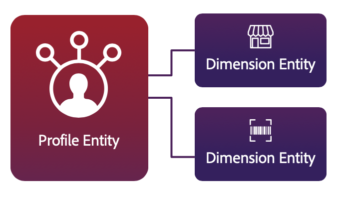

# [!DNL Platform] guardas para [!DNL Real-time Customer Profile]

[!DNL Real-time Customer Profile] proporciona perfiles individuales que le permiten ofrecer experiencias personalizadas entre canales basadas en perspectivas de comportamiento y atributos del cliente. Para lograr este objetivo, [!DNL Profile] y el motor de segmentación dentro de Adobe Experience Platform utilizan un modelo de datos híbridos altamente desnormalizado que oferta un nuevo enfoque para desarrollar perfiles de clientes. El uso de este modelo de datos híbridos hace extremadamente importante que los datos que se recopilan se modelen correctamente. Aunque el almacén de datos [!DNL Profile] que mantiene los datos de perfil no es un almacén relacional, [!DNL Profile] permite la integración con entidades de dimensión pequeñas para crear segmentos de forma simplificada e intuitiva. Esta integración se conoce como segmentación multientidad.

Adobe Experience Platform proporciona una serie de protecciones que le ayudan a evitar la creación de modelos de datos que [!DNL Real-time Customer Profile] no son compatibles. Este documento describe las prácticas recomendadas y las restricciones al utilizar entidades de dimensión, específicamente en la segmentación por lotes.

>[!NOTE]
>
>Los guardas y límites que se describen en este documento se están mejorando constantemente. Regrese regularmente para ver las actualizaciones.

## Primeros pasos

Se recomienda leer la siguiente documentación de servicios de Experience Platform antes de intentar crear modelos de datos para utilizarlos en [!DNL Real-time Customer Profile]. Trabajar con modelos de datos y las barreras descritas en este documento requiere comprender los diversos servicios de Experience Platform que intervienen en la gestión de [!DNL Real-time Customer Profile] las entidades:

* [[!DNL Real-time Customer Profile]](home.md):: Proporciona un perfil de consumo unificado y en tiempo real basado en datos agregados de varias fuentes.
* [Adobe Experience Platform Identity Service](../identity-service/home.md): Admite la creación de una &quot;vista única del cliente&quot; mediante el enlace de identidades de fuentes de datos dispares a medida que se van ingeriendo en [!DNL Platform].
* [[!DNL Experience Data Model (XDM)]](../xdm/home.md):: El marco estandarizado por el cual Platform organiza los datos de experiencia del cliente.
   * [Conceptos básicos de la composición](../xdm/schema/composition.md)de esquemas: Introducción a los esquemas y a los modelos de datos en Experience Platform.
* [Servicio](../segmentation/home.md)de segmentación de Adobe Experience Platform: Motor de segmentación dentro del [!DNL Platform] que se utiliza para crear segmentos de audiencia a partir de los perfiles del cliente en función de los comportamientos y atributos del cliente.
   * [Segmentación](../segmentation/multi-entity-segmentation.md)multientidad: Una guía para crear segmentos que integren entidades de dimensión con datos de perfil.

## Tipos de entidades

El modelo [!DNL Profile] de datos de almacenamiento consta de dos tipos de entidades principales:

* **Entidad principal:** Una entidad principal, o entidad perfil, combina los datos para formar una &quot;única fuente de verdad&quot; para un individuo. Estos datos unificados se representan usando lo que se conoce como &quot;vista de unión&quot;. Una vista de unión agrega los campos de todos los esquemas que implementan la misma clase en un único esquema de unión. El esquema de unión para [!DNL Real-time Customer Profile] es un modelo de datos híbridos desnormalizado que actúa como contenedor para todos los eventos de comportamiento y atributos de perfil.

   Los atributos independientes del tiempo, también conocidos como &quot;datos de registro&quot;, se modelan usando [!DNL XDM Individual Profile], mientras que los datos de series temporales, también conocidos como &quot;datos de evento&quot;, se modelan usando [!DNL XDM ExperienceEvent]. A medida que los datos de registros y series temporales se ingieren en Adobe Experience Platform, se activa [!DNL Real-time Customer Profile] el inicio de la ingesta de datos que se han habilitado para su uso. Cuanto más interacciones y detalles se ingieran, más robustos se volverán los perfiles individuales.

   

* **Entidad Dimension:** Su organización también puede definir clases XDM para describir otras cosas que no son personas, como tiendas, productos o propiedades. Estos esquemas no[!DNL XDM Individual Profile] se conocen como &quot;entidades de dimensión&quot; y no contienen datos de series temporales. Las entidades Dimension proporcionan datos de búsqueda que ayudan y simplifican las definiciones de segmentos de varias entidades y deben ser lo suficientemente pequeñas como para que el motor de segmentación pueda cargar todo el conjunto de datos en la memoria para un procesamiento óptimo (búsqueda rápida de puntos).

   

## Tipos de límite

Al definir el modelo de datos, se recomienda permanecer dentro de los márgenes de seguridad proporcionados para garantizar un rendimiento adecuado y evitar errores en el sistema. Las barandillas previstas en este documento incluyen dos tipos de límite:

* **Límite suave:** Un límite suave proporciona un máximo recomendado para un rendimiento óptimo del sistema. Es posible ir más allá de un límite suave sin romper el sistema ni recibir mensajes de error, aunque ir más allá de un límite suave provocará una degradación del rendimiento. Se recomienda mantenerse dentro del límite suave para evitar disminuciones en el rendimiento general.

* **Límite duro:** Un límite máximo absoluto para el sistema. Si se supera un límite máximo, se producirán errores y roturas, lo que impedirá que el sistema funcione según lo previsto.

## Guardias del modelo de datos

Al crear un modelo de datos para utilizarlo con [!DNL Real-time Customer Profile], se recomienda seguir las siguientes instrucciones.

### Guardias de entidad principal

| Guardrade | Límite | Tipo de límite | Descripción |
| --- | --- | --- | --- |
| Número de conjuntos de datos recomendados para contribuir al esquema de [!DNL Profile] unión | 20 | Leve | **Se recomienda un máximo de 20 conjuntos de datos [!DNL Profile]habilitados.** Para habilitar otro conjunto de datos para [!DNL Profile], primero se debe eliminar o deshabilitar un conjunto de datos existente. |
| Número de relaciones de varias entidades recomendadas | 5 | Leve | **Se recomienda un máximo de 5 relaciones de varias entidades definidas entre entidades principales y entidades de dimensión.** No se deben realizar asignaciones de relación adicionales hasta que se elimine o desactive una relación existente. |
| Profundidad máxima de JSON para el campo de ID utilizado en la relación de varias entidades | 4 | Leve | **La profundidad máxima recomendada de JSON para un campo de ID utilizado en relaciones de varias entidades es 4.** Esto significa que en un esquema muy anidado, los campos anidados con más de 4 niveles de profundidad no deben utilizarse como campo de ID en una relación. |
| Cardinalidad de matriz en un fragmento de perfil | &lt;=500 | Leve | **La cardinalidad óptima de la matriz en un fragmento de perfil (datos independientes del tiempo) es &lt;=500.** |
| Cardinalidad de matriz en ExperienceEvent | &lt;=10 | Leve | **La cardinalidad óptima de la matriz en un evento ExperienceEvent (datos de series temporales) es &lt;=10.** |

### Garantías de entidad Dimension

| Guardrade | Límite | Tipo de límite | Descripción |
| --- | --- | --- | --- |
| No se permiten datos de series temporales para entidades que no son[!DNL XDM Individual Profile] entidades | 0 | Grave | **No se permiten datos de series temporales para entidades que no pertenecen a Perfil Service[!DNL XDM Individual Profile] .** Si un conjunto de datos de series temporales está asociado con un no-[!DNL XDM Individual Profile] ID, el conjunto de datos no debe habilitarse para [!DNL Profile]. |
| No hay relaciones anidadas | 0 | Leve | **No debe crear una relación entre dos no esquemas[!DNL XDM Individual Profile] .** No se recomienda la capacidad de crear relaciones para ningún esquema que no forme parte del esquema de [!DNL Profile] unión. |
| Profundidad JSON máxima para el campo de ID principal | 4 | Leve | **La profundidad máxima recomendada de JSON para el campo de ID principal es 4.** Esto significa que en un esquema muy anidado, no debe seleccionar un campo como ID principal si está anidado con más de 4 niveles de profundidad. Un campo que se encuentra en el cuarto nivel anidado puede utilizarse como ID principal. |

## Guardias de tamaño de datos

Las siguientes barreras hacen referencia al tamaño de los datos y se recomiendan para garantizar que los datos se puedan ingerir, almacenar y consultar según lo previsto.

>[!NOTE]
>
>El tamaño de los datos se medirá como datos sin comprimir en JSON en el momento de la ingestión.

### Guardias de entidad principal

| Guardrade | Límite | Tipo de límite | Descripción |
| --- | --- | --- | --- |
| Tamaño máximo por fragmento de perfil | 10KB | Leve | **El tamaño máximo recomendado de un fragmento de perfil es de 10 KB.** La ingesta de fragmentos de perfil más grandes afectará al rendimiento del sistema. Por ejemplo, si se carga un conjunto de datos CRM pesado en el que algunos fragmentos de perfil tienen un tamaño de 50 kB, se degradará el rendimiento del sistema. |
| Tamaño máximo absoluto por fragmento de perfil | 1MB | Grave | **El tamaño máximo absoluto de un fragmento de perfil es de 1 MB.** La ingestión fallará al intentar cargar un fragmento de perfil de más de 1 MB. |

### Garantías de entidad Dimension

| Guardrade | Límite | Tipo de límite | Descripción |
| --- | --- | --- | --- |
| Tamaño total máximo para todas las entidades dimensionales | 5 GB   | Leve | **El tamaño total máximo recomendado para todas las entidades dimensionales es de 5 GB.** La ingesta de entidades de dimensiones grandes provocará una degradación del rendimiento del sistema. Por ejemplo, no se recomienda intentar cargar un catálogo de productos de 10 GB como una entidad de dimensión. |
| Conjuntos de datos por esquema de entidad dimensional | 5 | Leve | **Se recomienda un máximo de 5 conjuntos de datos asociados con cada esquema de entidad dimensional.** Por ejemplo: si crea un esquema para &quot;productos&quot; y agrega cinco conjuntos de datos de contribución, no debe crear un sexto conjunto de datos vinculado al esquema de productos. |