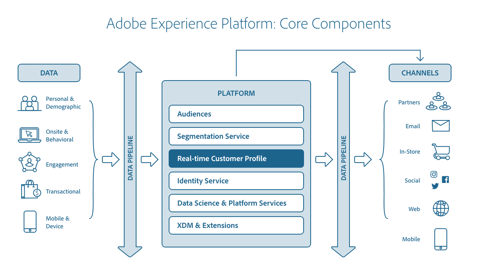

# Información general del [!DNL Real-time Customer Profile]

Adobe Experience Platform le permite dirigir experiencias coordinadas, coherentes y relevantes para sus clientes, independientemente de dónde o cuándo interactúen con su marca. Con [!DNL Real-time Customer Profile], puede ver una vista holística de cada cliente individual mediante la combinación de datos de varios canales, incluso en línea, sin conexión, CRM y de terceros. [!DNL Profile] le permite consolidar los datos de sus clientes en una vista unificada que ofrece una cuenta procesable con marca de hora de cada interacción con los clientes. Esta información general le ayudará a comprender la función y el uso de [!DNL Real-time Customer Profile] en [!DNL Experience Platform].

## [!DNL Profile] en Experience Platform

La relación entre el Perfil del cliente en tiempo real y otros servicios dentro del Experience Platform se resalta en el diagrama siguiente:

## Explicación de los perfiles

[!DNL Real-time Customer Profile] combina datos de varios sistemas empresariales y, a continuación, proporciona acceso a esos datos en forma de perfiles de clientes con eventos de series temporales relacionados. Esta función permite a los especialistas en marketing impulsar experiencias coordinadas, coherentes y relevantes con sus audiencias en varios canales. Las siguientes secciones resaltan algunos de los conceptos básicos que debe comprender para crear y mantener perfiles de forma eficaz dentro de la plataforma.

### Almacén de datos de perfil

Aunque [!DNL Real-time Customer Profile] procesa datos ingestados y utiliza Adobe Experience Platform [!DNL Identity Service] para combinar datos relacionados mediante la asignación de identidades, mantiene sus propios datos en el almacén de datos [!DNL Profile]. El almacén [!DNL Profile] está separado de los datos del catálogo en el lago de datos y de [!DNL Identity Service] datos en el gráfico de identidad.

El almacén de Perfiles utiliza una infraestructura de base de datos Cosmos de Microsoft Azure y Platform Data Lake utiliza el almacenamiento de Microsoft Azure Data Lake.

### Guardias de perfil

Experience Platform proporciona una serie de protecciones que le ayudan a evitar la creación de esquemas [del Modelo de datos de experiencia (XDM)](../xdm/home.md) que el Perfil del cliente en tiempo real no puede admitir. Esto incluye límites suaves que resultarán en la degradación del rendimiento, así como límites duros que resultarán en errores y averías del sistema. Para obtener más información, incluida una lista de directrices y casos de uso de ejemplo, lea la documentación de [resguardos de Perfil](guardrails.md).

### (Alfa) panel de Perfil {#profile-dashboard}

>[!IMPORTANT]
>
>La funcionalidad de panel está actualmente en alfa y no está disponible para todos los usuarios. La documentación y las funciones están sujetas a cambios.

La interfaz de usuario del Experience Platform proporciona un panel mediante el cual puede realizar vistas de información importante sobre los datos de Perfil del cliente en tiempo real, tal como se capturan durante una instantánea diaria. Para obtener más información sobre cómo acceder y trabajar con el panel [!DNL Profile] en la interfaz de usuario, así como información detallada sobre las métricas que se muestran en el panel, consulte la [guía de la interfaz de usuario de Perfil panel](ui/profile-dashboard.md).

### Fragmentos de perfil vs. perfiles combinados {#profile-fragments-vs-merged-profiles}

Cada perfil de cliente individual está compuesto por varios fragmentos de perfil que se han combinado para formar una sola vista de ese cliente. Por ejemplo, si un cliente interactúa con su marca en varios canales, su organización tendrá varios fragmentos de perfil relacionados con ese único cliente que aparecerán en varios conjuntos de datos. Cuando estos fragmentos se ingieren en la plataforma, se combinan para crear un solo perfil para ese cliente.

Cuando los datos de varias fuentes entran en conflicto (por ejemplo, un fragmento lista al cliente como &quot;soltero&quot; mientras que el otro lista al cliente como &quot;casado&quot;), la [directiva de combinación](#merge-policies) determina qué información se debe priorizar e incluir en el perfil del individuo. Por lo tanto, es probable que el número total de fragmentos de perfil dentro de la plataforma siempre sea mayor que el número total de perfiles combinados, ya que cada perfil está compuesto de varios fragmentos.

### Registrar datos

Un perfil es una representación de un sujeto, una organización o un individuo, compuesta de muchos atributos (también conocidos como datos de registros). Por ejemplo, el perfil de un producto puede incluir un SKU y una descripción, mientras que el perfil de una persona contiene información como nombre, apellidos y dirección de correo electrónico. Mediante [!DNL Experience Platform], puede personalizar perfiles para utilizar datos específicos relevantes para su negocio. La clase estándar [!DNL Experience Data Model] (XDM), [!DNL XDM Individual Profile], es la clase preferida sobre la que se genera un esquema al describir datos de registros de clientes y proporciona la información integral a muchas interacciones entre los servicios de plataforma. Para obtener más información sobre cómo trabajar con esquemas en [!DNL Experience Platform], lea la [información general del sistema XDM](../xdm/home.md).

### Eventos de series temporales

Los datos de series temporales proporcionan una instantánea del sistema en el momento en que un sujeto realizó una acción, directa o indirectamente, así como datos que detallan el propio evento. Representados por la clase de esquema estándar XDM ExperienceEvent, los datos de series temporales pueden describir eventos como elementos que se agregan a un carro, vínculos en los que se hace clic y vídeos vistos. Los datos de series temporales pueden utilizarse para basar las reglas de segmentación en y se puede acceder a los eventos de forma individual en el contexto de un perfil.

### Identidades

Cada empresa quiere comunicarse con sus clientes de una manera que se sienta personal. Sin embargo, uno de los desafíos de ofrecer experiencias digitales relevantes a los clientes es comprender cómo unir sus datos desconectados, lo que a menudo se extiende a través de diferentes canales digitales, como tabletas, teléfonos móviles y portátiles. [!DNL Identity Service] le permite crear una imagen completa de su cliente vinculando identidades de varios canales y creando un gráfico de identidad para cada cliente. Visite la [información general del servicio de identidad](../identity-service/home.md) para obtener más información.

### Combinar directivas

Al reunir fragmentos de datos de varias fuentes y combinarlos para ver una vista completa de cada uno de sus clientes individuales, las políticas de combinación son las reglas que [!DNL Platform] utiliza para determinar cómo se priorizarán los datos y qué datos se utilizarán para crear el perfil del cliente. Cuando hay datos contradictorios de varios conjuntos de datos, la política de combinación determinará cómo deben tratarse esos datos y qué valor debe utilizarse. Mediante las API de RESTful o la interfaz de usuario, puede crear nuevas políticas de combinación, administrar políticas existentes y establecer una directiva de combinación predeterminada para su organización.

Para obtener más información sobre cómo trabajar con políticas de combinación mediante la API [!DNL Real-time Customer Profile], consulte la [guía de extremo de directivas de combinación](api/merge-policies.md). Para trabajar con directivas de combinación mediante la [!DNL Experience Platform] IU, consulte la [guía de IU de directivas de combinación](ui/merge-policies.md).

### Esquemas de unión {#profile-fragments-and-union-schemas}

Una de las características clave de [!DNL Real-time Customer Profile] es la capacidad de unificar datos de varios canales. Cuando [!DNL Real-time Customer Profile] se utiliza para acceder a una entidad, puede proporcionarle una vista combinada de todos los fragmentos de perfil para esa entidad en todos los conjuntos de datos, denominada &quot;vista de unión&quot; y posible a través de lo que se conoce como esquema de unión.

Para obtener más información sobre los esquemas de unión, incluido el acceso a esquemas de unión en la interfaz de usuario, visite la [guía de la interfaz de usuario de esquema de unión](ui/union-schema.md).

### (Alfa) Atributos calculados

>[!IMPORTANT]
>
>La funcionalidad de atributo calculada está en alfa. La documentación y las funciones están sujetas a cambios.

Los atributos calculados permiten calcular automáticamente el valor de los campos en función de otros valores, cálculos y expresiones. Los atributos calculados funcionan en el nivel de perfil, lo que significa que se pueden acumulados valores en todos los registros y eventos. Cada atributo calculado contiene una expresión, o &quot;regla&quot;, que evalúa los datos entrantes y almacena el valor resultante en un atributo de perfil o en un evento. Estos cálculos le ayudan a responder fácilmente preguntas relacionadas con aspectos como el valor de compra de por vida, el tiempo entre compras o la cantidad de aperturas de aplicaciones, sin necesidad de realizar cálculos complejos manualmente cada vez que se necesita la información. Para obtener más información sobre los atributos calculados e instrucciones paso a paso para trabajar con ellos mediante la API [!DNL Real-time Customer Profile], consulte la [guía del extremo de atributos calculados](api/computed-attributes.md). Esta guía le ayudará a comprender mejor la función que los atributos calculados desempeñan en Adobe Experience Platform, e incluye ejemplos de llamadas de API para realizar operaciones CRUD básicas.

## Perfiles y segmentos

Adobe Experience Platform [!DNL Segmentation Service] produce las audiencias necesarias para potenciar las experiencias para sus clientes individuales. Cuando se crea un segmento de audiencia, el ID de ese segmento se agrega a la lista de pertenencias a segmentos para todos los perfiles que cumplen los requisitos. Las reglas de segmentos se generan y aplican a los datos [!DNL Real-time Customer Profile] mediante las API de RESTful y la interfaz de usuario del Generador de segmentos. Para obtener más información sobre la segmentación, lea la [información general del servicio de segmentación](../segmentation/home.md).

### Transmisión de flujo continuo e ingestión y segmentación de flujo continuo

La entrada en tiempo real es posible a través de un proceso llamado transmisión de la ingesta. A medida que se ingieren datos de series temporales y de perfiles, [!DNL Real-time Customer Profile] decide automáticamente incluir o excluir esos datos de los segmentos a través de un proceso continuo denominado segmentación por flujo continuo, antes de combinarlos con datos existentes y actualizar la vista de unión. Como resultado, puede realizar cálculos instantáneamente y tomar decisiones para ofrecer experiencias mejoradas e individualizadas a los clientes a medida que interactúan con su marca. Mientras se ingieren, los datos también se someten a validación para garantizar que se ingieran correctamente y se ajusten al esquema en el que se basa el conjunto de datos. Para obtener más información sobre qué validación se realiza durante la ingestión, lea la [información general sobre la calidad de la ingestión de datos](../ingestion/quality/overview.md).

## Proyecciones de Edge

Para ofrecer a sus clientes experiencias coordinadas, coherentes y personalizadas en varios canales en tiempo real, es necesario disponer de los datos adecuados y actualizarlos continuamente a medida que se produzcan cambios. Adobe Experience Platform permite este acceso en tiempo real a los datos mediante el uso de lo que se conoce como bordes. Un edge es un servidor ubicado geográficamente que almacena datos y los hace fácilmente accesibles para las aplicaciones. Por ejemplo, las aplicaciones de Adobe como Adobe Target y Adobe Campaign utilizan bordes para ofrecer experiencias personalizadas al cliente en tiempo real. Los datos se dirigen a un borde mediante una proyección, con un destino de proyección que define el borde al que se enviarán los datos y una configuración de proyección que define la información específica que estará disponible en el borde. Para obtener más información y empezar a trabajar con proyecciones mediante la API [!DNL Real-time Customer Profile], consulte la [guía de puntos finales de proyección de Edge](api/edge-projections.md).

## Ingreso de datos en [!DNL Profile]

[!DNL Platform] puede configurarse para enviar datos de registros y series temporales a  [!DNL Profile], admitiendo la transmisión de flujo continuo en tiempo real y la ingestión por lotes. Para obtener más información, consulte el tutorial que describe cómo [agregar datos al Perfil del cliente en tiempo real](tutorials/add-profile-data.md).

>[!NOTE]
>
>Los datos recopilados a través de soluciones de Adobe, incluyendo [!DNL Analytics Cloud], [!DNL Marketing Cloud] y [!DNL Advertising Cloud], fluyen hacia [!DNL Experience Platform] y se ingieren en [!DNL Profile].

### Métricas de ingestión de perfiles

Las perspectivas de visibilidad le permiten exponer métricas clave en Adobe Experience Platform. Además de [!DNL Experience Platform] estadísticas de uso e indicadores de rendimiento para diversas funcionalidades [!DNL Platform], existen métricas específicas relacionadas con el perfil que permiten obtener una perspectiva sobre las tasas de solicitudes entrantes, las tasas de ingestión exitosas, los tamaños de registros ingestados y mucho más. Para obtener más información, lea la [información general de la API de perspectivas de observación](../observability/api/overview.md) y, para obtener una lista completa de las métricas de Perfil del cliente en tiempo real, consulte la documentación sobre [métricas disponibles](../observability/api/metrics.md#available-metrics).

## [!DNL Data governance] y [!DNL Privacy]

[!DNL Data governance] es una serie de estrategias y tecnologías utilizadas para administrar los datos de los clientes y garantizar el cumplimiento de las regulaciones, restricciones y políticas aplicables al uso de los datos.

En lo que se refiere al acceso a los datos, la administración de los datos desempeña un papel clave dentro de [!DNL Experience Platform] a varios niveles:
* Etiquetado de uso de datos
* Directivas de acceso a datos
* Control de acceso de datos para acciones de marketing

[!DNL Data governance] se administra en varios puntos. Éstos incluyen decidir qué datos se ingieren en [!DNL Platform] y qué datos son accesibles después de la ingestión para una acción de mercadotecnia determinada. Para obtener más información, lea la [información general de la administración de datos](../data-governance/home.md).

### Gestión de solicitudes de exclusión y de privacidad de datos

[!DNL Experience Platform] permite a los clientes enviar solicitudes de exclusión relacionadas con el uso y el almacenamiento de sus datos en  [!DNL Real-time Customer Profile]. Para obtener más información sobre cómo se administran las solicitudes de exclusión, consulte la documentación sobre [cumplimiento de las solicitudes de exclusión](../segmentation/honoring-opt-outs.md).

## Próximos pasos y recursos adicionales

Para obtener más información sobre cómo trabajar con [!DNL Real-time Customer Profile] datos mediante la interfaz de usuario del Experience Platform o la API de Perfil, lea la [guía de la interfaz de usuario de Perfil](ui/user-guide.md) o la [guía del desarrollador de API](api/overview.md), respectivamente.