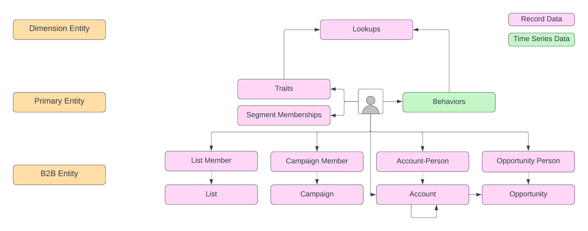

# Información general del [!DNL Real-Time Customer Profile]

Adobe Experience Platform le permite ofrecer experiencias coordinadas, coherentes y relevantes a sus clientes, independientemente de dónde o cuándo interactúen con su marca. con [!DNL Real-Time Customer Profile], puede ver una vista holística de cada cliente individual combinando datos de varios canales, incluidos en línea, sin conexión, CRM y de terceros. [!DNL Profile] le permite consolidar los datos de sus clientes en una vista unificada que ofrece una cuenta procesable con marca de tiempo de cada interacción con los clientes. Esta descripción general le ayudará a comprender la función y el uso de [!DNL Real-Time Customer Profile] en [!DNL Experience Platform].

## [!DNL Profile] en Experience Platform

La relación entre Perfil del cliente en tiempo real y otros servicios dentro de Experience Platform se resalta en el siguiente diagrama:

## Explicación de los perfiles

[!DNL Real-Time Customer Profile] combina datos de varios sistemas empresariales y, a continuación, proporciona acceso a esos datos en forma de perfiles de clientes con eventos de series temporales relacionados. Esta función permite a los especialistas en marketing impulsar experiencias coordinadas, coherentes y relevantes con sus audiencias en varios canales. Las siguientes secciones destacan algunos de los conceptos principales que debe comprender para crear y mantener perfiles de forma eficaz dentro de Platform.

### Composición de entidad de perfil

Un perfil de cliente en tiempo real está compuesto por una entidad principal, denominada **entidad principal** y varias entidades de soporte. En el contexto del Experience Platform, la entidad principal suele ser un **entidad de perfil**, que se compone de características, comportamientos y pertenencias a segmentos de una persona individual. Otras entidades permiten al motor de segmentación utilizar datos fuera de la entidad principal del perfil e incluyen lo siguiente:

- **Entidad dimensional**: La entidad que se utiliza para simplificar el proceso de modelado de datos para la información compartida entre eventos o registros de perfil. Esto también se conoce como entidad de búsqueda o entidad de clasificación.
- **Entidad B2B**: Entidades que describen la relación del perfil con las cuentas y oportunidades de negocio a negocio.

>[!IMPORTANT]
>
>Dado que las entidades dimensionales y B2B solo existen fuera de la entidad principal, solo se utilizan para la segmentación por lotes.

Las entidades dimensionales y B2B están vinculadas a la entidad principal a través de **relaciones de esquema**. Consulte la siguiente documentación para obtener más información:

- [Creación de una relación de esquema individual para entidades de consulta](../xdm/tutorials/relationship-ui.md)
- [Crear una relación de esquema &quot;varios a uno&quot; para entidades B2B](../xdm/tutorials/relationship-b2b.md)

### Almacenamiento de datos de perfil

Aunque [!DNL Real-Time Customer Profile] procesa los datos introducidos y utiliza Adobe Experience Platform [!DNL Identity Service] para combinar datos relacionados mediante asignación de identidad, mantiene sus propios datos en la variable [!DNL Profile] almacén de datos. La variable [!DNL Profile] el almacén es independiente de los datos del catálogo en el lago de datos y [!DNL Identity Service] datos en el gráfico de identidad.

El Almacenamiento de perfiles utiliza una infraestructura de base de datos de Microsoft Azure Cosmos y Platform Data Lake utiliza el almacenamiento de datos de Microsoft Azure.

### Protecciones de perfil

El Experience Platform proporciona una serie de protecciones que le ayudan a evitar la creación de [Esquemas del Modelo de datos de experiencia (XDM)](../xdm/home.md) que no admite el perfil de cliente en tiempo real. Esto incluye límites leves que resultarán en una degradación del rendimiento, así como límites duros que resultarán en errores y averías del sistema. Para obtener más información, incluida una lista de directrices y ejemplos de casos de uso, lea la [Protecciones de perfil](guardrails.md) documentación.

### Panel de perfiles {#profile-dashboard}

La interfaz de usuario del Experience Platform proporciona un tablero en el que puede ver información importante sobre los datos del perfil del cliente en tiempo real, tal como se capturan durante una instantánea diaria. Para aprender a acceder y trabajar con [!DNL Profile] tablero en la interfaz de usuario e información detallada sobre las métricas mostradas en el tablero, consulte [Guía de la interfaz de usuario del panel del perfil](ui/profile-dashboard.md).

### Fragmentos de perfil frente a perfiles combinados {#profile-fragments-vs-merged-profiles}

Cada perfil de cliente individual está compuesto por varios fragmentos de perfil que se han combinado para formar una sola vista de ese cliente. Por ejemplo, si un cliente interactúa con la marca a través de varios canales, su organización tendrá varios fragmentos de perfil relacionados con ese único cliente que aparecerán en varios conjuntos de datos. Cuando estos fragmentos se incorporan a Platform, se combinan para crear un perfil único para ese cliente.

En otras palabras, los fragmentos de perfil representan una identidad principal única y la [record](#record-data) o [evento](#time-series-events) datos para ese ID dentro de un conjunto de datos determinado.

Cuando los datos de varios conjuntos de datos entran en conflicto (por ejemplo, un fragmento enumera al cliente como &quot;soltero&quot; mientras que el otro indica al cliente como &quot;casado&quot;), la variable [combinar directiva](#merge-policies) determina qué información se va a priorizar y a incluir en el perfil para el individuo. Por lo tanto, es probable que el número total de fragmentos de perfil dentro de Platform sea siempre mayor que el número total de perfiles combinados, ya que cada perfil suele estar compuesto por varios fragmentos de varios conjuntos de datos.

### Registrar datos {#record-data}

Un perfil es una representación de un asunto, una organización o un individuo, compuesta por muchos atributos (también conocidos como datos de registro). Por ejemplo, el perfil de un producto puede incluir un SKU y una descripción, mientras que el perfil de una persona contiene información como nombre, apellido y dirección de correo electrónico. Uso [!DNL Experience Platform], puede personalizar perfiles para utilizar datos específicos relevantes para su empresa. La [!DNL Experience Data Model] (XDM), [!DNL XDM Individual Profile], es la clase preferida sobre la que se crea un esquema al describir datos de registros de clientes y proporciona la información integral a muchas interacciones entre los servicios de Platform. Para obtener más información sobre cómo trabajar con esquemas en [!DNL Experience Platform], comience leyendo el [Información general del sistema XDM](../xdm/home.md).

### Eventos de series temporales {#time-series-events}

Los datos de series temporales proporcionan una instantánea del sistema en el momento en que un sujeto realizó una acción directa o indirectamente, así como datos que detallan el propio evento. Representados por la clase de esquema estándar XDM ExperienceEvent, los datos de series temporales pueden describir eventos como elementos que se agregan a un carro, vínculos en los que se hace clic y vídeos vistos. Los datos de series temporales se pueden utilizar para basar las reglas de segmentación en y se puede acceder a los eventos de forma individual en el contexto de un perfil.

### Identidades

Cada empresa quiere comunicarse con sus clientes de una manera que se sienta personal. Sin embargo, uno de los desafíos de ofrecer experiencias digitales relevantes a los clientes es comprender cómo unir sus datos desconectados, lo que a menudo se propaga a través de diferentes canales digitales, como tabletas, teléfonos móviles y portátiles. [!DNL Identity Service] le permite crear una imagen completa de su cliente vinculando identidades de varios canales y creando un gráfico de identidad para cada cliente. Visite la [Información general del servicio de identidad](../identity-service/home.md) para obtener más información.

### Combinar directivas

Al unir fragmentos de datos de varias fuentes y combinarlos para ver una vista completa de cada uno de sus clientes, las políticas de combinación son las reglas que [!DNL Platform] utiliza para determinar cómo se priorizarán los datos y qué datos se utilizarán para crear el perfil del cliente.

Cuando hay datos conflictivos de varios conjuntos de datos, la política de combinación determina cómo se deben tratar esos datos y qué valor se debe utilizar. A través de las API de RESTful o la interfaz de usuario, puede crear nuevas políticas de combinación, administrar las políticas existentes y establecer una directiva de combinación predeterminada para su organización.

Para obtener más información sobre las políticas de combinación y su función en el Experience Platform, comience leyendo el [información general sobre políticas de combinación](merge-policies/overview.md).

### Esquemas de unión {#profile-fragments-and-union-schemas}

Una de las características principales de [!DNL Real-Time Customer Profile] es la capacidad de unificar datos de varios canales. When [!DNL Real-Time Customer Profile] se utiliza para acceder a una entidad, puede proporcionarle una vista combinada de todos los fragmentos de perfil de esa entidad en todos los conjuntos de datos, denominada &quot;vista de unión&quot; y posible a través de lo que se conoce como esquema de unión.

Para obtener más información sobre los esquemas de unión, incluido cómo acceder a los esquemas de unión en la interfaz de usuario, visite [guía de la interfaz de usuario del esquema de unión](ui/union-schema.md).

### (Alpha) Atributos calculados

>[!IMPORTANT]
>
>La funcionalidad de atributo calculada está en alfa. La documentación y la funcionalidad están sujetas a cambios.

Los atributos calculados son funciones que se utilizan para acumular datos de nivel de evento en atributos de nivel de perfil. Estas funciones se calculan automáticamente para que se puedan utilizar en toda la segmentación, activación y personalización. Estos cálculos le ayudan a responder fácilmente preguntas relacionadas con elementos como el valor de compra de por vida, el tiempo entre compras o el número de aperturas de aplicaciones, sin que sea necesario realizar cálculos complejos manualmente cada vez que se necesite la información. Para obtener más información sobre los atributos calculados, incluida la comprensión de la función que los atributos calculados juegan en Adobe Experience Platform, comience por leer la [información general sobre atributos calculados](computed-attributes/overview.md).

## Perfiles y segmentos

Adobe Experience Platform [!DNL Segmentation Service] produce las audiencias necesarias para potenciar las experiencias de cada cliente. Cuando se crea un segmento de audiencia, el ID de ese segmento se agrega a la lista de pertenencia a segmentos para todos los perfiles aptos. Las reglas de segmentos se crean y aplican a [!DNL Real-Time Customer Profile] datos mediante las API de RESTful y la interfaz de usuario del Generador de segmentos. Para obtener más información sobre la segmentación, comience leyendo el [Información general del servicio de segmentación](../segmentation/home.md).

### Incorporación por secuencias y segmentación por secuencias

La entrada en tiempo real es posible a través de un proceso llamado ingesta de flujo continuo. A medida que se incorporan los datos de perfil y serie temporal, [!DNL Real-Time Customer Profile] decide incluir o excluir automáticamente esos datos de segmentos a través de un proceso continuo llamado segmentación de flujo continuo, antes de combinarlos con datos existentes y actualizar la vista de unión. Como resultado, puede realizar cálculos instantáneamente y tomar decisiones para ofrecer experiencias mejoradas e individualizadas a los clientes a medida que interactúan con su marca. Durante la ingesta, los datos también se someten a validación para garantizar que se introduzcan correctamente y se ajusten al esquema en el que se basa el conjunto de datos. Para obtener más información sobre qué validación se realiza durante la ingesta, comience por leer la [información general sobre la calidad de la ingesta de datos](../ingestion/quality/overview.md).

## Proyecciones perimetrales

Para ofrecer experiencias coordinadas, coherentes y personalizadas a sus clientes en varios canales en tiempo real, es necesario disponer fácilmente de los datos adecuados y actualizarlos continuamente a medida que se produzcan cambios. Adobe Experience Platform permite este acceso en tiempo real a los datos mediante lo que se conoce como bordes. Un Edge es un servidor ubicado geográficamente que almacena datos y los hace fácilmente accesibles para las aplicaciones. Por ejemplo, las aplicaciones de Adobe como Adobe Target y Adobe Campaign utilizan perímetros para ofrecer experiencias personalizadas al cliente en tiempo real. Los datos se dirigen a un borde mediante una proyección, con un destino de proyección que define el borde al que se enviarán los datos y una configuración de proyección que define la información específica que se pondrá a disposición en el borde. Para obtener más información y empezar a trabajar con las proyecciones, use la variable [!DNL Real-Time Customer Profile] API, consulte [guía de extremos de proyección de edge](api/edge-projections.md).

## Ingesta de datos en [!DNL Profile]

[!DNL Platform] se puede configurar para que envíe datos de registros y series temporales a [!DNL Profile], que admite la ingesta de flujo continuo en tiempo real y la ingesta por lotes. Para obtener más información, consulte el tutorial que describe cómo [agregar datos al perfil del cliente en tiempo real](tutorials/add-profile-data.md).

>[!NOTE]
>
>Datos recopilados mediante soluciones de Adobe, incluidas [!DNL Analytics Cloud], [!DNL Marketing Cloud]y [!DNL Advertising Cloud], fluye a [!DNL Experience Platform] y se incorpora en [!DNL Profile].

### Métricas de ingesta de perfiles

Observability Insights permite exponer métricas clave en Adobe Experience Platform. Además de [!DNL Experience Platform] estadísticas de uso e indicadores de rendimiento para varios [!DNL Platform] existen métricas específicas relacionadas con el perfil que permiten conocer las tasas de solicitudes entrantes, las tasas de ingesta correctas, los tamaños de registro ingestados y mucho más. Para obtener más información, comience por leer la [Información general sobre la API de Observability Insights](../observability/api/overview.md)y para obtener una lista completa de las métricas del perfil del cliente en tiempo real, consulte la documentación de [métricas disponibles](../observability/api/metrics.md#available-metrics).

## Actualizar datos del Almacenamiento de perfiles

En ocasiones puede ser necesario actualizar los datos en el Almacenamiento de perfiles de su organización. Por ejemplo, es posible que necesite corregir registros o cambiar un valor de atributo. Esto se puede hacer mediante la ingesta por lotes y requiere un conjunto de datos habilitado para Perfil configurado con una etiqueta de actualización. Para obtener más información sobre cómo configurar un conjunto de datos para actualizaciones de atributos, consulte el tutorial para [activación de un conjunto de datos para Perfil y actualizar](../catalog/datasets/enable-upsert.md).

## Administración de datos y [!DNL Privacy]

Administración de datos es una serie de estrategias y tecnologías que se utilizan para administrar los datos de los clientes y garantizar el cumplimiento de las normativas, restricciones y políticas aplicables al uso de los datos.

En lo que respecta al acceso a los datos, el control de los datos desempeña un papel clave en [!DNL Experience Platform] en distintos niveles:

- Etiquetado del uso de los datos
- Políticas de acceso a los datos
- Control de acceso de datos para acciones de marketing

La administración de datos se realiza en varios puntos. Entre ellas, decidir en qué datos se introducen [!DNL Platform] y a qué datos se puede acceder después de la ingesta para una acción de marketing determinada. Para obtener más información, comience por leer la [información general sobre la administración de datos](../data-governance/home.md).

### Gestión de solicitudes de exclusión y privacidad de datos

[!DNL Experience Platform] permite a los clientes enviar solicitudes de exclusión relacionadas con el uso y almacenamiento de sus datos en [!DNL Real-Time Customer Profile]. Para obtener más información sobre cómo se gestionan las solicitudes de exclusión, consulte la documentación de [cumplimiento de las solicitudes de exclusión](../segmentation/consents.md).

## Pasos siguientes y recursos adicionales

Para obtener más información sobre cómo trabajar con datos del perfil del cliente en tiempo real mediante la interfaz de usuario del Experience Platform o la API de perfil, comience por leer la [Guía de la interfaz de usuario del perfil](ui/user-guide.md) o [Guía para desarrolladores de API](api/overview.md), respectivamente.
