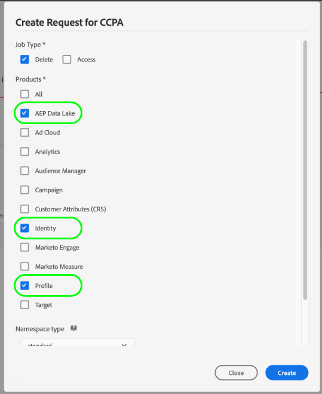

# Procesamiento de solicitudes de privacidad en [!DNL Real-time Customer Profile]

Adobe Experience Platform [!DNL Privacy Service] procesa las solicitudes de los clientes de acceso, exclusión de la venta o eliminación de sus datos personales según lo establecido en las normas de privacidad, como el Reglamento General de Protección de Datos (RGPD) y la [!DNL California Consumer Privacy Act] (CCPA).

Este documento cubre conceptos esenciales relacionados con el procesamiento de solicitudes de privacidad para [!DNL Real-time Customer Profile].

## Primeros pasos

Se recomienda que conozca bien los siguientes [!DNL Experience Platform] servicios antes de leer esta guía:

* [[!DNL Privacy Service]](../privacy-service/home.md): Gestiona las solicitudes de los clientes para acceder, desactivar o eliminar sus datos personales en todas las aplicaciones de Adobe Experience Cloud.
* [[!DNL Identity Service]](../identity-service/home.md): Resuelve el desafío fundamental que plantea la fragmentación de los datos de experiencia del cliente al unir identidades entre dispositivos y sistemas.
* [[!DNL Real-time Customer Profile]](home.md): Proporciona un perfil de cliente unificado y en tiempo real basado en datos agregados de varias fuentes.

## Explicación de los espacios de nombres de identidad {#namespaces}

Adobe Experience Platform [!DNL Identity Service] vincula los datos de identidad de los clientes entre sistemas y dispositivos. [!DNL Identity Service] utiliza espacios de  **nombres de** identidad para proporcionar contexto a los valores de identidad relacionándolos con su sistema de origen. Un área de nombres puede representar un concepto genérico, como una dirección de correo electrónico (&quot;correo electrónico&quot;) o asociar la identidad a una aplicación específica, como un Adobe Advertising Cloud ID (&quot;AdCloud&quot;) o un Adobe Target ID (&quot;TNTID&quot;).

El servicio de identidad mantiene un almacén de áreas de nombres de identidad definidas globalmente (estándar) y definidas por el usuario (personalizadas). Las áreas de nombres estándar están disponibles para todas las organizaciones (por ejemplo, &quot;correo electrónico&quot; y &quot;ECID&quot;), mientras que la organización también puede crear áreas de nombres personalizadas para adaptarlas a sus necesidades específicas.

Para obtener más información sobre los espacios de nombres de identidad en [!DNL Experience Platform], consulte la [descripción general del área de nombres de identidad](../identity-service/namespaces.md).

## Envío de solicitudes {#submit}

Las secciones siguientes describen cómo realizar solicitudes de privacidad para [!DNL Real-time Customer Profile] mediante la API o la interfaz de usuario de [!DNL Privacy Service]. Antes de leer estas secciones, es muy recomendable revisar la [documentación de la API del Privacy Service](../privacy-service/api/getting-started.md) o [IU del Privacy Service](../privacy-service/ui/overview.md) para ver los pasos completos sobre cómo enviar un trabajo de privacidad, incluido cómo dar formato correcto a los datos de identidad del usuario enviados en las cargas de solicitud.

>[!IMPORTANT]
>
>El Privacy Service solo puede procesar [!DNL Profile] datos mediante una directiva de combinación que no realiza la vinculación de identidad. Si utiliza la interfaz de usuario para confirmar si sus solicitudes de privacidad se están procesando, asegúrese de que está utilizando una directiva con &quot;[!DNL None]&quot; como tipo [!UICONTROL ID stitching]. En otras palabras, no se puede usar una directiva de combinación en la que [!UICONTROL ID stitching] esté configurado como &quot;[!UICONTROL Private graph]&quot;.
>
>
>
>También es importante tener en cuenta que no se puede garantizar la cantidad de tiempo que una solicitud de privacidad puede tardar en completarse. Si se producen cambios en los datos [!DNL Profile] mientras se procesa una solicitud, no se puede garantizar si esos registros se procesan o no.

### Uso de la API

Al crear solicitudes de trabajo en la API, cualquier ID proporcionado dentro de `userIDs` debe utilizar `namespace` y `type` específicos. Se debe proporcionar un [espacio de nombres de identidad](#namespaces) válido reconocido por [!DNL Identity Service] para el valor `namespace`, mientras que el `type` debe ser `standard` o `unregistered` (para los espacios de nombres estándar y personalizados, respectivamente).

>[!NOTE]
>
>Es posible que necesite proporcionar más de un ID para cada cliente, según el gráfico de identidad y cómo se distribuyan los fragmentos de perfil en los conjuntos de datos de Platform. Consulte la siguiente sección [fragmentos de perfil](#fragments) para obtener más información.

Además, la matriz `include` de la carga útil de la solicitud debe incluir los valores del producto para los diferentes almacenes de datos a los que se realiza la solicitud. Al realizar solicitudes a [!DNL Data Lake], la matriz debe incluir el valor &quot;ProfileService&quot;.

La siguiente solicitud crea un nuevo trabajo de privacidad para los datos de un único cliente en el almacén [!DNL Profile]. Se proporcionan dos valores de identidad para el cliente en la matriz `userIDs`; uno con el espacio de nombres de identidad estándar `Email` y otro con un espacio de nombres personalizado `Customer_ID`. También incluye el valor del producto para [!DNL Profile] (`ProfileService`) en la matriz `include`:

```shell
curl -X POST \
  https://platform.adobe.io/data/core/privacy/jobs \
  -H 'Authorization: Bearer {ACCESS_TOKEN}' \
  -H 'Content-Type: application/json' \
  -H 'x-api-key: {API_KEY}' \
  -H 'x-gw-ims-org-id: {IMS_ORG}' \
  -H 'x-sandbox-name: {SANDBOX_NAME}' \
  -d '{
    "companyContexts": [
      {
        "namespace": "imsOrgID",
        "value": "{IMS_ORG}"
      }
    ],
    "users": [
      {
        "key": "user12345",
        "action": ["access","delete"],
        "userIDs": [
          {
            "namespace": "Email",
            "value": "ajones@acme.com",
            "type": "standard"
          },
          {
            "namespace": "Customer_ID",
            "value": "12345678",
            "type": "unregistered"
          }
        ]
      }
    ],
    "include": ["ProfileService"],
    "expandIds": false,
    "priority": "normal",
    "analyticsDeleteMethod": "anonymize",
    "regulation": "ccpa"
}'
```

### Uso de la interfaz de usuario

Al crear solicitudes de trabajo en la interfaz de usuario, asegúrese de seleccionar **[!UICONTROL AEP Data Lake]** y/o **[!UICONTROL Profile]** en **[!UICONTROL Products]** para procesar los trabajos de los datos almacenados en [!DNL Data Lake] o [!DNL Real-time Customer Profile], respectivamente.

<br>

## Fragmentos de perfil en solicitudes de privacidad {#fragments}

En el almacén de datos [!DNL Profile], los datos personales de un cliente individual a menudo constan de varios fragmentos de perfil, que se asocian con la persona a través del gráfico de identidad. Al realizar solicitudes de privacidad al almacén [!DNL Profile], es importante tener en cuenta que las solicitudes solo se procesan en el nivel de fragmento de perfil, en lugar de en todo el perfil.

Por ejemplo, imaginemos una situación en la que está almacenando datos de atributos del cliente en tres conjuntos de datos separados, que utilizan identificadores diferentes para asociar esos datos con clientes individuales:

| Nombre del conjunto de datos | Campo de identidad principal | Atributos almacenados |
| --- | --- | --- |
| Conjunto de datos 1 | `customer_id` | `address` |
| Conjunto de datos 2 | `email_id` | `firstName`, `lastName` |
| Conjunto de datos 3 | `email_id` | `mlScore` |

Uno de los conjuntos de datos utiliza `customer_id` como identificador principal, mientras que los otros dos utilizan `email_id`. Si tuviera que enviar una solicitud de privacidad (acceso o eliminación) utilizando únicamente `email_id` como valor de ID de usuario, solo se procesarían los atributos `firstName`, `lastName` y `mlScore`, mientras que `address` no se verían afectados.

Para garantizar que sus solicitudes de privacidad procesen todos los atributos del cliente relevantes, debe proporcionar los valores de identidad principales para todos los conjuntos de datos aplicables en los que se puedan almacenar dichos atributos (hasta un máximo de nueve ID por cliente). Consulte la sección sobre campos de identidad en los [conceptos básicos de la composición del esquema](../xdm/schema/composition.md#identity) para obtener más información sobre los campos que se suelen marcar como identidades.

>[!NOTE]
>
>Si utiliza entornos limitados [limitados](../sandboxes/home.md) diferentes para almacenar los datos [!DNL Profile], debe realizar una solicitud de privacidad independiente para cada entorno limitado, indicando el nombre del entorno limitado apropiado en el encabezado `x-sandbox-name`.

## Eliminación del procesamiento de solicitudes

Cuando [!DNL Experience Platform] recibe una solicitud de eliminación de [!DNL Privacy Service], [!DNL Platform] envía confirmación a [!DNL Privacy Service] de que la solicitud se ha recibido y que los datos afectados se han marcado para su eliminación. A continuación, los registros se eliminan del almacén [!DNL Data Lake] o [!DNL Profile] una vez finalizado el trabajo de privacidad. Mientras el trabajo de eliminación sigue procesándose, los datos se eliminan de forma suave y, por lo tanto, ningún servicio [!DNL Platform] puede acceder a ellos. Consulte la [[!DNL Privacy Service] documentación](../privacy-service/home.md#monitor) para obtener más información sobre el seguimiento del estado de los trabajos.

>[!IMPORTANT]
>
>Aunque una solicitud de eliminación correcta elimina los datos de atributo recopilados para un cliente (o conjunto de clientes), la solicitud no elimina las asociaciones establecidas en el gráfico de identidad.
>
>Por ejemplo, una solicitud de eliminación que utilice los atributos `email_id` y `customer_id` de un cliente elimina todos los datos de atributos almacenados bajo esos ID. Sin embargo, cualquier dato que se incorpore posteriormente en el mismo `customer_id` se asociará con el `email_id` correspondiente, ya que la asociación sigue existiendo.

En futuras versiones, [!DNL Platform] enviará una confirmación a [!DNL Privacy Service] después de que se hayan eliminado físicamente los datos.

## Pasos siguientes

Al leer este documento, se le han introducido los conceptos importantes relacionados con el procesamiento de solicitudes de privacidad en [!DNL Experience Platform]. Se recomienda seguir leyendo la documentación proporcionada en esta guía para comprender mejor cómo administrar los datos de identidad y crear trabajos de privacidad.

Para obtener información sobre el procesamiento de solicitudes de privacidad de [!DNL Platform] recursos que [!DNL Profile] no utiliza, consulte el documento sobre el [procesamiento de solicitudes de privacidad en Data Lake](../catalog/privacy.md).
