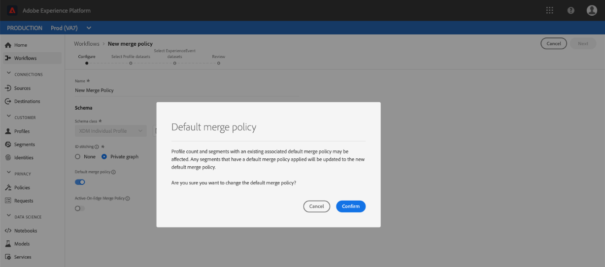

# Guía de IU de políticas de combinación

Adobe Experience Platform le permite unir fragmentos de datos de varias fuentes y combinarlos para ver una vista completa de cada uno de sus clientes individuales. Al reunir estos datos, las políticas de combinación son las reglas que [!DNL Platform] utiliza para determinar cómo se priorizarán los datos y qué datos se combinarán para crear una vista unificada.

Por ejemplo, si un cliente interactúa con su marca en varios canales, su organización tendrá varios fragmentos de perfil relacionados con ese único cliente que aparecerán en varios conjuntos de datos. Cuando estos fragmentos se ingieren en la plataforma, se combinan para crear un solo perfil para ese cliente. Cuando los datos de varias fuentes entran en conflicto (por ejemplo, un fragmento lista al cliente como &quot;soltero&quot; mientras que el otro lista al cliente como &quot;casado&quot;), la política de combinación determina qué información incluir en el perfil del individuo.

Mediante las API de RESTful o la interfaz de usuario, puede crear nuevas políticas de combinación, administrar políticas existentes y establecer una directiva de combinación predeterminada para su organización. Esta guía proporciona instrucciones paso a paso para trabajar con políticas de combinación mediante la interfaz de usuario (IU) de Adobe Experience Platform.

Si prefiere trabajar con políticas de combinación mediante la API [!DNL Real-time Customer Profile], siga las instrucciones descritas en la [guía de API de políticas de combinación](../api/merge-policies.md).

## Primeros pasos

Esta guía requiere una comprensión práctica de varias funciones importantes [!DNL Experience Platform]. Antes de seguir esta guía o usar API de Perfil, consulte la documentación de los siguientes servicios:

* [Perfil](../home.md) del cliente en tiempo real: Proporciona un perfil de consumo unificado y en tiempo real basado en datos agregados de varias fuentes.
* [Adobe Experience Platform Identity Service](../../identity-service/home.md): Permite el Perfil del cliente en tiempo real al enlazar identidades de fuentes de datos dispares que se están ingeriendo en  [!DNL Platform].
* [Modelo de datos de experiencia (XDM)](../../xdm/home.md): Marco normalizado por el cual se  [!DNL Platform] organizan los datos de experiencia del cliente.

## Métodos de combinación {#merge-methods}

Cada fragmento de perfil contiene información para una sola identidad del número total de identidades que podría existir para una persona. Al combinar esos datos para formar un perfil de cliente, existe la posibilidad de que dicha información entre en conflicto y se debe especificar la prioridad. La selección de un método de combinación permite especificar qué atributos del conjunto de datos priorizarán si se produce un conflicto de combinación entre conjuntos de datos.

Existen dos métodos de combinación disponibles para las directivas de combinación. A continuación se resumen cada uno de estos métodos con detalles adicionales que se proporcionan en las secciones siguientes:

* **[!UICONTROL Marca de hora pedida]:** en el evento de un conflicto, se da prioridad al fragmento de perfil que se actualizó más recientemente.
   * **Marcas de hora personalizadas:** [!UICONTROL Marca de hora ] pedida también admite marcas de hora personalizadas que tienen prioridad sobre las marcas de hora del sistema al combinar datos dentro del mismo conjunto de datos (varias identidades) o entre conjuntos de datos. Para obtener más información, consulte la sección sobre [uso de marcas de hora personalizadas](#custom-timestamps).
* **[!UICONTROL Prioridad] del conjunto de datos:** en el evento de un conflicto, dé prioridad a los fragmentos de perfil según el conjunto de datos del que provienen. Al seleccionar esta opción, debe elegir los conjuntos de datos relacionados y su orden de prioridad.

### Marca de hora pedida {#timestamp-ordered}

A medida que los registros de perfil se ingieren en Experience Platform, se obtiene una marca de hora del sistema en el momento de la ingestión y se agrega al registro. Cuando **[!UICONTROL Marca de tiempo solicitada]** está seleccionada como método de combinación para una directiva de combinación, los perfiles se combinan según la marca de tiempo del sistema. En otras palabras, la combinación se realiza en función de la marca de tiempo para cuando el registro se ingesta en la plataforma.

#### Uso de marcas de hora personalizadas {#custom-timestamps}

Ocasionalmente puede haber casos de uso en los que es necesario proporcionar una marca de tiempo personalizada y la directiva de combinación debe cumplir la marca de tiempo personalizada en lugar de la marca de tiempo del sistema. Algunos ejemplos de esto incluyen rellenar datos o garantizar el orden correcto de eventos si los registros se ingieren por orden.

Para utilizar una marca de tiempo personalizada, se debe agregar la **[!UICONTROL Mezcla de detalles de auditoría del sistema de origen externo]** al esquema de Perfil. Una vez agregada, la marca de tiempo personalizada se puede completar mediante el campo `lastUpdatedDate`. Cuando se ingesta un registro con el campo `lastUpdatedDate` rellenado, el Experience Platform utilizará ese campo para combinar registros entre conjuntos de datos. Si `lastUpdatedDate` no está presente, o no se ha rellenado, Platform seguirá usando la marca de tiempo del sistema.

>[!NOTE]
>
>Debe asegurarse de que la marca de tiempo `lastUpdatedDate` se rellena al ingerir una actualización en el mismo registro.

La siguiente captura de pantalla muestra los campos en la [!UICONTROL Mezcla de detalles de auditoría del sistema de origen externo]. Para obtener instrucciones paso a paso sobre cómo trabajar con esquemas mediante la interfaz de usuario de la plataforma, incluida la forma de agregar mezclas a esquemas, visite el [tutorial para crear un esquema mediante la interfaz de usuario](../../xdm/tutorials/create-schema-ui.md).

Para trabajar con marcas de hora personalizadas mediante la API, consulte la sección [guía de extremo de directivas de combinación sobre el uso de marcas de hora personalizadas](../api/merge-policies.md#custom-timestamps).

### Prioridad del conjunto de datos {#dataset-precedence}

Cuando **[!UICONTROL Prioridad del conjunto de datos]** está seleccionado como método de combinación para una directiva de combinación, puede dar prioridad a los fragmentos de perfil según el conjunto de datos del que provienen. Un caso de uso de ejemplo sería si su organización tuviera información presente en un conjunto de datos que sea preferible o de confianza sobre los datos de otro conjunto de datos.

Para crear una directiva de combinación con **[!UICONTROL prioridad del conjunto de datos]**, debe seleccionar los conjuntos de datos Perfil y ExperienceEvent que se incluyen y, a continuación, puede ordenar manualmente los conjuntos de datos Perfil para que tengan prioridad. Una vez seleccionados y ordenados los conjuntos de datos, se dará la prioridad más alta al conjunto de datos superior, el segundo conjunto de datos será el segundo más alto, y así sucesivamente.

## [!UICONTROL Coincidencia de ID] {#id-stitching}

La vinculación de identidad ([!UICONTROL identificación]) es el proceso de identificar fragmentos de datos y combinarlos para formar un registro de perfil completo. Para ayudar a ilustrar los diferentes comportamientos de vinculación, considere un solo cliente que interactúa con una marca utilizando dos direcciones de correo electrónico diferentes.

* **[!UICONTROL Ninguno]:** cuando se selecciona esta opción, los ID no se unen. Cuando se produce la segmentación, las identidades que pueden pertenecer a la misma persona no se vincularán juntas y la segmentación solo tendrá en cuenta los atributos adjuntos a cada ID individual al determinar si un cliente cumple los requisitos para ser miembro del segmento. Esto podría hacer que un único cliente tenga varios perfiles y que cada perfil cumpla los requisitos para distintos segmentos, lo que resultaría en que se envíen varios mensajes de marketing al mismo cliente.
* **[!UICONTROL Gráfico] privado:** cuando se selecciona el gráfico privado, se unen varias identidades relacionadas con el mismo individuo. Esto hace que el cliente tenga un solo perfil y permite que la segmentación considere varios atributos de varias identidades relacionadas al determinar la calificación del segmento. En este escenario, es probable que el cliente tenga un solo perfil, califique para un segmento en función de la combinación de atributos entre identidades y reciba sólo un mensaje de marketing.

Para obtener más información sobre las identidades y su función en la generación de perfiles y segmentos, lea la [información general del servicio de identidad](../../identity-service/home.md).

## Directiva de combinación predeterminada {#default-merge-policy}

Una organización puede crear una directiva de combinación predeterminada para su organización cuando combina fragmentos de perfil. Esto permite a los usuarios seleccionar fácilmente la directiva predeterminada al realizar acciones en Experience Platform, como ver perfiles de clientes o crear segmentos. En la mayoría de los casos, a menos que se especifique otra directiva de combinación, se utilizará la directiva de combinación predeterminada.

Cada organización puede crear varias directivas de combinación relacionadas con una sola clase de esquema XDM, pero solo puede tener una directiva de combinación predeterminada declarada para cada clase. Por ejemplo, su organización podría tener una directiva de combinación predeterminada relacionada con la clase [!DNL XDM Individual Profile] y una directiva de combinación predeterminada diferente para una clase de inventario de productos creada a medida.

Si crea una nueva directiva de combinación y la establece como predeterminada, el sistema actualizará automáticamente la directiva de combinación predeterminada anterior para que ya no sea la predeterminada.

>[!WARNING]
>
>Los recuentos de perfiles y los segmentos con una directiva de combinación predeterminada existente pueden verse afectados. Cualquier segmento que tenga aplicada una directiva de combinación predeterminada se actualizará a la nueva directiva de combinación predeterminada.

## Directivas de combinación de vistas {#view-merge-policies}

En la interfaz de usuario [!DNL Experience Platform], puede empezar a trabajar con políticas de combinación seleccionando **[!UICONTROL Perfiles]** en el menú de navegación izquierdo y luego seleccionando la ficha **[!UICONTROL Políticas de combinación]**. Esta ficha incluye una lista de todas las directivas de combinación existentes para la organización, así como detalles para cada directiva de combinación, incluido el nombre de la directiva, si la directiva de combinación es la directiva de combinación predeterminada y la clase de esquema a la que se relaciona la directiva de combinación.

Para seleccionar qué detalles están visibles o para agregar columnas adicionales a la pantalla, seleccione **[!UICONTROL Configurar columnas]** y haga clic en un nombre de columna para agregarla o quitarla de la vista.

## Crear una directiva de combinación {#create-a-merge-policy}

Para crear una nueva directiva de combinación, seleccione **[!UICONTROL Crear directiva de combinación]** en la ficha políticas de combinación.

En la pantalla de flujo de trabajo **[!UICONTROL Nueva directiva de combinación]**, puede proporcionar información importante para la nueva directiva de combinación mediante una serie de pasos guiados.

### [!UICONTROL Configurar] {#configure}

El primer paso del flujo de trabajo le permite configurar la directiva de combinación proporcionando información básica. Esta información incluye:

* **[!UICONTROL Nombre]**: El nombre de la directiva de combinación debe ser descriptivo pero conciso.
* **[!UICONTROL Clase]** de esquema: Clase de esquema XDM asociada a la directiva de combinación. Esto especifica la clase de esquema para la que se crea esta directiva de combinación. Las organizaciones pueden crear varias directivas de combinación por clase de esquema. Actualmente, solo la clase [!UICONTROL XDM Individual Perfil] está disponible en la interfaz de usuario. Puede previsualización del esquema de unión para la clase esquema seleccionando **[!UICONTROL Esquema de Unión de Vista]**. Para obtener más información, consulte la sección sobre [visualización del esquema de unión](#view-union-schema) que se muestra a continuación.
* **[!UICONTROL Coincidencia]** de ID: Este campo define cómo determinar las identidades relacionadas de un cliente. Consulte la sección sobre [identificación](#id-stitching) anterior en esta guía para obtener más información. Existen dos valores posibles:
   * **[!UICONTROL Ninguno]**: No realice ninguna vinculación de identidad.
   * **[!UICONTROL Gráfico]** privado: Realice la vinculación de identidad en función del gráfico de identidad privado.
* **[!UICONTROL Directiva]** de combinación predeterminada: Botón de alternancia que permite seleccionar si esta directiva de combinación será o no la predeterminada para su organización. Si el selector está activado, aparece una advertencia que le solicita que confirme que desea cambiar la directiva de combinación predeterminada de su organización. Consulte la sección sobre [directivas de combinación predeterminadas](#default-merge-policy) anterior en esta guía para obtener más información.
   

Una vez completados los campos requeridos, puede seleccionar **[!UICONTROL Siguiente]** para continuar con el flujo de trabajo.

#### [!UICONTROL Esquema de Unión de vista] {#view-union-schema}

Al crear o editar una directiva de combinación, puede vista del esquema de unión para la clase de esquema seleccionada seleccionando **[!UICONTROL Esquema de Unión de Vista]**.

Se abre el cuadro de diálogo [!UICONTROL Esquema de Unión de Vista], que muestra todos los esquemas, identidades y relaciones de contribución asociados con el esquema de unión. Puede utilizar el cuadro de diálogo para explorar el esquema de unión del mismo modo que lo haría si accediera a la ficha [!UICONTROL Esquema de Unión] de la sección [!UICONTROL Perfiles] de la interfaz de usuario de la plataforma.

Para obtener información detallada sobre los esquemas de unión, incluido cómo interactuar con ellos en la ficha [!UICONTROL Esquema de Unión] o en el cuadro de diálogo [!UICONTROL Esquema de Unión de Vista] que se muestra en el flujo de trabajo de políticas de combinación, visite la [guía de la IU de unión esquema](union-schema.md).

### [!UICONTROL Seleccionar conjuntos de datos de Perfil] {#select-profile-datasets}

En la pantalla **[!UICONTROL Seleccionar conjuntos de datos de Perfil]**, debe seleccionar el **[!UICONTROL método de combinación]** que desee utilizar para la directiva de combinación. También se muestra en la pantalla el número total de [!UICONTROL conjuntos de datos de Perfil] en la organización que se relacionan con la clase de esquema seleccionada en la pantalla anterior.

Según el método de combinación que elija, todos los conjuntos de datos de Perfil se combinarán por el orden en que se actualizaron por última vez (con orden de marca de hora) o tendrá que seleccionar qué conjuntos de datos de Perfil incluir en la política de combinación y el orden en que se combinarán (prioridad de conjunto de datos). Para obtener más información sobre los métodos de combinación, consulte la sección [métodos de combinación](#merge-methods) proporcionada anteriormente en este documento.

#### Marca de hora pedida {#timestamp-ordered-profile}

Si selecciona **[!UICONTROL Marca de hora ordenada]** como método de combinación, los atributos de los conjuntos de datos actualizados más recientemente tendrán prioridad. Esto se aplica a todos los conjuntos de datos de Perfil.

#### Prioridad del conjunto de datos {#dataset-precedence-profile}

Si selecciona **[!UICONTROL prioridad del conjunto de datos]** como método de combinación, deberá seleccionar conjuntos de datos de Perfil y priorizarlos manualmente. Cada conjunto de datos enumerado también incluye el estado del último lote ingestado o muestra un aviso de que no se han ingerido lotes en ese conjunto de datos.

Puede seleccionar hasta 50 conjuntos de datos de la lista de conjuntos de datos para incluirlos en la directiva de combinación. A medida que se seleccionan los conjuntos de datos, éstos se agregan a la sección **[!UICONTROL Seleccionar conjuntos de datos]**, lo que permite arrastrar y soltar los conjuntos de datos y ordenarlos según la prioridad deseada. A medida que los conjuntos de datos se ajustan en la lista, se actualizará el ordinal (1, 2, 3, etc.) al lado del conjunto de datos, mostrando la prioridad (1 recibe la prioridad más alta, luego 2 y después).

Al seleccionar un conjunto de datos también se actualiza la sección **[!UICONTROL esquema de Unión]**, que muestra los campos del esquema de unión en el que cada conjunto de datos aporta datos. Para obtener más información sobre los esquemas de unión, incluido cómo interactuar con las visualizaciones en la interfaz de usuario, consulte la [guía de la interfaz de usuario de esquema de unión](union-schema.md)

### [!UICONTROL Seleccionar conjuntos de datos de ExperienceEvent] {#select-experienceevent-datasets}

El paso siguiente en el flujo de trabajo requiere que seleccione conjuntos de datos de ExperienceEvent. Esta pantalla está influenciada por el método de combinación seleccionado en la pantalla [[!UICONTROL Seleccionar conjuntos de datos de Perfil]](#select-profile-datasets).

También se muestra en esta pantalla el número total de **[!UICONTROL conjuntos de datos de ExperienceEvent]** creados por su organización en relación con la clase de esquema que seleccionó en la pantalla de configuración de directivas de combinación.

#### Marca de hora pedida {#timestamp-ordered-experienceevent}

Si seleccionó **[!UICONTROL Marca de tiempo pedida]** como método de combinación para conjuntos de datos de Perfil, los atributos de los conjuntos de datos de ExperienceEvent actualizados más recientemente tendrán prioridad aquí también.

#### Prioridad del conjunto de datos {#dataset-precedence-experienceevent}

Si seleccionó **[!UICONTROL prioridad del conjunto de datos]** como método de combinación para conjuntos de datos de Perfil, deberá seleccionar los conjuntos de datos de ExperienceEvent para incluirlos. Puede seleccionar hasta 50 conjuntos de datos de ExperienceEvent desde la lista del conjunto de datos. A medida que se seleccionan los conjuntos de datos, éstos aparecen en la sección [!UICONTROL Seleccionar conjuntos de datos].

Los conjuntos de datos de ExperienceEvent no se pueden ordenar manualmente, sino que los atributos de los conjuntos de datos de ExperienceEvent se anexan a los conjuntos de datos de Perfil si forman parte del mismo fragmento de perfil.

De manera similar a seleccionar conjuntos de datos de Perfil, al seleccionar un conjunto de datos de ExperienceEvent también se actualiza la sección **[!UICONTROL esquema de Unión]**, que muestra los campos del esquema de unión al que cada conjunto de datos aporta datos. Para obtener más información sobre los esquemas de unión, incluido cómo interactuar con las visualizaciones en la interfaz de usuario, consulte la [guía de la interfaz de usuario de esquema de unión](union-schema.md)

### [!UICONTROL Revisar] {#review}

El paso final del flujo de trabajo es revisar la directiva de combinación. La pantalla **[!UICONTROL Revisar]** muestra el nombre de la nueva directiva de combinación, la clase de esquema en la que se basa, la opción [!UICONTROL identificación de identificación] seleccionada, así como el método de combinación y los conjuntos de datos incluidos en la directiva de combinación. Para realizar la vista de todos los conjuntos de datos de Perfil o de ExperienceEvent incluidos, seleccione el número de conjuntos de datos para expandir la lista desplegable.

Asegúrese de revisar cuidadosamente la directiva de combinación antes de seleccionar **[!UICONTROL Finalizar]** para completar el flujo de trabajo de creación.

#### Marca de hora pedida {#timestamp-ordered-review}

Si seleccionó **[!UICONTROL Marca de tiempo pedida]** como método de combinación para la directiva de combinación, la lista de conjuntos de datos de Perfil incluye todos los conjuntos de datos creados por la organización en relación con la clase de esquema, en orden de marca de tiempo. La lista de conjuntos de datos de ExperienceEvent incluye todos los conjuntos de datos que su organización ha creado para la clase de esquema seleccionada y se anexará a los conjuntos de datos de Perfil.

#### Prioridad del conjunto de datos {#dataset-precedence-review}

Si seleccionó **[!UICONTROL Prioridad del conjunto de datos]** como método de combinación para la directiva de combinación, las listas de los conjuntos de datos de Perfil y ExperienceEvent incluyen únicamente los conjuntos de datos de Perfil y ExperienceEvent que seleccionó durante el flujo de trabajo de creación, respectivamente. El orden de los conjuntos de datos de Perfil debe coincidir con la prioridad especificada durante la creación. Si no lo hace, utilice el botón [!UICONTROL Atrás] para volver a los pasos anteriores del flujo de trabajo y ajustar la prioridad.

### Lista actualizada de las directivas de combinación {#updated-list}

Después de completar el flujo de trabajo para crear una nueva directiva de combinación, volverá a la ficha **[!UICONTROL Directivas de combinación]**. La lista de las directivas de combinación para su organización ahora debe incluir la directiva de combinación que acaba de crear.

## Editar una directiva de combinación

En la ficha [!UICONTROL Combinar directivas], puede modificar una directiva de combinación existente creada para la clase [!DNL XDM Individual Profile] seleccionando el **[!UICONTROL nombre de directiva]** para la directiva de combinación que desee editar.

Cuando aparece la pantalla **[!UICONTROL Editar directiva de combinación]**, puede realizar cambios en el nombre y [!UICONTROL identificación de identificación], así como cambiar si esta directiva es o no la directiva de combinación predeterminada para su organización.

Seleccione **[!UICONTROL Siguiente]** para continuar a través del flujo de trabajo de la directiva de combinación a fin de actualizar el método de combinación y los conjuntos de datos incluidos en la directiva de combinación.

Una vez que haya realizado los cambios necesarios, revise la directiva de combinación y seleccione **[!UICONTROL Finalizar]** para volver a la ficha **[!UICONTROL Combinar directivas]**.

>[!WARNING]
>
>Cambiar una directiva de combinación puede afectar a los resultados de la segmentación y el perfil, ya que alterará la manera en que se resuelven los conflictos de datos.

## Infracción de la política de gestión de datos

Al crear o actualizar una directiva de combinación, se realiza una comprobación para determinar si la directiva de combinación infringe alguna de las directivas de uso de datos definidas por la organización. Las políticas de uso de datos forman parte de Adobe Experience Platform [!DNL Data Governance] y son reglas que describen los tipos de acciones de mercadotecnia que se le permite o se restringen para realizar con datos [!DNL Platform] específicos. Por ejemplo: si se utilizó una directiva de combinación para crear un segmento que se activó en un destino de terceros y su organización tenía una directiva de uso de datos que impedía la exportación de datos específicos a terceros, recibirá una notificación de **[!UICONTROL infracción de directiva de administración de datos detectada]** al intentar guardar la directiva de combinación.

Esta notificación incluye una lista de las directivas de uso de datos que se han infringido y le permite vista de los detalles de la infracción seleccionando una directiva de la lista. Al seleccionar una directiva violada, la ficha **[!UICONTROL Línea de datos]** proporciona el motivo de la infracción y las activaciones afectadas, cada una de las cuales proporciona más detalles sobre cómo se ha infringido la directiva de uso de datos.

Para obtener más información sobre cómo se realiza la administración de datos dentro de Adobe Experience Platform, lea la [información general sobre la administración de datos](../../data-governance/home.md).

## Pasos siguientes

Ahora que ha creado y configurado directivas de combinación para su organización, puede utilizarlas para ajustar la vista de perfiles de cliente dentro de Platform y para crear segmentos de audiencia a partir de los datos de Perfil. Consulte la [información general de segmentación](../../segmentation/home.md) para obtener más información sobre cómo crear y trabajar con segmentos mediante la [!DNL Experience Platform] interfaz de usuario y API.