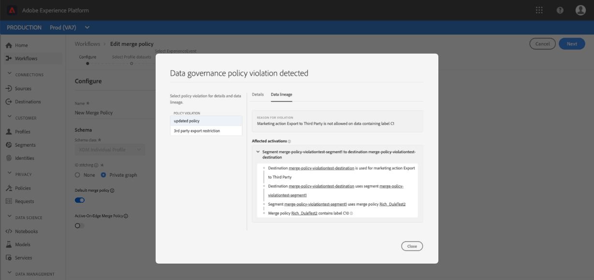

# Guía del usuario de directivas de combinación

Adobe Experience Platform le permite reunir datos de múltiples fuentes y combinarlos para ver una vista completa de cada uno de sus clientes individuales. Al reunir estos datos, las políticas de combinación son las reglas que [!DNL Platform] se utilizan para determinar cómo se priorizarán los datos y qué datos se combinarán para crear esa vista unificada.

Mediante las API de RESTful o la interfaz de usuario, puede crear nuevas políticas de combinación, administrar políticas existentes y establecer una directiva de combinación predeterminada para su organización. Esta guía proporciona instrucciones paso a paso para trabajar con políticas de combinación mediante la interfaz de usuario de Adobe Experience Platform.

Si prefiere trabajar con políticas de combinación mediante la [!DNL Real-time Customer Profile] API, siga las instrucciones que se describen en el tutorial [de API de políticas de](../api/merge-policies.md)combinación.

## Primeros pasos

Esta guía requiere una comprensión práctica de los diversos [!DNL Experience Platform] servicios relacionados con las políticas de fusión. Antes de comenzar este tutorial, consulte la documentación de los siguientes servicios:

* [[!Perfil del cliente en tiempo real de DNL]](../home.md): Proporciona un perfil de consumo unificado y en tiempo real basado en datos agregados de varias fuentes.
* [[!DNL Identity Service]](../../identity-service/home.md): Permite [!DNL Real-time Customer Profile] el puente de identidades de orígenes de datos dispares que se están ingeriendo en [!DNL Platform].
* [[!Modelo de datos de experiencia DNL (XDM)]](../../xdm/home.md): El marco normalizado por el cual [!DNL Platform] organiza los datos de experiencia del cliente.

## Directivas de combinación de vistas

En la interfaz de usuario, puede empezar a trabajar con políticas de combinación y ver una lista de las políticas de combinación existentes de su organización seleccionando [!DNL Experience Platform] Perfiles **[!UICONTROL en el carril izquierdo y, a continuación, seleccionando la ficha]** Combinar políticas **** .

Los detalles de cada directiva de combinación disponible para su organización están visibles en la página de aterrizaje, incluidos el nombre de la directiva, la directiva de combinación predeterminada y el esquema.

Para seleccionar qué detalles están visibles o para agregar columnas adicionales a la pantalla, seleccione el icono del selector de columnas y haga clic en el nombre de una columna para agregarla o eliminarla de la vista.

## Crear una directiva de combinación

Para crear una nueva directiva de combinación, seleccione **[!UICONTROL Crear directiva]** de combinación.

Aparece la pantalla **[!UICONTROL Crear directiva]** de combinación, que le permite proporcionar información importante para la nueva directiva de combinación.

* **[!UICONTROL Nombre]**: El nombre de la directiva de combinación debe ser descriptivo pero conciso.
* **[!UICONTROL Esquema]**: Esquema asociado a la directiva de combinación. Esto especifica el esquema XDM para el que se crea esta directiva de combinación. Las organizaciones pueden crear varias directivas de combinación por esquema.
* **[!UICONTROL Coincidencia]** de ID: Este campo define cómo determinar las identidades relacionadas de un cliente. Existen dos valores posibles:
   * **[!UICONTROL Ninguno]**: No realice ninguna vinculación de identidad.
   * **[!UICONTROL Gráfico]** privado: Realice la vinculación de identidad en función del gráfico de identidad privado.
* **[!UICONTROL Combinación]** de atributos: Un fragmento de perfil contiene información para una sola identidad de la lista de identidades que existen para un cliente individual. Cuando el tipo de gráfico de identidad utilizado da como resultado más de una identidad, existe la posibilidad de que haya atributos de perfil en conflicto y se debe especificar la prioridad. El uso de &quot;Combinación[!UICONTROL de]atributos&quot; permite especificar qué valores de perfil de conjuntos de datos priorizarán si se produce un conflicto de combinación entre conjuntos de datos de tipo clave-valor (datos de registros). Existen dos valores posibles:
   * **[!UICONTROL Marca de hora pedida]**: En el evento de un conflicto, se da prioridad al perfil que se actualizó más recientemente. [!UICONTROL La marca de tiempo pedida] también admite marcas de hora personalizadas que tienen prioridad sobre las marcas de hora del sistema al combinar datos dentro del mismo conjunto de datos (varias identidades) o entre conjuntos de datos. Para obtener más información, consulte la sección ordenada [de](#timestamp-ordered) marca de tiempo que se muestra a continuación.
   * **[!UICONTROL Prioridad]** del conjunto de datos: En el evento de un conflicto, dé prioridad a los fragmentos de perfil según el conjunto de datos del que provienen. Al seleccionar esta opción, debe elegir los conjuntos de datos relacionados y su orden de prioridad. Consulte los detalles sobre la prioridad [del](#dataset-precedence) conjunto de datos a continuación para obtener más información.
* **[!UICONTROL Directiva]** de combinación predeterminada: Botón de alternancia que permite seleccionar si esta directiva de combinación será o no la predeterminada para su organización. Si el selector está activado y se guarda la nueva directiva, la directiva predeterminada anterior se actualiza automáticamente para que ya no sea la predeterminada.

### Marca de hora solicitada {#timestamp-ordered}

A medida que los registros de Perfil se ingieren en Experience Platform, se obtiene una marca de hora del sistema en el momento de la ingestión y se agrega al registro. Cuando se selecciona **[!UICONTROL Marca de tiempo]** como tipo de combinación **[!UICONTROL de]** atributos para una directiva de combinación, los perfiles se combinan en función de la marca de tiempo del sistema. En otras palabras, la combinación se realiza en función de la marca de tiempo para cuando el registro se ingesta en la plataforma.

Ocasionalmente puede haber casos de uso en los que es necesario proporcionar una marca de tiempo personalizada y la directiva de combinación debe cumplir la marca de tiempo personalizada en lugar de la marca de tiempo del sistema. Algunos ejemplos de esto incluyen rellenar datos o garantizar el orden correcto de eventos si los registros se ingieren por orden.

>[!NOTE]
>
>Esta capacidad solo está disponible para la ingestión en conjuntos de datos. Si los registros se ingieren utilizando el mismo conjunto de datos, se produce el comportamiento de reemplazo predeterminado.

### Uso de marcas de hora personalizadas {#custom-timestamps}

Para utilizar una marca de tiempo personalizada, se debe agregar la &quot;Mezcla[!UICONTROL de detalles de auditoría del sistema de origen]externo&quot; al esquema de Perfil. Una vez agregada, la marca de tiempo personalizada se puede rellenar mediante el `lastUpdatedDate` campo.

Cuando se ingesta un registro con el `lastUpdatedDate` campo rellenado, el Experience Platform utilizará ese campo para combinar registros entre conjuntos de datos. Si no `lastUpdatedDate` está presente, o no se ha rellenado, Platform seguirá usando la marca de tiempo del sistema.

>[!NOTE]
>
>Debe asegurarse de que la `lastUpdatedDate` marca de tiempo se rellena al ingerir una actualización en el mismo registro.

La siguiente captura de pantalla muestra los campos en la &quot;Mezcla de detalles de auditoría del sistema de origen[!UICONTROL externo]&quot;. Para obtener instrucciones paso a paso sobre cómo trabajar con esquemas mediante la interfaz de usuario, incluida cómo agregar mezclas a esquemas, visite el [tutorial para crear un esquema mediante la interfaz de usuario](../../xdm/tutorials/create-schema-ui.md).

Para trabajar con marcas de hora personalizadas mediante la API, consulte el Apéndice de la guía [de extremo de directivas de](../api/merge-policies.md) combinación y la sección [Uso de marcas de hora](../api/merge-policies.md#custom-timestamps)personalizadas.

### Prioridad de conjunto de datos {#dataset-precedence}

Al seleccionar un valor de combinación **[!UICONTROL de]** atributos, puede seleccionar la prioridad **** de conjunto de datos, que le permite dar prioridad a los fragmentos de perfil según el conjunto de datos del que provienen.

Un caso de uso de ejemplo sería si su organización tuviera información presente en un conjunto de datos que sea preferible o de confianza sobre los datos de otro conjunto de datos.

Al seleccionar **[!UICONTROL Prioridad]** del conjunto de datos, se abre un panel independiente que requiere que seleccione entre los conjuntos de datos **** disponibles los conjuntos de datos que se incluirán (o utilice la casilla de verificación para seleccionar todos). A continuación, puede arrastrar y soltar esos conjuntos de datos en el panel Conjuntos de datos **** seleccionados y arrastrarlos al orden de prioridad correcto. Al conjunto de datos superior se le dará la prioridad más alta, al segundo más alto, y así sucesivamente.

Una vez que haya terminado de crear la directiva de combinación, seleccione **[!UICONTROL Guardar]** para volver a la ficha **[!UICONTROL Combinar directivas]** , donde la nueva directiva de combinación aparece ahora en la lista de políticas.

## Editar una directiva de combinación

Puede modificar una directiva de combinación existente mediante la ficha [!UICONTROL Combinar directivas] seleccionando el nombre **[!UICONTROL de la]** directiva para la directiva de combinación que desee editar.

Cuando aparece la pantalla **[!UICONTROL Editar directiva]** de combinación, puede realizar cambios en el nombre, el esquema, el tipo de identificación y el tipo de combinación de atributos, así como seleccionar si esta directiva será o no la directiva de combinación predeterminada para su organización.

>[!NOTE]
>
>No se puede editar la ID de la directiva de combinación, que se muestra en la parte superior de la pantalla de edición. Se trata de un ID de sólo lectura, generado por el sistema, que no se puede cambiar.

Una vez realizados los cambios necesarios, seleccione **[!UICONTROL Guardar]** para volver a la ficha **[!UICONTROL Combinar directivas]** , donde la información actualizada de la directiva de combinación ya está visible.

## Infracción de la política de gestión de datos

Al crear o actualizar una directiva de combinación, se realiza una comprobación para determinar si la directiva de combinación infringe alguna de las directivas de uso de datos definidas por la organización. Las políticas de uso de datos forman parte de Adobe Experience Platform [!DNL Data Governance] y son reglas que describen los tipos de acciones de marketing que puede realizar o que tiene restringido el acceso a datos específicos en [!DNL Platform] datos específicos. Por ejemplo, si se utilizara una directiva de combinación para crear un segmento que se activara en un destino de terceros y la organización tuviera una directiva de uso de datos que impidiera la exportación de datos específicos a terceros, recibiría una notificación de &quot;infracción de directiva de administración de[!UICONTROL datos detectada]&quot; al intentar guardar la directiva de combinación.

Esta notificación incluye una lista de las directivas de uso de datos que se han infringido y le permite vista de los detalles de la infracción seleccionando una directiva de la lista. Al seleccionar una directiva infringida, la ficha **[!UICONTROL Línea]** de datos proporciona el motivo de la infracción y las activaciones afectadas, cada una de las cuales proporciona más detalles sobre cómo se ha infringido la directiva de uso de datos.

Para obtener más información sobre el rendimiento de la administración de datos dentro de Adobe Experience Platform, lea la información general [sobre la administración de](../../data-governance/home.md)datos.

## Pasos siguientes

Ahora que ha creado y configurado directivas de combinación para su organización de IMS, puede utilizarlas para crear segmentos de audiencia a partir de los datos de perfil. Consulte la descripción general [de la](../../segmentation/home.md) segmentación para obtener más información sobre cómo crear y trabajar con segmentos mediante [!DNL Experience Platform].