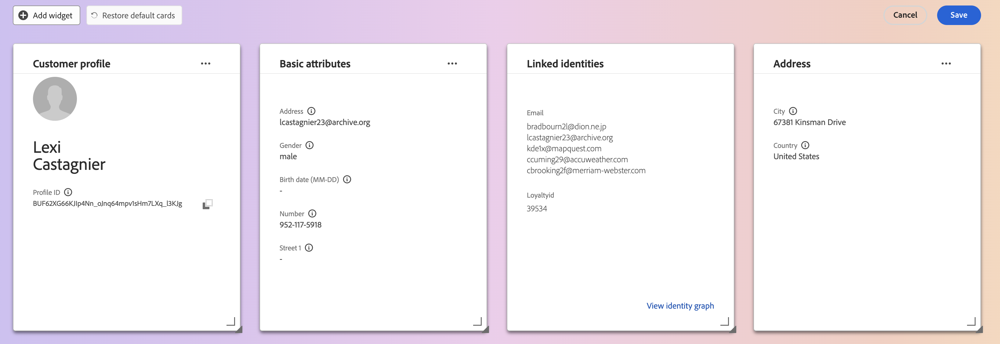

# Personalización de detalles de [!DNL Real-Time Customer Profile] {#profile-detail-customization}

En la interfaz de usuario de Adobe Experience Platform, puede ver datos de [!DNL Real-Time Customer Profile] e interactuar con ellos en forma de perfiles de clientes. La información de perfil mostrada en la interfaz de usuario de se ha combinado a partir de varios fragmentos de perfil para formar una sola vista de cada cliente individual. Esto incluye detalles como atributos básicos, identidades vinculadas y preferencias de canal. Los campos predeterminados que se muestran en los perfiles también se pueden cambiar en el nivel organizativo para mostrar los atributos preferidos de [!DNL Profile]. Esta guía proporciona instrucciones paso a paso para personalizar la forma en que se muestran los datos de [!DNL Profile] en la interfaz de usuario de Platform.

Para obtener una guía completa de la interfaz de usuario de perfiles, visite la [guía de la interfaz de usuario del perfil](user-guide.md).

## Reordenar y cambiar el tamaño de las tarjetas {#reorder-and-resize-cards}

En la ficha **[!UICONTROL Detalle]** del perfil del cliente, puede seleccionar **[!UICONTROL Personalizar detalles del perfil]** para cambiar el tamaño y reordenar las tarjetas existentes.

Después de elegir modificar el panel, puede reordenar las tarjetas seleccionando el título de la tarjeta y arrastrando y soltando las tarjetas en el orden deseado. También puede cambiar el tamaño de una tarjeta seleccionando el símbolo de ángulo en la esquina inferior derecha de la tarjeta (`⌟`) y arrastrando la tarjeta al tamaño deseado. En este ejemplo, se está cambiando el tamaño de la tarjeta **[!UICONTROL Atributos básicos]**.

La tarjeta seleccionada se ajusta al tamaño deseado y las tarjetas adyacentes se cambian de posición de forma dinámica. Esto puede hacer que algunas tarjetas se muevan a filas adicionales, lo que requiere que se desplace hacia abajo para ver todas las tarjetas. Por ejemplo, cuando se cambia el tamaño de la tarjeta &quot;[!UICONTROL Atributos básicos]&quot;, la tarjeta &quot;[!UICONTROL Identidades vinculadas]&quot; ya no está visible en la fila superior y aparece en una nueva segunda fila dentro del perfil (no se muestra). Para devolver la tarjeta &quot;[!UICONTROL Identidades vinculadas]&quot; a la fila superior, puede arrastrarla y colocarla en la posición actual de la tarjeta &quot;[!UICONTROL Preferencias de canal]&quot;.

## Editar y eliminar tarjetas

Además de cambiar el tamaño y reordenar las tarjetas, puede editar el contenido de determinadas tarjetas y quitar algunas tarjetas del panel por completo. Seleccione los puntos suspensivos (`...`) en la esquina superior derecha de la tarjeta para editarla o quitarla. Se abrirá una lista desplegable con opciones para editar o quitar la tarjeta, según las propiedades de la tarjeta seleccionada.

>[!NOTE]
>
>No todas las tarjetas se pueden editar o eliminar. Esto se debe a que algunas tarjetas contienen información de solo lectura o necesaria. Si una tarjeta no tiene puntos suspensivos en la esquina superior derecha, contiene información de solo lectura Y necesaria, y no se puede editar ni eliminar. Si una tarjeta tiene puntos suspensivos en la esquina y, al seleccionarla, solo se muestra una opción para quitar la tarjeta, la información de la tarjeta es de solo lectura y no se puede editar.

Seleccione **[!UICONTROL Editar]** en el menú desplegable para abrir el espacio de trabajo **[!UICONTROL Editar widget]**, donde puede actualizar el título de la tarjeta, reordenar o quitar los atributos visibles, o agregar atributos adicionales con el botón **[!UICONTROL Agregar atributos]**.

## Añadir atributos {#add-attributes}

En la pantalla **[!UICONTROL Editar widget]**, seleccione **[!UICONTROL Agregar atributos]** en la esquina superior derecha de la tarjeta para empezar a agregar atributos a esa tarjeta.

Cuando se abre el cuadro de diálogo **[!UICONTROL Seleccionar campo de esquema de unión]**, en el lado izquierdo del cuadro de diálogo se muestra el esquema de unión completo de [!UICONTROL XDM Individual Profile], con campos anidados debajo. Para obtener más información sobre los esquemas de unión, consulte la sección [esquemas de unión de la [!DNL Profile] guía del usuario](user-guide.md#union-schema).

La sección **[!UICONTROL Atributos seleccionados]** en el lado derecho del cuadro de diálogo muestra los atributos que están actualmente incluidos en la tarjeta que está editando. Aquí también puede quitar y reordenar atributos. Se muestra el número total de atributos seleccionados, así como el número máximo de atributos (20) que se pueden agregar a una sola tarjeta.

Puede seleccionar cualquiera de los campos de esquema de unión disponibles para personalizar los atributos de la tarjeta que está editando. Al seleccionar los campos, puede elegir ver el nombre de la ruta de archivo o el nombre para mostrar. Para cambiar entre estas dos pantallas, seleccione la opción **[!UICONTROL Mostrar nombres para mostrar]**.

![La opción [!UICONTROL Mostrar nombres para mostrar] está resaltada en la página de detalles del perfil.](../images/profile-customization/show-display-names.png)

Los campos seleccionados se muestran con una marca de verificación junto a ellos y se añaden automáticamente a la lista de atributos seleccionados. Una vez que hayas agregado todos los atributos que quisieras que se mostraran en la tarjeta, elige **[!UICONTROL Seleccionar]** para volver a la pantalla **[!UICONTROL Editar widget]**.

Cuando vuelva a la pantalla **[!UICONTROL Editar widget]**, la lista de atributos de la tarjeta debería actualizarse para reflejar sus opciones. Puede quitar o reordenar los atributos de la tarjeta o editar el título de la tarjeta según sea necesario. Una vez completadas las ediciones, selecciona **[!UICONTROL Guardar]** para guardar los cambios.

Después de guardar, regresa a la ficha **[!UICONTROL Detalle]**, donde están visibles la tarjeta y los atributos actualizados.

## Añadir una tarjeta nueva {#add-a-new-card}

Para personalizar aún más el aspecto de los perfiles dentro de Experience Platform, puede seleccionar añadir nuevas tarjetas al panel y seleccionar los atributos que desee mostrar en esas tarjetas. Para empezar, seleccione **[!UICONTROL Modificar tablero]** en la ficha **[!UICONTROL Detalle]**.

A continuación, seleccione **[!UICONTROL Agregar widget]** en la esquina superior izquierda del tablero.

Al elegir agregar una tarjeta nueva, se abre la pantalla **[!UICONTROL Editar widget]**, donde puede proporcionar un título para la tarjeta nueva y elegir los atributos que desea que muestre la tarjeta. Para empezar a agregar atributos a la tarjeta, seleccione **[!UICONTROL Agregar atributos]**.

Cuando se abre el cuadro de diálogo **[!UICONTROL Seleccionar campo de esquema de unión]**, en el lado izquierdo del cuadro de diálogo se muestra el esquema de unión completo de [!UICONTROL XDM Individual Profile] y en la sección de **[!UICONTROL Atributos seleccionados]** en el lado derecho del cuadro de diálogo se muestran los atributos que seleccione para su tarjeta. Para obtener más información sobre cómo agregar atributos, consulte la sección [sobre cómo agregar atributos](#add-attributes) que aparece anteriormente en este documento.

Se muestra el número total de atributos seleccionados, así como el número máximo de atributos (20) que se pueden agregar a una sola tarjeta. También puede quitar y reordenar los atributos seleccionados de esta pantalla. Una vez que haya agregado todos los atributos que desea mostrar en la tarjeta, elija **[!UICONTROL Seleccionar]** para volver a la pantalla **[!UICONTROL Editar widget]**.

Cuando vuelva a la pantalla **[!UICONTROL Editar widget]**, la lista de atributos de la tarjeta debería reflejar sus opciones de la pantalla anterior. También puede reordenar y quitar atributos de tarjeta según sea necesario.

Para guardar tu nueva tarjeta, primero debes proporcionar un **[!UICONTROL título de tarjeta]**, luego podrás seleccionar **[!UICONTROL Guardar]** y completar el proceso de creación de la tarjeta.

Después de guardar, volverá a la ficha **[!UICONTROL Detalle]**, donde podrá ver la nueva tarjeta y los atributos.

## Restaurar tarjetas predeterminadas

Si en cualquier momento decide que desea restaurar las tarjetas predeterminadas que se han eliminado desde entonces, tiene la capacidad de hacerlo de forma rápida y sencilla. En primer lugar, seleccione **[!UICONTROL Modificar tablero]** y, a continuación, seleccione **[!UICONTROL Restaurar tarjetas predeterminadas]**. Una vez que las tarjetas predeterminadas estén visibles, puede seleccionar **[!UICONTROL Guardar]** para guardar los cambios o seleccionar **[!UICONTROL Cancelar]** si no desea restaurar las tarjetas predeterminadas.

## Pasos siguientes

Al seguir este documento, debería poder actualizar la vista de perfil de su organización, lo que incluye agregar y eliminar tarjetas, editar detalles y atributos de tarjetas, y reordenar y cambiar el tamaño de las tarjetas. Para obtener más información sobre cómo trabajar con datos de [!DNL Profile] en la interfaz de usuario de Experience Platform, consulte la [[!DNL Profile] guía del usuario](user-guide.md).
