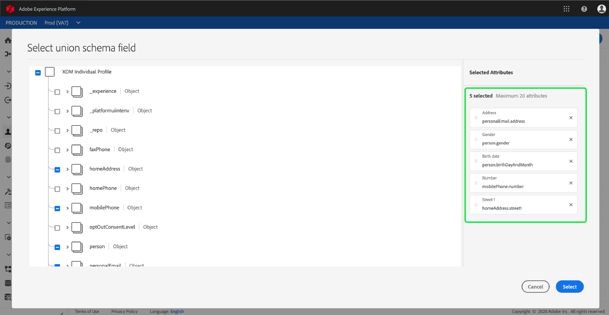
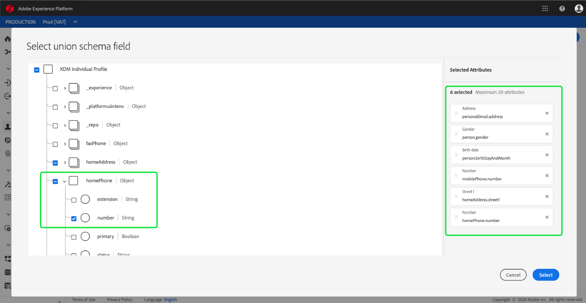

# [!DNL Real-time Customer Profile] personalización de detalles {#profile-detail-customization}

En la interfaz de usuario de Adobe Experience Platform, puede realizar vistas e interactuar con [!DNL Real-time Customer Profile] los datos en forma de perfiles de clientes. La información de perfil mostrada en la interfaz de usuario se ha combinado desde varios fragmentos de perfil para formar una sola vista de cada cliente individual. Esto incluye detalles como atributos básicos, identidades vinculadas y preferencias de canal. Los campos predeterminados que se muestran en los perfiles también se pueden cambiar en el nivel de organización para mostrar [!DNL Profile] los atributos preferidos. Esta guía proporciona instrucciones paso a paso para personalizar la forma en que se muestran [!DNL Profile] los datos en la interfaz de usuario de la plataforma.

Para obtener una guía completa de la interfaz de usuario de [!UICONTROL Perfiles] , visite la guía [del usuario de](user-guide.md)Perfil.

## Reordenar y cambiar el tamaño de las tarjetas {#reorder-and-resize-cards}

En la ficha [!UICONTROL Detalle] del perfil del cliente, puede seleccionar **[!UICONTROL Modificar panel]** para cambiar el tamaño y reordenar las tarjetas existentes.

Después de modificar el panel, puede reordenar las tarjetas seleccionando el título de la tarjeta y arrastrando y colocando las tarjetas en el orden deseado. También puede cambiar el tamaño de una tarjeta seleccionando el símbolo de ángulo en la esquina inferior derecha de la tarjeta (`⌟`) y arrastrando la tarjeta al tamaño deseado. En este ejemplo, se está cambiando el tamaño de la tarjeta de atributos **** básicos.

La tarjeta seleccionada se ajusta al tamaño deseado y las tarjetas que la rodean se cambian de posición de forma dinámica. Esto puede hacer que algunas tarjetas se muevan a filas adicionales, lo que requiere que se desplace hacia abajo para ver todas las tarjetas. Por ejemplo, cuando se cambia el tamaño de la tarjeta de atributos  básicos, la tarjeta de identidades  vinculadas ya no está visible en la fila superior y ahora aparece en una segunda fila nueva dentro del perfil (no se muestra). Para devolver la tarjeta de identidades [!UICONTROL vinculadas a la fila superior, puede arrastrarla y colocarla en la posición actual de la tarjeta de preferencias] de  Canal.

## Edición y eliminación de tarjetas

Además de cambiar el tamaño y reordenar las tarjetas, puede editar el contenido de ciertas tarjetas y eliminar algunas del panel por completo. Seleccione las elipses (`...`) en la esquina superior derecha de la tarjeta para editarla o eliminarla. Se abre un menú desplegable con opciones para editar o quitar la tarjeta, según las propiedades de la tarjeta seleccionada.

>[!NOTE]
>
>No todas las tarjetas se pueden editar o eliminar. Esto se debe a que algunas tarjetas contienen información de solo lectura o obligatoria. Si una tarjeta no tiene elipses en la esquina superior derecha, contiene información de sólo lectura Y necesaria y no se puede editar ni eliminar. Si una tarjeta tiene elipses en la esquina y si la selecciona solo muestra una opción para eliminar la tarjeta, la información de la tarjeta es de sólo lectura y no se puede editar.

Seleccione **[!UICONTROL Editar]** en la lista desplegable para abrir el espacio de trabajo de la utilidad **** Editar, donde puede actualizar el título de la tarjeta, reordenar o eliminar los atributos visibles o agregar atributos adicionales mediante el botón [!UICONTROL Añadir atributos] .

## Añadir atributos {#add-attributes}

En la pantalla [!UICONTROL Editar utilidad] , seleccione **[!UICONTROL Añadir atributos]** en la esquina superior derecha de la tarjeta para empezar a agregar atributos a la tarjeta.

Cuando se abre el cuadro de diálogo [!UICONTROL Seleccionar esquema] de unión, el lado izquierdo del cuadro de diálogo muestra el esquema completo de unión de Perfil [!UICONTROL individual] XDM, con campos anidados debajo. Para obtener más información sobre los esquemas de unión, consulte la sección esquemas de [unión de la [!DNL Profile] guía](user-guide.md#union-schema)del usuario.

La sección Atributos **** seleccionados, en la parte derecha del cuadro de diálogo, muestra los atributos que están actualmente incluidos en la tarjeta que está editando. Aquí también puede eliminar y reordenar atributos. Se muestra el número total de atributos seleccionados, así como el número máximo de atributos (20) que se pueden agregar a una sola tarjeta.

Puede seleccionar cualquiera de los campos de esquema de unión disponibles para personalizar los atributos de la tarjeta que está editando. Los campos seleccionados se muestran con una marca de verificación junto a ellos y se agregan automáticamente a la lista de los atributos seleccionados. Una vez que haya agregado todos los atributos que desea que se muestren en la tarjeta, elija **[!UICONTROL Seleccionar]** para volver a la pantalla [!UICONTROL Editar utilidad] .

Cuando vuelva a la pantalla [!UICONTROL Editar utilidad] , la lista de atributos en la tarjeta debería actualizarse para reflejar sus opciones. Aún puede eliminar o reordenar los atributos de la tarjeta o editar el título de la tarjeta según sea necesario. Una vez finalizadas las ediciones, seleccione **[!UICONTROL Guardar]** para guardar los cambios.

Después de guardar, volverá a la ficha [!UICONTROL Detalle] , donde se verán la tarjeta y los atributos actualizados.

## Add a new card {#add-a-new-card}

Para personalizar aún más el aspecto de los perfiles dentro del Experience Platform, puede elegir agregar nuevas tarjetas al panel y seleccionar los atributos que desea mostrar en esas tarjetas. Para comenzar, seleccione **[!UICONTROL Modificar panel]** en la ficha [!UICONTROL Detalle] .

A continuación, seleccione **[!UICONTROL Añadir utilidad]** en la esquina superior izquierda del panel.

Si elige agregar una tarjeta nueva, se abre la pantalla [!UICONTROL Editar utilidad] , donde puede proporcionar un título para la tarjeta nueva y elegir los atributos que desea que se muestren en la tarjeta. Para empezar a agregar atributos a la tarjeta, seleccione **[!UICONTROL Añadir atributos]**.

Cuando se abre el cuadro de diálogo **[!UICONTROL Seleccionar esquema de unión]** , el lado izquierdo del cuadro de diálogo muestra el esquema completo de unión de Perfil [!UICONTROL individual] XDM y la sección Atributos **** seleccionados del lado derecho del cuadro de diálogo muestra los atributos que se seleccionan para la tarjeta. Para obtener más información sobre cómo agregar atributos, consulte la [sección sobre cómo agregar atributos](#add-attributes) que aparece anteriormente en este documento.

Se muestra el número total de atributos seleccionados, así como el número máximo de atributos (20) que se pueden agregar a una sola tarjeta. También puede eliminar y reordenar los atributos seleccionados desde esta pantalla. Una vez que haya agregado todos los atributos que desea que se muestren en la tarjeta, elija **[!UICONTROL Seleccionar]** para volver a la pantalla [!UICONTROL Editar utilidad] .

Cuando vuelva a la pantalla [!UICONTROL Editar utilidad] , la lista de atributos en la tarjeta deberá reflejar las opciones de la pantalla anterior. También puede reordenar y eliminar atributos de tarjeta según sea necesario.

Para guardar la nueva tarjeta, primero debe proporcionar un título **[!UICONTROL de]** tarjeta, luego podrá seleccionar **[!UICONTROL Guardar]** y completar el proceso de creación de la tarjeta.

Después de guardar, volverá a la ficha [!UICONTROL Detalle] , donde se verán la tarjeta y los atributos nuevos.

## Restaurar tarjetas predeterminadas

Si en cualquier momento decide que desea eliminar los cambios y volver a la vista predeterminada, puede restaurar rápida y fácilmente todas las tarjetas y atributos predeterminados. Para ello, seleccione **[!UICONTROL Modificar panel]** y, a continuación, **[!UICONTROL Restaurar tarjetas]** predeterminadas. Esto eliminará todas las personalizaciones (incluido el cambio de tamaño) que haya realizado. A continuación, puede seleccionar **[!UICONTROL Guardar]** para guardar los cambios o, si no desea restaurar el valor predeterminado, seleccione **[!UICONTROL Cancelar]** para conservar los cambios realizados.

>[!NOTE]
>
>Tenga cuidado al restaurar las tarjetas y los atributos predeterminados. Una vez restaurado y guardado el valor predeterminado, la única manera de volver a las personalizaciones de vista es crearlas de nuevo siguiendo los pasos descritos en este documento.

## Pasos siguientes

Al seguir este documento, debería poder actualizar la vista de perfil de su organización, incluida la adición y eliminación de tarjetas, la edición de los detalles y atributos de las tarjetas y la reordenación y el cambio de tamaño de las tarjetas. Para obtener más información sobre cómo trabajar con [!DNL Profile] datos en la interfaz de usuario del Experience Platform, consulte la guía [[!DNL Profile] del](user-guide.md)usuario.