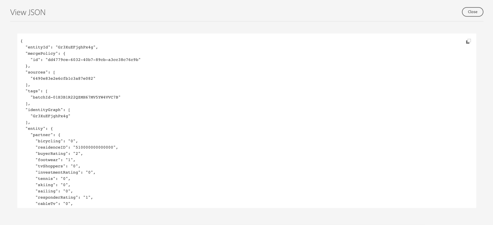

# Perfiles de clientes potenciales

Adobe Experience Platform le permite impulsar experiencias coordinadas, coherentes y relevantes para sus clientes, independientemente de dónde o cuándo interactúen con su marca.

Los perfiles de clientes potenciales se utilizan para representar a personas que aún no han participado en su compañía, pero a las que desea ponerse en contacto. Con los perfiles de clientes potenciales, puede complementar los perfiles de sus clientes con atributos de socios de terceros de confianza.

## Examinar {#browse}

Para acceder a los perfiles de clientes potenciales, seleccione **[!UICONTROL Perfiles]** en el **[!UICONTROL Posibles clientes]** sección.

El **[!UICONTROL Examinar]** se muestra la página. Se mostrará una lista de todos los perfiles de clientes potenciales de su organización.

![El [!UICONTROL Perfiles] botón aparece resaltado y muestra el [!UICONTROL Examinar] para perfiles de clientes potenciales.](../images/prospect-profile/browse-profiles.png)

>[!IMPORTANT]
>
>Aunque la mayor parte de la funcionalidad de navegación entre los perfiles del cliente y los perfiles del cliente potencial es la misma, usted **no puede** examinar los perfiles potenciales mediante una política de combinación. Esto se debe a que los perfiles potenciales se rigen automáticamente por una política de combinación basada en el tiempo y diseñada por el sistema. Encontrará más información sobre las políticas de combinación en la [resumen de políticas de combinación](../merge-policies/overview.md).

Para obtener más información sobre los perfiles de navegación, lea la [sección Examinar de la guía de usuario sobre perfiles](./user-guide.md#browse-identity).

## Detalles del perfil del cliente potencial {#profile-details}

>[!IMPORTANT]
>
>Un perfil cliente potencial caducará automáticamente después de 25 días de residir en Adobe Experience Platform.

Para ver más información sobre un perfil de cliente potencial específico, seleccione un perfil en la [!UICONTROL Examinar] página.

Se muestra información sobre el perfil del cliente potencial, incluidos los atributos asociados con el perfil y la pertenencia a la audiencia.

Para obtener más información sobre estas fichas, lea la [Ver la sección Detalles del perfil de la guía del usuario del perfil](./user-guide.md#profile-detail).

También puede ver todos los atributos en formato JSON seleccionando **[!UICONTROL Ver JSON]**.

![El [!UICONTROL Ver JSON] aparece resaltado en la página de detalles del perfil del cliente potencial.](../images/prospect-profile/profile-select-view-json.png)

El [!UICONTROL Ver JSON] aparece el cuadro de diálogo. Los atributos del perfil del cliente potencial ahora se muestran en forma JSON.

## Casos de uso sugeridos {#use-cases}

Para obtener información sobre cómo puede utilizar la funcionalidad de perfiles de clientes potenciales en Experience Platform en combinación con otras funcionalidades de Platform, lea la siguiente documentación de caso de uso:

- [Capte y adquiera nuevos clientes a través de la funcionalidad de prospección](../../rtcdp/partner-data/prospecting.md)

## Pasos siguientes

Después de leer esta guía, ahora comprende cómo se pueden utilizar los perfiles de clientes potenciales en Adobe Experience Platform. Para conocer cómo se pueden utilizar estos perfiles de clientes potenciales en las audiencias, lea la [guía de audiencias de clientes potenciales](../../segmentation/ui/prospect-audience.md).
