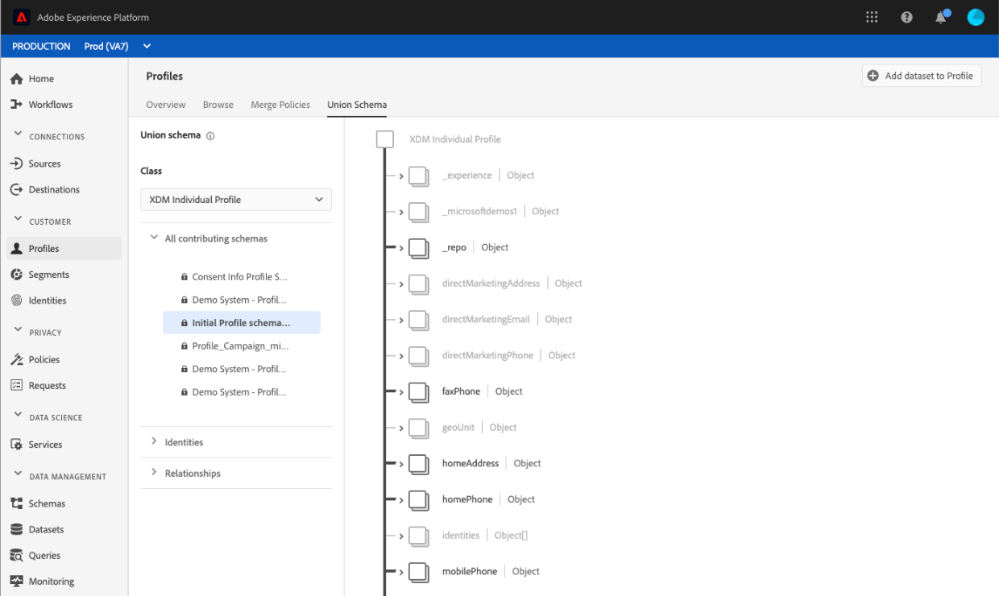

# [!UICONTROL Guía de IU de esquema] de unión

En la interfaz de usuario (IU) de Adobe Experience Platform, puede realizar fácilmente la vista de cualquier esquema de unión dentro de la organización y la previsualización de los campos, identidades, relaciones y esquemas de contribución para una clase específica. Esta guía proporciona información detallada sobre cómo realizar vistas y explorar esquemas de unión mediante la interfaz de usuario de la plataforma.

## Primeros pasos

Esta guía de la interfaz de usuario requiere conocer los distintos [!DNL Experience Platform] servicios que se utilizan para administrar datos de Perfil de clientes en tiempo real. Antes de leer esta guía, o de trabajar en la interfaz de usuario, consulte la documentación de los siguientes servicios:

* [[!DNL Real-time Customer Profile]](../home.md):: Proporciona un perfil de consumo unificado y en tiempo real basado en datos agregados de varias fuentes.
* [[!DNL Identity Service]](../../identity-service/home.md):: Habilita [!DNL Real-time Customer Profile] mediante el puente de identidades de orígenes de datos dispares a medida que se ingieren en [!DNL Platform].
* [[!DNL Experience Data Model] (XDM)](../../xdm/home.md): El marco normalizado por el cual [!DNL Platform] organiza los datos de experiencia del cliente.

## Explicación de los esquemas de unión

El Perfil del cliente en tiempo real le permite crear perfiles centralizados y robustos que contienen atributos del cliente y eventos con marca de hora, cada uno de los cuales interactúa con el cliente en los sistemas integrados con Adobe Experience Platform. Los esquemas del Modelo de datos de experiencia (XDM) proporcionan el formato y la estructura de estos datos, y cada esquema se basa en una clase XDM y contiene campos compatibles con esa clase.

Se pueden crear esquemas para varios casos de uso, haciendo referencia a la misma clase pero conteniendo campos específicos para su uso. Cuando un esquema está habilitado para Perfil, se convierte en parte de un esquema de unión. En otras palabras, los esquemas de unión están compuestos por varios esquemas que comparten la misma clase y que se han habilitado para Perfil. El esquema de unión permite ver una fusión de todos los campos contenidos en esquemas que comparten la misma clase. El Perfil del cliente en tiempo real utiliza el esquema de unión para crear una vista holística de cada cliente individual.

Trabajar con esquemas de unión requiere una comprensión profunda de los esquemas XDM. Para obtener más información, lea los [conceptos básicos de la composición](../../xdm/schema/composition.md)del esquema.

## Esquemas de unión de vista

Para desplazarse a los esquemas de unión dentro de la interfaz de usuario de la plataforma, seleccione **[!UICONTROL Perfiles]** en el panel de navegación izquierdo y, a continuación, seleccione la ficha Esquema **[!UICONTROL de]** Unión. La ficha Esquema [!UICONTROL de] Unión se abre para mostrar el esquema de unión de la clase seleccionada actualmente.

## Seleccionar una clase

Para mostrar el esquema de unión de una clase XDM específica, seleccione la clase en la lista desplegable **[!UICONTROL Clase]** . Debido al hecho de que no todas las clases tienen esquemas de unión, en la lista desplegable solo están disponibles las clases con esquemas de unión (es decir, las clases con esquemas habilitados para el Perfil).

Una vez seleccionada una clase, el esquema que se muestra se actualiza para reflejar el esquema de unión de la clase seleccionada. Por ejemplo, puede seleccionar Perfil **[!UICONTROL individual]** XDM para la vista del esquema de unión de esa clase.

## Explorar esquemas de unión

Puede explorar el esquema de unión desplazándose hacia arriba y hacia abajo hasta la vista de la estructura completa del esquema y seleccionando un corchete angular derecho (`>`) para expandir los campos anidados.

Seleccione cualquier campo para la vista de sus detalles, incluido el nombre para mostrar, el tipo de datos, la descripción, la ruta, la fecha de creación y la fecha de la última modificación. También puede realizar una vista de una lista de esquemas que contengan el campo seleccionado.

Al seleccionar el nombre de un esquema de contribución, se revelan los nombres de los conjuntos de datos relacionados con ese esquema que están invirtiendo datos en el campo seleccionado. Cada nombre de conjunto de datos aparece como un vínculo. Al seleccionar un nombre de conjunto de datos, se abre la ficha actividad de ese conjunto de datos en una ventana nueva.

Para obtener más información sobre conjuntos de datos, incluida la visualización de la actividad de conjuntos de datos y la vista previa de los datos de conjuntos de datos en la interfaz de usuario, visite la guía [de la interfaz de usuario de](../../catalog/datasets/user-guide.md)conjuntos de datos.

## Esquemas de contribución a la vista

También puede realizar la vista de los esquemas específicos que contribuyen al esquema de unión seleccionando **[!UICONTROL Todos los esquemas]** contribuyentes para ampliar la lista de esquemas. Según la clase seleccionada y el número de esquemas que su organización haya creado en Platform, podría ser una lista corta que contenga un solo esquema o una lista larga que contenga muchos esquemas.

Al seleccionar el nombre de un esquema específico, se resaltan los campos del esquema de unión que forman parte del esquema seleccionado. Una vez seleccionado un esquema, el esquema de unión aparece atenuado con barras negras que indican los campos que forman parte del esquema de contribución.

## Identidades de vista

A través de la interfaz de usuario, puede realizar la vista de una lista de identidades incluidas en el esquema de unión seleccionando **[!UICONTROL Identidades]** para expandir la lista.

Al seleccionar una identidad individual de la lista, el esquema mostrado se actualiza automáticamente según sea necesario para mostrar el campo de identidad. Esto podría incluir la expansión de varios campos si el campo de identidad está anidado.

El campo de identidad se resalta dentro del esquema de unión y los detalles de la identidad se muestran en el lado derecho de la pantalla. Los detalles incluyen una lista de esquemas de contribución que contiene el campo de identidad y puede explorar en profundidad para encontrar vínculos a los conjuntos de datos relacionados con ese esquema que están ingresando datos al campo de identidad seleccionado.

## Relaciones de vista

La IU de esquema de unión también permite ver las relaciones que se han definido para esquemas en función de la clase de esquema seleccionada. La definición de una relación es una forma de conectar dos esquemas pertenecientes a diferentes clases para obtener perspectivas más complejas sobre los datos de los clientes.

Si se han establecido relaciones para la clase seleccionada, al seleccionar **[!UICONTROL Relaciones]** se muestra una lista de campos utilizados para crear relaciones. No todos los esquemas utilizan o necesitan relaciones definidas, por lo que es común que la sección de relaciones no contenga campos.

Para obtener más información sobre las relaciones de esquema, incluida la forma de definirlas mediante la interfaz de usuario, visite [este documento sobre las relaciones](../../xdm/tutorials/relationship-ui.md)de esquema.

Al seleccionar un campo de relación de la lista, el esquema mostrado se actualiza según sea necesario para mostrar el campo de relación resaltado. Esto podría incluir la expansión de varios campos si el campo de relación está anidado.

## Pasos siguientes

Al leer esta guía, ahora sabe cómo vista y navegar por los esquemas de unión mediante la [!DNL Experience Platform] IU. Para obtener más información sobre los esquemas, incluido cómo se utilizan en toda la plataforma, lea la información general [del sistema](../../xdm/home.md)XDM.
