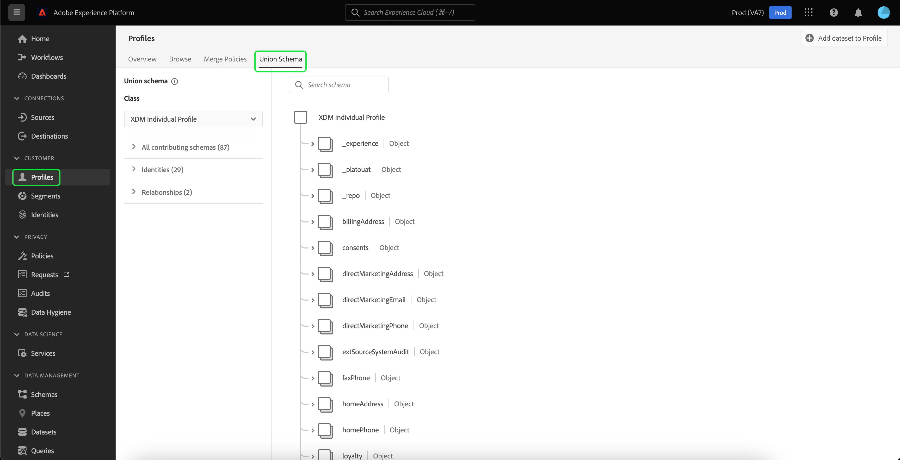

# [!UICONTROL Esquema de unión] Guía de la interfaz de usuario

En la interfaz de usuario (IU) de Adobe Experience Platform, puede ver fácilmente cualquier esquema de unión de su organización y previsualizar los campos, las identidades, las relaciones y los esquemas de contribución de una clase específica. Esta guía proporciona información detallada sobre cómo ver y explorar esquemas de unión mediante la interfaz de usuario de Platform.

## Primeros pasos

Esta guía de la interfaz de usuario requiere conocer las distintas [!DNL Experience Platform] servicios relacionados con la administración de datos del perfil del cliente en tiempo real. Antes de leer esta guía o de trabajar en la interfaz de usuario, revise la documentación de los siguientes servicios:

* [[!DNL Real-Time Customer Profile]](../home.md): Proporciona un perfil de cliente unificado y en tiempo real basado en datos agregados de varias fuentes.
* [[!DNL Identity Service]](../../identity-service/home.md): Habilitación [!DNL Real-Time Customer Profile] al unir identidades de fuentes de datos dispares a medida que se incorporan [!DNL Platform].
* [[!DNL Experience Data Model (XDM)]](../../xdm/home.md): El marco normalizado por el cual [!DNL Platform] organiza los datos de experiencia del cliente.

## Explicación de los esquemas de unión

El perfil del cliente en tiempo real le permite crear perfiles robustos y centralizados que contengan atributos del cliente y eventos con marca de hora, y que cada cliente interactúe entre sí en sistemas integrados con Adobe Experience Platform. El formato y la estructura de estos datos los proporcionan los esquemas del Modelo de datos de experiencia (XDM), cada esquema se basa en una clase XDM y contiene campos compatibles con esa clase.

Se pueden crear esquemas para varios casos de uso, que hagan referencia a la misma clase pero que contengan campos específicos de su uso. Cuando un esquema está habilitado para Perfil, pasa a formar parte de un esquema de unión. En otras palabras, los esquemas de unión están compuestos por varios esquemas que comparten la misma clase y que se han habilitado para Perfil. El esquema de unión permite ver una amalgamación de todos los campos contenidos en esquemas que comparten la misma clase. El perfil del cliente en tiempo real utiliza el esquema de unión para crear una vista holística de cada cliente individual.

El trabajo con esquemas de unión requiere una comprensión profunda de los esquemas XDM. Para obtener más información, comience por leer la [conceptos básicos de la composición del esquema](../../xdm/schema/composition.md).

## Ver esquemas de unión

Para ir a los esquemas de unión dentro de la interfaz de usuario de Platform, seleccione **[!UICONTROL Perfiles]** en el panel de navegación izquierdo, seleccione la opción **[!UICONTROL Esquema de unión]** pestaña . La variable [!UICONTROL Esquema de unión] se abre para mostrar el esquema de unión de la clase seleccionada actualmente.

## Seleccionar una clase

Para mostrar el esquema de unión de una clase XDM específica, seleccione la clase en el **[!UICONTROL Clase]** lista desplegable. Debido al hecho de que no todas las clases tienen esquemas de unión, solo las clases con esquemas de unión (es decir, clases con esquemas que se han habilitado para Perfil) están disponibles en la lista desplegable.

Una vez seleccionada una clase, el esquema que se muestra se actualiza para reflejar el esquema de unión de la clase seleccionada. Por ejemplo, puede seleccionar **[!UICONTROL Perfil individual XDM]** para ver el esquema de unión de esa clase.

## Explorar esquemas de unión

Puede explorar el esquema de unión desplazándose hacia arriba y hacia abajo para ver la estructura completa del esquema y seleccionando un corchete angular derecho (`>`) para expandir los campos anidados.

Seleccione cualquier campo para ver sus detalles, como nombre para mostrar, tipo de datos, descripción, ruta, fecha creada y fecha de la última modificación. También puede ver una lista de esquemas de contribución que contengan el campo seleccionado.

Al seleccionar el nombre de un esquema de contribución, se muestran los nombres de los conjuntos de datos relacionados con ese esquema que están introduciendo datos en el campo seleccionado. Cada nombre de conjunto de datos aparece como un vínculo. Al seleccionar un nombre de conjunto de datos, se abre la pestaña actividad de ese conjunto de datos en una nueva ventana.

Para obtener más información sobre conjuntos de datos, incluida la visualización de la actividad del conjunto de datos y la vista previa de los datos del conjunto de datos en la interfaz de usuario, visite la [guía de la interfaz de usuario de conjuntos de datos](../../catalog/datasets/user-guide.md).

## Ver esquemas de contribución

También puede ver qué esquemas específicos contribuyen al esquema de unión seleccionando **[!UICONTROL Todos los esquemas de contribución]** para expandir la lista de esquemas. Según la clase que haya seleccionado y el número de esquemas que su organización haya creado en Platform, podría ser una lista corta que contenga un esquema único o una lista larga que contenga muchos esquemas.

Al seleccionar el nombre de un esquema específico, se resaltan los campos del esquema de unión que forman parte del esquema seleccionado. Una vez seleccionado un esquema, el esquema de unión aparece atenuado con barras negras que indican los campos que forman parte del esquema de contribución.

## Ver identidades

A través de la interfaz de usuario puede ver una lista de identidades incluidas en el esquema de unión seleccionando **[!UICONTROL Identidades]** para expandir la lista.

La selección de una identidad individual en la lista hace que el esquema mostrado se actualice automáticamente según sea necesario para mostrar el campo de identidad. Esto podría incluir la expansión de varios campos si el campo de identidad está anidado.

El campo de identidad se resalta dentro del esquema de unión y los detalles de la identidad se muestran en el lado derecho de la pantalla. Los detalles incluyen una lista de esquemas de contribución que contienen el campo de identidad y puede explorar en profundidad para encontrar vínculos a los conjuntos de datos relacionados con ese esquema que están incorporando datos en el campo de identidad seleccionado.

## Ver relaciones

La IU de esquema de unión también permite ver las relaciones que se han definido para esquemas en función de la clase de esquema seleccionada. La definición de una relación es una forma de conectar dos esquemas pertenecientes a diferentes clases para obtener perspectivas más complejas sobre los datos de los clientes.

Si se han establecido relaciones para la clase seleccionada, seleccione **[!UICONTROL Relaciones]** muestra una lista de campos utilizados para crear relaciones. No todos los esquemas utilizan o necesitan relaciones definidas, por lo que es común que la sección de relaciones no contenga campos.

Para obtener más información sobre las relaciones de esquema, como cómo definirlas mediante la interfaz de usuario, visite [este documento sobre relaciones de esquema](../../xdm/tutorials/relationship-ui.md).

Si se selecciona un campo de relación en la lista, el esquema mostrado se actualiza según sea necesario para mostrar el campo de relación resaltado. Esto podría incluir la expansión de varios campos si el campo de relación está anidado.

## Pasos siguientes

Al leer esta guía, ahora sabe cómo ver y navegar por los esquemas de unión usando la variable [!DNL Experience Platform] IU. Para obtener más información sobre los esquemas, incluido cómo se utilizan en toda la plataforma, comience leyendo el [Información general del sistema XDM](../../xdm/home.md).
