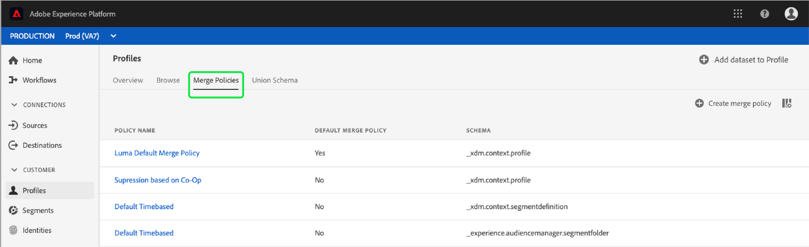

# [!DNL Real-time Customer Profile] Guía de la interfaz de usuario

[!DNL Real-time Customer Profile] crea una vista holística de cada uno de sus clientes individuales, combinando datos de varios canales, incluidos datos en línea, sin conexión, CRM y de terceros. Este documento sirve como guía para interactuar con datos [!DNL Real-time Customer Profile] en la interfaz de usuario (IU) de Adobe Experience Platform.

## Primeros pasos

Esta guía de la interfaz de usuario requiere comprender los distintos [!DNL Experience Platform] servicios que se implican en la administración de [!DNL Real-time Customer Profiles]. Antes de leer esta guía, o de trabajar en la interfaz de usuario, consulte la documentación de los siguientes servicios:

* [[!DNL Real-time Customer Profile]](../home.md):: Proporciona un perfil de consumo unificado y en tiempo real basado en datos agregados de varias fuentes.
* [[!DNL Identity Service]](../../identity-service/home.md):: Habilita  [!DNL Real-time Customer Profile] mediante el puente de identidades de orígenes de datos dispares a medida que se ingieren en  [!DNL Platform].
* [[!DNL Experience Data Model (XDM)]](../../xdm/home.md):: Marco normalizado por el cual se  [!DNL Platform] organizan los datos de experiencia del cliente.

## Información general

En la interfaz de usuario del Experience Platform, seleccione **[!UICONTROL Perfiles]** en el panel de navegación izquierdo para abrir la ficha **[!UICONTROL Información general]**. Esta ficha proporciona vínculos a documentación y vídeos para ayudarle a comprender y comenzar a trabajar con perfiles.

### (Alfa) panel de Perfil

>[!IMPORTANT]
>
>La funcionalidad de panel está actualmente en alfa y no está disponible para todos los usuarios. La documentación y las funciones están sujetas a cambios.

Para algunos usuarios, si selecciona **[!UICONTROL Perfiles]** en la navegación izquierda y abre la ficha **[!UICONTROL Información general]**, se proporciona un panel que describe las métricas clave relacionadas con los datos de Perfil.

Para obtener más información, visite la [guía del panel de Perfil](profile-dashboard.md).

## Examinar

Seleccione la ficha **[!UICONTROL Examinar]** para examinar los perfiles por identidad.

### Métricas de perfil {#profile-metrics}

A la derecha de la ficha **[!UICONTROL Examinar]** hay varias métricas importantes relacionadas con los datos de perfil, incluido el [recuento de perfiles](#profile-count) total, así como una lista de [perfiles por Área de nombres](#profiles-by-namespace).

Estas métricas de perfil se evalúan mediante la directiva de combinación predeterminada de su organización. Para obtener más información sobre cómo trabajar con políticas de combinación, incluida la definición de una directiva de combinación predeterminada, consulte la [guía del usuario de directivas de combinación](merge-policies.md).

Además de estas métricas, la sección Métricas de perfil también proporciona una fecha y hora de última actualización, que muestra cuándo se evaluaron las métricas por última vez.

### Recuento de perfiles {#profile-count}

El recuento de perfiles muestra el número total de perfiles que tiene su organización dentro de [!DNL Experience Platform], después de que la directiva de combinación predeterminada de su organización haya combinado fragmentos de perfil para formar un único perfil para cada cliente individual. En otras palabras, su organización puede tener varios fragmentos de perfil relacionados con un único cliente que interactúa con su marca en diferentes canales, pero estos fragmentos se combinarán (según la política de combinación predeterminada) y devolverá un recuento de perfiles &quot;1&quot; porque todos están relacionados con el mismo individuo.

El recuento de perfiles también incluye tanto perfiles con atributos (datos de registros) como perfiles que contienen únicamente datos de series temporales (eventos), como perfiles Adobe Analytics. El recuento de perfiles se actualiza con regularidad para proporcionar un número total actualizado de perfiles dentro de la plataforma.

Cuando la ingestión de registros en el almacén [!DNL Profile] aumenta o disminuye el recuento en más de un 5%, se activa un trabajo para actualizar el recuento. Para los flujos de trabajo de datos de flujo continuo, se realiza una comprobación por hora para determinar si se ha alcanzado el umbral de aumento o reducción del 5 %. Si lo ha hecho, se activa automáticamente un trabajo para actualizar el recuento de perfiles. Para la ingestión por lotes, dentro de los 15 minutos siguientes a la correcta ingestión de un lote en el almacén de Perfiles, si se alcanza el umbral de aumento o disminución del 5 %, se ejecuta un trabajo para actualizar el recuento de perfiles.

### Perfiles por Área de nombres {#profiles-by-namespace}

La métrica **[!UICONTROL Perfiles por Área de nombres]** muestra el recuento total y desglose de Áreas de nombres en todos los perfiles combinados de su almacén de Perfiles. El número total de perfiles por Área de nombres (es decir, sumar los valores mostrados para cada Área de nombres) siempre será mayor que la métrica de recuento de perfiles porque un perfil podría tener varias Áreas de nombres asociadas. Por ejemplo, si un cliente interactúa con su marca en más de un canal, se asociarán varias Áreas de nombres con ese cliente individual.

De forma similar a la métrica [recuento de perfiles](#profile-count), cuando la ingestión de registros en el almacén [!DNL Profile] aumenta o disminuye el recuento en más de un 5%, se activa un trabajo para actualizar las métricas de Área de nombres. Para los flujos de trabajo de datos de flujo continuo, se realiza una comprobación por hora para determinar si se ha alcanzado el umbral de aumento o reducción del 5 %. Si lo ha hecho, se activa automáticamente un trabajo para actualizar el recuento de perfiles. Para la ingestión por lotes, dentro de los 15 minutos posteriores a la ingestión satisfactoria de un lote en el almacén [!DNL Profile], si se alcanza el umbral de aumento o disminución del 5 %, se ejecuta un trabajo para actualizar las métricas.

### Combinar directiva

El selector **[!UICONTROL Combinar directiva]** selecciona automáticamente la directiva de combinación predeterminada para su organización. Si no desea utilizar esa directiva de combinación, puede seleccionar `X` junto a la directiva de combinación predeterminada para abrir el cuadro de diálogo **[!UICONTROL Seleccionar directiva de combinación]** donde puede elegir otra directiva de combinación.

Para obtener más información sobre las directivas de combinación y su función dentro de la plataforma, consulte la [guía de IU de directivas de combinación](merge-policies.md).

### Área de nombres de identidad

El selector **[!UICONTROL Área de nombres de identidad]** abre un cuadro de diálogo en el que puede elegir la Área de nombres de identidad por la que desea buscar y puede personalizar los atributos que se muestran en la búsqueda seleccionando el icono de filtro y eligiendo los atributos que desee agregar o eliminar.

En el cuadro de diálogo **[!UICONTROL Seleccionar Área de nombres de identidad]**, elija la Área de nombres en la que desea realizar la búsqueda o utilice la barra de búsqueda del cuadro de diálogo para empezar a escribir el nombre de una Área de nombres. Puede seleccionar una Área de nombres para vista de detalles adicionales y una vez encontrada la Área de nombres que desee utilizar, puede seleccionar el botón de radio y pulsar **[!UICONTROL Seleccionar]** para continuar.

### Valor de identidad

Después de seleccionar una Área de nombres de identidad, vuelva a la ficha **[!UICONTROL Examinar]** donde puede introducir un **[!UICONTROL valor de identidad]**. Este valor es específico de un perfil de cliente individual y debe ser una entrada válida para la Área de nombres proporcionada. Por ejemplo, la selección de la Área de nombres de identidad &quot;Correo electrónico&quot; requeriría un valor de identidad en forma de una dirección de correo electrónico válida.

Una vez introducido un valor, seleccione **[!UICONTROL Mostrar perfil]** y se devuelve un solo perfil que coincida con el valor. Seleccione el **[!UICONTROL ID de Perfil]** para vista de los detalles del perfil.

### Detalles del perfil {#profile-detail}

Al seleccionar el **[!UICONTROL ID de Perfil]**, se abre la ficha **[!UICONTROL Detalle]**. La información de perfil mostrada en la ficha **[!UICONTROL Detalle]** se ha combinado desde varios fragmentos de perfil para formar una sola vista del cliente individual. Esto incluye detalles del cliente, como atributos básicos, identidades vinculadas y preferencias de canal. Los campos predeterminados que se muestran también se pueden cambiar en el nivel de organización para mostrar los atributos de Perfil preferidos. Para obtener más información sobre la personalización de estos campos, incluidas las instrucciones paso a paso para agregar y quitar atributos y cambiar el tamaño de los paneles de panel, lea la [guía de personalización de detalles de perfil](profile-customization.md).

Puede vista de información adicional relacionada con el perfil individual seleccionando otra de las fichas disponibles. Estas fichas incluyen atributos, eventos y pertenencia a segmentos, que muestran los segmentos para los que el perfil está cualificado actualmente.

## Combinar directivas

En el menú principal **[!UICONTROL Perfiles]**, seleccione la ficha **[!UICONTROL Combinar políticas]** para vista de una lista de directivas de combinación que pertenecen a su organización. Cada directiva de la lista muestra su nombre, sea o no la directiva de combinación predeterminada, y la clase de esquema a la que se aplica.

Para obtener más información sobre las directivas de combinación, consulte la [guía de IU de directivas de combinación](merge-policies.md).

Para obtener más información sobre cómo trabajar con políticas de combinación mediante la API de Perfil del cliente en tiempo real, consulte la [guía de extremo de directivas de combinación](../api/merge-policies.md).

## Esquema de unión {#union-schema}

En el menú principal **[!UICONTROL Perfiles]**, seleccione la ficha **[!UICONTROL Esquema de Unión]** para vista de los esquemas de unión disponibles para los datos ingestados. Un esquema de unión es una amalgamación de todos los campos [!DNL Experience Data Model] (XDM) bajo la misma clase, cuyos esquemas se han habilitado para utilizarse en [!DNL Real-time Customer Profile].

Para obtener más información sobre los esquemas de unión, visite la [guía de la interfaz de usuario de esquema de unión](union-schema.md).

## Pasos siguientes

Al leer esta guía, ahora sabe cómo vista y administrar sus [!DNL Profile] datos mediante la [!DNL Experience Platform] IU. Para obtener información sobre cómo trabajar con datos de Perfil mediante la API de Perfil del cliente en tiempo real, consulte la [guía para desarrolladores de Perfil](../api/overview.md).