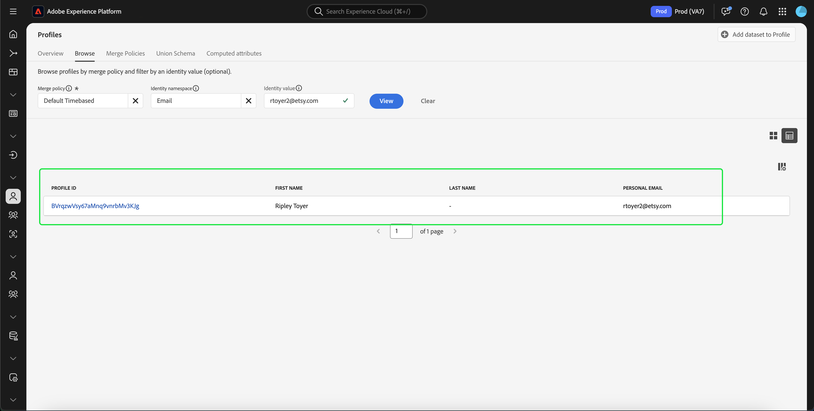
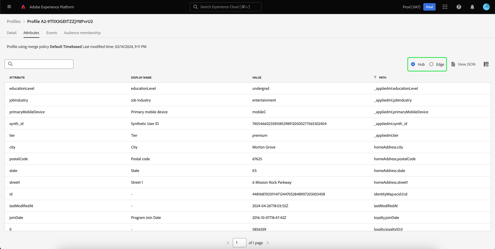
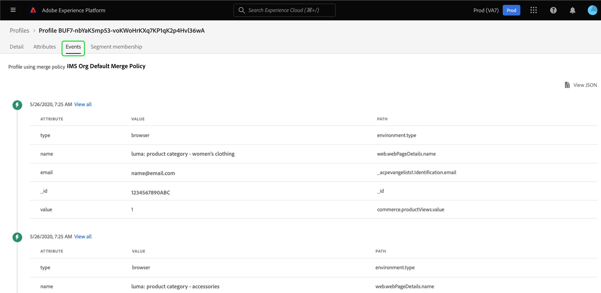

# [!DNL Real-Time Customer Profile] Guía de IU

[!DNL Real-Time Customer Profile] crea una vista integral de cada uno de sus clientes individuales, combinando datos de varios canales, incluidos datos en línea, sin conexión, CRM y de terceros. Este documento sirve como guía para interactuar con [!DNL Real-Time Customer Profile] en la interfaz de usuario (IU) de Adobe Experience Platform.

## Introducción

Esta guía de la interfaz de usuario requiere una comprensión de las distintas [!DNL Experience Platform] servicios relacionados con la gestión de [!DNL Real-Time Customer Profiles]. Antes de leer esta guía o de trabajar en la interfaz de usuario de, consulte la documentación de los siguientes servicios:

* [[!DNL Real-Time Customer Profile] descripción general](../home.md): Proporciona un perfil de consumidor unificado y en tiempo real basado en los datos agregados de varias fuentes.
* [[!DNL Identity Service]](../../identity-service/home.md): Habilita [!DNL Real-Time Customer Profile] uniendo identidades de fuentes de datos dispares a medida que se incorporan en [!DNL Platform].
* [[!DNL Experience Data Model (XDM)]](../../xdm/home.md): El marco estandarizado mediante el cual [!DNL Platform] organiza los datos de experiencia del cliente.

## Información general de 

En la IU del Experience Platform, seleccione **[!UICONTROL Perfiles]** en la navegación izquierda para abrir **[!UICONTROL Información general]** pestaña que muestra el tablero de perfiles.

>[!NOTE]
>
>Si su organización es nueva en Platform y aún no ha creado conjuntos de datos de perfil o políticas de combinación activos, la variable [!UICONTROL Perfiles] el panel no es visible. En su lugar, la variable [!UICONTROL Información general] Esta pestaña muestra vínculos y documentación para ayudarle a empezar a usar el Perfil del cliente en tiempo real.

### Tablero de perfil {#profile-dashboard}

El panel de perfil describe las métricas clave relacionadas con los datos de perfil de su organización.

Para obtener más información, visite la [guía del tablero de perfiles](../../dashboards/guides/profiles.md).

## [!UICONTROL Examinar] métricas de pestaña

Seleccione el **[!UICONTROL Examinar]** para mostrar varias métricas relacionadas con los datos de perfil de su organización. También puede utilizar esta pestaña para examinar el almacén de perfiles mediante una política de combinación o una identidad, como se describe en la siguiente sección de esta guía.

En el lado derecho de la **[!UICONTROL Examinar]** es la pestaña [recuento de perfiles](#profile-count) así como una lista de [perfiles por área de nombres](#profiles-by-namespace).

>[!NOTE]
>
>Estas métricas de perfil pueden diferir de las métricas mostradas en la [tablero de perfiles](#profile-dashboard) porque se evalúan utilizando la política de combinación predeterminada de su organización. Para obtener más información sobre cómo trabajar con políticas de combinación, incluido cómo definir una política de combinación predeterminada, consulte la [resumen de políticas de combinación](../merge-policies/overview.md).

Además de estas métricas, esta sección proporciona una fecha y una hora de última actualización, que muestra cuándo se evaluaron por última vez las métricas.

### Recuento de perfiles {#profile-count}

El recuento de perfiles muestra el número total de perfiles que su organización tiene en Experience Platform, después de que la política de combinación predeterminada de su organización haya combinado fragmentos de perfil para formar un único perfil para cada cliente individual. En otras palabras, su organización puede tener varios fragmentos de perfil relacionados con un único cliente que interactúa con su marca en diferentes canales, pero estos fragmentos se combinarían (según la política de combinación predeterminada) y devolverían un recuento de perfil &quot;1&quot; porque todos están relacionados con la misma persona.

El recuento de perfiles también incluye perfiles con atributos (datos de registro), así como perfiles que solo contienen datos de series temporales (eventos), como perfiles de Adobe Analytics. El recuento de perfiles se actualiza regularmente para proporcionar un número total actualizado de perfiles dentro de Platform.

#### Actualización de la métrica de recuento de perfiles

Cuando la ingesta de registros en el [!DNL Profile] La tienda aumenta o disminuye el recuento en más del 5 % y se activa un trabajo para actualizar el recuento. Para los flujos de trabajo de datos de flujo continuo, se realiza una comprobación cada hora para determinar si se ha alcanzado el umbral de aumento o disminución del 5 %. En caso afirmativo, se activa automáticamente un trabajo para actualizar el recuento de perfiles. Para la ingesta por lotes, en los 15 minutos siguientes a la ingesta correcta de un lote en el almacén de perfiles, si se alcanza el umbral de aumento o disminución del 5 %, se ejecuta un trabajo para actualizar el recuento de perfiles.

### [!UICONTROL Perfiles por área de nombres] {#profiles-by-namespace}

El **[!UICONTROL Perfiles por área de nombres]** Esta métrica muestra el recuento total y el desglose de áreas de nombres en todos los perfiles combinados del almacén de perfiles. El número total de perfiles por área de nombres (es decir, sumando los valores mostrados para cada área de nombres) siempre será mayor que la métrica de recuento de perfiles porque un perfil podría tener varias áreas de nombres asociadas. Por ejemplo, si un cliente interactúa con su marca en más de un canal, se asociarán varias áreas de nombres a ese cliente individual.

#### Actualización del [!UICONTROL Perfiles por área de nombres] métrica

Similar a la [recuento de perfiles](#profile-count) métrica, cuando la ingesta de registros en la variable [!DNL Profile] Una tienda de aumenta o disminuye el recuento en más del 5 % y se activa un trabajo para actualizar las métricas del área de nombres. Para los flujos de trabajo de datos de flujo continuo, se realiza una comprobación cada hora para determinar si se ha alcanzado el umbral de aumento o disminución del 5 %. En caso afirmativo, se activa automáticamente un trabajo para actualizar el recuento de perfiles. Para la ingesta por lotes, en los 15 minutos siguientes a la ingesta correcta de un lote en [!DNL Profile] En el almacén de, si se alcanza el umbral de aumento o disminución del 5 %, se ejecuta un trabajo para actualizar las métricas.

## Uso [!UICONTROL Examinar] para ver los perfiles

En el **[!UICONTROL Examinar]** pestaña puede ver perfiles de muestra mediante una política de combinación o buscar perfiles específicos mediante un área de nombres de identidad y un valor.

### Examinar por [!UICONTROL Política de combinación]

El **[!UICONTROL Examinar]** La pestaña está configurada en la política de combinación predeterminada de su organización de forma predeterminada. Para elegir una política de combinación diferente, seleccione la `X` junto al nombre de la política de combinación y, a continuación, utilice el selector para abrir **[!UICONTROL Seleccionar política de combinación]** diálogo.

>[!NOTE]
>
>Si no hay ninguna política de combinación seleccionada, utilice el botón de selección situado junto a la etiqueta **[!UICONTROL Política de combinación]** para abrir el cuadro de diálogo de selección.

Para elegir una política de combinación del **[!UICONTROL Seleccionar política de combinación]** , seleccione el botón de opción situado junto al nombre de la política y utilice **[!UICONTROL Seleccionar]** para volver a la [!UICONTROL Examinar] pestaña. A continuación, puede seleccionar **[!UICONTROL Ver]** para actualizar los perfiles de muestra y ver un muestreo de perfiles con la nueva política de combinación aplicada.

Los perfiles que se muestran representan una muestra de hasta 20 perfiles del almacén de perfiles de su organización, después de aplicar la política de combinación seleccionada. Los perfiles de muestra para la política de combinación seleccionada se actualizan cuando se agregan nuevos datos al almacén de perfiles de su organización.

Para ver los detalles de uno de los perfiles de muestra, seleccione la opción **[!UICONTROL ID de perfil]**. Para obtener más información, consulte la sección que aparece más adelante en esta guía sobre [visualización de detalles del perfil](#profile-detail).

Para obtener más información sobre las políticas de combinación y su función en Platform, consulte la [resumen de políticas de combinación](../merge-policies/overview.md).

### Examinar por [!UICONTROL Identidad] {#browse-identity}

En el **[!UICONTROL Examinar]** , puede utilizar un área de nombres de identidad para buscar un perfil específico por un valor de identidad. La exploración por una identidad requiere que proporcione una política de combinación, un área de nombres de identidad y un valor de identidad.

Si es necesario, utilice el **[!UICONTROL Política de combinación]** selector para abrir **[!UICONTROL Seleccionar política de combinación]** y elija la política de combinación que desee utilizar.

A continuación, utilice el **[!UICONTROL Área de nombres de identidad]** selector para abrir **[!UICONTROL Seleccionar área de nombres de identidad]** y elija el área de nombres en la que desea buscar. Si su organización tiene muchas áreas de nombres, puede utilizar la barra de búsqueda del cuadro de diálogo para empezar a escribir el nombre de un área de nombres.

Puede seleccionar un área de nombres para ver detalles adicionales o seleccionar el botón de opción para elegir un área de nombres. A continuación, puede utilizar **[!UICONTROL Seleccionar]** para continuar.

Después de seleccionar una [!UICONTROL Área de nombres de identidad] y volver a la [!UICONTROL Examinar] , puede introducir una variable **[!UICONTROL Valor de identidad]** relacionada con el área de nombres que ha seleccionado.

>[!NOTE]
>
>Este valor es específico de un perfil de cliente individual y debe ser una entrada válida para el área de nombres proporcionada. Por ejemplo, para seleccionar el área de nombres de identidad &quot;Correo electrónico&quot; se necesita un valor de identidad en forma de dirección de correo electrónico válida.

Una vez introducido un valor, seleccione **[!UICONTROL Ver]** y se devuelve un solo perfil que coincide con el valor. Seleccione el **[!UICONTROL ID de perfil]** para ver los detalles del perfil.

## Ver detalles del perfil {#profile-detail}

Después de seleccionar una **[!UICONTROL ID de perfil]**, el **[!UICONTROL Detalle]** se abre. La información de perfil mostrada en la **[!UICONTROL Detalle]** La pestaña se ha combinado a partir de varios fragmentos de perfil para formar una sola vista del cliente individual. Esto incluye detalles del cliente, como atributos básicos, identidades vinculadas y preferencias de canal.

Los campos predeterminados mostrados también se pueden cambiar a nivel organizativo para mostrar los atributos de perfil preferidos. Para obtener más información sobre cómo personalizar estos campos, incluidas instrucciones paso a paso para agregar y quitar atributos y cambiar el tamaño de los paneles, lea la [guía de personalización de detalles de perfil](profile-customization.md).

También puede alternar entre la visualización de los nombres de atributos como nombres para mostrar y sus nombres de rutas de campo. Para cambiar entre estas dos pantallas, seleccione la **[!UICONTROL Mostrar nombres para mostrar]** alternar.

Para ver información adicional relacionada con el perfil del cliente individual, seleccione una de las otras pestañas disponibles. Estas pestañas incluyen atributos, eventos y la pestaña pertenencia a audiencias que muestra las audiencias para las que el perfil está cualificado actualmente.

### Pestaña Atributos

El **[!UICONTROL Atributos]** proporciona una vista de lista que resume todos los atributos relacionados con un único perfil, una vez aplicada la política de combinación especificada.

Estos atributos también se pueden ver como un objeto JSON seleccionando **[!UICONTROL Ver JSON]**. Esto resulta útil para los usuarios que deseen comprender mejor cómo se incorporan los atributos de perfil en Platform.

Para ver los atributos disponibles en Edge, seleccione **[!UICONTROL Edge]** en el selector de ubicación de datos.

Para obtener más información sobre los perfiles de Edge, lea la [documentación de perfiles de Edge](../edge-profiles.md).

### Pestaña Eventos

El **[!UICONTROL Eventos]** Esta pestaña contiene datos de los 100 ExperienceEvents más recientes asociados al cliente. Estos datos pueden incluir aperturas de correo electrónico, actividades del carro de compras y vistas de páginas. Seleccionar **[!UICONTROL Ver todo]** para cualquier evento individual proporciona campos y valores adicionales para las capturas como parte del evento.

Los eventos también se pueden ver como un objeto JSON seleccionando **[!UICONTROL Ver JSON]**. Esto resulta útil para comprender cómo se capturan los eventos en Platform.

### Pestaña Membresía de audiencia

El **[!UICONTROL Abono a audiencia]** Esta pestaña muestra una lista con el nombre y la descripción de las audiencias a las que pertenece actualmente el perfil del cliente individual. Esta lista se actualiza automáticamente a medida que el perfil cumple los requisitos de las audiencias o caduca. El recuento total de audiencias para las que el perfil está cualificado actualmente se muestra en la parte derecha de la pestaña.

Para obtener más información sobre la segmentación en Experience Platform, consulte la [Documentación del servicio de segmentación del Experience Platform Adobe](../../segmentation/home.md).

Para ver la pertenencia de los perfiles a la audiencia disponibles en Edge, seleccione **[!UICONTROL Edge]** en el selector de ubicación de datos. Puede encontrar más información acerca de la segmentación de Edge en la [guía de segmentación de edge](../../segmentation/ui/edge-segmentation.md).

## Políticas de combinación

Desde el principal **[!UICONTROL Perfiles]** , seleccione la opción **[!UICONTROL Políticas de combinación]** para ver una lista de las políticas de combinación que pertenecen a su organización. Cada directiva de la lista muestra su nombre, independientemente de si es o no la directiva de combinación predeterminada y la clase de esquema a la que se aplica.

Para obtener más información sobre las políticas de combinación, consulte [resumen de políticas de combinación](../merge-policies/overview.md).

## Esquema de unión {#union-schema}

Desde el principal **[!UICONTROL Perfiles]** , seleccione la opción **[!UICONTROL Esquema de unión]** para ver los esquemas de unión disponibles para los datos ingeridos. Un esquema de unión es una amalgamación de todos los [!DNL Experience Data Model] (XDM) en la misma clase, cuyos esquemas se han habilitado para su uso en [!DNL Real-Time Customer Profile].

Para obtener más información sobre los esquemas de unión, visite la [guía de IU del esquema de unión](union-schema.md).

## Atributos calculados {#computed-attributes}

Desde el principal **[!UICONTROL Perfiles]** , seleccione la opción **[!UICONTROL Atributos calculados]** para ver una lista de atributos calculados que pertenecen a su organización.

Para obtener más información sobre los atributos calculados, lea la [información general sobre atributos calculados](../computed-attributes/overview.md). Para obtener más información sobre cómo utilizar atributos calculados en la IU de Platform, lea la [guía de IU de atributos calculados](../computed-attributes/ui.md).

## Pasos siguientes

Al leer esta guía, sabe cómo ver y administrar los datos de perfil de su organización mediante la interfaz de usuario de Experience Platform. Para obtener información sobre cómo trabajar con datos de perfil mediante API de Experience Platform, consulte la [Guía de la API del perfil del cliente en tiempo real](../api/overview.md).
