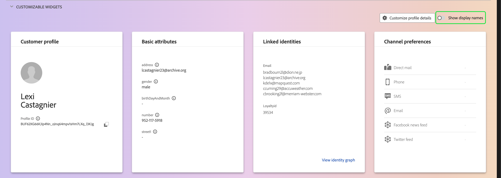

# Guía de la interfaz de usuario de [!DNL Real-Time Customer Profile]

[!DNL Real-Time Customer Profile] crea una vista integral de cada uno de sus clientes individuales, combinando datos de varios canales, incluidos datos en línea, sin conexión, CRM y de terceros. Este documento sirve como guía para interactuar con los datos de [!DNL Real-Time Customer Profile] en la interfaz de usuario (IU) de Adobe Experience Platform.

## Introducción

Esta guía de interfaz de usuario requiere una comprensión de los distintos servicios de [!DNL Experience Platform] involucrados con la administración de [!DNL Real-Time Customer Profiles]. Antes de leer esta guía o de trabajar en la interfaz de usuario de, consulte la documentación de los siguientes servicios:

* [[!DNL Real-Time Customer Profile] descripción general](../home.md): proporciona un perfil de consumidor unificado en tiempo real basado en datos agregados de varias fuentes.
* [[!DNL Identity Service]](../../identity-service/home.md): habilita [!DNL Real-Time Customer Profile] al unir identidades de orígenes de datos dispares a medida que se incorporan en [!DNL Experience Platform].
* [[!DNL Experience Data Model (XDM)]](../../xdm/home.md): El marco estandarizado mediante el cual [!DNL Experience Platform] organiza los datos de experiencia del cliente.

## [!UICONTROL Información general]

En la interfaz de usuario de Experience Platform, seleccione **[!UICONTROL Perfiles]** en el panel de navegación izquierdo para abrir la pestaña **[!UICONTROL Información general]** que muestra el panel de perfil.

>[!NOTE]
>
>Si su organización es nueva en Experience Platform y aún no ha creado conjuntos de datos de perfil o políticas de combinación activos, el panel [!UICONTROL Perfiles] no estará visible. En su lugar, la pestaña [!UICONTROL Información general] muestra vínculos y documentación para ayudarle a empezar con el Perfil del cliente en tiempo real.

### Panel de control de perfil {#profile-dashboard}

El panel de perfil describe las métricas clave relacionadas con los datos de perfil de su organización.

Para obtener más información, visita la [guía de panel de perfil](../../dashboards/guides/profiles.md).

## [!UICONTROL Examinar] ficha

En la ficha **[!UICONTROL Examinar]**, puede ver sus perfiles en una vista de **tarjeta** o en una vista de **gráfico** seleccionando la opción.

Además, puede examinar los perfiles mediante una política de combinación o buscar perfiles específicos utilizando un área de nombres de identidad y un valor.

### Examinar por [!UICONTROL política de combinación]

La ficha **[!UICONTROL Examinar]** está establecida en la directiva de combinación predeterminada para su organización de forma predeterminada. Para elegir una política de combinación diferente, seleccione el `X` junto al nombre de la política de combinación y, a continuación, utilice el selector para abrir el cuadro de diálogo **[!UICONTROL Seleccionar política de combinación]**.

>[!NOTE]
>
>Si no se ha seleccionado ninguna política de combinación, utilice el botón de selección situado junto al campo **[!UICONTROL Política de combinación]** para abrir el cuadro de diálogo de selección.

Para elegir una política de combinación del cuadro de diálogo **[!UICONTROL Seleccionar política de combinación]**, seleccione el botón de opción situado junto al nombre de la política y, a continuación, utilice **[!UICONTROL Seleccionar]** para volver a la ficha [!UICONTROL Examinar]. A continuación, puede seleccionar **[!UICONTROL Ver]** para actualizar los perfiles de muestra y ver un muestreo de perfiles con la nueva política de combinación aplicada.

Los perfiles que se muestran representan una muestra de hasta 20 perfiles del almacén de perfiles de su organización, después de aplicar la política de combinación seleccionada. Los perfiles de muestra para la política de combinación seleccionada se actualizan cuando se agregan nuevos datos al almacén de perfiles de su organización.

Para ver los detalles de uno de los perfiles de muestra, seleccione el **[!UICONTROL ID de perfil]**. Para obtener más información, consulte la sección más adelante en esta guía sobre [ver detalles del perfil](#profile-detail).

Para obtener más información acerca de las políticas de combinación y su función en Experience Platform, consulte la [descripción general de las políticas de combinación](../merge-policies/overview.md).

### Examinar por [!UICONTROL identidad] {#browse-identity}

En la ficha **[!UICONTROL Examinar]**, puede usar un área de nombres de identidad para buscar un perfil específico por un valor de identidad. La exploración por una identidad requiere que proporcione una política de combinación, un área de nombres de identidad y un valor de identidad.

Si es necesario, use el selector **[!UICONTROL Política de combinación]** para abrir el cuadro de diálogo **[!UICONTROL Seleccionar política de combinación]** y elija la política de combinación que desee usar.

A continuación, use el selector de **[!UICONTROL área de nombres de identidad]** para abrir el cuadro de diálogo **[!UICONTROL Seleccionar área de nombres de identidad]** y elija el área de nombres en el que desea buscar. Si su organización tiene muchas áreas de nombres, puede utilizar la barra de búsqueda del cuadro de diálogo para empezar a escribir el nombre de un área de nombres.

Puede seleccionar un área de nombres para ver detalles adicionales o seleccionar el botón de opción para elegir un área de nombres. A continuación, puede usar **[!UICONTROL Select]** para continuar.

Después de seleccionar un [!UICONTROL área de nombres de identidad] y regresar a la ficha [!UICONTROL Examinar], puede escribir un **[!UICONTROL valor de identidad]** relacionado con el área de nombres que seleccionó.

>[!NOTE]
>
>Este valor es específico de un perfil de cliente individual y debe ser una entrada válida para el área de nombres proporcionada. Por ejemplo, para seleccionar el área de nombres de identidad &quot;Correo electrónico&quot; se necesita un valor de identidad en forma de dirección de correo electrónico válida.

Una vez que se haya introducido un valor, seleccione **[!UICONTROL Ver]** y se devolverá un solo perfil que coincida con el valor. Seleccione **[!UICONTROL ID de perfil]** para ver un perfil.

## Ver perfil {#view-profile}

>[!CONTEXTUALHELP]
>id="platform_errors_uplib_201001_404"
>title="Entidad no encontrada"
>abstract="Esto significa que Experience Platform no ha podido encontrar la entidad solicitada. Para resolver este error, pruebe una de las siguientes soluciones:<ul><li>Asegúrese de que el ID de perfil correcto aparece en la dirección URL de la entidad a la que intenta acceder.</li><li>Asegúrese de que tiene la combinación correcta de organización y zona protegida para la entidad a la que intenta acceder.</li></ul>"

Después de seleccionar un **[!UICONTROL ID de perfil]**, se abre la pestaña **[!UICONTROL Detalle]**. La información de perfil mostrada en la ficha **[!UICONTROL Detail]** se ha combinado a partir de varios fragmentos de perfil para formar una sola vista del cliente individual. Esto incluye detalles del cliente, como atributos básicos, identidades vinculadas y preferencias de canal.

Además, puede ver otros detalles sobre perfiles como sus [atributos](#attributes), [eventos](#events) y [pertenencia a audiencias](#audience-membership).

### Pestaña Detalles {#profile-detail}

La ficha **[!UICONTROL Detalles]** proporciona información más detallada sobre el perfil seleccionado y está separada en cuatro secciones: Información del perfil del cliente, widgets de insight de IA, widgets personalizables y widgets autoclasificados.

Además, puede alternar si se muestran las perspectivas generadas por IA, mostrar los detalles de hub en comparación con edge y ver los detalles en la vista de gráfico.

#### Datos sobre perfil de cliente {#customer-profile-insights}

La sección **[!UICONTROL Perspectivas del perfil del cliente]** muestra una breve introducción a los atributos del perfil. Esto incluye el ID de perfil, el correo electrónico, el número de teléfono, el sexo, la fecha de nacimiento, así como las identidades y las pertenencias a audiencias del perfil.

#### Widgets de datos de IA {#ai-insight-widgets}

La sección **[!UICONTROL widgets de insight de IA]** muestra widgets generados por IA. Estos widgets proporcionan una visión rápida del perfil, en función de los datos del perfil, incluidos datos demográficos (como edad, sexo o ubicación), comportamientos del usuario (como historial de compras, actividad en el sitio web o participación en medios sociales), así como psicográficos (como intereses, preferencias o elecciones de estilo de vida). Todos los widgets de IA utilizan datos que **ya** existen en el perfil.

#### Widgets personalizables {#customizable-widgets}

La sección **[!UICONTROL Widgets personalizables]** muestra widgets que puede personalizar para que coincidan con sus necesidades comerciales. Puede agrupar atributos en widgets independientes, eliminar widgets no deseados o ajustar el diseño de los widgets.

Los campos predeterminados mostrados también se pueden cambiar a nivel organizativo para mostrar los atributos de perfil preferidos. Para obtener más información acerca de cómo personalizar estos campos, incluidas instrucciones paso a paso para agregar y quitar atributos y cambiar el tamaño de los paneles del panel, lea la [guía de personalización de detalles de perfil](profile-customization.md).

También puede alternar entre la visualización de los nombres de atributos como nombres para mostrar y sus nombres de rutas de campo. Para cambiar entre estas dos pantallas, seleccione la opción **[!UICONTROL Mostrar nombres para mostrar]**.

#### Widgets clasificados automáticamente {#auto-classified-widgets}

La sección **[!UICONTROL Widgets clasificados automáticamente]** muestra widgets que aprovechan el esquema de unión para determinar los grupos de campos de origen a los que pertenece un atributo, lo que proporciona un contexto más claro sobre la procedencia de los datos. Puede utilizar la barra de búsqueda para buscar más fácilmente palabras clave dentro de los widgets.

Estos widgets combinan datos de evento (con el widget de eventos de experiencia) y datos de atributos, lo que le permite tener una vista unificada del perfil. Puede usar estos widgets para explorar la estructura de los datos de su perfil y estructurar mejor sus [widgets personalizables](#customizable-widgets).

>[!NOTE]
>
>Si hay varios grupos de campos de origen, los widgets solo usarán **una** de las opciones disponibles.

### Pestaña Atributos {#attributes}

La ficha **[!UICONTROL Atributos]** proporciona una vista de lista que resume todos los atributos relacionados con un único perfil, una vez aplicada la política de combinación especificada.

Estos atributos también se pueden ver como un objeto JSON al seleccionar **[!UICONTROL Ver JSON]**. Esto resulta útil para los usuarios que desean comprender mejor cómo se incorporan los atributos de perfil en Experience Platform.

Para ver los atributos disponibles en Edge, seleccione **[!UICONTROL Edge]** en el selector de ubicación de datos.

Para obtener más información sobre los perfiles de Edge, lea la [documentación de perfiles Edge](../edge-profiles.md).

### Pestaña Eventos {#events}

La pestaña **[!UICONTROL Events]** contiene datos de los 100 ExperienceEvents más recientes asociados con el cliente. Estos datos pueden incluir aperturas de correo electrónico, actividades del carro de compras y vistas de páginas. Si se selecciona **[!UICONTROL Ver todo]** para cualquier evento individual, se obtienen campos y valores adicionales como parte del evento.

Los eventos también se pueden ver como un objeto JSON al seleccionar **[!UICONTROL Ver JSON]**. Esto resulta útil para comprender cómo se capturan los eventos en Experience Platform.

### Pestaña Membresía de audiencia {#audience-membership}

La ficha **[!UICONTROL Pertenencia a audiencias]** muestra una lista con el nombre y la descripción de las audiencias a las que pertenece actualmente el perfil de cliente individual. Esta lista se actualiza automáticamente a medida que el perfil cumple los requisitos de las audiencias o caduca. El recuento total de audiencias para las que el perfil está cualificado actualmente se muestra en la parte derecha de la pestaña.

Para obtener más información sobre la segmentación en Experience Platform, consulte la [documentación del servicio de segmentación de Adobe Experience Platform](../../segmentation/home.md).

Para ver la pertenencia de la audiencia a los perfiles disponibles en Edge, selecciona **[!UICONTROL Edge]** en el selector de ubicación de datos. Encontrará más información sobre la segmentación de Edge en la [guía de segmentación de Edge](../../segmentation/methods/edge-segmentation.md).

## Combinar políticas

En el menú principal **[!UICONTROL Perfiles]**, seleccione la ficha **[!UICONTROL Políticas de combinación]** para ver una lista de las políticas de combinación que pertenecen a su organización. Cada directiva de la lista muestra su nombre, independientemente de si es o no la directiva de combinación predeterminada y la clase de esquema a la que se aplica.

Para obtener más información acerca de las políticas de combinación, vea la [descripción general de las políticas de combinación](../merge-policies/overview.md).

## Esquema de unión {#union-schema}

En el menú principal **[!UICONTROL Perfiles]**, seleccione la pestaña **[!UICONTROL Esquema de unión]** para ver los esquemas de unión disponibles para los datos ingeridos. Un esquema de unión es una amalgamación de todos los campos [!DNL Experience Data Model] (XDM) de la misma clase, cuyos esquemas se han habilitado para su uso en [!DNL Real-Time Customer Profile].

Para obtener más información sobre los esquemas de unión, visite la [guía de la interfaz de usuario del esquema de unión](union-schema.md).

## Atributos calculados {#computed-attributes}

En el menú principal **[!UICONTROL Perfiles]**, seleccione la ficha **[!UICONTROL Atributos calculados]** para ver una lista de atributos calculados que pertenecen a su organización.

Para obtener más información sobre los atributos calculados, lea la [descripción general de los atributos calculados](../computed-attributes/overview.md). Para obtener más información sobre cómo usar atributos calculados en la interfaz de usuario de Experience Platform, lea la [guía de la interfaz de usuario de atributos calculados](../computed-attributes/ui.md).

## Próximos pasos

Al leer esta guía, sabe cómo ver y administrar los datos de perfil de su organización mediante la interfaz de usuario de Experience Platform. Para obtener información sobre cómo trabajar con datos de perfil usando las API de Experience Platform, consulte la [guía de la API del perfil del cliente en tiempo real](../api/overview.md).
