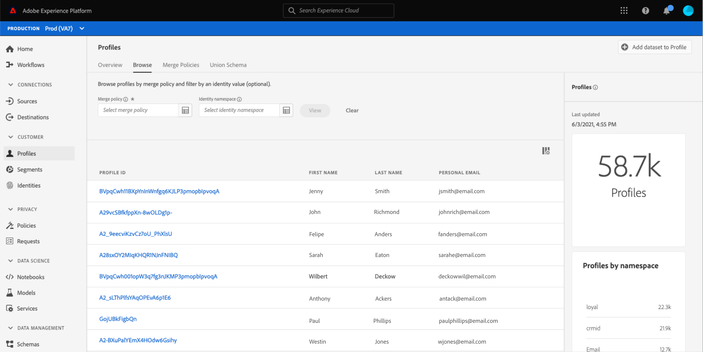
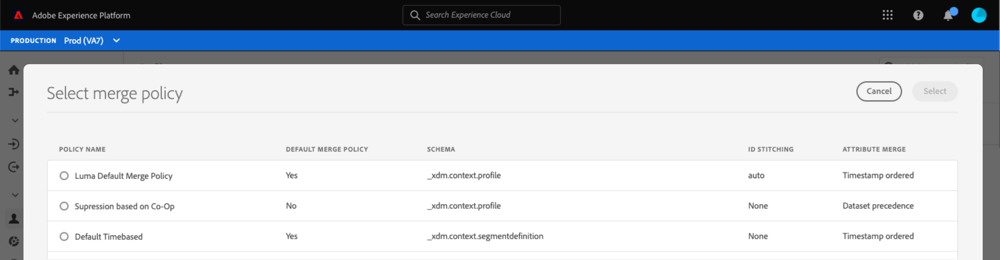
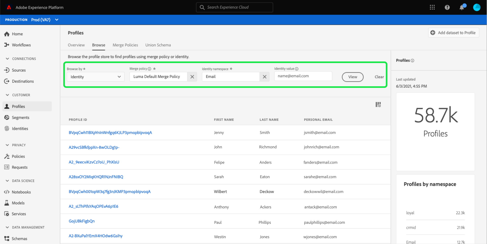

# [!DNL Real-time Customer Profile] Guía de la interfaz de usuario

[!DNL Real-time Customer Profile] crea una vista holística de cada uno de sus clientes individuales, combinando datos de varios canales, incluidos datos en línea, sin conexión, CRM y de terceros. Este documento sirve como guía para interactuar con datos [!DNL Real-time Customer Profile] en la interfaz de usuario (IU) de Adobe Experience Platform.

## Primeros pasos

Esta guía de la interfaz de usuario requiere conocer los distintos [!DNL Experience Platform] servicios relacionados con la administración de [!DNL Real-time Customer Profiles]. Antes de leer esta guía o de trabajar en la interfaz de usuario, revise la documentación de los siguientes servicios:

* [[!DNL Real-time Customer Profile] información general](../home.md): Proporciona un perfil de cliente unificado y en tiempo real basado en datos agregados de varias fuentes.
* [[!DNL Identity Service]](../../identity-service/home.md): Habilita  [!DNL Real-time Customer Profile] mediante el puente de identidades de fuentes de datos dispares a medida que se incorporan en  [!DNL Platform].
* [[!DNL Experience Data Model (XDM)]](../../xdm/home.md): El marco estandarizado mediante el cual se  [!DNL Platform] organizan los datos de experiencia del cliente.

## Información general de 

En la interfaz de usuario del Experience Platform, seleccione **[!UICONTROL Profiles]** en el panel de navegación izquierdo para abrir la pestaña **[!UICONTROL Overview]** que muestra el panel de perfiles.

>[!NOTE]
>
>Si su organización es nueva en Platform y aún no tiene conjuntos de datos de perfil activos o políticas de combinación creadas, el panel [!UICONTROL Perfiles] no está visible. En su lugar, la pestaña [!UICONTROL Información general] muestra vínculos y documentación para ayudarle a empezar con el Perfil del cliente en tiempo real.

### Panel de perfiles {#profile-dashboard}

El panel de perfiles describe las métricas clave relacionadas con los datos de perfil de la organización.

Para obtener más información, consulte la [guía del panel de perfiles](../../dashboards/guides/profiles.md).

##  Métricas de la pestaña Explorar

Seleccione la pestaña **[!UICONTROL Browse]** para mostrar varias métricas relacionadas con los datos de perfil de su organización. También puede utilizar esta ficha para explorar el almacén de perfiles mediante una política de combinación o una identidad, tal como se describe en la siguiente sección de esta guía.

A la derecha de la pestaña **[!UICONTROL Browse]** se encuentra el [profile count](#profile-count), así como una lista de [perfiles por namespace](#profiles-by-namespace).

>[!NOTE]
>
>Estas métricas de perfil pueden variar con respecto a las métricas mostradas en el [panel de perfil](#profile-dashboard) porque se evalúan con la política de combinación predeterminada de su organización. Para obtener más información sobre cómo trabajar con políticas de combinación, incluida cómo definir una directiva de combinación predeterminada, consulte [merge policy overview](../merge-policies/overview.md).

Además de estas métricas, esta sección proporciona una última fecha y hora de actualización, que muestra cuándo se evaluaron las métricas por última vez.

### Recuento de perfiles {#profile-count}

El recuento de perfiles muestra el número total de perfiles que tiene la organización en Experience Platform, después de que la política de combinación predeterminada de la organización haya combinado fragmentos de perfil para formar un único perfil para cada cliente individual. En otras palabras, su organización puede tener varios fragmentos de perfil relacionados con un único cliente que interactúa con su marca a través de diferentes canales, pero estos fragmentos se fusionarían juntos (según la política de combinación predeterminada) y devolverían un recuento de &quot;1&quot; perfil porque todos están relacionados con la misma persona.

El recuento de perfiles también incluye perfiles con atributos (datos de registro) y perfiles que solo contienen datos de series temporales (eventos), como perfiles de Adobe Analytics. El recuento de perfiles se actualiza regularmente para proporcionar un número total actualizado de perfiles dentro de Platform.

#### Actualización de la métrica de recuento de perfiles

Cuando la ingesta de registros en el almacén [!DNL Profile] aumenta o disminuye el recuento en más del 5 %, se activa un trabajo para actualizar el recuento. Para los flujos de trabajo de datos de flujo continuo, se realiza una comprobación cada hora para determinar si se ha alcanzado el umbral de aumento o reducción del 5 %. Si lo ha hecho, se activa automáticamente un trabajo para actualizar el recuento de perfiles. Para la ingesta por lotes, en un plazo de 15 minutos tras la ingesta correcta de un lote en el Almacenamiento de perfiles, si se alcanza el umbral de aumento o disminución del 5 %, se ejecuta un trabajo para actualizar el recuento de perfiles.

### [!UICONTROL Perfiles por área de nombres] {#profiles-by-namespace}

La métrica **[!UICONTROL Perfiles por área de nombres]** muestra el recuento total y el desglose de áreas de nombres en todos los perfiles combinados en el Almacenamiento de perfiles. El número total de perfiles por área de nombres (es decir, sumando los valores mostrados para cada área de nombres) siempre será mayor que la métrica de recuento de perfiles porque un perfil podría tener varias áreas de nombres asociadas. Por ejemplo, si un cliente interactúa con la marca en más de un canal, se asociarán varias áreas de nombres con ese cliente individual.

#### Actualización de la métrica [!UICONTROL Perfiles por área de nombres]

De forma similar a la métrica [recuento de perfiles](#profile-count), cuando la ingesta de registros en el almacén [!DNL Profile] aumenta o disminuye el recuento en más del 5%, se activa un trabajo para actualizar las métricas del área de nombres. Para los flujos de trabajo de datos de flujo continuo, se realiza una comprobación cada hora para determinar si se ha alcanzado el umbral de aumento o reducción del 5 %. Si lo ha hecho, se activa automáticamente un trabajo para actualizar el recuento de perfiles. Para la ingesta por lotes, en un plazo de 15 minutos tras la ingesta correcta de un lote en el almacén [!DNL Profile], si se alcanza el umbral de aumento o disminución del 5 %, se ejecuta un trabajo para actualizar las métricas.

## Utilice la pestaña [!UICONTROL Browse] para ver los perfiles

En la pestaña **[!UICONTROL Browse]** puede ver perfiles de muestra mediante una política de combinación o buscar perfiles específicos utilizando un espacio de nombres y un valor de identidad.

### Examinar por [!UICONTROL Política de combinación]

La pestaña **[!UICONTROL Browse]** está establecida en la directiva de combinación predeterminada para su organización de forma predeterminada. Para elegir una política de combinación diferente, seleccione `X` junto al nombre de la política de combinación y utilice el selector para abrir el cuadro de diálogo **[!UICONTROL Seleccionar política de combinación]**.

>[!NOTE]
>
>Si no hay ninguna política de combinación seleccionada, utilice el botón de selección situado junto al campo **[!UICONTROL Merge policy]** para abrir el cuadro de diálogo de selección.

Para elegir una política de combinación en el cuadro de diálogo **[!UICONTROL Seleccionar política de combinación]**, seleccione el botón de opción situado junto al nombre de la política y, a continuación, utilice **[!UICONTROL Seleccionar]** para volver a la pestaña [!UICONTROL Examinar]. A continuación, puede seleccionar **[!UICONTROL View]** para actualizar los perfiles de muestra y ver un muestreo de perfiles con la nueva política de combinación aplicada.

Los perfiles mostrados representan una muestra de hasta 20 perfiles del almacén de perfiles de su organización, una vez aplicada la política de combinación seleccionada. Los perfiles de muestra de la política de combinación seleccionada se actualizan cuando se agregan nuevos datos al almacén de perfiles de su organización.

Para ver los detalles de uno de los perfiles de ejemplo, seleccione el **[!UICONTROL ID de perfil]**. Para obtener más información, consulte la sección más adelante en esta guía sobre la [visualización de detalles de perfil](#profile-detail).

Para obtener más información sobre las políticas de combinación y su función dentro de Platform, consulte la [información general sobre las políticas de combinación](../merge-policies/overview.md).

### Examinar por [!UICONTROL Identity] {#browse-identity}

En la pestaña **[!UICONTROL Browse]**, puede utilizar un área de nombres de identidad para buscar un perfil específico por un valor de identidad. La navegación por una identidad requiere que proporcione una política de combinación, un área de nombres de identidad y un valor de identidad.

Si es necesario, utilice el selector **[!UICONTROL Merge policy]** para abrir el cuadro de diálogo **[!UICONTROL Select merge policy]** y elija la política de combinación que desea utilizar.

A continuación, utilice el selector **[!UICONTROL Identity namespace]** para abrir el cuadro de diálogo **[!UICONTROL Select identity namespace]** y elija el área de nombres en el que desea buscar. Si su organización tiene muchos espacios de nombres, puede utilizar la barra de búsqueda del cuadro de diálogo para empezar a escribir el nombre de un espacio de nombres.

Puede seleccionar un área de nombres para ver detalles adicionales o seleccionar el botón de opción para elegir un área de nombres. A continuación, puede utilizar **[!UICONTROL Select]** para continuar.

Después de seleccionar un [!UICONTROL espacio de nombres de identidad] y volver a la pestaña [!UICONTROL Browse], puede introducir un **[!UICONTROL valor de identidad]** relacionado con el espacio de nombres seleccionado.

>[!NOTE]
>
>Este valor es específico de un perfil de cliente individual y debe ser una entrada válida para el área de nombres proporcionada. Por ejemplo, seleccionar el área de nombres de identidad &quot;Correo electrónico&quot; requeriría un valor de identidad en forma de dirección de correo electrónico válida.

Una vez introducido un valor, seleccione **[!UICONTROL View]** y se devuelve un solo perfil que coincida con el valor. Seleccione el **[!UICONTROL ID de perfil]** para ver los detalles del perfil.

## Ver detalles de perfil {#profile-detail}

Después de seleccionar un **[!UICONTROL ID de perfil]**, se abre la pestaña **[!UICONTROL Detail]**. La información de perfil mostrada en la pestaña **[!UICONTROL Detail]** se ha combinado desde varios fragmentos de perfil para formar una sola vista del cliente individual. Esto incluye detalles del cliente, como atributos básicos, identidades vinculadas y preferencias de canal.

Los campos predeterminados mostrados también se pueden cambiar en el nivel de organización para mostrar los atributos de perfil preferidos. Para obtener más información sobre la personalización de estos campos, incluidas las instrucciones paso a paso para agregar y eliminar atributos y cambiar el tamaño de los paneles del tablero, consulte la [guía de personalización de detalles del perfil](profile-customization.md).

Puede ver información adicional relacionada con el perfil individual seleccionando otra de las pestañas disponibles. Estas pestañas incluyen atributos, eventos y la pestaña de pertenencia a segmentos que muestra los segmentos para los que el perfil está cualificado actualmente.

## Combinar directivas

En el menú principal **[!UICONTROL Profiles]**, seleccione la pestaña **[!UICONTROL Merge Policies]** para ver una lista de directivas de combinación que pertenecen a su organización. Cada directiva de la lista muestra su nombre, tanto si es la directiva de combinación predeterminada como la clase de esquema a la que se aplica.

Para obtener más información sobre las políticas de combinación, consulte [merge policy overview](../merge-policies/overview.md).

## Esquema de unión {#union-schema}

En el menú principal **[!UICONTROL Profiles]**, seleccione la pestaña **[!UICONTROL Union Schema]** para ver los esquemas de unión disponibles para sus datos introducidos. Un esquema de unión es una combinación de todos los campos [!DNL Experience Data Model] (XDM) de la misma clase, cuyos esquemas se han habilitado para su uso en [!DNL Real-time Customer Profile].

Para obtener más información sobre los esquemas de unión, visite la [guía de la interfaz de usuario del esquema de unión](union-schema.md).

## Pasos siguientes

Al leer esta guía, sabe cómo ver y administrar los datos de perfil de su organización mediante la interfaz de usuario del Experience Platform. Para obtener información sobre cómo trabajar con datos de perfil mediante API de Experience Platform, consulte la [Guía de API de perfil de cliente en tiempo real](../api/overview.md).
