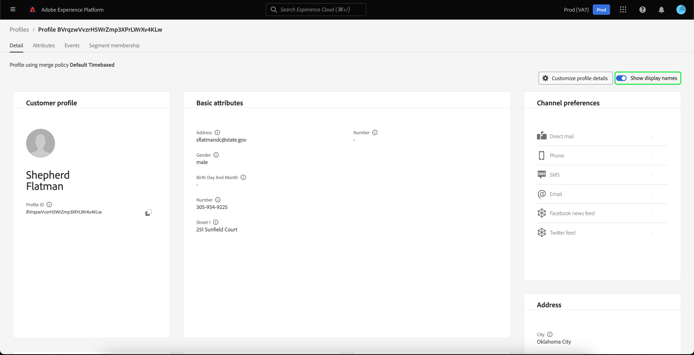

# [!DNL Real-time Customer Profile] Guía de la interfaz de usuario

[!DNL Real-time Customer Profile] crea una vista holística de cada uno de sus clientes individuales, combinando datos de varios canales, incluidos datos en línea, sin conexión, CRM y de terceros. Este documento sirve como guía para interactuar con [!DNL Real-time Customer Profile] en la interfaz de usuario (IU) de Adobe Experience Platform.

## Primeros pasos

Esta guía de la interfaz de usuario requiere conocer las distintas [!DNL Experience Platform] servicios relacionados con la administración [!DNL Real-time Customer Profiles]. Antes de leer esta guía o de trabajar en la interfaz de usuario, revise la documentación de los siguientes servicios:

* [[!DNL Real-time Customer Profile] información general](../home.md): Proporciona un perfil de cliente unificado y en tiempo real basado en datos agregados de varias fuentes.
* [[!DNL Identity Service]](../../identity-service/home.md): Habilitación [!DNL Real-time Customer Profile] al unir identidades de fuentes de datos dispares a medida que se incorporan [!DNL Platform].
* [[!DNL Experience Data Model (XDM)]](../../xdm/home.md): El marco normalizado por el cual [!DNL Platform] organiza los datos de experiencia del cliente.

## Información general de 

En la interfaz de usuario del Experience Platform, seleccione **[!UICONTROL Perfiles]** en el panel de navegación izquierdo para abrir **[!UICONTROL Información general]** que muestra el panel de perfiles.

>[!NOTE]
>
>Si su organización es nueva en Platform y aún no tiene conjuntos de datos de perfil activos o políticas de combinación creadas, se crea la variable [!UICONTROL Perfiles] tablero no está visible. En su lugar, la variable [!UICONTROL Información general] muestra vínculos y documentación para ayudarle a empezar con el Perfil del cliente en tiempo real.

### Panel de perfiles {#profile-dashboard}

El panel de perfiles describe las métricas clave relacionadas con los datos de perfil de la organización.

Para obtener más información, visite [guía del panel de perfiles](../../dashboards/guides/profiles.md).

## [!UICONTROL Examinar] métricas de ficha

Seleccione el **[!UICONTROL Examinar]** para mostrar varias métricas relacionadas con los datos de perfil de su organización. También puede utilizar esta ficha para explorar el almacén de perfiles mediante una política de combinación o una identidad, tal como se describe en la siguiente sección de esta guía.

En el lado derecho del **[!UICONTROL Examinar]** es la [recuento de perfiles](#profile-count) así como una lista de [perfiles por espacio de nombres](#profiles-by-namespace).

>[!NOTE]
>
>Estas métricas de perfil pueden variar con respecto a las métricas mostradas en la variable [panel de perfiles](#profile-dashboard) porque se evalúan utilizando la directiva de combinación predeterminada de su organización. Para obtener más información sobre cómo trabajar con políticas de combinación, incluido cómo definir una directiva de combinación predeterminada, consulte [información general sobre políticas de combinación](../merge-policies/overview.md).

Además de estas métricas, esta sección proporciona una última fecha y hora de actualización, que muestra cuándo se evaluaron las métricas por última vez.

### Recuento de perfiles {#profile-count}

El recuento de perfiles muestra el número total de perfiles que tiene la organización en Experience Platform, después de que la política de combinación predeterminada de la organización haya combinado fragmentos de perfil para formar un único perfil para cada cliente individual. En otras palabras, su organización puede tener varios fragmentos de perfil relacionados con un único cliente que interactúa con su marca a través de diferentes canales, pero estos fragmentos se fusionarían juntos (según la política de combinación predeterminada) y devolverían un recuento de &quot;1&quot; perfil porque todos están relacionados con la misma persona.

El recuento de perfiles también incluye perfiles con atributos (datos de registro) y perfiles que solo contienen datos de series temporales (eventos), como perfiles de Adobe Analytics. El recuento de perfiles se actualiza regularmente para proporcionar un número total actualizado de perfiles dentro de Platform.

#### Actualización de la métrica de recuento de perfiles

Cuando la ingesta de registros en la variable [!DNL Profile] el almacén aumenta o disminuye el recuento en más del 5 %; se activa un trabajo para actualizar el recuento. Para los flujos de trabajo de datos de flujo continuo, se realiza una comprobación cada hora para determinar si se ha alcanzado el umbral de aumento o reducción del 5 %. Si lo ha hecho, se activa automáticamente un trabajo para actualizar el recuento de perfiles. Para la ingesta por lotes, en un plazo de 15 minutos tras la ingesta correcta de un lote en el Almacenamiento de perfiles, si se alcanza el umbral de aumento o disminución del 5 %, se ejecuta un trabajo para actualizar el recuento de perfiles.

### [!UICONTROL Perfiles por área de nombres] {#profiles-by-namespace}

La variable **[!UICONTROL Perfiles por área de nombres]** muestra el recuento y desglose total de áreas de nombres en todos los perfiles combinados en el Almacenamiento de perfiles. El número total de perfiles por área de nombres (es decir, sumando los valores mostrados para cada área de nombres) siempre será mayor que la métrica de recuento de perfiles porque un perfil podría tener varias áreas de nombres asociadas. Por ejemplo, si un cliente interactúa con la marca en más de un canal, se asociarán varias áreas de nombres con ese cliente individual.

#### Actualización del [!UICONTROL Perfiles por área de nombres] métrica

Similar a la variable [recuento de perfiles](#profile-count) al ingerir registros en la [!DNL Profile] el almacén aumenta o disminuye el recuento en más del 5 %; se activa un trabajo para actualizar las métricas del área de nombres. Para los flujos de trabajo de datos de flujo continuo, se realiza una comprobación cada hora para determinar si se ha alcanzado el umbral de aumento o reducción del 5 %. Si lo ha hecho, se activa automáticamente un trabajo para actualizar el recuento de perfiles. Para la ingesta por lotes, en un plazo de 15 minutos tras la ingesta correcta de un lote en la variable [!DNL Profile] En el almacén, si se alcanza el umbral de aumento o disminución del 5 %, se ejecuta un trabajo para actualizar las métricas.

## Uso [!UICONTROL Examinar] ficha para ver perfiles

En el **[!UICONTROL Examinar]** puede ver perfiles de muestra mediante una política de combinación o buscar perfiles específicos utilizando un espacio de nombres y un valor de identidad.

### Examinar por [!UICONTROL Combinar directiva]

La variable **[!UICONTROL Examinar]** está configurada en la directiva de combinación predeterminada para su organización de forma predeterminada. Para elegir una política de combinación diferente, seleccione la `X` junto al nombre de la directiva de combinación y, a continuación, utilice el selector para abrir el **[!UICONTROL Seleccionar política de combinación]** diálogo.

>[!NOTE]
>
>Si no hay ninguna directiva de combinación seleccionada, utilice el botón de selección situado junto al **[!UICONTROL Combinar directiva]** para abrir el cuadro de diálogo de selección.

Para elegir una política de combinación de la **[!UICONTROL Seleccionar política de combinación]** , seleccione el botón de opción situado junto al nombre de la directiva y, a continuación, utilice **[!UICONTROL Select]** para volver a la [!UICONTROL Examinar] pestaña . A continuación, puede seleccionar **[!UICONTROL Ver]** para actualizar los perfiles de muestra y ver un muestreo de perfiles con la nueva política de combinación aplicada.

Los perfiles mostrados representan una muestra de hasta 20 perfiles del almacén de perfiles de su organización, una vez aplicada la política de combinación seleccionada. Los perfiles de muestra de la política de combinación seleccionada se actualizan cuando se agregan nuevos datos al almacén de perfiles de su organización.

Para ver los detalles de uno de los perfiles de muestra, seleccione la opción **[!UICONTROL ID de perfil]**. Para obtener más información, consulte la sección más adelante en esta guía sobre [visualización de detalles de perfil](#profile-detail).

Para obtener más información sobre las políticas de combinación y su función en Platform, consulte la [información general sobre políticas de combinación](../merge-policies/overview.md).

### Examinar por [!UICONTROL Identidad] {#browse-identity}

En el **[!UICONTROL Examinar]** , puede utilizar un área de nombres de identidad para buscar un perfil específico por un valor de identidad. La navegación por una identidad requiere que proporcione una política de combinación, un área de nombres de identidad y un valor de identidad.

Si es necesario, use la variable **[!UICONTROL Combinar directiva]** para abrir el **[!UICONTROL Seleccionar política de combinación]** y seleccione la política de combinación que desee utilizar.

A continuación, utilice el **[!UICONTROL Área de nombres de identidad]** para abrir el **[!UICONTROL Seleccionar área de nombres de identidad]** y elija el espacio de nombres que desea buscar. Si su organización tiene muchos espacios de nombres, puede utilizar la barra de búsqueda del cuadro de diálogo para empezar a escribir el nombre de un espacio de nombres.

Puede seleccionar un área de nombres para ver detalles adicionales o seleccionar el botón de opción para elegir un área de nombres. A continuación, puede usar **[!UICONTROL Select]** para continuar.

Después de seleccionar una [!UICONTROL Área de nombres de identidad] y volviendo al [!UICONTROL Examinar] , puede especificar una **[!UICONTROL Valor de identidad]** relacionado con el espacio de nombres que ha seleccionado.

>[!NOTE]
>
>Este valor es específico de un perfil de cliente individual y debe ser una entrada válida para el área de nombres proporcionada. Por ejemplo, seleccionar el área de nombres de identidad &quot;Correo electrónico&quot; requeriría un valor de identidad en forma de dirección de correo electrónico válida.

Una vez introducido un valor, seleccione **[!UICONTROL Ver]** y se devuelve un solo perfil que coincide con el valor . Seleccione el **[!UICONTROL ID de perfil]** para ver los detalles del perfil.

## Ver detalles de perfil {#profile-detail}

Después de seleccionar una **[!UICONTROL ID de perfil]**, el **[!UICONTROL Detalle]** se abre. La información de perfil mostrada en la variable **[!UICONTROL Detalle]** se ha combinado desde varios fragmentos de perfil para formar una sola vista del cliente individual. Esto incluye detalles del cliente, como atributos básicos, identidades vinculadas y preferencias de canal.

Los campos predeterminados mostrados también se pueden cambiar en el nivel de organización para mostrar los atributos de perfil preferidos. Para obtener más información sobre la personalización de estos campos, incluidas las instrucciones paso a paso para añadir y eliminar atributos y cambiar el tamaño de los paneles del panel, lea la [guía de personalización de detalles de perfil](profile-customization.md).

Puede ver información adicional relacionada con el perfil de cliente individual seleccionando otra de las pestañas disponibles. Estas pestañas incluyen atributos, eventos y la pestaña de pertenencia a segmentos que muestra los segmentos para los que el perfil está cualificado actualmente.

### Ficha Atributos

La variable **[!UICONTROL Atributos]** proporciona una vista de lista que resume todos los atributos relacionados con un solo perfil, una vez aplicada la política de combinación especificada.

Estos atributos también pueden verse como un objeto JSON seleccionando **[!UICONTROL Ver JSON]**. Esto resulta útil para los usuarios que deseen comprender mejor cómo se introducen los atributos de perfil en Platform.

### Ficha Eventos

La variable **[!UICONTROL Eventos]** contiene datos de los 100 ExperienceEvents más recientes asociados al cliente. Estos datos pueden incluir aperturas de correo electrónico, actividades del carro de compras y vistas de páginas. Selección **[!UICONTROL Ver todo]** para cualquier evento individual, proporciona campos y valores adicionales que se capturan como parte del evento.

Los eventos también pueden verse como un objeto JSON seleccionando **[!UICONTROL Ver JSON]**. Esto resulta útil para comprender cómo se capturan los eventos en Platform.

### Pestaña Pertenencia a segmentos

La variable **[!UICONTROL Pertenencia a segmentos]** muestra una lista con el nombre y la descripción de los segmentos a los que pertenece actualmente el perfil de cliente individual. Esta lista se actualiza automáticamente a medida que el perfil se califica o caduca a partir de los segmentos. El recuento total de segmentos para los que el perfil está cualificado actualmente se muestra en la parte derecha de la pestaña .

Para obtener más información sobre la segmentación en Experience Platform, consulte la [Documentación del servicio de segmentación del Experience Platform de Adobes](../../segmentation/home.md).

## Combinar directivas

Desde el principal **[!UICONTROL Perfiles]** seleccione **[!UICONTROL Combinar directivas]** para ver una lista de directivas de combinación pertenecientes a su organización. Cada directiva de la lista muestra su nombre, tanto si es la directiva de combinación predeterminada como la clase de esquema a la que se aplica.

Para obtener más información sobre las directivas de combinación, consulte la [información general sobre políticas de combinación](../merge-policies/overview.md).

## Esquema de unión {#union-schema}

Desde el principal **[!UICONTROL Perfiles]** seleccione **[!UICONTROL Esquema de unión]** para ver los esquemas de unión disponibles para sus datos introducidos. Un esquema de unión es una amalgama de todos [!DNL Experience Data Model] (XDM) campos de la misma clase, cuyos esquemas se han habilitado para su uso en [!DNL Real-time Customer Profile].

Para obtener más información sobre los esquemas de unión, visite la [guía de la interfaz de usuario del esquema de unión](union-schema.md).

## Pasos siguientes

Al leer esta guía, sabe cómo ver y administrar los datos de perfil de su organización mediante la interfaz de usuario del Experience Platform. Para obtener información sobre cómo trabajar con datos de perfil mediante API de Experience Platform, consulte la [Guía de la API del perfil del cliente en tiempo real](../api/overview.md).
