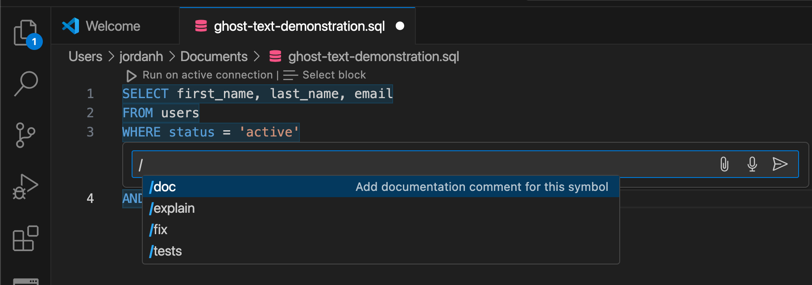

# Conectar [!DNL GitHub Copilot] y [!DNL Visual Studio Code] al servicio de consultas

>[!IMPORTANT]
>
>Antes de utilizar esta herramienta integrada, debe comprender qué datos se comparten con GitHub. Los datos compartidos incluyen información contextual sobre el código y los archivos que se están editando (&quot;indicadores&quot;) y detalles sobre las acciones del usuario (&quot;datos de participación del usuario&quot;).  Revise la declaración de privacidad de [[!DNL GitHub Copilot]](https://docs.github.com/en/site-policy/privacy-policies/github-general-privacy-statement#github-privacy-statement) para obtener más información sobre los datos que recopilan. También debe tener en cuenta las implicaciones de seguridad de la participación en servicios de terceros, ya que es responsable de garantizar el cumplimiento de las políticas de gobernanza de datos de su organización. Adobe no se responsabiliza por cualquier preocupación o problema relacionado con los datos que pueda surgir del uso de esta herramienta. Consulte la documentación de GitHub para obtener más información.

[!DNL GitHub Copilot], con tecnología OpenAI Codex, es una herramienta impulsada por IA que mejora su experiencia de codificación al sugerir fragmentos de código y funciones completas directamente dentro de su editor. Integrado con [!DNL Visual Studio Code] ([!DNL VS Code]), [!DNL Copilot] puede acelerar significativamente el flujo de trabajo, especialmente cuando se trabaja con consultas complejas. Siga esta guía para aprender a conectar [!DNL GitHub Copilot] y [!DNL VS Code] al servicio de consultas para escribir y administrar las consultas con mayor eficacia. Para obtener más información sobre [!DNL Copilot], visite la [página de productos Copilot de GitHub](https://github.com/pricing) y la [documentación oficial [!DNL Copilot] 5}.](https://docs.github.com/en/copilot/about-github-copilot/what-is-github-copilot)

Este documento describe los pasos necesarios para conectar [!DNL GitHub Copilot] y [!DNL VS Code] con Adobe Experience Platform Query Service.

## Introducción  {#get-started}

Esta guía requiere que ya tenga acceso a una cuenta de GitHub y que se haya registrado en [!DNL GitHub Copilot]. Puede [registrarse en el sitio web de GitHub](https://github.com/github-copilot/signup). También necesita [!DNL VS Code]. Puedes [descargar [!DNL VS Code] desde su sitio web oficial](https://code.visualstudio.com/download).

Una vez que haya instalado [!DNL VS Code] y activado su suscripción a [!DNL Copilot], adquiera sus credenciales de conexión para Experience Platform. Estas credenciales se encuentran en la ficha [!UICONTROL Credentials] del área de trabajo de [!UICONTROL Queries] en la interfaz de usuario de Experience Platform. Lea la guía de credenciales de [para obtener información sobre cómo encontrar estos valores en la interfaz de usuario de Experience Platform](../ui/credentials.md). Póngase en contacto con el administrador de su organización si actualmente no tiene acceso al área de trabajo [!UICONTROL Consultas].

### Extensiones [!DNL Visual Studio Code] requeridas {#required-extensions}

Se requieren las siguientes extensiones [!DNL Visual Studio Code] para administrar y consultar de forma eficaz las bases de datos SQL de Experience Platform directamente en el editor de código. Descargue e instale estas extensiones.

- [SQLTools](https://marketplace.visualstudio.com/items?itemName=mtxr.sqltools): utilice la extensión SQLTools para administrar y consultar varias bases de datos SQL. Incluye funciones como un ejecutor de consultas, un formateador SQL y un explorador de conexiones, con compatibilidad con controladores adicionales para aumentar la productividad del desarrollador. Lea la información general sobre Visual Studio Marketplace para obtener más detalles.
- [Controlador PostgreSQL/Cockroach de SQLTools](https://marketplace.visualstudio.com/items?itemName=mtxr.sqltools-driver-pg): Esta extensión le permite conectar, consultar y administrar bases de datos PostgreSQL y CockroachDB directamente en el editor de código.

Las siguientes extensiones habilitan [!DNL GitHub Copilot] y sus características de chat.

- [[!DNL GitHub Copilot]](https://marketplace.visualstudio.com/items?itemName=GitHub.copilot): proporciona sugerencias de codificación en línea a medida que escribe.
- [[!DNL GitHub Copilot] Chat](https://marketplace.visualstudio.com/items?itemName=GitHub.copilot-chat): una extensión complementaria que proporciona asistencia de inteligencia artificial aplicada a la conversación.

## Crear conexión {#create-connection}

Seleccione el icono del cilindro () en el panel de navegación izquierdo de [!DNL VS Code], seguido de **[!DNL Add New Connection]** o el icono de cilindro más ().

Aparece **[!DNL Connection Assistant]**. Seleccione el controlador de base de datos **[!DNL PostgreSQL]**.

![Página de configuración de SQLTools en [!DNL VS Code] con PostgreSQl resaltado.](../images/clients/github-copilot/postgres-database-driver.png)

### Configuración de conexión de entrada {#input-connection-settings}

Aparecerá la vista [!DNL Connection Settings]. Escriba las credenciales de conexión de Experience Platform en los campos apropiados de SQLTools [!DNL Connection Assistant]. Los valores requeridos se explican en la tabla siguiente.

| Propiedad | Descripción |
| --- |--- |
| [!DNL Connection name] | Proporcione un &quot;[!DNL Connection name]&quot; como `Prod_MySQL_Server` que sea descriptivo y que indique claramente su propósito (por ejemplo, un entorno de producción para un servidor MySQL). Las prácticas recomendadas incluyen: <ul><li>Siga las convenciones de nomenclatura de su organización para asegurarse de que sea único dentro del sistema.</li><li>Mantenga la concisión para mantener la claridad y evitar confusiones con otras conexiones.</li><li>Incluya detalles relevantes acerca de la función o el entorno de la conexión en el nombre.</li></ul> |
| [!DNL Connect using] | Utilice la opción **[!DNL Server and Port]** para especificar la dirección del servidor (nombre de host) y el número de puerto para establecer una conexión directa con Experience Platform |
| [!DNL Server address] | Escriba el valor **[!UICONTROL Host]** proporcionado en las credenciales de Experience Platform Postgres, como `acmeprod.platform-query.adobe.io`. |
| [!DNL Port] | Este valor suele ser `80` para los servicios de Experience Platform. |
| [!DNL Database] | Escriba el valor **[!UICONTROL Database]** proporcionado en sus credenciales de Experience Platform Postgres, como `prod:all`. |
| [!DNL Username] | Esta propiedad hace referencia a su ID de organización de. Introduzca el valor **[!UICONTROL Username]** proporcionado en sus credenciales de Experience Platform Postgres. |
| [!DNL Password] | Esta propiedad es su token de acceso. Escriba el valor **[!UICONTROL Password]** proporcionado en las credenciales de Experience Platform Postgres. |

A continuación, seleccione **[!DNL Use Password]**, seguido de **[!DNL Save as plaintext in settings]** en el menú desplegable que aparece. Aparece el campo [!DNL Password]. Utilice este campo de entrada de texto para introducir el token de acceso.

Finalmente, para habilitar SSL, seleccione el campo de entrada [!DNL SSL] y elija [!DNL Enabled] en el menú desplegable que aparece.

>[!TIP]
>
>Una vez que haya introducido todas las credenciales, puede probar la conexión antes de guardarla. Desplácese hacia abajo hasta la parte inferior del área de trabajo y seleccione **[!DNL Test Connection]**.
>
>{width="100" zoomable="yes"}

Una vez que haya escrito correctamente los detalles de la conexión, seleccione **[!DNL Save Connection]** para confirmar la configuración.

Aparecerá la vista [!DNL Review connection details] y se mostrarán las credenciales de conexión. Cuando esté seguro de que los detalles de la conexión son correctos, seleccione **[!DNL Connect Now]**.

Su área de trabajo [!DNL VS Code] aparece con una sugerencia de [!DNL GitHub Copilot].

![Sesión SQL conectada en [!DNL VS Code].](../images/clients/github-copilot/connected.png)

## Guía rápida de [!DNL GitHub Copilot]

Una vez que se haya conectado a su instancia de Experience Platform, puede usar [!DNL Copilot] como asistente de codificación de IA para ayudarle a escribir código de forma más rápida y con más confianza. Esta sección describe sus funciones principales y cómo utilizarlas.

## Introducción a [!DNL GitHub Copilot] {#get-started-with-copilot}

Primero, asegúrese de que tiene instalada la versión más reciente de [!DNL VS Code]. Una versión [!DNL VS Code] obsoleta puede impedir que las características de la clave [!DNL Copilot] funcionen según lo previsto. A continuación, asegúrese de que la configuración [!DNL Enable Auto Completions] esté habilitada. Si [!DNL Copilot] se está ejecutando correctamente, el icono **[!DNL Copilot]** () aparecerá en la barra de estado (si hay un problema, en su lugar se mostrará el icono de error [!DNL Copilot]). Seleccione el icono **[!DNL Copilot]** para abrir el menú [!DNL [!DNL GitHub Copilot]]. En el menú **[!DNL [!DNL GitHub Copilot]]**, seleccione **[!DNL Edit Settings]**

![Editor de [!DNL VS Code] con [!DNL GitHub Copilot Menu] mostrado y el icono [!DNL Copilot] y Editar configuración resaltados.](../images/clients/github-copilot/github-copilot-menu.png)

Desplácese hacia abajo por las opciones y compruebe que la casilla de verificación está habilitada para la configuración [!DNL Enable Auto Completions].

![Panel de configuración de [!DNL GitHub Copilot] con la casilla de verificación Habilitar finalizaciones automáticas seleccionada y resaltada.](../images/clients/github-copilot/enable-auto-completions.png)

## Finalizaciones de código {#code-completions}

Una vez que instala la extensión [!DNL GitHub Copilot] e inicia sesión, se activa automáticamente una característica denominada **Texto fantasma**, que sugiere que el código se complete mientras escribe. Estas sugerencias le ayudan a escribir código de forma más eficaz y con menos interrupciones. También puede utilizar comentarios para guiar las sugerencias de código de IA. Esto significa que los usuarios no técnicos pueden convertir voz sin formato en código para explorar sus datos.

![Se ha resaltado la interfaz de usuario de VSCode con una sugerencia de código y el icono [!DNL GitHub Copilot].](../images/clients/github-copilot/ghost-text.png)

>[!TIP]
>
>Si desea deshabilitar [!DNL Copilot] para un archivo o idioma específico, seleccione el icono en la barra de estado y desactívelo.

### Aceptar sugerencias de texto fantasma completas o parciales {#accept-suggestions}

Cuando [!DNL GitHub Copilot] sugiere que el código se complete, puede aceptar sugerencias parciales o completas. Seleccione **Tab** para aceptar toda la sugerencia o mantenga presionada la tecla **Control (o Comando en Mac)** y presione la **flecha derecha** para aceptar texto parcial. Para rechazar una sugerencia, presione **Escape**.

>[!TIP]
>  
>Si no recibe sugerencias, asegúrese de que [[!DNL Copilot] esté habilitado en el idioma del archivo](#get-started-with-copilot).

![El editor [!DNL VS Code] muestra una sugerencia de texto gris tenue de [!DNL GitHub Copilot] como texto fantasma junto a código parcialmente escrito.](../images/clients/github-copilot/accept-partial-suggestions.png)

### Sugerencias alternativas {#alternative-suggestions}

Para recorrer las sugerencias de código alternativo, seleccione las flechas en el cuadro de diálogo [!DNL Copilot].

![Editor de [!DNL VS Code] que muestra el panel Sugerencias alternativas de Copilot.](../images/clients/github-copilot/code-suggestions.png)

## Usar el chat en línea {#inline-chat}

También puede chatear con [!DNL Copilot] directamente acerca de su código. Use **Control (o Comando) + I** para almacenar en déclencheur el cuadro de diálogo de chat en línea. Esta función se utiliza para repetir el código y refinar las sugerencias en contexto. Puede resaltar un bloque de código y utilizar un chat en línea para ver una solución diferente propuesta por la IA antes de aceptarla.

<!-- THis section is poss unnecessary:
There are inline features for chat including doc, expalin, fix and test

 -->

## Vista de chat dedicada {#dedicated-chat}

Puede utilizar una interfaz de chat más tradicional con una barra lateral de chat dedicada para formar ideas y estrategias, resolver problemas de codificación y discutir detalles de implementación. Seleccione el icono de chat () en la barra lateral [!DNL VS Code] para abrir una ventana de chat dedicada.

![Barra lateral de chat de [!DNL GitHub Copilot] con el icono de chat resaltado.](../images/clients/github-copilot/chat-sidebar.png)

También puede acceder al historial de chat seleccionando el icono del historial () en la parte superior del panel de chat.

## Pasos siguientes

Ahora está listo para consultar de manera eficiente sus bases de datos de Experience Platform directamente desde su editor de código y usar las sugerencias de código con tecnología de IA de [!DNL GitHub Copilot] para agilizar la escritura y optimizar las consultas SQL. Para obtener más información sobre cómo escribir y ejecutar consultas, consulte las [instrucciones para la ejecución de consultas](../best-practices/writing-queries.md).
