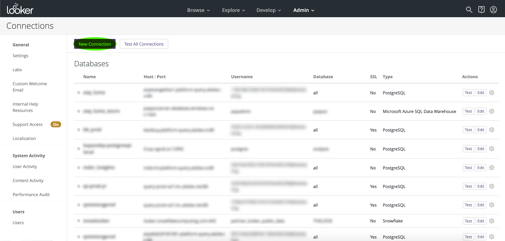

# [!DNL Looker]

Este documento cubre los pasos para conectar [!DNL Looker] con Adobe Experience Platform [!DNL Query Service].

>[!NOTE]
>
> En esta guía se asume que ya tiene acceso a [!DNL Looker] y que está familiarizado con cómo navegar por su interfaz. Puede encontrar más información sobre [!DNL Looker] en la [documentación oficial [!DNL Looker] ](https://docs.looker.com/).

## Conectar [!DNL Looker] con plataforma

Después de iniciar sesión en [!DNL Looker], seleccione **[!DNL Admin]**, seguido de **[!DNL Connections]**.

En esta página, seleccione **[!DNL New Connection]**.

Desde aquí puede completar los detalles de la configuración de conexión.

- **[!DNL Name]:** El nombre de la conexión.
- **[!DNL Dialect]:** El dialecto utilizado para la base de datos SQL. [!DNL Query Service] usa  **[!DNL PostgreSQL]**.
- **[!DNL Host and Port]:** El punto final del host y su puerto para  [!DNL Query Service].
- **[!DNL Database]:** La base de datos que se utilizará.
- **[!DNL Username and Password]:** Las credenciales de inicio de sesión que se utilizarán. El nombre de usuario tendrá la forma `ORG_ID@AdobeOrg`.

>[!NOTE]
>
>Para obtener más información sobre cómo encontrar el host y el puerto, el nombre de la base de datos y las credenciales de inicio de sesión, visite la [página de credenciales en la plataforma](https://platform.adobe.com/query/configuration). Para encontrar sus credenciales, inicie sesión en [!DNL Platform] y luego seleccione **[!UICONTROL Consultas]**, seguido de **[!UICONTROL Credenciales]**.

Después de introducir los detalles de conexión, seleccione **[!DNL Test These Settings]** para asegurarse de que las credenciales funcionan correctamente. Si lo hacen, a continuación aparecerá un mensaje que indica que puede conectarse. Si la conexión es correcta, seleccione **[!DNL Add Connection]** para crear la conexión.

## Pasos siguientes

Ahora que se ha conectado con [!DNL Query Service], puede utilizar [!DNL Looker] para escribir consultas. Para obtener más información sobre cómo escribir y ejecutar consultas, lea la [guía de consultas en ejecución](../best-practices/writing-queries.md).