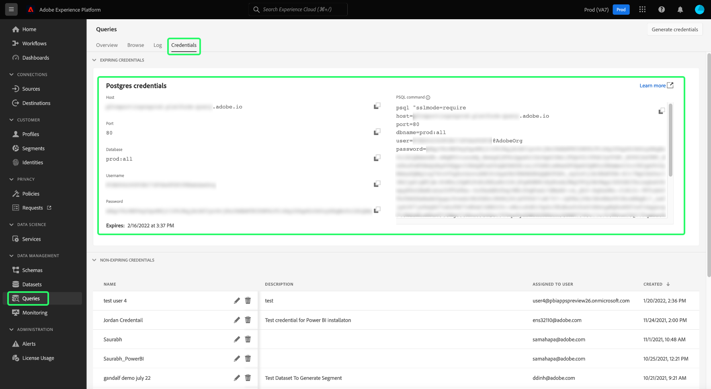

# Conectar [!DNL Power BI] al servicio de consultas

Este documento describe los pasos para conectar el escritorio [!DNL Power BI] con el servicio de consultas de Adobe Experience Platform.

## Introducción

Esta guía requiere que ya tenga acceso a la aplicación de escritorio [!DNL Power BI] y que esté familiarizado con la forma de navegar por su interfaz. Para descargar el escritorio [!DNL Power BI] o para obtener más información, consulte la [documentación oficial [!DNL Power BI] 3}.](https://docs.microsoft.com/en-us/power-bi/)

>[!IMPORTANT]
>
> La aplicación de escritorio [!DNL Power BI] es **solamente** disponible en dispositivos Windows.

Para adquirir las credenciales necesarias para conectar [!DNL Power BI] al Experience Platform, debe tener acceso al área de trabajo Consultas en la interfaz de usuario de Platform. Póngase en contacto con el administrador de su organización si actualmente no tiene acceso al área de trabajo de consultas.

## Conectar [!DNL Power BI] al servicio de consultas {#connect-power-bi}

Para conectar a [!DNL Power BI] al servicio de consultas, abra [!DNL Power BI] y seleccione **[!DNL Get Data]** en la banda superior del menú. A continuación, escriba &quot;[!DNL PostgreSQL]&quot; en la barra de búsqueda para reducir la lista de orígenes de datos. De los resultados que aparecen, seleccione **[!DNL PostgreSQL database]**, seguido de **[!DNL Connect]**.

Aparecerá el cuadro de diálogo de la base de datos [!DNL PostgreSQL], en el que se solicitarán valores para el servidor y la base de datos. Encontrará instrucciones adicionales sobre cómo [conectarse a una base de datos PostgreSQL desde Power Query Desktop](https://learn.microsoft.com/en-us/power-query/connectors/postgresql#connect-to-a-postgresql-database-from-power-query-desktop) en la documentación oficial de [!DNL PowerBI].

Estos valores necesarios se toman de las credenciales de Adobe Experience Platform. Para encontrar sus credenciales, inicie sesión en la interfaz de usuario de Platform y seleccione **[!UICONTROL Consultas]** en el panel de navegación izquierdo, seguido de **[!UICONTROL Credenciales]**. Para obtener más información sobre cómo encontrar el nombre de la base de datos, el host, el puerto y las credenciales de inicio de sesión, lea la [guía de credenciales](../ui/credentials.md).

>[!IMPORTANT]
>
>Como usuario de Power BI o Tableau, puede conectarse con Customer Journey Analytics a sus herramientas de BI desde la pestaña de credenciales del servicio de consulta. Consulte la documentación de credenciales para obtener instrucciones sobre cómo [conectar las herramientas de BI al Customer Journey Analytics](../ui/credentials.md#connect-to-customer-journey-analytics).

En el campo **[!DNL Server]** del cuadro de diálogo [!DNL PostgreSQL database], escriba el valor para el host encontrado en la sección [!UICONTROL Credenciales] del servicio de consulta. Para la producción, agregue el puerto `:80` al final de la cadena de host. Por ejemplo, `made-up.platform-query.adobe.io:80`.

El campo **[!DNL Database]** puede ser &quot;todo&quot; o un nombre de tabla de conjunto de datos. Por ejemplo, `prod:all`.

>[!IMPORTANT]
>
>Las estructuras de datos anidadas en herramientas de BI de terceros se pueden aplanar para mejorar su facilidad de uso y reducir la carga de trabajo necesaria para recuperar, analizar, transformar y crear informes de datos. Consulte la documentación sobre la característica [`FLATTEN` ](../key-concepts/flatten-nested-data.md) para obtener instrucciones sobre cómo activar esta configuración al conectarse a una base de datos.

### Modo de conectividad de datos {#data-connectivity-mode}

A continuación, puede seleccionar su **[!DNL Data Connectivity mode]**. En el cuadro de diálogo [!DNL PostgreSQL database], seleccione **[!DNL Import]** seguido de **[!DNL OK]** para mostrar una lista de todas las tablas disponibles, o bien seleccione **[!DNL DirectQuery]** para consultar el origen de datos directamente sin importar ni copiar datos directamente en [!DNL Power BI].

Para obtener más información acerca del modo **[!DNL Import]**, lea la sección sobre [importación de una tabla](#import). Para obtener más información acerca del modo **[!DNL DirectQuery]**, lea la sección sobre [consultar un conjunto de datos sin importar datos](#direct-query).

Seleccione **[!DNL OK]** después de confirmar los detalles de la base de datos.

### Autenticación {#authentication}

Después de confirmar el modo de conectividad de datos, aparece un mensaje en el que se solicita la configuración del nombre de usuario, la contraseña y la aplicación. En este caso, el nombre de usuario es su ID de organización y la contraseña es su token de autenticación. Ambos se encuentran en la página de credenciales del servicio de consulta.

Complete estos detalles y, a continuación, seleccione **[!DNL Connect]** para continuar con el paso siguiente.

## Importar una tabla {#import}

Al seleccionar **[!DNL Import]** [!DNL Data Connectivity mode], se importa el conjunto de datos completo, lo que le permite utilizar las tablas y columnas seleccionadas dentro de la aplicación de escritorio [!DNL Power BI] tal cual.

>[!IMPORTANT]
>
>Para ver los cambios de datos que se han producido desde la importación inicial, debe actualizar los datos dentro de [!DNL Power BI] importando de nuevo el conjunto de datos completo.

Para importar una tabla, escriba los detalles del servidor y la base de datos [tal como se ha descrito anteriormente](#connect-power-bi) y seleccione **[!DNL Import]** [!DNL Data Connectivity mode], seguido de **[!DNL OK]**. Aparece el cuadro de diálogo [!DNL Navigator], que muestra una lista de todas las tablas disponibles. Seleccione la tabla que desee previsualizar, seguida de **[!DNL Load]** para introducir el conjunto de datos en Power BI. La tabla ahora se ha importado a [!DNL Power BI].

[Encontrará información general sobre cómo conectarse a los datos en la aplicación PowerBi de escritorio](https://learn.microsoft.com/en-us/power-bi/connect-data/desktop-quickstart-connect-to-data#connect-to-data) en la documentación oficial.

### Importar tablas mediante SQL personalizado

[!DNL Power BI] y otras herramientas de terceros como [!DNL Tableau] no permiten actualmente a los usuarios importar objetos anidados, como objetos XDM en Platform. Para tener en cuenta esto, [!DNL Power BI] le permite utilizar SQL personalizado para acceder a estos campos anidados y crear una vista aplanada de los datos. [!DNL Power BI] carga esta vista aplanada de los datos anidados anteriormente como una tabla normal.

En el cuadro de diálogo [!DNL PostgreSQL database], seleccione **[!DNL Advanced options]** para introducir una consulta SQL personalizada en la sección **[!DNL SQL statement]**. Esta consulta personalizada debe utilizarse para acoplar los pares de nombre-valor de JSON a un formato de tabla. La documentación oficial también proporciona información sobre cómo [conectar PowerBI mediante una instrucción SQL en las opciones avanzadas](https://learn.microsoft.com/en-us/power-query/connectors/postgresql#connect-using-advanced-options).

Una vez que haya especificado la consulta personalizada, seleccione **[!DNL OK]** para continuar con la conexión de la base de datos. Consulte la sección [authentication](#authentication) anterior para obtener instrucciones sobre cómo conectar una base de datos desde esta parte del flujo de trabajo.

Una vez finalizada la autenticación, aparecerá una vista previa de los datos acoplados en el tablero de escritorio [!DNL Power BI] como una tabla. El nombre del servidor y la base de datos se muestran en la parte superior del cuadro de diálogo. Seleccione **[!DNL Load]** para completar el proceso de importación.

Las visualizaciones ya están disponibles para su edición y exportación desde la aplicación de escritorio [!DNL Power BI].

## Consultar el conjunto de datos sin importar datos {#direct-query}

**[!DNL DirectQuery]** [!DNL Data Connectivity mode] consulta el origen de datos directamente sin importar ni copiar datos en el escritorio [!DNL Power BI]. Con este modo de conexión, puede actualizar todas las visualizaciones con datos actuales a través de la interfaz de usuario. Sin embargo, el tiempo necesario para producir o actualizar la visualización variará según el rendimiento del origen de datos subyacente.

Encontrará más información sobre [el uso de [!DNL DirectQuery]](https://learn.microsoft.com/en-us/power-bi/connect-data/desktop-use-directquery), así como una explicación detallada sobre sus [opciones de conectividad, casos de uso y limitaciones](https://learn.microsoft.com/en-us/power-bi/connect-data/desktop-directquery-about) en la documentación oficial de [!DNL PowerBI].

Para usar este(a) [!DNL Data Connectivity mode], seleccione la opción **[!DNL DirectQuery]** y después **[!DNL Advanced options]** para escribir una consulta SQL personalizada en la sección **[!DNL SQL statement]**. Asegúrese de que **[!DNL Include relationship columns]** esté seleccionado. Una vez que haya completado la consulta, seleccione **[!DNL OK]** para continuar.

Aparecerá una vista previa de la consulta. Seleccione **[!DNL Load]** para ver los resultados de la consulta.

## Pasos siguientes

Al leer este documento, debería haber comprendido cómo conectarse a la aplicación de escritorio [!DNL Power BI] y los diferentes modos de conexión de datos disponibles. Para obtener más información sobre cómo escribir y ejecutar consultas, consulte las [instrucciones para la ejecución de consultas](../best-practices/writing-queries.md).
