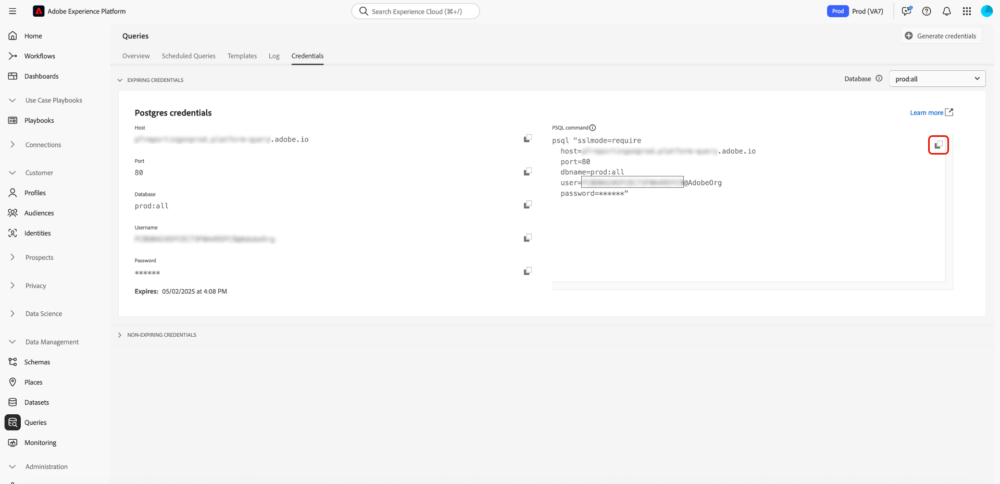

# Conectar PSQL al servicio de consultas

PSQL es una interfaz de línea de comandos instalada junto con PostgreSQL en el equipo. Este documento describe los pasos para conectar PSQL con Adobe Experience Platform Query Service.

>[!IMPORTANT]
>
>El servicio de consultas solo admite la conexión con PSQL versión 14.x. Las versiones anteriores a 14.x (como 10.x a 13.x) y las versiones posteriores (15.x y posteriores) no son compatibles oficialmente. Asegúrese de que ha instalado una versión de cliente compatible. Como referencia, consulte las [Fechas de finalización de la vida útil de PostgreSQL](https://endoflife.date/postgresql).

Antes de empezar, asegúrese de que tiene acceso a PSQL y familiaridad básica con el uso del cliente. Encontrará más información sobre PSQL en la [documentación oficial de PSQL](https://www.postgresql.org/docs/current/app-psql.html).

>[!IMPORTANT]
>
>Al descargar PostgreSQL, asegúrese de seleccionar la versión 14.x. De forma predeterminada, el sitio web PostgreSQL ofrece la versión más reciente, que puede no ser compatible con el servicio de consulta.

Una vez instalado PSQL, puede conectarlo al servicio de consultas. Vuelva a la interfaz de usuario de Experience Platform y, a continuación, seleccione **[!UICONTROL Consultas]**, seguidas de **[!UICONTROL Credenciales]**.

En la sección **[!UICONTROL Comando PSQL]**, seleccione el icono **[!UICONTROL Copiar al portapapeles]** () para copiar la cadena de comandos.



Pegue la cadena de comando en el terminal y presione **Enter** en el teclado.

>[!IMPORTANT]
>
>Si está en un equipo, utilice un editor de texto para eliminar los saltos de línea en la cadena de comando y, a continuación, copie la cadena. Si usa la versión 12.0 o superior de, deberá agregar `PGGSSENCMODE=disable` a la cadena de conexión. Esta configuración deshabilita el cifrado GSSAPI, que no es necesario para las conexiones al servicio de consultas y puede causar errores de conexión.<br>Además, si usa credenciales que no caducan, asegúrese de reemplazar el campo de contraseña por la contraseña de credencial que no caduca. Para obtener más información sobre las credenciales que no caducan, lea la [guía de credenciales](../ui/credentials.md).

Debería ver un resultado como este:

```shell
psql (14.4, server 0.1.0)
SSL connection (protocol: TLSv1.2, cipher: ECDHE-RSA-AES256-GCM-SHA384, bits: 256, compression: off)
Type "help" for help.
all=>
```

Si no ve la versión 14.x, descargue e instale una versión 14.x compatible de PSQL desde la [página oficial de descargas de PostgreSQL](https://www.postgresql.org/download/).

>[!NOTE]
>
>Siga las instrucciones de instalación del sistema operativo y, a continuación, compruebe la versión de PSQL instalada ejecutando `psql --version` en el terminal.

## Pasos siguientes

Ahora que se ha conectado con el servicio de consultas, puede utilizar PSQL para escribir consultas. Consulte la guía [ejecución de consultas](../best-practices/writing-queries.md) para obtener más información.
