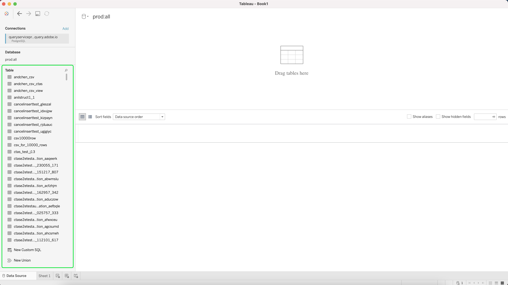

# Conectar [!DNL Tableau] al servicio de Consulta

Este documento cubre los pasos para conectar Tableau con Adobe Experience Platform [!DNL Query Service].

>[!NOTE]
>
> En esta guía se asume que ya tiene acceso a [!DNL Tableau] y que está familiarizado con cómo navegar por su interfaz. Puede encontrar más información sobre [!DNL Tableau] en la [documentación oficial [!DNL Tableau] ](https://help.tableau.com/current/pro/desktop/en-us/default.htm).

Para conectar [!DNL Tableau] con [!DNL Query Service], abra [!DNL Tableau] y, en la sección **[!DNL To a Server]**, seleccione **[!DNL More]** seguido de **[!DNL PostgreSQL]**

Ahora puede introducir valores para conectarse con Adobe Experience Platform. Para obtener más información sobre cómo encontrar el nombre de la base de datos, el host, el puerto y las credenciales de inicio de sesión, visite la [página de credenciales en la plataforma](https://platform.adobe.com/query/configuration). Para encontrar sus credenciales, inicie sesión en [!DNL Platform] y luego seleccione **[!UICONTROL Consultas]**, seguido de **[!UICONTROL Credenciales]**.

Asegúrese de haber marcado la casilla **[!UICONTROL SSL requerido]** antes de intentar la conexión.

Después de completar todas las credenciales, seleccione **[!DNL Sign In]** para continuar.

Ahora se ha conectado con Adobe Experience Platform, con una lista de las tablas mostradas en un lado.

## Pasos siguientes

Ahora que se ha conectado con [!DNL Query Service], puede utilizar [!DNL Tableau] para escribir consultas. Para obtener más información sobre cómo escribir y ejecutar consultas, lea la guía sobre [consultas en ejecución](../best-practices/writing-queries.md).