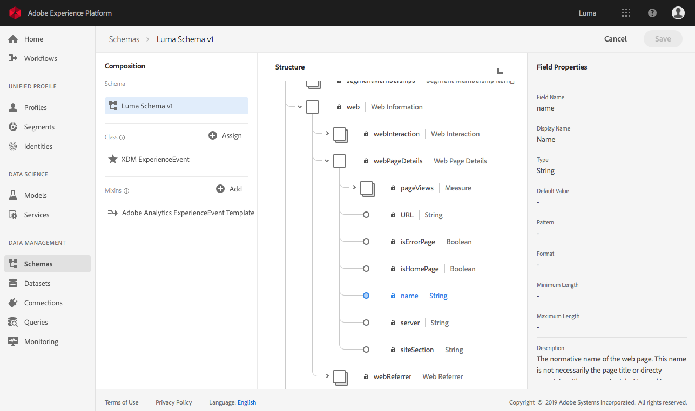

# Conjuntos de datos vs. tablas y esquemas

Revise la lista de conjuntos de datos disponibles en la interfaz de usuario [de](https://platform.adobe.com/datasets)Adobe Experience Platform y asegúrese de observar los nombres de conjuntos de datos.
>[!NOTE]
>
>Algunos nombres de conjuntos de datos tienen espacios y, de lo contrario, podrían no ser seguros para SQL.


Revise la estructura jerárquica del esquema del conjunto de datos en la interfaz de usuario haciendo clic en el nombre de un esquema en la tabla del conjunto de datos.



Abra la línea de comandos de PSQL y utilice los detalles de conexión desde aquí: [https://platform.adobe.com/query/configuration](https://platform.adobe.com/query/configuration).


Para vista de las tablas disponibles [!DNL Platform] con SQL, puede utilizar `\d` o `SHOW TABLES;`.


`\d` muestra la vista PostgreSQL estándar

```sql
             List of relations
 Schema |       Name      | Type  |  Owner   
--------+-----------------+-------+----------
 public | luma_midvalues  | table | postgres
 public | luma_postvalues | table | postgres
(2 rows)
```

`SHOW TABLES;` es un comando personalizado que proporciona una vista más detallada y presenta la tabla, así como el nombre del conjunto de datos que se encuentra en la [!DNL Platform] interfaz de usuario.

```sql
       name      |        dataSetId         |     dataSet    | description | resolved 
-----------------+--------------------------+----------------+-------------+----------
 luma_midvalues  | 5bac030c29bb8d12fa992e58 | Luma midValues |             | false
 luma_postvalues | 5c86b896b3c162151785b43c | Luma midValues |             | false
(2 rows)
```

Para vista del esquema raíz de una tabla, utilice el `\d table_name` comando .

>[!NOTE]
>
>El esquema presentado muestra los campos raíz, la mayoría de los cuales son complejos, referidos a un tipo de objeto en la interfaz de usuario del esquema de Dataset.

`\d luma_midvalues`

```sql
                         Table "public.luma_midvalues"
      Column       |             Type            | Collation | Nullable | Default 
-------------------+-----------------------------+-----------+----------+---------
 timestamp         | timestamp                   |           |          | 
 _id               | text                        |           |          | 
 productlistitems  | anyarray                    |           |          | 
 commerce          | luma_midvalues_commerce     |           |          | 
 receivedtimestamp | timestamp                   |           |          | 
 enduserids        | luma_midvalues_enduserids   |           |          | 
 datasource        | datasource                  |           |          | 
 web               | luma_midvalues_web          |           |          | 
 placecontext      | luma_midvalues_placecontext |           |          | 
 identitymap       | anymap                      |           |          | 
 marketing         | marketing                   |           |          | 
 environment       | luma_midvalues_environment  |           |          | 
 _experience       | luma_midvalues__experience  |           |          | 
 device            | device                      |           |          | 
 search            | search                      |           |          | 
```

Para ir más allá en el esquema, utilice caracteres de subrayado (`_`) para declarar la columna en la tabla que desee describir. Por ejemplo, `\d table_name_column`

`\d luma_midvalues_web`

```sql
                 Composite type "public.luma_midvalues_web"
     Column     |               Type                | Collation | Nullable | Default 
----------------+-----------------------------------+-----------+----------+---------
 webpagedetails | luma_midvalues_web_webpagedetails |           |          | 
 webreferrer    | web_webreferrer                   |           |          | 
```
