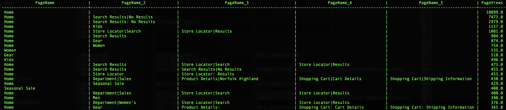

# Uso de funciones definidas por Adobe

Uno de los grandes diferenciadores del Adobe es que comprende los datos de experiencia y lo que los clientes necesitan para poder hacer con esos datos. Puede utilizar esta comprensión para crear funciones de ayuda que faciliten su trabajo.

Este documento cubre las funciones definidas por Adobes (ADF) para admitir tres actividades clave [!DNL Analytics] :
- [Sesionización](#sessionization)
- [Atribución](#attribution)
- [Control de rutas](#pathing)

## Sesionización

El `SESS_TIMEOUT()` reproduce los grupos de visitas encontrados con Adobe Analytics. Realiza una agrupación similar basada en el tiempo, pero con parámetros personalizables.

**Sintaxis:**

`SESS_TIMEOUT(timestamp, timeout_in_seconds) OVER ([partition] [order] [frame])`

**Devuelve:**

Estructura con campos `(timestamp_diff, num, is_new, depth)`

### Explorar el nivel de fila `SESS_TIMEOUT()` y el resultado

```sql
SELECT analyticsVisitor,
      session.is_new,
      session.timestamp_diff,
      session.num,
      session.depth
FROM  (
        SELECT endUserIDs._experience.aaid.id as analyticsVisitor,
        SESS_TIMEOUT(timestamp, 60 * 30)
        OVER (PARTITION BY endUserIDs._experience.aaid.id
        ORDER BY timestamp
        ROWS BETWEEN UNBOUNDED PRECEDING AND CURRENT ROW)
        AS session
        FROM your_analytics_table
        WHERE TIMESTAMP >= to_timestamp('2018-12-01') AND TIMESTAMP <= to_timestamp('2018-12-31')
      )
LIMIT 100;
```


### Crear un nuevo informe de tendencias con visitantes, sesiones y vistas de página

```sql
SELECT
      date_format( from_utc_timestamp(timestamp, 'EDT') , 'yyyy-MM-dd') as Day,
      COUNT(DISTINCT analyticsVisitor ) as Visitors,
      COUNT(DISTINCT analyticsVisitor || session.num ) as Sessions,
      SUM( PageViews ) as PageViews
FROM
    (
      SELECT
          timestamp,
          endUserIDs._experience.aaid.id as analyticsVisitor,
          SESS_TIMEOUT(timestamp, 60 * 30)
      OVER (PARTITION BY endUserIDs._experience.aaid.id
      ORDER BY timestamp
      ROWS BETWEEN UNBOUNDED PRECEDING AND CURRENT ROW)
      AS session,
          web.webPageDetails.pageviews.value as PageViews
      FROM your_analytics_table
      WHERE TIMESTAMP >= to_timestamp('2018-12-01') AND TIMESTAMP <= to_timestamp('2018-12-31')
    )
GROUP BY Day 
ORDER BY Day DESC 
LIMIT 31;
```


## Atribución

La atribución es la forma en que se asignan métricas o conversiones, como ingresos, pedidos o suscripciones, a los esfuerzos de mercadotecnia.

En Adobe Analytics, la configuración de atribución se configura mediante variables como eVars y se generan a medida que se ingestan los datos.

Las FDA de atribución que se encuentran en [!DNL Query Service] permiten que esas asignaciones se definan y generen en tiempo de consulta.

Este ejemplo se centra en la atribución de último toque, pero Adobe también oferta la atribución de primer toque.

>[!NOTE]
>
>Otras opciones con tiempos de espera y caducidad basada en eventos estarán disponibles en futuras versiones de [!DNL Query Service].

**Sintaxis:**

`ATTRIBUTION_LAST_TOUCH(timestamp, [channel_name], column) OVER ([partition] [order] [frame])`

**Devuelve:**

Estructura con campo `(value)`

### Explorar la atribución de nivel de fila

```sql
SELECT
  endUserIds._experience.aaid.id,
  _experience.analytics.customDimensions.evars.evar10 as MemberLevel,
  ATTRIBUTION_LAST_TOUCH(timestamp, 'eVar10', _experience.analytics.customDimensions.evars.evar10)
      OVER(PARTITION BY endUserIds._experience.aaid.id
           ORDER BY timestamp
           ROWS BETWEEN UNBOUNDED PRECEDING AND CURRENT ROW).value
      AS LastMemberLevel,
  commerce.purchases.value as Orders
FROM your_analytics_table 
WHERE TIMESTAMP >= to_timestamp('2018-04-01') AND TIMESTAMP <= to_timestamp('2018-04-30')
LIMIT 50;
```


### Crear un desglose de pedidos por último nivel de miembro (eVar10)

```sql
SELECT
  LastMemberLevel,
  SUM(Orders) as MemberLevelOrders
FROM 
(SELECT
  ATTRIBUTION_LAST_TOUCH(timestamp, 'eVar10', _experience.analytics.customDimensions.evars.evar10)
      OVER(PARTITION BY endUserIds._experience.aaid.id
           ORDER BY timestamp
           ROWS BETWEEN UNBOUNDED PRECEDING AND CURRENT ROW).value
      AS LastMemberLevel,
  commerce.purchases.value as Orders
FROM your_analytics_table 
WHERE TIMESTAMP >= to_timestamp('2018-04-01') AND TIMESTAMP <= to_timestamp('2018-04-30')
)
GROUP BY LastMemberLevel 
ORDER BY MemberLevelOrders DESC
LIMIT 25;
```


## Control de rutas

El control de rutas ayuda a comprender cómo los clientes navegan por el sitio. Los `NEXT()` y `PREVIOUS()` ADF lo hacen posible.

**Sintaxis:**

```sql
NEXT(key, [shift, [ignoreNulls]]) OVER ([partition] [order] [frame])
PREVIOUS(key, [shift, [ignoreNulls]]) OVER ([partition] [order] [frame])
```

**Devuelve:**

Estructura con campo `(value)`

### Seleccionar la página actual y la página siguiente

```sql
SELECT 
      endUserIds._experience.aaid.id,
      timestamp,
      web.webPageDetails.name,
      NEXT(web.webPageDetails.name, 1, true)
          OVER(PARTITION BY endUserIds._experience.aaid.id
              ORDER BY timestamp
              ROWS BETWEEN CURRENT ROW AND UNBOUNDED FOLLOWING).value
          AS next_pagename
FROM your_analytics_table
WHERE TIMESTAMP >= to_timestamp('2018-12-01') AND TIMESTAMP <= to_timestamp('2018-12-31') 
LIMIT 10;
```


### Crear un informe de desglose para los cinco nombres de página principales al entrar en la sesión

```sql
  SELECT 
    PageName,
    PageName_2,
    PageName_3,
    PageName_4,
    PageName_5,
    SUM(PageViews) as PageViews
  FROM
    (SELECT
      PageName,
      NEXT(PageName, 1, true)
        OVER(PARTITION BY VisitorID, session.num
              ORDER BY timestamp
              ROWS BETWEEN CURRENT ROW AND UNBOUNDED FOLLOWING).value
        AS PageName_2,
      NEXT(PageName, 2, true)
        OVER(PARTITION BY VisitorID, session.num
              ORDER BY timestamp
              ROWS BETWEEN CURRENT ROW AND UNBOUNDED FOLLOWING).value
        AS PageName_3,
      NEXT(PageName, 3, true)
         OVER(PARTITION BY VisitorID, session.num
              ORDER BY timestamp
              ROWS BETWEEN CURRENT ROW AND UNBOUNDED FOLLOWING).value
        AS PageName_4,
      NEXT(PageName, 4, true)
         OVER(PARTITION BY VisitorID, session.num
              ORDER BY timestamp
              ROWS BETWEEN CURRENT ROW AND UNBOUNDED FOLLOWING).value
        AS PageName_5,
      PageViews,
      session.depth AS SessionPageDepth
    FROM
      (SELECT
        endUserIds._experience.aaid.id as VisitorID,
        timestamp,
        web.webPageDetails.pageviews.value AS PageViews,
        web.webPageDetails.name AS PageName,
        SESS_TIMEOUT(timestamp, 60 * 30) 
          OVER (PARTITION BY endUserIDs._experience.aaid.id 
                ORDER BY timestamp 
                ROWS BETWEEN UNBOUNDED PRECEDING AND CURRENT ROW) 
        AS session
      FROM your_analytics_table
      WHERE TIMESTAMP >= to_timestamp('2018-12-01') AND TIMESTAMP <= to_timestamp('2018-12-31')
    )
  WHERE SessionPageDepth=1
  GROUP BY PageName, PageName_2, PageName_3, PageName_4, PageName_5
  ORDER BY PageViews DESC
  LIMIT 100;
```



## Recursos adicionales

El siguiente vídeo muestra cómo ejecutar consultas en la interfaz de Adobe Experience Platform y en un cliente PSQL. Además, en el vídeo también se utilizan ejemplos de propiedades individuales en un objeto XDM, mediante funciones definidas por Adobe y mediante CREATE TABLE AS SELECT (CTAS).

>[!VIDEO](https://video.tv.adobe.com/v/29796?quality=12&learn=on)

