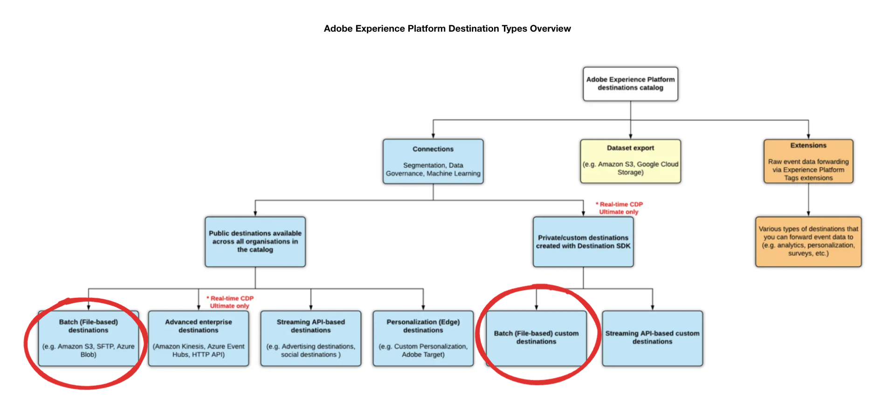

# Crear audiencias con SQL

Utilice la extensión de audiencia SQL para crear audiencias con datos del lago de datos, incluidas las entidades de dimensión existentes (como atributos del cliente o información del producto).

El uso de esta extensión SQL mejora la capacidad de crear audiencias, ya que no necesita datos sin procesar en los perfiles al definir segmentos de audiencia. Las audiencias creadas con este método se registran automáticamente en el espacio de trabajo de Audience, donde puede segmentarlas a destinos basados en archivos.


Este documento explica cómo utilizar la extensión de audiencia SQL en Data Distiller de Adobe Experience Platform para crear, administrar y publicar audiencias mediante comandos SQL.

## Ciclo de vida de creación de audiencias en Data Distiller {#audience-creation-lifecycle}

Siga estos pasos para crear, administrar y activar sus audiencias. Las audiencias creadas se integran perfectamente en el &quot;flujo de audiencia&quot;, de modo que puede generar segmentos a partir de audiencias base y destinos basados en archivos de destinatario (por ejemplo, cargas de CSV o ubicaciones de almacenamiento en la nube) para llegar a los clientes. &quot;Flujo de audiencia&quot; hace referencia al proceso completo de creación, administración y activación de audiencias, lo que garantiza una integración perfecta entre destinos.

Como parte de su &quot;flujo de audiencia&quot;, use los siguientes comandos SQL para [crear](#create-audience), [modificar](#add-profiles-to-audience) y [eliminar](#delete-audience) audiencias en Adobe Experience Platform.

### Crear un público {#create-audience}

Utilice el comando `CREATE AUDIENCE AS SELECT` para definir una audiencia nueva. La audiencia creada se guardará en un conjunto de datos y se registrará en el espacio de trabajo de [!UICONTROL Audiencias] en Data Distiller.

```sql
CREATE AUDIENCE table_name  
WITH (primary_identity='IdentitycolName', identity_namespace='Namespace for the identity used', [schema='target_schema_title'])
AS (select_query)
```

**Parámetros**

Utilice estos parámetros para definir la consulta de creación de audiencias SQL:

| Parámetro | Descripción |
|--------------------|------------------------------------------------------------------|
| `schema` | Opcional. Define el esquema XDM para el conjunto de datos creado por la consulta. |
| `table_name` | Nombre de la tabla y audiencia. |
| `primary_identity` | Especifica la columna de identidad principal de la audiencia. |
| `identity_namespace` | Área de nombres de la identidad. Puede utilizar un área de nombres existente o crear una nueva. Para ver las áreas de nombres disponibles, use el comando `SHOW NAMESPACES`. Para crear un área de nombres nueva, use `CREATE NAMESPACE`. Por ejemplo: `CREATE NAMESPACE lumaCrmId WITH (code='testns', TYPE='Email')`. |
| `select_query` | Una instrucción SELECT que define la audiencia. La sintaxis de la consulta SELECT se encuentra en la sección [consultas SELECT](../sql/syntax.md#select-queries). |

{style="table-layout:auto"}

>[!NOTE]
>
>Para proporcionar una mayor flexibilidad para estructuras de datos complejas, puede anidar atributos enriquecidos al definir audiencias. Los atributos enriquecidos, como `orders`, `total_revenue`, `recency`, `frequency` y `monetization`, se pueden usar para filtrar audiencias según sea necesario.

**Ejemplo:**

El siguiente ejemplo muestra cómo estructurar la consulta de creación de audiencias SQL:

```sql
CREATE Audience aud_test
WITH (primary_identity=userId, identity_namespace=lumaCrmId)
AS SELECT userId, orders, total_revenue, recency, frequency, monetization FROM profile_dim_customer;
```

En este ejemplo, la columna `userId` se identifica como columna de identidad y se asigna un espacio de nombres (`lumaCrmId`) apropiado. Las columnas restantes (`orders`, `total_revenue`, `recency`, `frequency` y `monetization`) son atributos enriquecidos que proporcionan contexto adicional para la audiencia.

**Limitaciones:**

Tenga en cuenta las siguientes limitaciones al utilizar SQL para la creación de audiencias:

- La columna de identidad principal **debe** estar en el nivel más alto del conjunto de datos, sin estar anidada dentro de otros atributos o categorías.
- Las audiencias externas creadas con comandos SQL tienen un período de retención de 30 días. Después de 30 días, estas audiencias se eliminan automáticamente, lo que es una consideración importante para planificar las estrategias de gestión de audiencias.

### Adición de perfiles a una audiencia existente {#add-profiles-to-audience}

Utilice el comando `INSERT INTO` para agregar perfiles (o audiencias completas) a una audiencia existente.

```sql
INSERT INTO table_name
SELECT select_query
```

**Parámetros**

En la tabla siguiente se explican los parámetros necesarios para el comando `INSERT INTO`:

| Parámetro | Descripción |
|----------------|--------------------------------------------------------------------------------|
| `table_name` | El nombre de la tabla que se creó como parte del comando crear audiencia. |
| `select_query` | Una instrucción SELECT. La sintaxis de la consulta SELECT se encuentra en la sección consultas SELECT. |

{style="table-layout:auto"}

**Ejemplo:**

El siguiente ejemplo muestra cómo agregar perfiles a una audiencia existente con el comando `INSERT INTO`:

```sql
INSERT INTO Audience aud_test
SELECT userId, orders, total_revenue, recency, frequency, monetization FROM customer_ds;
```

### Ejemplo de audiencia del modelo RFM {#rfm-model-audience-example}

En el siguiente ejemplo se muestra cómo crear una audiencia utilizando el modelo Actualización, Frecuencia y Monetización (RFM). Este ejemplo segmenta a los clientes en función de sus puntuaciones de actualización, frecuencia y monetización para identificar grupos clave, como clientes fieles, clientes nuevos y clientes de alto valor.

<!--  Q) Since the focus of this document is on external audiences, or should I just include this temporarily? We could simply provide a link to the separate RFM modeling documentation rather than including the full example here. (Add link to new RFM document when it is published) -->

La siguiente consulta crea un esquema para la audiencia de RFM. La instrucción configura campos para contener información del cliente como `userId`, `days_since_last_purchase`, `orders`, `total_revenue`, etc.

```sql
CREATE Audience adls_rfm_profile
WITH (primary_identity=userId, identity_namespace=lumaCrmId) AS
SELECT
    cast(NULL AS string) userId,
    cast(NULL AS integer) days_since_last_purchase,
    cast(NULL AS integer) orders,
    cast(NULL AS decimal(18,2)) total_revenue,
    cast(NULL AS integer) recency,
    cast(NULL AS integer) frequency,
    cast(NULL AS integer) monetization,
    cast(NULL AS string) rfm_model
WHERE false;
```

Después de crear la audiencia, rellénela con datos de clientes y segmente los perfiles en función de sus puntuaciones de RFM. La instrucción SQL siguiente utiliza la función `NTILE(4)` para clasificar a los clientes en cuartiles según sus puntuaciones RFM (Actualización, Frecuencia, Monetización). Estas puntuaciones clasifican a los clientes en seis segmentos, como &quot;Principal&quot;, &quot;Leal&quot; y &quot;Ballenas&quot;. A continuación, los datos segmentados del cliente se insertan en la tabla de audiencias `adls_rfm_profile`&quot;.

```sql
INSERT INTO Audience adls_rfm_profile
SELECT
    userId,
    days_since_last_purchase,
    orders,
    total_revenue,
    recency,
    frequency,
    monetization,
    CASE
        WHEN Recency=1 AND Frequency=1 AND Monetization=1 THEN '1. Core - Your Best Customers'
        WHEN Recency IN(1,2,3,4) AND Frequency=1 AND Monetization IN (1,2,3,4) THEN '2. Loyal - Your Most Loyal Customers'
        WHEN Recency IN(1,2,3,4) AND Frequency IN (1,2,3,4) AND Monetization=1 THEN '3. Whales - Your Highest Paying Customers'
        WHEN Recency IN(1,2,3,4) AND Frequency IN(1,2,3) AND Monetization IN(2,3,4) THEN '4. Promising - Faithful Customers'
        WHEN Recency=1 AND Frequency=4 AND Monetization IN (1,2,3,4) THEN '5. Rookies - Your Newest Customers'
        WHEN Recency IN (2,3,4) AND Frequency=4 AND Monetization IN (1,2,3,4) THEN '6. Slipping - Once Loyal, Now Gone'
    END AS rfm_model
FROM (
    SELECT
        userId,
        days_since_last_purchase,
        orders,
        total_revenue,
        NTILE(4) OVER (ORDER BY days_since_last_purchase) AS recency,
        NTILE(4) OVER (ORDER BY orders DESC) AS frequency,
        NTILE(4) OVER (ORDER BY total_revenue DESC) AS monetization
    FROM (
        SELECT
            userid,
            DATEDIFF(current_date, MAX(purchase_date)) AS days_since_last_purchase,
            COUNT(purchaseid) AS orders,
            CAST(SUM(total_revenue) AS double) AS total_revenue
        FROM (
            SELECT DISTINCT
                ENDUSERIDS._EXPERIENCE.EMAILID.ID AS userid,
                commerce.`ORDER`.purchaseid AS purchaseid,
                commerce.`ORDER`.pricetotal AS total_revenue,
                TO_DATE(timestamp) AS purchase_date
            FROM sample_data_for_ootb_templates
            WHERE commerce.`ORDER`.purchaseid IS NOT NULL
        ) AS b
        GROUP BY userId
    )
);
```

### Eliminar una audiencia (ELIMINAR AUDIENCIA) {#delete-audience}

Utilice el comando `DROP AUDIENCE` para eliminar una audiencia existente. Si la audiencia no existe, se produce una excepción a menos que se especifique `IF EXISTS`.

```sql
DROP AUDIENCE [IF EXISTS] [db_name.]table_name
```

**Parámetros**

La tabla contiene los parámetros necesarios para el comando `DROP AUDIENCE`:

| Parámetro | Descripción |
|----------------|----------------------------------------------------------------------------------------|
| `IF EXISTS` | Opcional. Si se especifica, en el caso de que no se encuentre la tabla, no se generará ninguna excepción. |
| `db_name` | Especifica el grupo de datos utilizado para calificar el conjunto de datos de audiencia. |
| `table_name` | El nombre de la tabla que se creó como parte del comando crear audiencia. |

{style="table-layout:auto"}

**Ejemplo:**

El siguiente ejemplo muestra cómo eliminar una audiencia mediante el comando DROP AUDIENCE:

```sql
DROP AUDIENCE IF EXISTS aud_test;
```

### Registro y disponibilidad automáticos de audiencias {#registration-and-availability}

Las audiencias creadas con la extensión SQL se registran automáticamente con el Distiller de datos [!UICONTROL Origin] en Audience Workspace. Una vez registradas, estas audiencias están disponibles para la segmentación en destinos basados en archivos, lo que mejora la segmentación y las estrategias de segmentación. Este proceso no requiere ninguna configuración adicional, lo que optimiza la gestión de público. Para obtener más información sobre cómo ver, administrar y crear audiencias en la interfaz de usuario de Platform, consulte la [descripción general del portal de audiencias](../../segmentation/ui/audience-portal.md).

<!-- Q) Do you know how long it takes for the audience to register? This info would help manage user expectations. -->


## Activar públicos en destinos {#activate-audiences}

Active las audiencias segmentándolas a cualquier destino basado en archivos, como [!DNL Amazon S3], [!DNL SFTP] o [!DNL Azure Blob]. Los atributos de audiencia enriquecidos están disponibles para un mayor refinamiento y filtrado, según sea necesario.



## Aclaraciones de características {#faqs}

Esta sección aborda las preguntas más frecuentes sobre la creación y administración de audiencias externas mediante SQL en Data Distiller.

**Preguntas**:

- ¿La creación de audiencias solo se admite para conjuntos de datos planos?

+++Respuesta

Actualmente, la creación de audiencias se limita a atributos planos (de nivel raíz) al definir la audiencia.

+++

- ¿La creación de audiencias resulta en un único conjunto de datos o en varios conjuntos de datos, o varía según la configuración?

+++Respuesta

Hay una asignación uno a uno entre una audiencia y un conjunto de datos.

+++

- ¿El conjunto de datos creado durante la creación de audiencias está marcado para Perfil?

+++Respuesta

No, el conjunto de datos creado durante la creación de audiencias no está marcado para Perfil.

+++

- ¿Se crea el conjunto de datos en el lago de datos?

+++Respuesta

Sí, el conjunto de datos asociado con la audiencia se crea en el lago de datos. Los atributos de este conjunto de datos están disponibles en el Compositor de audiencias y en el flujo de destino como atributos enriquecidos.

+++

- ¿Los atributos de la audiencia están restringidos a destinos basados en archivos por lotes de empresa? (Sí o No)

+++Respuesta

No. Los atributos enriquecidos en la audiencia están disponibles para su uso tanto en destinos por lotes de empresa como basados en archivos. Si aparece un error como &quot;Los siguientes ID de segmento tienen áreas de nombres no permitidas para este destino: e917f626-a038-42f7-944c-xyxyx&quot;, cree un nuevo segmento en Data Distiller y utilícelo con cualquier destino disponible.

+++

- ¿Puedo crear una audiencia de audiencias que use una audiencia de Data Distiller?

+++Respuesta

Sí, puede crear una audiencia de audiencias que utilice una audiencia de Data Distiller.

+++

- ¿Aparecen estas audiencias en Adobe Journey Optimizer? Si no es así, ¿qué sucede cuando se crea una nueva audiencia en el generador de reglas que incluye a todos los miembros de esta audiencia?

+++Respuesta

Las audiencias de Data Distiller también están disponibles en Adobe Journey Optimizer. Puede utilizar las audiencias de Data Distiller en Adobe Journey Optimizer y filtrar los resultados en función de los atributos enriquecidos.

+++

- ¿Las audiencias de Data Distiller se eliminan cada 30 días, ya que son audiencias externas?

+++Respuesta

Sí, las audiencias de Data Distiller se eliminan cada 30 días, ya que son audiencias externas.

+++

## Pasos siguientes

Después de leer este documento, ha aprendido a utilizar la extensión de audiencia SQL en Data Distiller para crear, administrar y publicar audiencias de forma eficaz mediante comandos SQL. Ahora puede personalizar las definiciones de audiencias en función de sus requisitos empresariales únicos y activarlas en varios destinos, optimizando las estrategias de marketing y las decisiones basadas en datos.

A continuación, puede leer la siguiente documentación para desarrollar y optimizar aún más sus estrategias de gestión de público de Platform:

- **Explorar la evaluación de audiencias**: Obtenga información acerca de los [métodos de evaluación de audiencias en Adobe Experience Platform](../../segmentation/home.md#evaluate-segments): segmentación de streaming para actualizaciones en tiempo real, segmentación por lotes para procesamiento programado o bajo demanda y segmentación de Edge para evaluación instantánea en el Edge Network.
- **Integrar con destinos**: lea la guía sobre cómo [exportar archivos bajo demanda a destinos por lotes](../../destinations/ui/export-file-now.md) mediante la interfaz de usuario de destinos de Platform.
- **Revisar rendimiento de audiencias**: Analice el rendimiento de las audiencias definidas por SQL en diferentes canales. Utilice perspectivas de datos para ajustar y mejorar las definiciones de audiencia y las estrategias de segmentación. Lea el documento sobre [Información de la audiencia](../../dashboards/insights/audiences.md) para obtener información sobre cómo acceder y adaptar las consultas SQL para obtener información de la audiencia en Adobe Real-Time CDP. A continuación, puede crear sus propias perspectivas y transformar los datos sin procesar en información procesable personalizando el panel Audiencias para visualizar y utilizar de forma eficaz estas perspectivas y mejorar la toma de decisiones.

