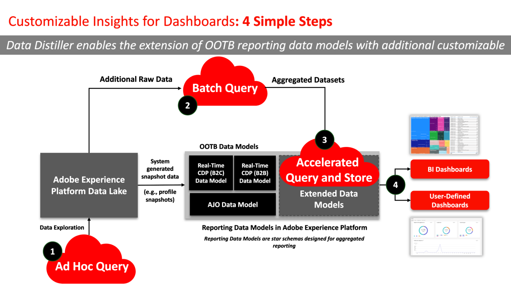

# SQL Insights

Cree modelos de datos de informes personalizados para extraer perspectivas más profundas, optimizar estrategias y adaptar los análisis para satisfacer necesidades comerciales específicas con SQL Insights de Data Distiller. Utilice la capacidad Perspectivas de SQL para mejorar la transparencia y obtener perspectivas operativas de sus datos de Adobe Experience Platform en dimensiones como perfiles, audiencias, campañas, recorridos, autorizaciones y consentimientos. Esta capacidad proporciona una solución versátil y adaptable para adaptar los modelos de datos de creación de informes de su organización a las necesidades específicas de su empresa.

Para [visualizar sus perspectivas de SQL](../../../dashboards/sql-insights-query-pro-mode/overview.md), puede usar [query pro mode](../../../dashboards/sql-insights-query-pro-mode/overview.md) para realizar análisis complejos con consultas SQL personalizadas y transformar sus datos en gráficos fácilmente interpretables. Utilice el modo query pro para crear perspectivas y visualizaciones personalizadas en sus paneles y atender a audiencias técnicas y no técnicas descargando sus perspectivas como archivos CSV.

Este documento cubre los casos de uso, las funcionalidades esenciales y los pasos necesarios para desarrollar un panel de perspectivas SQL con Data Distiller.

## Requisitos previos

Este tutorial utiliza paneles definidos por el usuario para visualizar datos del modelo de datos personalizado en la interfaz de usuario de Platform. Consulte la [documentación de paneles definidos por el usuario](../../../dashboards/standard-dashboards.md) para obtener más información sobre esta función.

## Introducción

El SKU de Data Distiller es necesario para crear un modelo de datos personalizado para las perspectivas de creación de informes y ampliar los modelos de datos de Real-Time CDP que contienen datos de Platform enriquecidos. Consulte la documentación de [empaquetado](../../packaging.md), [protecciones](../../guardrails.md#query-accelerated-store) y [licencias](../../data-distiller/license-usage.md) relacionada con el SKU de Data Distiller. Si no tiene el SKU de Distiller de datos, póngase en contacto con el representante del servicio de atención al cliente de Adobe para obtener más información.

## Casos de uso de SQL Insights {#use-cases}

A continuación se muestran casos de uso comunes que se pueden abordar de forma eficaz mediante SQL Insights en Data Distiller.

### Transparencia del perfil y uso de audiencia {#usage-transparency}

**Desafío:** Cómo desglosar los indicadores clave de rendimiento (KPI) según criterios específicos como unidades de negocio, estado de lealtad o valor de duración del cliente (CLTV).

**Solución de perspectivas de SQL:** Data Distiller habilita la extensión de los modelos de datos de informes en Adobe Experience Platform, lo que permite [agregar atributos de perfil personalizados como CLTV](../../use-cases/customer-lifetime-value.md) o estado de lealtad.

### Seguimiento de anomalías de consentimiento {#consent-anomaly-tracking}

**Desafío:** Aplicar informes de línea de tendencia de tamaño y superposición de audiencias a atributos de consentimiento personalizados para canales como correo electrónico, SMS y teléfono.

**Solución de perspectivas de SQL:** El modelo de datos de informes se puede ampliar para realizar un seguimiento de los cambios en las preferencias de consentimiento a lo largo del tiempo. Esto implica crear tablas adicionales de hechos y dimensiones para analizar las preferencias de consentimiento de tendencias y programar [la actualización incremental de los datos](../../key-concepts/incremental-load.md).

### Optimizar estrategia de segmentación de audiencia {#optimize-audience-segmentation-strategy}

**Desafío:** Cómo integrar las puntuaciones de tendencia generadas por modelos de Aprendizaje automático (ML) en sus informes de KPI de audiencia.

**Solución de perspectivas de SQL:** Data Distiller permite la inclusión de [puntuaciones de tendencia de modelos ML personalizados](../../use-cases/propensity-score.md), lo que facilita el cálculo de puntuaciones agregadas en el nivel de audiencia. Estos datos se pueden registrar junto con los KPI estándar.

### Expansión de audiencia {#audience-expansion}

**Desafío:** Cómo adquirir más que solo recuentos de perfiles en informes de superposición de audiencias y lograr datos demográficos o preferencias adicionales para guiar las estrategias de expansión de audiencias.

**Solución de perspectivas de SQL:** Al ampliar el modelo de datos de informes, los usuarios pueden incorporar atributos de perfil adicionales, lo que enriquece el informe de superposición de audiencias con datos demográficos y preferencias relevantes.

## Capacidades clave para generar SQL Insights {#key-capabilities}

La siguiente ilustración resalta varias funcionalidades esenciales para generar SQL Insights. Estas funciones incluyen:

1. **Visualizaciones de datos:** que incorporan elementos visuales como tendencias y gráficos de barras para obtener una vista completa de las tendencias de datos.
1. **Creación de paneles:** Permite la creación de paneles personalizados adaptados a casos de uso específicos, lo que proporciona una experiencia de análisis más personalizada y dirigida.
1. **Modelado flexible de datos SQL:** Utilice un enfoque versátil de modelado de datos SQL que permita a los usuarios combinar y manipular sin problemas diferentes conjuntos de datos, mejorando la adaptabilidad y la profundidad analítica.
1. **Almacenamiento acelerado:** Implementación de un mecanismo de almacenamiento acelerado para proporcionar información agregada a través de SQL de forma eficiente, lo que garantiza un acceso rápido y sencillo a información valiosa.
1. **Conectividad de BI:** Facilita la integración perfecta con herramientas populares de Business Intelligence (BI), como Power BI, Tableau, Looker y Apache Superset. Esta conectividad garantiza la compatibilidad con diversos entornos de BI, lo que ofrece a los usuarios la flexibilidad de utilizar la herramienta que elijan para realizar análisis e informes detallados.

## Pasos para crear SQL Insights {#steps-to-create}

Para desarrollar un panel de SQL Insights dentro de Data Distiller, siga las instrucciones paso a paso a continuación.

1. **Exploración de consultas ad hoc:** Comience ejecutando consultas ad hoc `SELECT` para explorar datos sin procesar en el lago de datos. Esto permite realizar análisis de datos exploratorios sobre la marcha para experimentar y validar datos en los que los resultados de las consultas no se almacenan en el lago de datos.
1. **Utilización de consultas por lotes:** Use consultas por lotes para [crear trabajos programados](../../api/scheduled-queries.md#create-a-new-scheduled-query) para generar tablas agregadas de información, lo que garantiza un enfoque sistemático y automatizado para el procesamiento de datos. Las consultas por lotes ejecutan `INSERT TABLE AS SELECT` y `CREATE TABLE AS SELECT` consultas para limpiar, dar forma, manipular y enriquecer datos. Los resultados de estas consultas se almacenan en el lago de datos.
1. **Carga de perspectivas agregadas:** Cargue las perspectivas agregadas generadas en el almacén acelerado y use SQL para probar consultas, y garantizar la precisión y eficacia de la recuperación de datos. Para obtener información sobre cómo [realizar consultas sin estado en el almacén acelerado](../../api/accelerated-queries.md), consulte la documentación.
1. **Acceso e integración:** Acceda a las perspectivas almacenadas en el almacén acelerado sin problemas mediante la integración con los [paneles definidos por el usuario](../../../dashboards/standard-dashboards.md) de Adobe Experience Platform u otras herramientas de Business Intelligence (BI) preferidas. Estas integraciones con clientes de terceros facilitan una experiencia coherente e intuitiva para los usuarios.

## Pasos siguientes

Al leer este documento, ahora comprende mejor los casos de uso, las capacidades esenciales y los pasos necesarios para desarrollar un panel de perspectivas SQL con Data Distiller. Para continuar aprendiendo a crear modelos de datos de informes personalizados, consulte la [guía del modelo de datos de perspectivas de informes](./reporting-insights-data-model.md).
