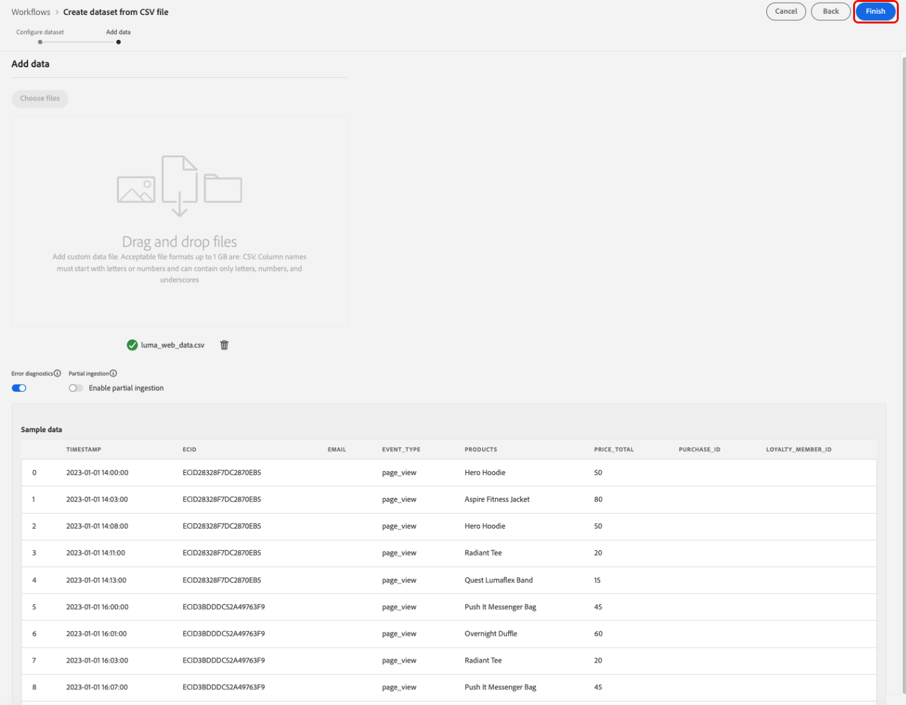
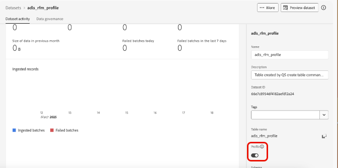
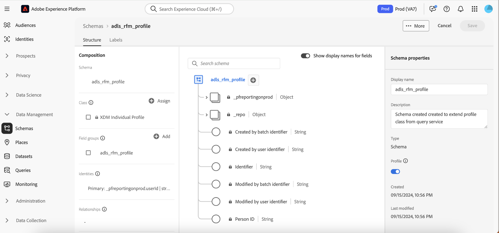
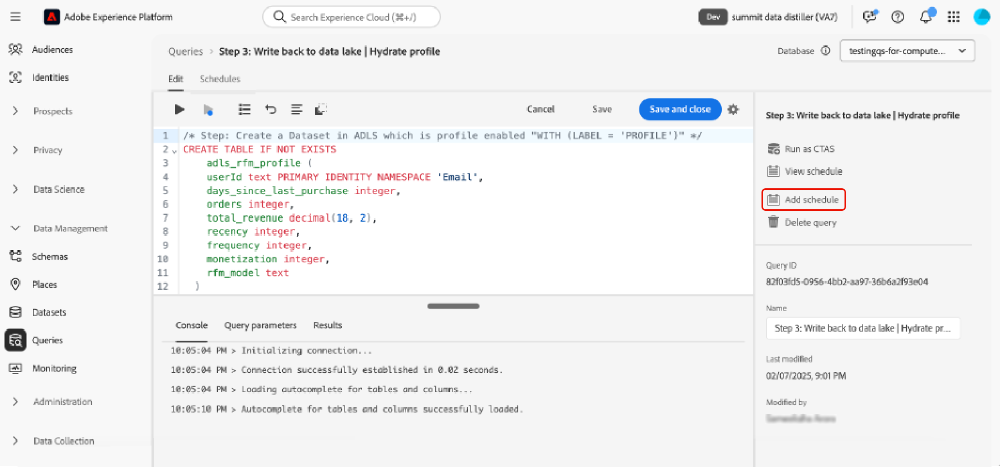

# Sugerencias principales para maximizar el valor con Adobe Experience Platform Data Distiller

Esta página contiene el conjunto de datos de ejemplo para que aplique lo que ha aprendido en la sesión de Adobe Summit &quot;OS656: consejos principales para maximizar el valor con Adobe Experience Platform Data Distiller&quot;. Aprenderá a acelerar las implementaciones de Adobe Real-Time Customer Data Platform y Journey Optimizer mediante la mejora de los datos del perfil del cliente en tiempo real. Este enriquecimiento aprovecha la perspectiva profunda de los patrones de comportamiento de los clientes para crear audiencias para la entrega y optimización de experiencias.

A través del caso práctico de Luma, analizará los datos de comportamiento del usuario y creará un modelo *Actualización, Frecuencia, Monetario (RFM)*, una técnica de análisis de marketing para la segmentación de clientes basada en patrones de compra.

## Requisito previo

Para ejecutar este caso de uso, la instancia de Adobe Experience Platform debe tener licencia para [Data Distiller](./overview.md). Póngase en contacto con su representante de Adobe para obtener más información.

## Descripción general del modelo RFM {#rfm-overview}

RFM, abreviatura de Actualización (R), Frecuencia (F) y Monetaria (M), es un enfoque basado en datos para la segmentación y el análisis de clientes. Esta metodología evalúa tres aspectos clave del comportamiento de los clientes: la fecha en que un cliente realizó una compra, la frecuencia con la que interactúa y la cantidad que gasta. Al cuantificar estos factores, las empresas pueden obtener perspectivas procesables en los segmentos de clientes y desarrollar estrategias de marketing dirigidas que satisfagan mejor las necesidades individuales de los clientes.

## Comprender el comportamiento del cliente con el modelo RFM {#understand-customer-behavior}

El modelo RFM segmenta a los clientes según el comportamiento transaccional utilizando tres parámetros clave.

- **Actualización** mide el tiempo desde la última compra de un cliente, indicando los niveles de participación y el potencial de compra futuro.
- La **frecuencia** registra la frecuencia con la que un cliente interactúa y sirve como un claro indicador de lealtad y participación sostenida.
- **Valor monetario** evalúa el gasto total de los clientes, destacando su valor general para la empresa.

Al combinar estos factores, las empresas asignan puntuaciones numéricas (generalmente en una escala de `1` a `4`) a cada cliente. Las puntuaciones más bajas indican resultados más favorables. Por ejemplo, un cliente que puntúa `1` en todas las categorías se considera uno de los mejores, lo que demuestra una actividad reciente, una participación alta y un gasto significativo.

## Ventajas y limitaciones del modelo RFM {#benefits-and-limitations}

Cada técnica de modelado de marketing implica compensaciones, ofreciendo tanto beneficios como limitaciones. El modelado de RFM es una herramienta valiosa para comprender el comportamiento de los clientes y refinar las estrategias de marketing. Sus ventajas incluyen la segmentación de clientes para personalizar la mensajería, optimizar los ingresos y mejorar las tasas de respuesta, la retención, la satisfacción y el valor de duración del cliente (CLTV).

Sin embargo, el modelado RFM tiene limitaciones. Supone uniformidad dentro de los segmentos en función de la actualización, la frecuencia y el valor monetario, lo que puede simplificar en exceso el comportamiento de los clientes. El modelo también asigna el mismo peso a estos factores, lo que podría tergiversar el valor para el cliente. Además, no tiene en cuenta el contexto, como los rasgos específicos del producto o las preferencias del cliente, que pueden llevar a interpretaciones erróneas del comportamiento de compra.

## Crear una audiencia SQL dinámica basada en puntuación RFM {#build-a-dynamic-rfm-audience}

Antes de iniciar el caso práctico de Luma, debe ingerir un conjunto de datos de muestra. Primero [seleccione el vínculo para descargar el conjunto de datos `luma_web_data.zip` localmente](../resources/luma_web_data.zip). El conjunto de datos de ejemplo es un archivo csv en formato .zip comprimido para alinearlo con el caso de uso. Descomprima este archivo ZIP con Adobe Acrobat o una herramienta de extracción de archivos de confianza, como la utilidad integrada del sistema operativo. En la práctica, los datos suelen proceder de Adobe Analytics, Adobe Commerce o Adobe Web/Mobile SDK.

A lo largo de este tutorial, utilizará Data Distiller para extraer eventos y campos relevantes en un formato CSV estandarizado. El objetivo es incluir solo campos esenciales a la vez que se mantiene una estructura de datos plana para una mayor eficiencia y facilidad de uso.

### Paso 1: Cargar los datos CSV en Experience Platform {#upload-csv-data}

Siga estos pasos para cargar un archivo CSV en Adobe Experience Platform.

#### Creación de un conjunto de datos a partir de un archivo CSV {#create-a-dataset}

En la interfaz de usuario de Experience Platform, vaya a **[!UICONTROL Flujos de trabajo]** en el carril de navegación izquierdo y seleccione **[!UICONTROL Crear conjunto de datos a partir del archivo CSV]** de las opciones disponibles. Aparece una nueva barra lateral a la derecha de la pantalla, seleccione **[!UICONTROL Launch]**.

Aparecerá el panel [!UICONTROL Configurar conjunto de datos]. En el campo **[!UICONTROL Nombre]**, escriba el nombre del conjunto de datos como &quot;luma_web_data&quot; y seleccione **[!UICONTROL Siguiente]**.

Aparecerá el panel [!UICONTROL Agregar datos]. Arrastre y suelte el archivo CSV en el cuadro **[!UICONTROL Agregar datos]** o seleccione **[!UICONTROL Elegir archivo]** para examinar y cargar el archivo.

Para obtener más información sobre este proceso, consulte el [tutorial de ingesta por lotes](../../ingestion/tutorials/ingest-batch-data.md) y el [flujo de trabajo de creación de conjuntos de datos](../../catalog/datasets/user-guide.md#create) en la guía de la interfaz de usuario del conjunto de datos.

#### Revisión y finalización de la carga {#review-and-complete-upload}

Una vez cargado el archivo, aparecerá una vista previa de datos en la parte inferior de la interfaz de usuario. Seleccione **[!UICONTROL Finalizar]** para completar la carga.



Aparece la vista de actividades del conjunto de datos para el conjunto de datos &quot;luma_web_data&quot;. La carga manual del archivo CSV
se ingiere como un lote y se identifica con un [!UICONTROL ID de lote]. Un panel del lado derecho muestra el nombre de la tabla como `luma_web_data`.

>[!TIP]
>
>Al escribir consultas en Data Distiller, utilice el nombre de la tabla en lugar del nombre del conjunto de datos. El nombre del conjunto de datos solo se utiliza para explorar en la interfaz de usuario.


<!--  
My table name is; luma_web_data_20250312_235611_817 Should we explain the suffix? 
-->

Una vez que los datos hayan terminado de procesarse, seleccione [!UICONTROL Previsualizar conjunto de datos] en la esquina superior derecha para previsualizar el conjunto de datos. Así es como aparece la vista previa del conjunto de datos:


#### Consideraciones del esquema {#schema-considerations}

No es necesario un esquema XDM estructurado (por ejemplo, registros, eventos o esquemas B2B) porque los datos se importan como un archivo CSV sin procesar. En su lugar, el conjunto de datos utiliza un esquema ad hoc.

>[!TIP]
>
>Los esquemas ad hoc son esquemas XDM con campos que están separados por espacios de nombres para su uso únicamente por un único conjunto de datos. Los esquemas ad hoc se utilizan en varios flujos de trabajo de ingesta de datos para Experience Platform y en la creación de ciertos tipos de conexiones de origen.

Aunque Data Distiller admite todos los tipos de esquema, el conjunto de datos final para la ingesta en el Perfil del cliente en tiempo real utilizará un esquema XDM de registro.

### Paso 2: Conéctese al lago de datos y explore los conjuntos de datos disponibles {#connect-to-the-data-lake-and-explore-datasets}

El siguiente paso es explorar los datos del lago de datos de Adobe Experience Platform para garantizar su precisión e integridad. Los datos deben ser precisos y completos para generar perspectivas significativas, pero durante las transferencias de datos pueden producirse errores, incoherencias o valores que faltan. Esto hace que la verificación y exploración de datos sea esencial.

>[!TIP]
>
>El lago de datos almacena datos sin procesar y sin procesar, como registros de eventos, datos del flujo de navegación y registros ingeridos por lotes, para análisis y procesamiento. El Almacenamiento de perfiles contiene datos identificables por el cliente, incluidos eventos vinculados a la identidad e información de atributos, para admitir la personalización y activación en tiempo real.

Utilice Data Distiller para verificar la calidad y la integridad del conjunto de datos a través de varias operaciones. Para confirmar que los datos se tradujeron con precisión durante la ingesta, ejecute `SELECT` consultas para inspeccionarlos, validarlos y analizarlos. Este proceso ayuda a identificar y resolver discrepancias, incoherencias o falta de información.

#### Realizar una consulta de exploración básica {#basic-exploration-queries}

En la interfaz de usuario de Adobe Experience Platform, seleccione **[!UICONTROL Consultas]** en el carril de navegación izquierdo y, a continuación, seleccione **[!UICONTROL Crear consulta]**. Aparecerá el Editor de consultas.

Pegue la siguiente consulta en el editor y ejecútela:

```sql
SELECT * FROM luma_web_data; 
```

Los resultados de la consulta se muestran debajo del Editor de consultas en la ficha **[!UICONTROL Resultados]**. Para expandir los resultados en un cuadro de diálogo nuevo, seleccione **[!UICONTROL Ver resultados]**. Los resultados son similares a la imagen siguiente.


Consulte el documento [instrucciones generales para la ejecución de consultas](../best-practices/writing-queries.md) para obtener más información.

#### Céntrese en los pedidos y excluya las transacciones canceladas {#focus-orders-exclude-cancelled}

El modelo RFM evalúa la actualización, la frecuencia y el valor monetario en función de las compras completadas. Los eventos no transaccionales, como las vistas de página y las interacciones de cierre de compra, se excluyen del análisis. Además, los pedidos cancelados deben eliminarse, ya que no contribuyen a cálculos de RFM válidos y requieren un enfoque de procesamiento diferente.

Para garantizar la precisión:

- Identificar los identificadores de compra asociados con las cancelaciones y agruparlos usando `GROUP BY`.
- Excluya estos ID de compra del conjunto de datos.
- Filtre los datos para conservar solo los pedidos completados.

Las siguientes consultas muestran cómo identificar y excluir pedidos cancelados del conjunto de datos.

Esta primera consulta selecciona todos los ID de compra no nulos asociados con una cancelación y los agrega mediante `GROUP BY`. Los ID de compra resultantes deben excluirse del conjunto de datos.

```sql
CREATE OR replace VIEW orders_cancelled
AS
  SELECT purchase_id
  FROM   luma_web_data
  WHERE  event_type IN ( 'order', 'cancellation' )
         AND purchase_id IS NOT NULL
  GROUP  BY purchase_id
  HAVING Count(DISTINCT event_type) = 2; 
```

La segunda consulta recupera únicamente los ID de compra que no están en este conjunto excluido.

```sql
SELECT *
FROM   luma_web_data
WHERE  purchase_id NOT IN (SELECT purchase_id
                           FROM   orders_cancelled)
        OR purchase_id IS NULL; 
```

La tercera consulta quita todos los eventos que no son de orden del conjunto de datos.

```sql
SELECT *
FROM   luma_web_data
WHERE  event_type = 'order'
       AND purchase_id NOT IN (SELECT purchase_id
                               FROM   orders_cancelled); 
```

### Paso 3: Enriquecimiento de los datos mediante funciones de Data Distiller {#enrich-the-data}

A continuación, utilice Data Distiller para extraer y transformar datos de clientes, generar puntuaciones de RFM, transacciones agregadas y segmentar clientes mediante el comportamiento de compra. Siga estos pasos para calcular los valores de Actualización, Frecuencia y Monetarios (RFM), crear un modelo de audiencia y preparar perspectivas para la activación.

#### Calcular la puntuación RFM para cada ID de usuario único

Para calcular las puntuaciones de RFM, extraiga los campos clave de los datos sin procesar mediante el filtrado de campos.

La siguiente consulta se basa en la lógica de la sección anterior al seleccionar el correo electrónico como `userid`, ya que cada pedido requiere el inicio de sesión por correo electrónico. Data Distiller aplica la función `TO_DATE` para convertir la marca de tiempo en un formato de fecha. El campo `total_revenue` representa el precio de cada transacción y se agrega posteriormente sumándolo para cada `userid`.

```sql
SELECT email AS userid, 
       purchase_id AS purchaseid, 
       price_total AS total_revenue, -- reflects the price for each individual transaction
       TO_DATE(timestamp) AS purchase_date -- converts timestamp to date format
FROM luma_web_data 
WHERE event_type = 'order' 
      AND purchase_id NOT IN (SELECT purchase_id FROM orders_cancelled) 
      AND email IS NOT NULL;
```

Los resultados se parecen a la imagen siguiente.


A continuación, cree un `TABLE` para almacenar los resultados de la consulta anterior en un conjunto de datos derivado. Copie y pegue el siguiente comando en el Editor de consultas para crear un(a) `TABLE`.

```sql
CREATE TABLE IF NOT EXISTS order_data AS
  SELECT email              AS userid,
         purchase_id        AS purchaseid,
         price_total        AS total_revenue,
         To_date(timestamp) AS purchase_date
  FROM   luma_web_data
  WHERE  event_type = 'order'
         AND purchase_id NOT IN (SELECT purchase_id FROM orders_cancelled)
         AND email IS NOT NULL; 
```

El resultado tiene un aspecto similar al de la siguiente imagen, pero con un ID de conjunto de datos diferente.


Se recomienda ejecutar una consulta de exploración sencilla para inspeccionar los datos del conjunto de datos. Utilice la siguiente instrucción para ver los datos.

```sql
SELECT * FROM order_data;
```


#### Agregar las transacciones para generar los valores de RFM {#aggregate-transactions}

Para calcular los valores de RFM, esta consulta agrega transacciones para cada usuario.

La función `DATEDIFF(CURRENT_DATE, MAX(purchase_date)) AS days_since_last_purchase` calcula el número de días transcurridos desde la compra más reciente para cada usuario.

Utilice la siguiente consulta SQL:

```sql
SELECT 
    userid, 
    DATEDIFF(CURRENT_DATE, MAX(purchase_date)) AS days_since_last_purchase, 
    COUNT(purchaseid) AS orders, 
    SUM(total_revenue) AS total_revenue 
FROM order_data 
GROUP BY userid;
```

Los resultados se parecen a la imagen siguiente.


Para mejorar la eficacia y reutilización de las consultas, cree un(a) `VIEW` para almacenar los valores RFM agregados.

```sql
CREATE OR replace VIEW rfm_values
AS
  SELECT userid,
         DATEDIFF(current_date, MAX(purchase_date)) AS days_since_last_purchase,
         COUNT(purchaseid)                          AS orders,
         SUM(total_revenue)                         AS total_revenue
  FROM   order_data
  GROUP BY userid; 
```

El resultado es similar a la siguiente imagen, pero con un ID diferente.


Una vez más, como práctica recomendada, ejecute una consulta de exploración sencilla para inspeccionar los datos de la vista. Utilice la siguiente instrucción.

```sql
SELECT * FROM RFM_Values;
```

La siguiente captura de pantalla muestra un resultado de muestra de la consulta, con los valores de RFM calculados para cada usuario. El resultado corresponde al ID de vista de la consulta `CREATE VIEW`.


#### Generar el cubo multidimensional RFM {#generate-multi-dimensional-cube}

Para segmentar a los clientes según sus puntuaciones de RFM, utilice un cubo multidimensional de RFM. La función de ventana `NTILE` ordena los valores en bloques clasificados y divide cada dimensión en cuatro grupos iguales (cuartiles), lo que permite una segmentación estructurada.

- Actualización: los clientes se clasifican según la fecha en que realizaron una compra (`days_since_last_purchase`). Los que compraron más recientemente están en el grupo 1, mientras que los que no han comprado durante más tiempo están en el grupo 4.
- Frecuencia: los clientes se clasifican según la frecuencia con la que realizan compras (`ORDER BY orders DESC`). Los compradores más frecuentes están en el grupo 1, mientras que los menos frecuentes están en el grupo 4.
- Monetaria: los clientes se clasifican según el gasto total (`total_revenue`). Los que más gastan están en el grupo 1, mientras que los que más gastan están en el grupo 4.

Ejecute la siguiente consulta SQL para generar el cubo multidimensional RFM:

```sql
SELECT userid,
       days_since_last_purchase,
       orders,
       total_revenue,
       5 - NTILE(4)
             OVER (
               ORDER BY days_since_last_purchase DESC) AS recency,
       NTILE(4)
         OVER (
           ORDER BY orders DESC)                       AS frequency,
       NTILE(4)
         OVER (
           ORDER BY total_revenue DESC)                AS monetization
FROM   rfm_val ues; 
```

Los resultados se parecen a las imágenes de abajo.


A continuación, utilice la siguiente instrucción para crear un `VIEW` para estos datos.

Crear un `VIEW` para el cubo multidimensional RFM mejora la eficacia al almacenar datos presegmentados, lo que elimina la necesidad de volver a calcular las puntuaciones RFM en consultas futuras. Simplifica las instrucciones SQL, garantiza la coherencia de los datos y mejora la reutilización para un análisis más amplio.

```sql
CREATE OR replace VIEW rfm_scores
AS
  SELECT userid,
         days_since_last_purchase,
         orders,
         total_revenue,
         5 - NTILE(4)
               over (
                 ORDER BY days_since_last_purchase DESC) AS recency,
         NTILE(4)
           over (
             ORDER BY orders DESC)                       AS frequency,
         NTILE(4)
           over (
             ORDER BY total_revenue DESC)                AS monetization
  FROM   rfm_values;
```

#### Segmentos del modelo RFM {#model-rfm-segments}

Con las puntuaciones de RFM calculadas, los clientes pueden clasificarse en los seis segmentos prioritarios siguientes:

1. `Core`: Mejores clientes con un valor monetario, de actualización y de frecuencia elevado (Actualización = 1, Frecuencia = 1, Monetaria = 1).
2. `Loyal`: clientes frecuentes que son consistentes pero no los que más gastan (Frecuencia = 1).
3. `Whales`: Los que gastan más, independientemente de la actualización y la frecuencia (Monetaria = 1).
4. `Promising`: Gastadores frecuentes pero menores (frecuencia = 1, 2, 3; monetario = 2, 3, 4).
5. `Rookies`: clientes nuevos con baja frecuencia (Actualización = 1, Frecuencia = 4).
6. `Slipping`: Clientes anteriormente leales con una actividad disminuida (Actualización = 2, 3, 4; Frecuencia = 4).

Para optimizar el acceso y la reutilización, cree un(a) `VIEW` que almacene los segmentos, puntuaciones y valores de RFM.

Las instrucciones `CASE` del siguiente SQL clasifican a los clientes en segmentos según sus puntuaciones de RFM y asignan los resultados a la variable `RFM_Model`.

+++Seleccionar para ver SQL

```sql
CREATE OR replace VIEW rfm_model_segment
AS
  SELECT userid,
         days_since_last_purchase,
         orders,
         total_revenue,
         recency,
         frequency,
         monetization,
         CASE
           WHEN recency = 1
                AND frequency = 1
                AND monetization = 1 THEN '1. Core - Your Best Customers'
           WHEN recency IN( 1, 2, 3, 4 )
                AND frequency = 1
                AND monetization IN ( 1, 2, 3, 4 ) THEN
           '2. Loyal - Your Most Loyal Customers'
           WHEN recency IN( 1, 2, 3, 4 )
                AND frequency IN ( 1, 2, 3, 4 )
                AND monetization = 1 THEN
           '3. Whales - Your Highest Paying Customers'
           WHEN recency IN( 1, 2, 3, 4 )
                AND frequency IN ( 1, 2, 3 )
                AND monetization IN( 2, 3, 4 ) THEN
           '4. Promising - Faithful customers'
           WHEN recency = 1
                AND frequency = 4
                AND monetization IN ( 1, 2, 3, 4 ) THEN
           '5. Rookies - Your Newest Customers'
           WHEN recency IN ( 2, 3, 4 )
                AND frequency = 4
                AND monetization IN ( 1, 2, 3, 4 ) THEN
           '6. Slipping - Once Loyal, Now Gone'
         END RFM_Model
  FROM   rfm_scores; 
```

+++

El `VIEW` generado sigue la misma estructura que las creaciones anteriores, pero con un ID diferente.

Se recomienda ejecutar una consulta de exploración sencilla para inspeccionar los datos de la vista. Utilice la siguiente instrucción.

<!-- Double check this SQL. I wrote it.- it was absent fom the KT doc. -->

```sql
SELECT * FROM rfm_model_segment;
```

<!-- Perhaps these VIEW results could be chopped? -->

Las siguientes capturas de pantalla muestran un resultado de muestra de la consulta `SELECT * FROM rfm_model_segment;`, con los datos del modelo de RFM segmentado. El resultado refleja la estructura de los `VIEW` generados, incluidos los segmentos de clientes asignados en función de las puntuaciones de RFM.


### Paso 4: Utilice SQL para introducir por lotes datos RFM en el Perfil del cliente en tiempo real {#sql-batch-ingest-rfm-data}

El, ingesta por lotes de datos de clientes enriquecidos con RFM en el Perfil del cliente en tiempo real. Para empezar, cree un conjunto de datos con perfil habilitado e inserte los datos transformados mediante SQL.

#### Crear un conjunto de datos derivado para almacenar atributos RFM {#create-a-derived-dataset}

Dado que este conjunto de datos se incorporará al almacén de perfiles, requiere una clave de partición.

>[!TIP]
>
>El campo de identidad principal sirve como clave de partición, lo que garantiza una distribución, recuperación y rendimiento de consultas eficientes. Al asignar una identidad principal con un área de nombres de identidad, se agrupan los registros de perfil relacionados, lo que optimiza las búsquedas y actualizaciones dentro del almacén de perfiles.

Cree un conjunto de datos vacío para almacenar atributos RFM y asignar una identidad principal.

En esta instrucción SQL:

- `userId TEXT PRIMARY IDENTITY NAMESPACE 'Email'`: define la columna userId como la identidad principal mediante el área de nombres &quot;Correo electrónico&quot;&#x200B;
- `days_since_last_purchase INTEGER`: Almacena el número de días desde la última compra del usuario&#x200B;
- `orders INTEGER`: representa el número total de pedidos realizados por el usuario&#x200B;
- `total_revenue DECIMAL(18, 2)`: Registra los ingresos totales generados por el usuario con una precisión de hasta 18 dígitos y dos decimales&#x200B;
- `recency INTEGER, frequency INTEGER, monetization INTEGER`: almacena las puntuaciones de RFM respectivas del usuario.&#x200B;
- `rfm_model TEXT`: contiene la clasificación de segmentos RFM asignada al usuario.&#x200B;
- `WITH (LABEL = 'PROFILE')`: marca la tabla como Habilitada para perfiles en Experience Platform, lo que garantiza que los datos ingeridos contribuyan a crear perfiles de clientes en tiempo real&#x200B;

>[!NOTE]
>
>El área de nombres &quot;Correo electrónico&quot; es un [área de nombres de identidad estándar](../../identity-service/features/namespaces.md#standard) en Adobe Experience Platform. Al definir campos de identidad, asegúrese de que el área de nombres adecuada se especifica para facilitar una resolución de identidad precisa. palo de golf
>
>Para obtener más información sobre la definición de campos de identidad y el trabajo con áreas de nombres de identidad, consulte la [documentación del servicio de identidad](../../identity-service/home.md) o la guía sobre la [definición de un campo de identidad en la interfaz de usuario de Adobe Experience Platform](../../xdm/ui/fields/identity.md).

El siguiente SQL crea una tabla habilitada para perfiles para almacenar atributos RFM

```sql
CREATE TABLE IF NOT EXISTS adls_rfm_profile (
    userId TEXT PRIMARY IDENTITY NAMESPACE 'Email', -- Primary identity field using the 'Email' namespace
    days_since_last_purchase INTEGER, -- Days since the last purchase
    orders INTEGER, -- Total number of orders
    total_revenue DECIMAL(18, 2), -- Total revenue with two decimal precision
    recency INTEGER, -- Recency score
    frequency INTEGER, -- Frequency score
    monetization INTEGER, -- Monetary score
    rfm_model TEXT -- RFM segment classification
) WITH (LABEL = 'PROFILE'); -- Enable the table for Real-Time Customer Profile
```

El resultado de esta consulta se parece a las creaciones de conjuntos de datos anteriores en este manual, pero con un ID diferente.

Después de crear el conjunto de datos, vaya a Conjuntos de datos > Examinar > `adls_rfm_profile` para comprobar que el conjunto de datos está vacío.



También puede navegar a **[!UICONTROL Esquemas]** > **[!UICONTROL Examinar]** > `adls_rfm_profile` para ver el diagrama de esquema de perfil individual XDM del conjunto de datos recién creado y sus grupos de campos personalizados.



#### Insertar datos en el conjunto de datos derivado recién creado {#insert-data-into-derived-dataset}

A continuación, inserte los datos de `rfm_model_segment VIEW` en `adls_rfm_profile`, que está habilitado para el Perfil del cliente en tiempo real.

Asegúrese de que el orden de los campos de la consulta `SELECT` de la instrucción `INSERT` coincida exactamente con la estructura de `rfm_model_segment`. Esta alineación garantiza que los valores de `rfm_model_segment` se inserten correctamente en los campos correspondientes de la tabla de destino. La falta de alineación entre los campos de origen y destino puede provocar discrepancias en los datos.

>[!NOTE]
>
>Esta consulta se ejecuta en modo por lotes, lo que requiere que se gire un clúster para ejecutar el proceso. La operación lee datos del lago de datos, los procesa dentro del clúster y escribe los resultados en el lago de datos.

```sql
INSERT INTO adls_rfm_profile
SELECT Struct(userid, days_since_last_purchase, orders, total_revenue, recency,
              frequency, monetization, rfm_model) _pfreportingonprod
FROM   rfm_model_segment; 
```

Una vez completada, el resultado de la consulta mostrará &quot;Consulta completada&quot; en la consola.

### Paso 5: Programar la consulta para el procesamiento por lotes {#schedule-the-query}

Ahora que el código SQL genera un conjunto de datos derivado y lo habilita para el Perfil del cliente en tiempo real, el siguiente paso es automatizar las actualizaciones programando la consulta para que se ejecute a intervalos específicos. Mediante las actualizaciones automáticas de conjuntos de datos, se elimina la necesidad de la ejecución manual.

#### Programar la ejecución de la consulta

Después de guardar el SQL, vaya a la ficha **[!UICONTROL Plantillas]** para ver la consulta guardada e iniciar el proceso de programación. Existen dos formas de programar una consulta:

Seleccione **[!UICONTROL Agregar horario]** en la barra lateral derecha.



También puede seleccionar la pestaña **[!UICONTROL Horarios]** debajo del nombre de la plantilla y seleccionar **[!UICONTROL Agregar horario]**.


Para obtener más información sobre consultas de programación, consulte la [documentación de programaciones de consultas](../ui/query-schedules.md).

Aparece la vista [!UICONTROL Detalles de programación]. Desde aquí, introduzca los siguientes detalles para configurar la programación:

- **[!UICONTROL Frecuencia de ejecución]**: **Anual**
- **[!UICONTROL Día de ejecución]**: **30 de abril**
- **[!UICONTROL Hora de ejecución de horario]**: **11 PM UTC**
- **[!UICONTROL Período Programado]**: **1 de abril a 31 de mayo de 2024**

Seleccione **[!UICONTROL Guardar]** para confirmar la programación.


Una vez guardada la programación, puede ir a la ficha **[!UICONTROL Consultas programadas]** en cualquier momento para supervisar los trabajos programados de Data Distiller. Para obtener más información sobre [ver el estado de ejecución de la consulta, los mensajes de error y las alertas](../ui/monitor-queries.md), consulte el documento Supervisión de consultas programadas.

Una vez configurada, la consulta SQL se ejecuta automáticamente a los intervalos definidos, lo que garantiza que los datos permanezcan actualizados sin necesidad de intervención manual.

### Paso 6: Crear y activar una audiencia basada en RFM

<!-- double check this intro paragraph ... -->

En este tutorial existen dos métodos para crear y activar una audiencia basada en RFM.

- Solución 1: cree y active una audiencia directamente mediante Data Distiller y consultas SQL.
- Solución 2: defina y administre una audiencia en la interfaz de usuario de Experience Platform mediante atributos RFM precalculados, sin SQL.

Elija el método que mejor se adapte a su flujo de trabajo.

#### Solución 1: audiencia SQL a través de Data Distiller {#data-distiller-sql-audience}

Utilice el comando `CREATE AUDIENCE AS SELECT` para definir una audiencia nueva. La audiencia creada se guardará en un conjunto de datos y se registrará en el espacio de trabajo de **[!UICONTROL Audiencias]** en **[!UICONTROL Data Distiller]**.

Las audiencias creadas con la extensión SQL se registran automáticamente con el origen [!UICONTROL Data Distiller] en el espacio de trabajo [!UICONTROL Audiencias]. Desde la interfaz de usuario de [!UICONTROL Audiences], puede ver, administrar y activar las audiencias según sea necesario.


Para obtener más información sobre las audiencias SQL, consulte la [Documentación de audiencias de Data Distiller](../data-distiller-audiences/overview.md). Para obtener información sobre cómo administrar audiencias en la interfaz de usuario, consulte la [descripción general del portal de audiencias](../../segmentation/ui/audience-portal.md#audience-list).

#### Crear un público {#create-an-audience}

Para crear una audiencia, utilice los siguientes comandos SQL:

```sql
-- Define an audience for best customers based on RFM scores
CREATE AUDIENCE rfm_best_customer 
WITH (
    primary_identity = _pfreportingonprod.userId, 
    identity_namespace = queryService
) AS ( 
    SELECT * FROM adls_rfm_profile 
    WHERE _pfreportingonprod.recency = 1 
        AND _pfreportingonprod.frequency = 1 
        AND _pfreportingonprod.monetization = 1 
);

-- Define an audience that includes all customers
CREATE AUDIENCE rfm_all_customer 
WITH (
    primary_identity = _pfreportingonprod.userId, 
    identity_namespace = queryService
) AS ( 
    SELECT * FROM adls_rfm_profile 
);

-- Define an audience for core customers based on email identity
CREATE AUDIENCE rfm_core_customer 
WITH (
    primary_identity = _pfreportingonprod.userId, 
    identity_namespace = Email
) AS ( 
    SELECT * FROM adls_rfm_profile 
    WHERE _pfreportingonprod.recency = 1 
        AND _pfreportingonprod.frequency = 1 
        AND _pfreportingonprod.monetization = 1 
);
```

#### Insertar una audiencia {#insert-an-audience}

Para agregar perfiles a una audiencia existente, use el comando `INSERT INTO`. Esto le permite agregar perfiles individuales o segmentos de audiencia completos a un conjunto de datos de audiencia existente.

```sql
-- Insert profiles into the audience dataset
INSERT INTO AUDIENCE adls_rfm_audience 
SELECT 
    _pfreportingonprod.userId, 
    _pfreportingonprod.days_since_last_purchase, 
    _pfreportingonprod.orders, 
    _pfreportingonprod.total_revenue, 
    _pfreportingonprod.recency, 
    _pfreportingonprod.frequency, 
    _pfreportingonprod.monetization 
FROM adls_rfm_profile 
WHERE _pfreportingonprod.rfm_model = '6. Slipping - Once Loyal, Now Gone';
```

#### Adición de perfiles a una audiencia {#add-profiles-to-audience}

Utilice los siguientes comandos SQL para crear y rellenar una audiencia:

```sql
-- Create an empty audience dataset
CREATE AUDIENCE adls_rfm_audience 
WITH (
    primary_identity = userId, 
    identity_namespace = Email
) AS 
SELECT 
    CAST(NULL AS STRING) userId, 
    CAST(NULL AS INTEGER) days_since_last_purchase, 
    CAST(NULL AS INTEGER) orders, 
    CAST(NULL AS DECIMAL(18,2)) total_revenue, 
    CAST(NULL AS INTEGER) recency, 
    CAST(NULL AS INTEGER) frequency, 
    CAST(NULL AS INTEGER) monetization, 
    CAST(NULL AS STRING) rfm_model 
WHERE FALSE;
```

#### Eliminar una audiencia {#delete-an-audience}

Para eliminar una audiencia existente, use el comando `DROP AUDIENCE`. Si la audiencia no existe, se produce una excepción a menos que se especifique `IF EXISTS`.

Utilice el siguiente comando SQL para eliminar una audiencia:

```sql
DROP AUDIENCE IF EXISTS adls_rfm_audience;
```

#### Solución 2: crear una audiencia con atributos de RFM {#create-audience-with-rfm-attributes}

Use atributos de RFM para segmentar a los usuarios según su comportamiento y características. Esta sección le guía a través de la interfaz de usuario de Adobe Experience Platform para definir una audiencia mediante puntuaciones de RFM.

Para comprobar que los datos se han cargado en el perfil del cliente en tiempo real, vaya a **[!UICONTROL Clientes] > [!UICONTROL Perfiles] > [!UICONTROL Examinar]**. Seleccione **[!UICONTROL Área de nombres de identidad]** como `Email` e introduzca `user0076@example.com`. Compruebe los detalles del perfil para confirmar que contiene los atributos RFM esperados.


Para examinar las audiencias existentes, selecciona **[!UICONTROL Audiencias]** en el panel de navegación izquierdo y asegúrate de que la pestaña **[!UICONTROL Examinar]** esté seleccionada. Aparecerá la lista de audiencias disponibles en la zona protegida. Al seleccionar una audiencia, se muestra su descripción, las reglas de calificación y el número de perfiles incluidos.

Para crear una audiencia nueva, selecciona **[!UICONTROL Crear audiencia]** en la esquina superior derecha. Aparece un cuadro de diálogo con dos opciones. Seleccione **[!UICONTROL Generar regla]** seguida de **[!UICONTROL Crear]**.


La interfaz de usuario de Composición de audiencia proporciona acceso a atributos de perfil. Vaya a **[!UICONTROL Atributos] > [!UICONTROL Perfil individual de XDM]** para ver los atributos disponibles.

Para obtener más información sobre cómo usar la Composición de audiencias, consulte la [guía de la interfaz de usuario de la Composición de audiencias](../../segmentation/ui/audience-composition.md). Para obtener más información sobre cómo usar el Generador de segmentos, consulte la [guía de la interfaz de usuario del Generador de segmentos](../../segmentation/ui/segment-builder.md).


Los atributos personalizados creados en Data Distiller se almacenan en la carpeta correspondiente al nombre del área de nombres del inquilino, que aparece junto al nombre de la zona protegida. Estos atributos se pueden utilizar para definir criterios de segmentación de audiencia.


Para crear una audiencia con atributos de RFM, arrastre y suelte el atributo `Rfm_Model` en el Compositor de audiencias. Estos atributos se pueden utilizar para audiencias de Edge, de flujo continuo y por lotes.


Para finalizar la audiencia, selecciona **[!UICONTROL Guardar y publicar]** en la esquina superior derecha. Después de guardar, la audiencia recién creada aparece en el área de trabajo de [!UICONTROL Audiencias], donde puede revisar su resumen y los criterios de calificación.

Utilice el Generador de segmentos para acceder a los atributos RFM derivados y diseñar audiencias adicionales. Active la audiencia de SQL recién creada en función de las puntuaciones de RFM y envíela a cualquier destino preferido, incluido Adobe Journey Optimizer.
