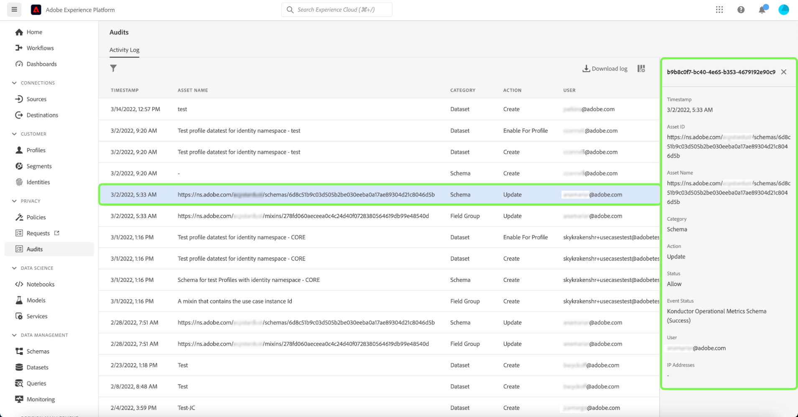

# Integración del registro de auditoría [!DNL Query Service]

La integración del registro de auditoría [!DNL Query Service] de Adobe Experience Platform proporciona registros de las acciones de usuario relacionadas con consultas. Los registros de auditoría son una herramienta esencial para solucionar problemas y cumplir con las políticas de administración de datos corporativos y los requisitos regulatorios. La capacidad permite devolver un registro de acciones para muchos tipos de eventos y filtrar y exportar los registros. Se puede acceder a los registros a través de la interfaz de usuario de Experience Platform o de la [API de consulta de auditoría](https://www.adobe.io/experience-platform-apis/references/audit-query/) y descargarlos en los formatos de archivo CSV o JSON.

Para obtener más información sobre la interfaz de usuario de registros de auditoría, consulte el [documento de información general de registros de auditoría](../../landing/governance-privacy-security/audit-logs/overview.md). Para obtener más información sobre cómo realizar llamadas a las API de Experience Platform, consulte la [guía de API de registros de auditoría](../../landing/api-guide.md).

>[!NOTE]
>
>Se registran las acciones de desalojo de sesión. Para ver los flujos de trabajo de IU, consulte [Administrar sesiones del servicio de consultas](../ui/session-management.md).

## Requisitos previos

Debe tener el permiso [!DNL Data Governance] [!UICONTROL View User Activity Log] habilitado para ver el panel de registro de auditoría en la interfaz de usuario de Experience Platform. El permiso se habilita a través de Adobe [Admin Console](https://adminconsole.adobe.com/). Póngase en contacto con el administrador de su organización si no tiene privilegios de administrador para habilitar este permiso. Consulte la documentación de control de acceso para obtener [instrucciones completas sobre cómo agregar permisos a través de Admin Console](../../access-control/home.md).

## [!DNL Query Service] categorías de registros de auditoría {#audit-log-categories}

Las categorías de registro de auditoría proporcionadas por [!DNL Query Service] son las siguientes.

| Categoría | Descripción |
|---|---|
| [!UICONTROL Query] | Esta categoría le permite auditar las ejecuciones de consultas. |
| [!UICONTROL Query template] | Esta categoría le permite auditar las distintas acciones (crear, actualizar y eliminar) realizadas en una plantilla de consulta. |
| [!UICONTROL Scheduled query] | Esta categoría le permite auditar las programaciones que se han creado, actualizado o eliminado en [!DNL Query Service]. |

## Realizar un registro de auditoría [!DNL Query Service] {#perform-an-audit-log}

Para realizar una auditoría de [!DNL Query Service] actividades, seleccione **[!UICONTROL Audits]** en el panel de navegación izquierdo, seguido del icono de funnel () para mostrar una lista de controles de filtro y ayudar a reducir los resultados.

Desde la ficha [!UICONTROL Audits] del tablero [!UICONTROL Activity log], puede filtrar todas las acciones de Experience Platform registradas por cualquiera de las [!DNL Query Service] categorías. Los resultados del registro se pueden filtrar aún más en función del período de tiempo en que se ejecutaron, la acción/función realizada o el usuario que implementó la consulta. Consulte la documentación del registro de auditoría para obtener [instrucciones completas sobre cómo filtrar los registros en función de la categoría, la acción, el usuario y el estado](../../landing/governance-privacy-security/audit-logs/overview.md#managing-audit-logs-in-the-ui).

Los datos de registro de auditoría devueltos contienen la siguiente información sobre todas las consultas que cumplen los criterios de filtro seleccionados.

| Nombre de columna | Descripción |
|---|---|
| [!UICONTROL Timestamp] | La fecha y hora exactas de la acción realizada en formato `month/day/year hour:minute AM/PM`. |
| [!UICONTROL Asset Name] | El valor del campo [!UICONTROL Asset Name] depende de la categoría elegida como filtro. Al usar la categoría [!UICONTROL Scheduled query], este es el **nombre de programación**. Al usar la categoría [!UICONTROL Query template], este es el **nombre de plantilla**. Cuando se usa la categoría [!UICONTROL Query], este es el **identificador de sesión** |
| [!UICONTROL Category] | Este campo coincide con la categoría seleccionada por usted en la lista desplegable de filtros. |
| [!UICONTROL Action] | Esto puede ser crear, eliminar, actualizar o ejecutar. Las acciones disponibles dependen de la categoría elegida como filtro. |
| [!UICONTROL User] | Este campo proporciona el ID de usuario que ejecutó la consulta. |

>[!NOTE]
>
>La descarga de los resultados del registro en los formatos de archivo CSV o JSON proporciona más detalles de consulta que los mostrados de forma predeterminada en el panel de registro de auditoría.

## Panel Detalles

Seleccione cualquier fila de resultados de registro de auditoría para abrir un panel de detalles a la derecha de la pantalla.

El panel de detalles se puede usar para encontrar [!UICONTROL Asset ID] y [!UICONTROL Event status].

El valor de [!UICONTROL Asset ID] cambia según la categoría utilizada en la auditoría.

* Al usar la categoría [!UICONTROL Query], [!UICONTROL Asset ID] es el **identificador de sesión**.
* Cuando se usa la categoría [!UICONTROL Query template], [!UICONTROL Asset ID] es el **identificador de plantilla** con el prefijo `[!UICONTROL templateID:]`.
* Cuando se usa la categoría [!UICONTROL Scheduled query], [!UICONTROL Asset ID] es el **identificador de programación** con el prefijo `[!UICONTROL scheduleID:]`.

El valor de [!UICONTROL Event status] cambia según la categoría utilizada en la auditoría.

* Al usar la categoría [!UICONTROL Query], el campo [!UICONTROL Event status] proporciona una lista de todos los **ID de consulta** ejecutados por el usuario dentro de esa sesión.
* Al usar la categoría [!UICONTROL Query template], el campo [!UICONTROL Event status] proporciona el **nombre de plantilla** como prefijo para el estado del evento.
* Al usar la categoría [!UICONTROL Query schedule], el campo [!UICONTROL Event status] proporciona el **nombre de programación** como prefijo para el estado del evento.

## Filtros disponibles para [!DNL Query Service] categorías de registro de auditoría {#available-filters}

Los filtros disponibles varían según la categoría seleccionada en la lista desplegable. La siguiente tabla detalla los filtros disponibles para [[!DNL Query Service] categorías de registros de auditoría](#audit-log-categories).

| Filtro | Descripción |
|---|---|
| Categoría | Consulte la sección [[!DNL Query Service] categorías de registros de auditoría](#audit-log-categories) para obtener una lista completa de las categorías disponibles. |
| Acción | Al hacer referencia a [!DNL Query Service] categorías de auditoría, la actualización es una **modificación del formulario existente**, la eliminación es la **eliminación de la programación o plantilla**, la creación es **creación de una nueva programación o plantilla** y la ejecución es **ejecución de una consulta**. |
| Usuario | Introduzca el ID de usuario completo (por ejemplo, johndoe@acme.com) para filtrar por usuario. |
| Estado | Las opciones [!UICONTROL Allow], [!UICONTROL Success] y [!UICONTROL Failure] filtran los registros en función del &quot;estado&quot; o del &quot;estado de evento&quot;, mientras que la opción [!UICONTROL Deny] filtrará **todos los** registros. |
| Fecha | Seleccione una fecha de inicio o de finalización para definir un intervalo de fechas en el que filtrar los resultados. |

## Próximos pasos

Al leer este documento, entiende mejor la capacidad del registro de auditoría [!DNL Query Service] y cómo se puede utilizar para filtrar las acciones de usuario de [!DNL Query Service].

Si está usando la funcionalidad de registro de auditoría [!DNL Query Service] para solucionar problemas, se recomienda que lea la [guía de solución de problemas](../troubleshooting-guide.md).
