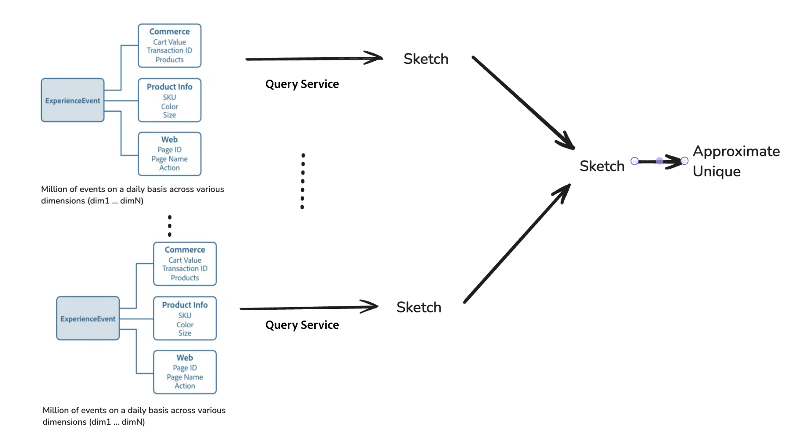

# Análisis eficiente de big data con hipercubos

>[!AVAILABILITY]
>
>Esta funcionalidad solo está disponible para los usuarios que hayan comprado el [SKU de Data Distiller](../data-distiller/overview.md). Póngase en contacto con el representante del Adobe para obtener más información.

Aprenda a utilizar hipercubos en el servicio Experience Query de Adobe Experience Platform para realizar análisis de datos avanzados con una eficacia mejorada. Este documento explica cómo usar funciones avanzadas de la [[!DNL Apache Datasketches] biblioteca](https://datasketches.apache.org/) para controlar de forma incremental recuentos distintos y cálculos complejos, sin tener que volver a procesar los datos históricos cada vez.

En el análisis de big data, la generación de métricas como recuentos distintos, cuantiles, elementos más frecuentes, uniones y análisis de gráficos a menudo implica un recuento no aditivo (donde los resultados no se pueden resumir simplemente a partir de subgrupos). Los métodos tradicionales requieren volver a procesar todos los datos históricos, lo que puede consumir muchos recursos y tiempo. Utilice bocetos, que son resúmenes compactos que utilizan probabilidades para representar conjuntos de datos grandes, y funciones avanzadas del servicio de consultas para optimizar este proceso al reducir la necesidad de volver a calcular.

## Funciones clave de los hipercubos {#key-functions}

Hypercubes ofrece varias funciones potentes para mejorar la eficiencia y flexibilidad del análisis de datos.

1. **Contar usuarios únicos o consultas distintas**: Use las capacidades SQL para generar recuentos únicos de usuarios que interactúen con diversas dimensiones de datos, como vistas de productos, visitas al sitio o actividad comercial, sin volver a analizar repetidamente los datos sin procesar.
2. **Procesamiento incremental**: realice actualizaciones incrementales para plegar y combinar puntos de datos en dimensiones y tiempo sin volver a calcular todo desde cero.
3. **Análisis multidimensional**: Los hipercubos habilitan el filtrado multidimensional y la reorganización de datos para crear filas de resumen que representan combinaciones de dimensiones. Estos resúmenes se pueden utilizar para generar perspectivas con una sobrecarga de cálculo mínima.

## Casos de uso de hipercubos {#use-cases}

Utilice hipercubos para generar de forma eficaz recuentos distintos para varias interacciones de usuario sin volver a calcular los datos por completo cada vez. A continuación se indican algunos escenarios prácticos para su uso:

- Analizar visitantes únicos que ven productos específicos durante un período de tiempo definido.
- Identifique a los usuarios que interactúen con varios productos en un periodo determinado para mejorar el análisis de ventas cruzadas.
- Distingue a los usuarios que interactúan con un producto, pero no con otro, a lo largo del tiempo para descubrir patrones de preferencias.
- Combine datos de interacción en línea y sin conexión para obtener una vista completa del comportamiento del usuario durante un periodo determinado.
- Rastree el movimiento del usuario en diferentes actividades dentro de un evento para optimizar el diseño y los servicios.

## Beneficios del uso de hipercubos

En estas situaciones, puede precalcular la información básica para categorías específicas. Sin embargo, al analizar datos en varias dimensiones y períodos de tiempo, debe volver a calcular todo desde los datos sin procesar o utilizar un hipercubo de servicio de consulta. Los hipercubos agilizan el proceso al organizar los datos de manera eficiente, lo que permite un filtrado flexible y un análisis multidimensional sin necesidad de volver a procesarlos. Utilizan funciones avanzadas para estimar los resultados de forma rápida y precisa para ofrecer ventajas clave como una mayor eficiencia de procesamiento, escalabilidad y adaptabilidad para tareas analíticas complejas.

### Eficiencia del tamaño de los datos para el procesamiento de consultas

El servicio de consultas puede comprimir millones o miles de millones de puntos de datos (por ejemplo, ID de usuario) en un formulario compacto denominado boceto. Este boceto tiene un tamaño de datos significativamente reducido para el procesamiento de consultas, lo que mantiene la escalabilidad y hace que trabajar con él sea mucho más fácil y rápido. Independientemente del tamaño que tengan los datos originales, el tamaño del boceto sigue siendo pequeño, lo que hace que el análisis de big data sea mucho más manejable y eficiente.

El diagrama siguiente ilustra cómo se procesan los ExperienceEvents de Commerce, información del producto y dimensión web en bocetos, que luego se utilizan para aproximar recuentos únicos.


### Combinar bocetos para que el análisis de datos sea más rápido y sencillo

Para evitar volver a calcular y mejorar la velocidad de procesamiento, puede combinar bocetos de diferentes categorías o grupos. Query Service también simplifica el diseño al organizar los datos en un hipercubo, donde cada fila se convierte en un resumen de su partición (una colección de dimensiones) junto a la columna de boceto. Cada fila del híper cubo contiene la combinación de dimensiones, pero no tiene datos sin procesar. Al ejecutar una consulta, especifique las columnas dimensionales que desee utilizar para crear métricas aditivas y combine los bocetos de esas filas.



### Rentabilidad {#cost-effectiveness}

Los datos del cliente suelen ser a gran escala, pero puede eliminar la necesidad de volver a procesar los datos históricos mediante el procesamiento incremental. Los bocetos son mucho más pequeños y permiten obtener resultados más rápidos en tiempo real, al tiempo que ahorran recursos y costes informáticos. Esta transformación de datos hace que las consultas interactivas sean más factibles y eficientes.

## Información general sobre funciones

En esta sección se describe cómo cada función optimiza el procesamiento de datos y mejora las capacidades analíticas mediante el uso eficiente de bocetos e hipercubos. Detalla su propósito, sintaxis de ejemplo, parámetros y resultado esperado.

### Crear estimaciones de recuento únicas con bocetos HTML

`hll_build_agg` es una función de agregado que crea un boceto de HLL (HyperLogLog). Esta función es un método compacto y probabilístico para estimar el número de valores únicos dentro de una columna o expresión en un conjunto de datos agrupado.

#### Definición de función

```sql
hll_build_agg(column [, lgConfigK])
```

**Uso:**

En el siguiente ejemplo se muestra cómo se puede estructurar la función dentro de una consulta.

```sql
SELECT
   [dim1, dim2 ... ,] hll_build_agg(coalesce(col1, col2, col3)) AS sketch_col
FROM fact_sketch_table
  [GROUP BY dimension1, dimension2 ...]
```

#### Parámetros

| Parámetro | Descripción |
|---------------------------|---------------------------------------|
| `column` | El nombre de la columna o columna en la que se creará un boceto. |
| `lgConfigK` | *Int* (opcional) El log-base-2 de K, donde K es el número de contenedores o ranuras para el boceto HTML. Valor mínimo: 4. Valor máximo: 12. Valor predeterminado: 12. |

#### Salida

| Columna de salida | Descripción |
|---------------------------|---------------------------------------|
| `sketch_res` | Una columna de tipo cadena que contiene el boceto de HLL estringido. |

#### Ejemplo de SQL

El ejemplo siguiente crea un boceto agregado en la columna `customer_id`:

```sql
SELECT
  country,
  hll_build_agg(customer_id, 10) AS sketch
FROM
  EXPLODE(
    ARRAY<STRUCT<country STRING, customer_id STRING, invoice_id STRING>>[
      ('UA', 'customer_id_1', 'invoice_id_11'),
      ('CZ', 'customer_id_2', 'invoice_id_22'),
      ('CZ', 'customer_id_2', 'invoice_id_23'),
      ('BR', 'customer_id_3', 'invoice_id_31'),
      ('UA', 'customer_id_2', 'invoice_id_24')
    ])
GROUP BY country;
```

**Salida de ejemplo de SQL:**

| País | Bosquejar |
|---------|------------------------------------------------------------|
| UA | AgEHBAMAAgCR9mUEulKKCQAAAAAAAAAAAAAAAAAAAAAAAAAAAAAAAA== |
| CZ | AgEHBAMAAQC6UooJAAAAAAAAAAAAAAAAAAAAAAAAAAAAAA== |
| BR | AgEHBAMAAQCcmH0HAAAAAAAAAAAAAAAAAAAAAAAAAAAAAA== |

### Calcular recuentos distintos con bocetos HTML

`hll_estimate` es una función escalar que proporciona una estimación del recuento distinto dentro de cada fila de un conjunto de datos. A diferencia de las funciones acumuladas, `hll_estimate` funciona en el sentido de las filas y se utiliza para estimar el recuento distinto de un boceto dentro de filas individuales.

>[!NOTE]
>
>Esta función no se puede utilizar como función agregada. Para los recuentos agregados, use `sketch_count`.

#### Definición de función

```sql
hll_estimate(sketch_col)
```

**Uso:**

En el siguiente ejemplo se muestra cómo se puede estructurar la función dentro de una consulta.

```sql
SELECT
   [col1, col2 ... ,] hll_estimate(sketch_column) AS estimate
FROM fact_sketch_table
```

#### Parámetros

| Parámetro | Descripción |
|---------------------------|---------------------------------------|
| `sketch_column` | Columna que contiene un boceto de HLL estringido. Calcula el recuento distinto del boceto en cada fila. |

#### Salida

| Columna de salida | Descripción |
|---------------------------|---------------------------------------|
| `estimate` | Columna de tipo double que proporciona la estimación del boceto, redondeada a dos decimales. |

#### Ejemplo de SQL

El ejemplo siguiente calcula el recuento distinto de clientes por país mediante la función `hll_estimate` en un boceto de HLL:

```sql
SELECT
  country,
  hll_estimate(hll_build_agg(customer_id, 10)) AS distinct_customers_by_country
FROM
  (
    SELECT
      country,
      hll_build_agg(customer_id, 10) AS sketch
    FROM 
      EXPLODE(
        ARRAY<STRUCT<country STRING, customer_id STRING, invoice_id STRING>>[
          ('UA', 'customer_id_1', 'invoice_id_11'),
          ('CZ', 'customer_id_2', 'invoice_id_22'),
          ('CZ', 'customer_id_2', 'invoice_id_23'),
          ('BR', 'customer_id_3', 'invoice_id_31'),
          ('UA', 'customer_id_2', 'invoice_id_24')
        ])
    GROUP BY country
  );
```

**Salida de ejemplo de SQL:**

| País | distinct_customers_by_country |
|---------|-------------------------------|
| UA | 2,00 |
| CZ | 1,00 |
| BR | 1,00 |

### Combinar varios bocetos de HLL con `hll_merge_agg`

`hll_merge_agg` es una función de agregado que combina varios bocetos de HLL dentro de un grupo y genera un nuevo boceto como salida. Permite la combinación de bocetos entre particiones o dimensiones, lo que mejora la flexibilidad del análisis de datos.

#### Definición de función

```sql
hll_merge_agg(sketch_col [, allowDifferentLgConfigK])
```

**Uso:**

En el siguiente ejemplo se muestra cómo se puede estructurar la función dentro de una consulta.

```sql
SELECT
   [dim1, dim2 ... ,] hll_merge_agg(sketch_column.sketch) AS estimate
FROM fact_sketch_table
  [GROUP BY dimension1, dimension2 ...]
```

#### Parámetros

| Parámetro | Descripción |
|---------------------------|---------------------------------------|
| `sketch_column` | Columna que contiene el boceto de HLL estringido. |
| `allowDifferentLgConfigK` | *Boolean* (Opcional) Si se establece en true, permite combinar bocetos con valores de `lgConfigK` diferentes. El valor predeterminado es false. Se genera una excepción si el valor es false y los bocetos tienen `lgConfigK` valores diferentes. |

>[!NOTE]
>
>Si `allowDifferentLgConfigK` se establece como falso, la combinación de bocetos con diferentes valores de `lgConfigK` resultará en un `UnsupportedOperationException`.

#### Salida

| Columna de salida | Descripción |
|----------------|-------------------------------------------------|
| `sketch_res` | Columna de tipo boceto HTML que contiene el boceto HTML combinado estringido. |

#### Ejemplo de SQL

El ejemplo siguiente combina varios bocetos de HLL en la columna `customer_id`:

```sql
SELECT
   hll_merge_agg(hll_sketch) AS uniq_customers_with_invoice
FROM
  (
    SELECT
      country,
      hll_build_agg(customer_id) AS hll_sketch
    FROM
      EXPLODE(
        ARRAY<STRUCT<country STRING, customer_id STRING, invoice_id STRING>>[
          ('UA', 'customer_id_1', 'invoice_id_11'),
          ('BR', 'customer_id_3', 'invoice_id_31'),
          ('CZ', 'customer_id_2', 'invoice_id_22'),
          ('CZ', 'customer_id_2', 'invoice_id_23'),
          ('BR', 'customer_id_3', 'invoice_id_31'),
          ('UA', 'customer_id_2', 'invoice_id_24')
        ])
    GROUP BY country
    UNION
    SELECT
      country,
      hll_build_agg(customer_id) AS hll_sketch
    FROM
      EXPLODE(
        ARRAY<STRUCT<country STRING, customer_id STRING, invoice_id STRING>>[
          ('UA', 'customer_id_1', 'invoice_id_21'),
          ('MX', 'customer_id_3', 'invoice_id_31'),
          ('MX', 'customer_id_2', 'invoice_id_21')
        ])
    GROUP BY country
  )
GROUP BY customer_id;
```

**Salida de ejemplo de SQL:**

| País | hll_merge_agg(sketch, true) |
|---------|--------------------------------------------|
| UA | AgEHDAMAAwiR9mUEulKKCQAAAAAAAAAAAAAA== |
| CZ | AgEHDAMAAQi6UooJAAAAAAAAAAAAAAAAAAAAAA== |
| BR | AgEHDAMAAQicmH0HAAAAAAAAAAAAAAAAAAAAAAAA== |
| MX | AgEHFQMAAgiGL/kNdAAAAAAAAAAAAAAAAA== |

### Estimar cardinalidad con `hll_merge_count_agg`

`hll_merge_count_agg` es una función de agregado que calcula la cardinalidad (número de elementos únicos) de uno o más bocetos dentro de una columna. Devuelve una sola estimación para todos los bocetos encontrados dentro de la agrupación. Esta función se utiliza para añadir bocetos y no se puede utilizar como transformación en el sentido de las filas. Para las estimaciones de filas, use `sketch_estimate`.

#### Definición de función

```sql
hll_merge_count_agg(sketch_col [, allowDifferentLgConfigK])
```

**Uso:**

En el siguiente ejemplo se muestra cómo se puede estructurar la función dentro de una consulta.

```sql
SELECT
   [dim1, dim2 ... ,] hll_merge_count_agg(sketch_column) AS estimate
FROM fact_sketch_table
  [GROUP BY dimension1, dimension2 ...]
```

#### Parámetros

| Parámetro | Descripción |
|-------------------------|----------------------------------------------|
| `sketch_column` | Columna que contiene el boceto de HLL estringido. |
| `allowDifferentLgConfigK` | *Booleano* (Opcional) El valor predeterminado es falso. Si se establece en true, permite combinar bocetos con diferentes valores de `lgConfigK`. De lo contrario, se produce un `UnsupportedOperationException`. |

#### Salida

| Columna de salida | Descripción |
|---------------|----------------------------------------------------------|
| `estimate` | Una columna de tipo Double que proporciona la estimación del boceto. |

#### Ejemplo de SQL

El ejemplo siguiente calcula el número de clientes únicos con facturas que utilizan la función `hll_merge_count_agg`:

```sql
SELECT
   hll_merge_count_agg(hll_sketch) AS uniq_customers_with_invoice
FROM
  (
    SELECT
      country,
      hll_build_agg(customer_id) AS hll_sketch
    FROM
      EXPLODE(
        ARRAY<STRUCT<country STRING, customer_id STRING, invoice_id STRING>>[
          ('UA', 'customer_id_1', 'invoice_id_11'),
          ('BR', 'customer_id_3', 'invoice_id_31'),
          ('CZ', 'customer_id_2', 'invoice_id_22'),
          ('CZ', 'customer_id_2', 'invoice_id_23'),
          ('BR', 'customer_id_3', 'invoice_id_31'),
          ('UA', 'customer_id_2', 'invoice_id_24')
        ])
    GROUP BY country
    UNION
    SELECT
      country,
      hll_build_agg(customer_id) AS hll_sketch
    FROM
      EXPLODE(
        ARRAY<STRUCT<country STRING, customer_id STRING, invoice_id STRING>>[
          ('UA', 'customer_id_1', 'invoice_id_21'),
          ('MX', 'customer_id_3', 'invoice_id_31'),
          ('MX', 'customer_id_2', 'invoice_id_21')
        ])
    GROUP BY country
  )
GROUP BY customer_id;
```

**Salida de ejemplo de SQL:**

| País | hll_merge_count_agg(sketch, true) |
|---------|----------------------------------|
| UA | 2.0 |
| CZ | 1,0 |
| BR | 1,0 |
| MX | 2.0 |

## Limitaciones

Actualmente, los bocetos no se pueden actualizar una vez creados. Las futuras actualizaciones introducirán la capacidad de actualizar bocetos. Con esta funcionalidad, puede gestionar las ejecuciones perdidas y los datos que llegan tarde de forma más eficaz.

## Pasos siguientes

Al leer este documento, ahora sabe cómo utilizar hipercubos y funciones de boceto asociadas para realizar un procesamiento de datos eficiente para análisis complejos y multidimensionales sin necesidad de volver a procesar los datos históricos. Este método ahorra tiempo, reduce costes y ofrece la flexibilidad necesaria para consultas interactivas en tiempo real, lo que lo convierte en una valiosa herramienta para el análisis de big data en Adobe Experience Platform.

A continuación, explore otros conceptos clave, como [carga incremental](../key-concepts/incremental-load.md) y [deduplicación de datos](../key-concepts/deduplication.md), para profundizar en cómo usar estas funciones de manera efectiva para sus necesidades de datos específicas.


