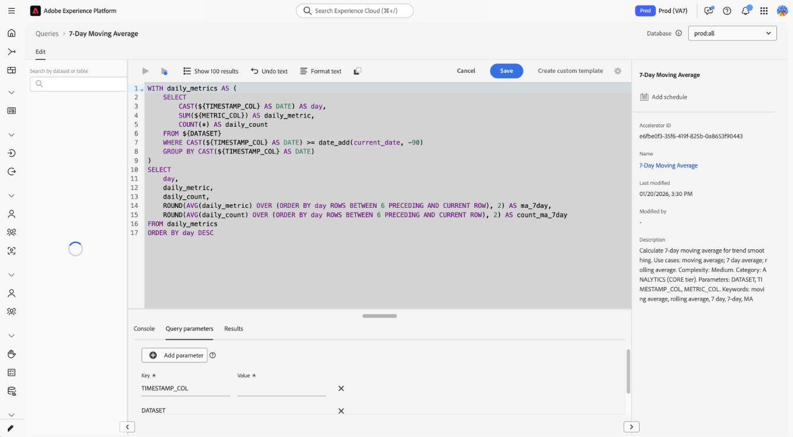

# Aceleradores de Data Distiller {#data-distiller-accelerators}

Los aceleradores de Data Distiller son plantillas SQL parametrizadas creadas por Adobe y diseñadas para escenarios analíticos comunes. Utilice aceleradores para ejecutar análisis comunes sin escribir SQL desde cero. Los aceleradores son de solo lectura y Adobe los mantiene, lo que garantiza la coherencia en toda la organización. Si necesita modificar una, puede clonarla como plantilla personalizada.

Lea esta guía para obtener información sobre cómo ejecutar, programar y clonar aceleradores en el área de trabajo [!UICONTROL Queries].

>[!AVAILABILITY]
>
>Data Distiller Accelerators solo está disponible para organizaciones con un SKU de Data Distiller. La pestaña [!UICONTROL Accelerators] y los flujos de trabajo relacionados requieren el complemento Data Distiller. Consulta la [descripción general de Data Distiller](../data-distiller/overview.md) o ponte en contacto con tu representante de Adobe para obtener más información.

## Requisitos previos {#prerequisites}

Antes de empezar, asegúrese de cumplir los siguientes requisitos:

* Tiene acceso al área de trabajo [!UICONTROL Queries] en Experience Platform.
* Entiende [cómo usar el Editor de consultas y ejecutar consultas](./user-guide.md).
* Está familiarizado con [consultas parametrizadas](./parameterized-queries.md) (los marcadores de posición en SQL se reemplazaron durante la ejecución).

## Cuándo usar aceleradores {#when-to-use}

Utilice aceleradores cuando necesite SQL creado previamente para patrones analíticos comunes como análisis de funnel, promedios móviles o superposición de audiencias. Si ningún acelerador se ajusta a su caso de uso, [escriba una consulta personalizada en el Editor de consultas](./user-guide.md#query-authoring) o solicite un nuevo acelerador (consulte [Solicitar un nuevo acelerador](#request-accelerator)).

Un pequeño conjunto de aceleradores se abre como tableros para su análisis inmediato, mientras que otros se abren en el Editor de consultas, donde puede ejecutar, programar o adaptar la lógica. Consulte la sección [Aceleradores vinculados al panel](#dashboard-accelerators) para ver cómo estas visualizaciones preconfiguradas ofrecen información sobre sus datos de audiencia.

Para empezar a usar aceleradores, vaya al área de trabajo **[!UICONTROL Queries]** y abra la ficha **[!UICONTROL Accelerators]** o **[!UICONTROL Overview]**.

## Rutas de detección de aceleradores {#discovery-paths}

Puede acceder a los aceleradores del espacio de trabajo Consultas de dos formas, en función de si desea el catálogo completo o las plantillas recomendadas.

### Uso de la pestaña Aceleradores

Utilice esta ruta cuando desee examinar todos los aceleradores disponibles. Para abrir el catálogo completo del acelerador, seleccione **[!UICONTROL Queries]** en el panel de navegación izquierdo y, a continuación, seleccione la pestaña **[!UICONTROL Accelerators]**.

El espacio de trabajo muestra una tabla de aceleradores con nombres, vistas previas SQL y marcas de tiempo. Seleccione un nombre de acelerador para abrirlo en el Editor de consultas.

>[!NOTE]
>
>Todos los aceleradores seleccionados de la ficha **[!UICONTROL Accelerators]** se abren en el Editor de consultas.

### Uso de la pestaña Información general

Utilice esta ruta cuando desee acceder rápidamente a los aceleradores más recomendados. Vaya a **[!UICONTROL Queries]** y, a continuación, seleccione la ficha **[!UICONTROL Overview]**. A continuación, seleccione una tarjeta de la sección **[!UICONTROL Recommended Data Distiller accelerators]**.

La mayoría de los aceleradores se abren en el Editor de consultas. Un pequeño conjunto de aceleradores se abre como paneles con visualizaciones creadas previamente. Si la tarjeta abre un panel en lugar del Editor de consultas, vea [Aceleradores vinculados a paneles](#dashboard-accelerators).

## Abra un acelerador en el Editor de consultas {#open-accelerator}

En esta sección se explica qué sucede cuando se abre un acelerador en el Editor de consultas y las acciones que se pueden realizar a continuación, como ejecutar el acelerador, programarlo o crear una plantilla personalizada.

Después de abrir un acelerador, puedes **ejecutar** el acelerador para ver los resultados, **programar** el acelerador para que se ejecute automáticamente o **crear una plantilla personalizada** para modificar el SQL.

>[!NOTE]
>
>Cuando abre un acelerador en el Editor de consultas, el SQL se carga previamente en un estado de solo lectura y las acciones de la barra de herramientas como [!UICONTROL Show results], [!UICONTROL Undo text], [!UICONTROL Format text] se han deshabilitado.

El panel derecho muestra metadatos como **[!UICONTROL Accelerator ID]**, **[!UICONTROL Name]** y detalles de modificación, y proporciona acceso a la programación mediante **[!UICONTROL Add schedule]**.

### Proporcione parámetros y ejecute un acelerador {#provide-parameters-execute}

Para ejecutar el acelerador, primero debe proporcionar valores para todos los parámetros necesarios. Los parámetros utilizan la sintaxis `${PARAMETER_NAME}` y aparecen en la ficha **[!UICONTROL Query parameters]** debajo del editor. Por ejemplo, `${START_DATE}` requiere un valor de fecha en formato `YYYY-MM-DD` (por ejemplo, `2024-01-01`), y `${AUDIENCE_ID}` requiere un identificador de audiencia específico.

Para ejecutar un acelerador:

1. Seleccione **[!UICONTROL Query parameters]** e introduzca un valor para cada parámetro.
2. Seleccione el icono de reproducción () en la barra de herramientas.

El acelerador se ejecuta y muestra los resultados en la ficha **[!UICONTROL Results]**. Estos resultados no se mantienen en un conjunto de datos a menos que utilice **[!UICONTROL Run as CTAS]** o programe el acelerador.

Para obtener más información sobre las consultas parametrizadas, consulte [Consultas parametrizadas en el Editor de consultas](./parameterized-queries.md).

## Conservar los resultados de un acelerador {#persist-results}

Después de ejecutar un acelerador y confirmar los resultados, puede mantener la salida en un conjunto de datos.

Para crear un conjunto de datos a partir de los resultados, seleccione **[!UICONTROL Save]** para guardar el acelerador como plantilla y, a continuación, seleccione **[!UICONTROL Run as CTAS]**. Aparecerá el cuadro de diálogo **[!UICONTROL Enter output dataset details]**. Introduzca un nombre de conjunto de datos y una descripción opcional y, a continuación, confirme la creación del conjunto de datos. Esta acción crea un nuevo conjunto de datos y escribe los resultados en él.

![Se ha rellenado el cuadro de diálogo [!UICONTROL Enter output dataset details] con un nombre y una descripción de conjunto de datos.](../images/ui/accelerators/output-dataset-details-dialog.png)

## Programar un acelerador {#schedule-accelerator}

Para programar la ejecución automática de un acelerador con valores de parámetro fijos, seleccione **[!UICONTROL Add schedule]** en el panel derecho.

>[!TIP]
>
>Antes de programar, asegúrese de comprender los valores de parámetro necesarios. Ejecute primero el acelerador para validar los resultados.

Aparecerá el cuadro de diálogo de configuración de programación.

En el cuadro de diálogo de configuración de programación, debe volver a proporcionar una frecuencia, un periodo de tiempo, un conjunto de datos de salida y valores de parámetro. Los valores de parámetro introducidos en el Editor de consultas no se llevan a la configuración de programación. En la sección **[!UICONTROL Dataset details]**, puede elegir entre **[!UICONTROL Append into existing dataset]** o **[!UICONTROL Create and append into new dataset]**. Después de configurar la programación, el acelerador se ejecuta automáticamente en función de la configuración y escribe los resultados en el conjunto de datos seleccionado.

Para obtener instrucciones paso a paso completas, consulte la guía [Crear una programación de consultas](./query-schedules.md#create-schedule).

## Creación de una plantilla personalizada a partir de un acelerador {#create-custom-template}

Si necesita modificar el SQL o reutilizar la lógica bajo su propia configuración, puede crear una plantilla personalizada a partir de un acelerador. Primero, abra un acelerador en el Editor de consultas y, a continuación, seleccione **[!UICONTROL Create custom template]**. Modifique el SQL y los detalles según sea necesario y seleccione **[!UICONTROL Save]** o **[!UICONTROL Save and close]** para almacenar la plantilla.

Una vez guardada, la plantilla es editable y se puede ejecutar, programar o utilizar con CTAS. La plantilla se guardará en la ficha **[!UICONTROL Templates]**, donde podrá administrarla como cualquier otra plantilla. Para obtener más información, consulte [Plantillas de consulta](./query-templates.md).

### Cambios al crear una plantilla personalizada {#custom-template-differences}

La plantilla clonada difiere del acelerador original porque el SQL es editable, puede guardar cambios, eliminar la plantilla y programarla. El campo **[!UICONTROL Modified by]** muestra su nombre. La plantilla se encuentra en la ficha **[!UICONTROL Templates]** en lugar de en **[!UICONTROL Accelerators]**.

## Aceleradores vinculados al panel {#dashboard-accelerators}

Algunos aceleradores de la ficha **[!UICONTROL Overview]** se abren como paneles en lugar de consultas SQL. Estos aceleradores proporcionan visualizaciones prediseñadas para analizar datos de audiencia y no requieren la entrada de parámetros ni la ejecución manual.

Los siguientes aceleradores se abren en el área de trabajo **[!UICONTROL Dashboards]**:

**[!UICONTROL Advanced Audience Overlaps]** analiza las intersecciones entre las audiencias seleccionadas o en todo el conjunto de audiencias para identificar patrones de superposición. Utilice estas perspectivas para refinar la segmentación y reducir la segmentación redundante.

**[!UICONTROL Audience Comparison]** compara métricas clave entre dos audiencias en paralelo, incluido el tamaño, la composición de identidad y los cambios con el paso del tiempo. Utilice esta vista para evaluar las diferencias de rendimiento e informar las decisiones de segmentación.

**[!UICONTROL Audience Trends]** registra cómo cambian las métricas de audiencia con el paso del tiempo, incluidos el tamaño de la audiencia y los recuentos de identidad. Utilice estas tendencias para monitorizar el crecimiento y evaluar el impacto de las estrategias de segmentación.

**[!UICONTROL Audience Identity Overlaps]** examina cómo los tipos de identidad se superponen dentro de las audiencias seleccionadas para comprender las relaciones de identidad. Utilice este análisis para mejorar la vinculación de identidad y la precisión de la segmentación.

Cuando se abra el tablero, utilice los controles y filtros disponibles para explorar y comparar los datos de audiencia. Para obtener más información, consulte [plantillas de tablero](../../dashboards/sql-insights-query-pro-mode/templates/overview.md).

## Solicitar un nuevo acelerador {#request-accelerator}

Si tiene un caso de uso recurrente que no está cubierto por los aceleradores existentes, envíe una solicitud a través de su canal de asistencia de Adobe. Adobe evalúa las solicitudes en función de patrones de uso comunes y de la aplicabilidad del sector.

## Próximos pasos {#next-steps}

Ahora puede utilizar aceleradores para ejecutar y automatizar consultas analíticas comunes.

Para ampliar los flujos de trabajo, cree y examine [plantillas de consulta](./query-templates.md#browse), cree [consultas parametrizadas](./parameterized-queries.md), programe [consultas](./query-schedules.md) o explore [flujos de trabajo del servicio de consulta](./user-guide.md).
