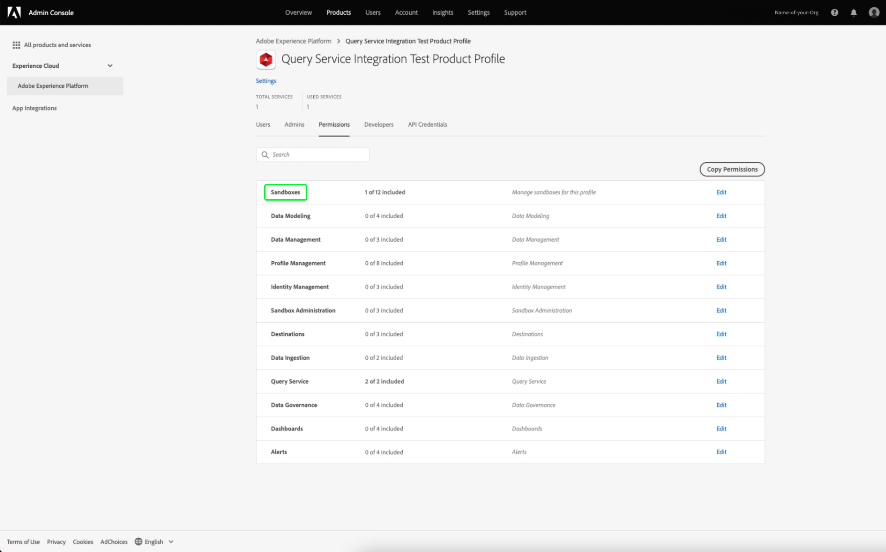
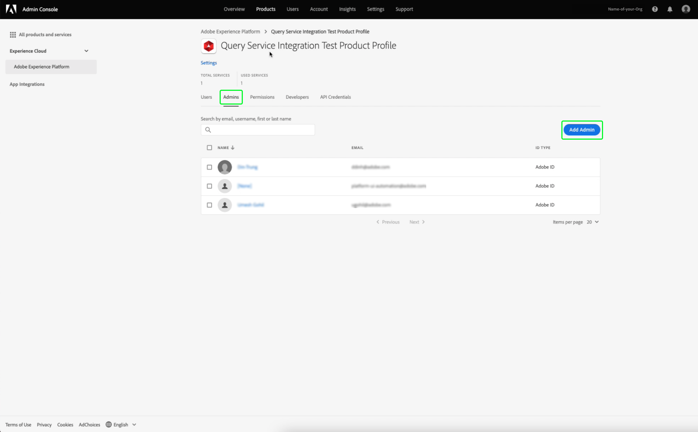

# Guía de credenciales

El servicio de consulta de Adobe Experience Platform le permite conectarse con clientes externos. Puede conectarse a estos clientes externos utilizando credenciales que caducan o credenciales que no caducan.

## Credenciales de caducidad

Puede utilizar las credenciales caducadas para configurar rápidamente una conexión con un cliente externo.


La sección **[!UICONTROL Credenciales de caducidad]** proporciona la siguiente información:

- **[!UICONTROL Host]**: Nombre del host al que se conectará. Para conectarse al servicio de consulta, esto incluirá el nombre de la organización de IMS que está utilizando actualmente.
- **[!UICONTROL Puerto]**: Número de puerto del host al que se conectará.
- **[!UICONTROL Base de datos]**: Nombre de la base de datos a la que se conectará.
- **[!UICONTROL Nombre de usuario]**: El nombre de usuario que utilizará para conectarse al servicio de consulta.
- **[!UICONTROL Contraseña]**: La contraseña que utilizará para conectarse al servicio de consulta.
- **[!UICONTROL Comando]** PSQL: Un comando que ha insertado automáticamente toda la información relevante para que se conecte al servicio de consulta mediante PSQL en la línea de comandos.
- **[!UICONTROL Caduca]**: La fecha de caducidad de las credenciales que caducan. Las credenciales caducan 24 horas después de generarse.

## Credenciales que no caducan

Puede utilizar credenciales que no caduquen para configurar una conexión más permanente con un cliente externo.

Para poder crear credenciales que no caduquen, debe configurar los permisos **Sandboxes** y **Administrar integración del servicio de consulta** para su organización en Adobe Admin Console.

Inicie sesión en [Adobe Admin Console](https://adminconsole.adobe.com/) y seleccione la organización correspondiente en la barra de navegación superior.

En la sección [!UICONTROL Products and services] de [!UICONTROL Overview], seleccione **Adobe Experience Platform**.


Aparecerá la página Detalles de Adobe Experience Platform. A continuación, cree un nuevo perfil. Seleccione [!UICONTROL **Nuevo perfil**].


Aparece un cuadro de diálogo de creación de perfiles. Escriba un nombre descriptivo para el nuevo perfil y seleccione [!UICONTROL **Guardar**]. Aparece la página [!UICONTROL Configuración] del nuevo perfil. Seleccione la pestaña [!UICONTROL **Permisos**] en las opciones disponibles.

### Habilitar permisos del servicio de consulta

Para asegurarse de que los permisos correctos del servicio de consulta están habilitados para su organización, busque y seleccione la categoría [!UICONTROL **Query Service**] en la lista.


Aparece el espacio de trabajo [!UICONTROL Editar permisos] para el servicio de consulta. Seleccione el icono de signo más (**+**) para [!UICONTROL **Administrar consultas**] y [!UICONTROL **Administrar integración del servicio de consultas**] para agregarlos a la columna [!UICONTROL Elementos de permisos incluidos]. A continuación, seleccione [!UICONTROL **Save**] para confirmar los cambios.


Esto le devuelve a la ficha Configuración > Permisos .

### Habilitar permisos de Sandbox

Para asegurarse de que el entorno limitado correcto está seleccionado para su organización, busque y seleccione la categoría [!UICONTROL **Sandboxes**] en la lista.



Aparecerá el espacio de trabajo Simuladores para pruebas. Desde [!UICONTROL Available Permission Items], busque el entorno limitado correspondiente, en esta imagen es el entorno limitado del producto. Seleccione el icono de signo más (**+**) para agregarlo a los [!UICONTROL Elementos de permiso incluidos]. A continuación, seleccione [!UICONTROL **Save**] para confirmar los cambios.


Esto le devuelve a la ficha Configuración > Permisos .

Se requieren tres pasos más para permitir que un usuario acceda a la función de cuenta que no caduca.

- Agregue un nuevo usuario para otorgar los permisos recién creados a . Seleccione la pestaña [!UICONTROL **Users**], seguida de [!UICONTROL **Add User**].


Aparecerá el cuadro de diálogo crear usuario. Introduzca un nombre y un correo electrónico para el nuevo usuario y seleccione [!UICONTROL **Save**].

- El usuario debe agregarse como administrador para permitir la creación de cuentas para cualquier perfil de producto activo. Para agregar el usuario recién creado como administrador. seleccione la pestaña [!UICONTROL **Administradores**], seguido de [!UICONTROL **Agregar administradores**].



Aparecerá el cuadro de diálogo agregar administrador. Introduzca los detalles del nuevo administrador en los campos de texto y seleccione [!UICONTROL **Save**].

- El usuario debe añadirse como desarrollador para que se cree una integración. Seleccione la pestaña **Developers**, seguida de **Add Developer**.


Aparece el cuadro de diálogo agregar desarrollador . Introduzca los detalles del nuevo desarrollador en los campos de texto y seleccione **Save**.

Para obtener más información sobre cómo asignar permisos, lea la documentación sobre [Control de acceso](../../access-control/home.md).

Todos los permisos necesarios ahora están configurados en la consola del desarrollador de Adobe para que el usuario utilice la función de credenciales caducadas.

Para crear un conjunto de credenciales que no caducan, en el espacio de trabajo Credenciales de consultas seleccione **[!UICONTROL Generar credenciales]**.


Aparece el modal de generación de credenciales. Para crear credenciales que no caduquen, debe proporcionar los siguientes detalles:

- **[!UICONTROL Nombre]**: Nombre de las credenciales que está generando.
- **[!UICONTROL Descripción]**: (Opcional) Descripción de las credenciales que está generando.
- **[!UICONTROL Asignado a]**: El usuario al que se asignarán las credenciales. Este valor debe ser la dirección de correo electrónico del usuario que está creando las credenciales.
- **[!UICONTROL Contraseña]**  (opcional) Una contraseña opcional para sus credenciales. Si la contraseña no está establecida, Adobe generará automáticamente una contraseña.

Una vez que haya proporcionado todos los detalles requeridos, seleccione **[!UICONTROL Generate credentials]** para generar sus credenciales.


>[!IMPORTANT]
>
>Una vez seleccionado el botón **[!UICONTROL Generate credentials]** , se descarga un archivo JSON de configuración en el equipo local. Dado que el Adobe **not** registra la credencial generada, **debe** almacenar de forma segura el archivo descargado y mantener un registro de la credencial.
>
>Además, si las credenciales no se utilizan durante 90 días, se cancelarán.

El archivo JSON de configuración contiene información como el nombre de cuenta técnica, el ID de cuenta técnica y las credenciales. Se proporciona en el siguiente formato.

```json
{"technicalAccountName":"9F0A21EE-B8F3-4165-9871-846D3C8BC49E@TECHACCT.ADOBE.COM","credential":"3d184fa9e0b94f33a7781905c05203ee","technicalAccountId":"4F2611B8613AA3670A495E55"}
```

Ahora que ha guardado las credenciales generadas, seleccione **[!UICONTROL Cerrar]**. Ahora puede ver una lista de todas sus credenciales que no caducan.


Puede editar o eliminar las credenciales que no caducan. Para editar una credencial que no caduque, seleccione el icono de lápiz (). Para eliminar una credencial que no caduque, seleccione el icono de eliminación ().

Al editar una credencial que no caduca, aparece un modal. Puede proporcionar los siguientes detalles para actualizar:

- **[!UICONTROL Nombre]**: Nombre de las credenciales que está generando.
- **[!UICONTROL Descripción]**: (Opcional) Descripción de las credenciales que está generando.
- **[!UICONTROL Asignado a]**: El usuario al que se asignarán las credenciales. Este valor debe ser la dirección de correo electrónico del usuario que está creando las credenciales.


Una vez que haya proporcionado todos los detalles requeridos, seleccione **[!UICONTROL Update account]** para completar la actualización de sus credenciales.

## Uso de credenciales para conectarse a clientes externos

Puede utilizar las credenciales que caducan o que no caducan para conectarse con clientes externos, como Aqua Data Studio, Looker o Power BI.

La tabla siguiente contiene la lista de parámetros y su descripción, que normalmente se requieren para conectarse a clientes externos.

>[!NOTE]
>
>Cuando se conecta a un host con credenciales que no caducan, sigue siendo necesario utilizar todos los parámetros enumerados en la sección [!UICONTROL EXPIRING CREDENTIALS] excepto la contraseña.

| Parámetro | Descripción |
|---|---|
| **Servidor/Host** | Nombre del servidor/host al que se está conectando. Este valor adopta la forma de `server.adobe.io` y se puede encontrar en **[!UICONTROL Host]**. |
| **Puerto** | Puerto para el servidor/host al que se está conectando. Este valor se puede encontrar en **[!UICONTROL Port]**. Un valor de ejemplo para el puerto sería `80`. |
| **Database** | La base de datos a la que se está conectando. Este valor se puede encontrar en **[!UICONTROL Database]**. Un valor de ejemplo para la base de datos sería `prod:all`. |
| **Nombre de usuario** | El nombre de usuario del usuario que se está conectando al cliente externo. Esto toma la forma de una cadena alfanumérica antes de `@AdobeOrg`. Este valor se encuentra en **[!UICONTROL Nombre de usuario]**. |
| **Contraseña** | La contraseña del usuario que se está conectando al cliente externo. <ul><li>Si está utilizando credenciales que caducan, esto se encuentra en **[!UICONTROL Contraseña]** dentro de la sección de credenciales que caducan.</li><li>Si utiliza credenciales que no caducan, este valor comprende los argumentos de technicalAccountID y las credenciales tomadas del archivo JSON de configuración. El valor de la contraseña adopta la forma: `{technicalAccountId}:{credential}`.</li></ul> |

## Pasos siguientes

Ahora que comprende cómo funcionan las credenciales que caducan y las que no caducan, puede utilizar estas credenciales para conectarse a clientes externos. Para obtener más información detallada sobre los clientes externos, lea la [guía de conexión de clientes a Query Service](../clients/overview.md).
