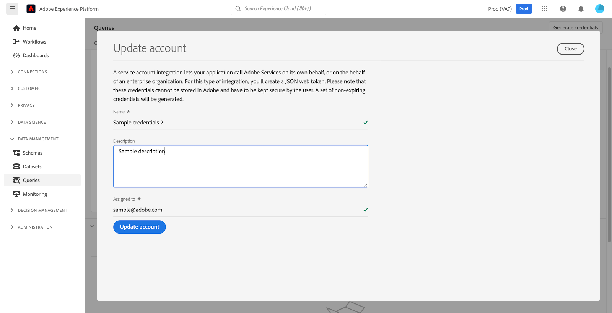

# Guía de credenciales

El servicio de consultas de Adobe Experience Platform le permite conectarse con clientes externos. Puede conectarse a estos clientes externos utilizando credenciales que caducan o que no caducan.

>[!NOTE]
>
>El panel Credenciales no está disponible automáticamente para todos los usuarios. Póngase en contacto con el equipo de su cuenta de Adobe para solicitar la [!UICONTROL Credenciales] para que se incluya en el espacio de trabajo del servicio de consultas en caso de que lo necesite. Si se solicita, este cambio es para toda la organización y está a cargo del equipo de ingeniería de Adobe. No es una configuración controlada por los usuarios.

## Credenciales que caducan {#expiring-credentials}

>[!CONTEXTUALHELP]
>id="platform_queryservice_credentials_expiringcredentials"
>title="Modo SSL del cliente"
>abstract="SSL debe estar habilitado en los clientes conectados al servicio de consultas. Asegúrese de que el modo SSL esté configurado en “requisito”."

Puede utilizar credenciales que caducan para configurar rápidamente una conexión con un cliente externo.


El **[!UICONTROL Credenciales que caducan]** proporciona la siguiente información:

- **[!UICONTROL Host]**: Nombre del host al que conectar al cliente. Esto incorpora el nombre de su organización, tal como se ve en la cinta superior de la interfaz de usuario de Platform.
- **[!UICONTROL Puerto]**: Número de puerto del host al que se va a conectar.
- **[!UICONTROL Base de datos]**: Nombre de la base de datos a la que conectar un cliente.
- **[!UICONTROL Nombre de usuario]**: El nombre de usuario utilizado para conectarse al servicio de consultas.
- **[!UICONTROL Contraseña]**: La contraseña utilizada para conectarse al servicio de consultas. Las contraseñas de la IU se han cifrado en hash por motivos de seguridad. Seleccione el icono de copia () para copiar las credenciales completas sin hash en el portapapeles.
- **[!UICONTROL comando PSQL]**: Un comando que ha insertado automáticamente toda la información relevante para conectarse al servicio de consultas mediante PSQL en la línea de comandos.
- **[!UICONTROL Caduca]**: la fecha y hora de caducidad de las credenciales que caducan. La duración de validez predeterminada del token es de 24 horas, pero se puede cambiar en la configuración avanzada del Admin Console.

>[!TIP]
>
>Para cambiar la duración de la sesión de la conexión de credenciales que caduca al servicio de consultas, vaya a [Admin Console](https://adminconsole.adobe.com/) y seleccione las siguientes opciones en la pantalla: **Configuración** > **Privacidad y seguridad** > **Configuración de autenticación** > **Configuración avanzada** > **Duración máxima de la sesión**.
>
>
>
>Consulte la documentación de ayuda de Adobe para obtener más información sobre la [Configuración avanzada](https://helpx.adobe.com/enterprise/using/authentication-settings.html#advanced-settings) ofrecido por Admin Console.

### Conectarse a los datos del Customer Journey Analytics en sesiones de consulta {#connect-to-customer-journey-analytics}

Utilice la extensión de Customer Journey Analytics BI con Power BI o Tableau para acceder a su Customer Journey Analytics [vistas de datos](https://experienceleague.adobe.com/en/docs/analytics-platform/using/cja-dataviews/data-views) con SQL. Al integrar el servicio de consultas con la extensión de BI, puede acceder a las vistas de datos directamente dentro de las sesiones del servicio de consultas. Esta integración optimiza la funcionalidad de las herramientas de BI que utilizan el servicio de consultas como interfaz PostgreSQL. Esta funcionalidad elimina la necesidad de duplicar vistas de datos en las herramientas de BI, garantiza la creación de informes coherentes en todas las plataformas y simplifica la integración de datos de Customer Journey Analytics con otras fuentes en las plataformas de BI.

Consulte la documentación para obtener información sobre cómo [conectar el servicio de consultas a diversas aplicaciones cliente de escritorio](../clients/overview.md) como [Power BI](../clients/power-bi.md) o [Tableau](../clients/tableau.md)

>[!IMPORTANT]
>
>Se requieren un proyecto del espacio de trabajo del Customer Journey Analytics y una vista de datos para utilizar esta funcionalidad.

Para acceder a los datos del Customer Journey Analytics en Power BI o Tableau, seleccione [!UICONTROL Base de datos] menú desplegable, luego seleccione `prod:cja` en las opciones disponibles. A continuación, copie su [!DNL Postgres] parámetros de credenciales (host, puerto, base de datos, nombre de usuario y otros) para su uso en la configuración de Power BI o Tableau.


>[!NOTE]
>
>Al conectar Power BI o Tableau a Customer Journey Analytics, se consume el derecho de &quot;sesiones simultáneas&quot; del servicio de consultas. Si se requieren sesiones y consultas adicionales, se puede adquirir un complemento adicional del paquete de usuarios de consultas ad hoc para obtener cinco sesiones simultáneas adicionales y una consulta simultánea adicional.

También puede acceder a los datos del Customer Journey Analytics directamente desde el Editor de consultas o la CLI de Postgres. Para ello, consulte la `cja` base de datos al escribir la consulta. Consulte el Editor de consultas [guía de creación de consultas](./user-guide.md#query-authoring) para obtener más información sobre cómo escribir, ejecutar y guardar consultas.

Consulte la [Guía de extensión de BI](https://experienceleague.adobe.com/en/docs/analytics-platform/using/cja-dataviews/bi-extension) para obtener instrucciones completas sobre el acceso a las vistas de datos del Customer Journey Analytics con SQL.

## Credenciales que no caducan {#non-expiring-credentials}

Puede utilizar credenciales que no caduquen para configurar una conexión más permanente con un cliente externo.

>[!NOTE]
>
>Las credenciales que no caducan tienen las siguientes limitaciones:<br><ul><li>Los usuarios deben iniciar sesión con un nombre de usuario y una contraseña que incluyan `{technicalAccountId}:{credential}`. Encontrará más información en la [Generar credenciales](#generate-credentials) sección.</li><li>Tras la creación de las credenciales que caducan, se crea una nueva función con un conjunto de permisos básicos que permite a los usuarios ver esquemas y conjuntos de datos. El permiso &quot;administrar consultas&quot; también se asigna a esta función para su uso con el servicio de consultas.</li><li>Los clientes de terceros pueden tener un rendimiento diferente del esperado al enumerar objetos de consulta. Por ejemplo, algunos clientes de terceros como [!DNL DB Visualizer] no mostrará el nombre de la vista en el panel izquierdo. Sin embargo, el nombre de vista es accesible si se llama dentro de una consulta SELECT. Del mismo modo, [!DNL PowerUI] es posible que no muestre las vistas temporales creadas a través de SQL que se van a seleccionar para la creación de tableros.</li></ul>

### Requisitos previos

Para poder generar credenciales que no caduquen, debe completar los siguientes pasos en Adobe Admin Console:

1. Iniciar sesión en [Adobe Admin Console](https://adminconsole.adobe.com/) y seleccione la organización correspondiente en la barra de navegación superior.
2. [Seleccione un perfil de producto.](../../access-control/ui/browse.md)
3. [Configure tanto la variable **Zonas protegidas** y **Administración de integración de Query Service** permissions](../../access-control/ui/permissions.md) para el perfil del producto.
4. [Añadir un nuevo usuario a un perfil de producto](../../access-control/ui/users.md) por lo tanto, se les otorgan los permisos configurados.
5. [Añadir el usuario como administrador de perfil de producto](https://helpx.adobe.com/es/enterprise/using/manage-product-profiles.html) para permitir la creación de una cuenta para cualquier perfil de producto activo.
6. [Añadir el usuario como desarrollador de perfiles de producto](https://helpx.adobe.com/es/enterprise/using/manage-developers.html) para crear una integración.

Para obtener más información sobre cómo asignar permisos, lea la documentación sobre [control de acceso](../../access-control/home.md).

Todos los permisos necesarios ahora están configurados en la consola de Adobe Developer para que el usuario utilice la función de credenciales que caducan.

### Generar credenciales {#generate-credentials}

Para crear un conjunto de credenciales que no caduquen, vuelva a la interfaz de usuario de Platform y seleccione **[!UICONTROL Consultas]** desde la navegación izquierda para acceder a [!UICONTROL Consultas] workspace. A continuación, seleccione la **[!UICONTROL Credenciales]** seguido de **[!UICONTROL Generar credenciales]**.


Aparece un cuadro de diálogo que le permite generar credenciales. Para crear credenciales que no caduquen, debe proporcionar los siguientes detalles:

- **[!UICONTROL Nombre]**: Nombre de las credenciales que está generando.
- **[!UICONTROL Descripción]**: (Opcional) Una descripción de las credenciales que está generando.
- **[!UICONTROL Asignado a]**: usuario al que se asignarán las credenciales. Este valor debe ser la dirección de correo electrónico del usuario que está creando las credenciales.
- **[!UICONTROL Contraseña]** (Opcional) Una contraseña opcional para sus credenciales. Si no se ha establecido la contraseña, el Adobe generará automáticamente una contraseña.

Una vez que haya proporcionado todos los detalles necesarios, seleccione **[!UICONTROL Generar credenciales]** para generar sus credenciales.


>[!IMPORTANT]
>
>Cuándo **[!UICONTROL Generar credenciales]** Cuando se selecciona, se descarga un archivo JSON de configuración en el equipo local. Ya que el Adobe sí **no** Para registrar las credenciales generadas, debe almacenar de forma segura el archivo descargado y mantener un registro de las credenciales.
>
>Además, si las credenciales no se utilizan durante 90 días, se eliminarán las credenciales.

El archivo JSON de configuración contiene información como el nombre de la cuenta técnica, el ID de la cuenta técnica y las credenciales. Se proporciona en el siguiente formato.

```json
{"technicalAccountName":"9F0A21EE-B8F3-4165-9871-846D3C8BC49E@TECHACCT.ADOBE.COM","credential":"3d184fa9e0b94f33a7781905c05203ee","technicalAccountId":"4F2611B8613AA3670A495E55"}
```

Una vez guardadas las credenciales generadas, seleccione **[!UICONTROL Cerrar]**. Ahora puede ver una lista de todas las credenciales que no caducan.


Puede editar o eliminar las credenciales que no caducan. Para editar una credencial que no caduque, seleccione el icono de lápiz (). Para eliminar una credencial que no caduque, seleccione el icono Eliminar ().

Al editar una credencial que no caduca, aparece un modal. Puede proporcionar los siguientes detalles para actualizar:

- **[!UICONTROL Nombre]**: Nombre de las credenciales que está generando.
- **[!UICONTROL Descripción]**: (Opcional) Una descripción de las credenciales que está generando.
- **[!UICONTROL Asignado a]**: usuario al que se asignarán las credenciales. Este valor debe ser la dirección de correo electrónico del usuario que está creando las credenciales.



Una vez que haya proporcionado todos los detalles necesarios, seleccione **[!UICONTROL Actualizar cuenta]** para completar la actualización de las credenciales.

## Usar credenciales para conectarse a clientes externos {#use-credential-to-connect}

Puede utilizar las credenciales que caducan o no caducan para conectarse con clientes externos, como Aqua Data Studio, Looker o Power BI. El método de entrada para estas credenciales variará según el cliente externo. Consulte la documentación del cliente externo para obtener instrucciones específicas sobre el uso de estas credenciales.

La imagen indica la ubicación de cada parámetro encontrado en la interfaz de usuario, excepto la contraseña de las credenciales que no caducan. Aunque los archivos de configuración JSON proporcionan credenciales que no caducan, puede ver las credenciales que caducan en el **Credenciales** en la interfaz de usuario.


En la tabla siguiente se describen los parámetros que suelen ser necesarios para conectarse a clientes externos.

>[!NOTE]
>
>Al conectarse a un host con credenciales que no caducan, sigue siendo necesario utilizar todos los parámetros enumerados en la [!UICONTROL CREDENCIALES QUE CADUCAN] excepto la contraseña y el nombre de usuario.
>El formato para introducir el nombre de usuario y la contraseña utiliza valores separados por dos puntos, como se ve en este ejemplo `username:{your_username}` y `password:{password_string}`.

| Parámetro | Descripción | Ejemplo |
|---|---|---|
| **Servidor/Host** | El nombre del servidor/host al que se está conectando. <ul><li>Este valor se utiliza tanto para credenciales que caducan como para credenciales que no caducan y adopta la forma de `server.adobe.io`. El valor se encuentra en **[!UICONTROL Host]** en el [!UICONTROL CREDENCIALES QUE CADUCAN] sección.</ul></li> | `acme.platform.adobe.io` |
| **Puerto** | El puerto del servidor/host al que se está conectando. <ul><li>Este valor se utiliza tanto para credenciales que caducan como para credenciales que no caducan y se encuentra en **[!UICONTROL Puerto]** en el [!UICONTROL CREDENCIALES QUE CADUCAN] sección.</ul></li> | `80` |
| **Database** | La base de datos a la que se está conectando. <ul><li>Este valor se utiliza tanto para credenciales que caducan como para credenciales que no caducan y se encuentra en **[!UICONTROL Base de datos]** en el [!UICONTROL CREDENCIALES QUE CADUCAN] sección. </ul></li> | `prod:all` |
| **Nombre de usuario** | El nombre de usuario del usuario que se está conectando al cliente externo. <ul><li>Este valor se utiliza tanto para credenciales que caducan como para credenciales que no caducan. Adopta la forma de una cadena alfanumérica antes de que `@AdobeOrg`. Este valor se encuentra en **[!UICONTROL Nombre de usuario]**.</li></ul> | `ECBB80245ECFC73E8A095EC9@AdobeOrg` |
| **Contraseña** | La contraseña del usuario que se está conectando al cliente externo. <ul><li>Si utiliza credenciales que caducan, se encuentra en **[!UICONTROL Contraseña]** dentro de [!UICONTROL CREDENCIALES QUE CADUCAN] sección.</li><li>Si utiliza credenciales que no caducan, este valor son los argumentos concatenados de technicalAccountID y la credencial tomada del archivo JSON de configuración. El valor de la contraseña adopta la forma siguiente: `{technicalAccountId}:{credential}`.</li></ul> | <ul><li>Una contraseña de credencial que caduca tiene más de mil caracteres como cadena alfanumérica. No se dará ningún ejemplo.</li><li>Una contraseña de credencial que no caduca es la siguiente:<br>`4F2611B8613DK3670V495N55:3d182fa9e0b54f33a7881305c06203ee`</li></ul> |

{style="table-layout:auto"}

## Pasos siguientes

Ahora que comprende cómo funcionan las credenciales que caducan y las que no caducan, puede utilizar estas credenciales para conectarse a clientes externos. Para obtener más información detallada acerca de los clientes externos, lea la [guía de conexión de clientes al servicio de consultas](../clients/overview.md).
