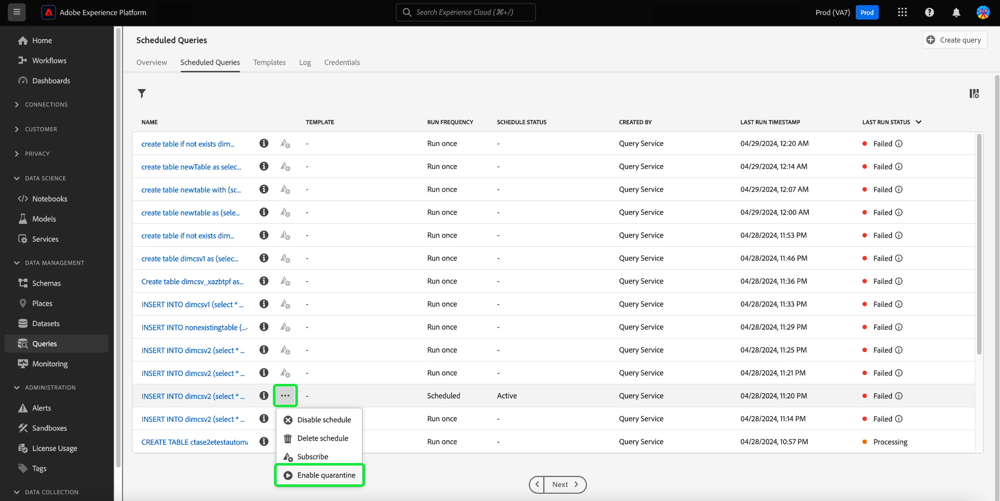

# Monitorización de consultas programadas

Adobe Experience Platform proporciona una visibilidad mejorada para el estado de todos los trabajos de consulta a través de la IU. Desde el [!UICONTROL Consultas programadas] , ahora puede encontrar información importante acerca de las ejecuciones de consultas que incluye el estado, los detalles de la programación y los mensajes/códigos de error en caso de que fallen. También puede suscribirse a alertas para consultas en función de su estado a través de la interfaz de usuario para cualquiera de estas consultas mediante [!UICONTROL Consultas programadas] pestaña.

## [!UICONTROL Consultas programadas]

El [!UICONTROL Consultas programadas] proporciona una visión general de todas sus consultas de CTAS e ITAS programadas. Se pueden encontrar detalles de ejecución para todas las consultas programadas, así como códigos de error y mensajes para cualquier consulta fallida.

Para ir a [!UICONTROL Consultas programadas] pestaña, seleccione **[!UICONTROL Consultas]** desde la barra de navegación izquierda seguida de **[!UICONTROL Consultas programadas]**

La siguiente tabla describe cada columna disponible.

>[!NOTE]
>
>El icono de alertas de suscripciones () está contenido en cada fila de una columna sin título. Consulte la [suscripciones de alerta](#alert-subscription) para obtener más información.

| Columna | Descripción |
|---|---|
| **[!UICONTROL Nombre]** | El campo de nombre es el nombre de la plantilla o los primeros caracteres de la consulta SQL. Cualquier consulta creada a través de la interfaz de usuario con el Editor de consultas recibe el nombre al principio. Si la consulta se creó mediante la API, su nombre se convierte en un fragmento del SQL inicial utilizado para crear la consulta. Para ver una lista de todas las ejecuciones asociadas con la consulta, seleccione un elemento de la [!UICONTROL Nombre] columna. Para obtener más información, consulte la [query ejecuta detalles de programación](#query-runs) sección. |
| **[!UICONTROL Plantilla]** | Nombre de plantilla de la consulta. Seleccione un nombre de plantilla para navegar hasta el Editor de consultas. La plantilla de consulta se muestra en el Editor de consultas para mayor comodidad. Si no hay ningún nombre de plantilla, la fila se marca con un guión y no se puede redirigir al Editor de consultas para ver la consulta. |
| **[!UICONTROL SQL]** | Un fragmento de la consulta SQL. |
| **[!UICONTROL Frecuencia de ejecución]** | La cadencia con la que se configurará la consulta para ejecutarse. Los valores disponibles son `Run once` y `Scheduled`. |
| **[!UICONTROL Creado por]** | El nombre del usuario que creó la consulta. |
| **[!UICONTROL Creado]** | La marca de tiempo cuando se creó la consulta, en formato UTC. |
| **[!UICONTROL Marca de tiempo de última ejecución]** | La marca de tiempo más reciente cuando se ejecutó la consulta. Esta columna resalta si una consulta se ha ejecutado según su programación actual. |
| **[!UICONTROL Último estado de ejecución]** | El estado de la ejecución de consulta más reciente. Los valores de estado son: `Success`, `Failed`, `In progress`, y `No runs`. |
| **[!UICONTROL Estado de horario]** | El estado actual de la consulta programada. Hay seis valores potenciales, [!UICONTROL Registro], [!UICONTROL Activo], [!UICONTROL Inactivo], [!UICONTROL Eliminado], un guión y [!UICONTROL En Cuarentena].<ul><li>El **[!UICONTROL Registro]** El estado indica que el sistema sigue procesando la creación de la nueva programación para la consulta. Tenga en cuenta que no puede deshabilitar ni eliminar una consulta programada mientras se esté registrando.</li><li>El **[!UICONTROL Activo]** El estado indica que la consulta programada tiene **aún no se ha aprobado** su fecha y hora de finalización.</li><li>El **[!UICONTROL Inactivo]** El estado indica que la consulta programada tiene **aprobado** su fecha y hora de finalización o ha sido marcado por un usuario para que esté en estado inactivo.</li><li>El **[!UICONTROL Eliminado]** El estado indica que se ha eliminado la programación de consultas.</li><li>El guión indica que la consulta programada es una consulta única y no recurrente.</li><li>El **[!UICONTROL En Cuarentena]** El estado indica que la consulta ha fallado diez ejecuciones consecutivas y requiere su intervención antes de que se puedan llevar a cabo más ejecuciones.</li></ul> |

>[!TIP]
>
>Si va al Editor de consultas, puede seleccionar **[!UICONTROL Consultas]** para volver a la [!UICONTROL Plantillas] pestaña.

## Personalizar la configuración de tablas para consultas programadas {#customize-table}

Puede ajustar las columnas en la [!UICONTROL Consultas programadas] a sus necesidades. Para abrir [!UICONTROL Personalizar tabla] configuración diálogo y editar columnas disponibles, seleccione el icono configuración (), en la parte superior derecha de la pantalla.

>[!NOTE]
>
>El [!UICONTROL Creado] La columna que hace referencia a la fecha en la que se creó la programación está oculta de forma predeterminada.

Active las casillas de verificación correspondientes para quitar o agregar una columna de tabla. A continuación, seleccione **[!UICONTROL Aplicar]** para confirmar sus opciones.

>[!NOTE]
>
>Cualquier consulta creada a través de la interfaz de usuario de se convierte en una plantilla con nombre como parte del proceso de creación. El nombre de la plantilla se ve en la columna de plantilla. Si la consulta se creó mediante la API, la columna de plantilla está en blanco.

## Administración de consultas programadas con acciones en línea {#inline-actions}

El [!UICONTROL Consultas programadas] view ofrece varias acciones en línea para administrar todas las consultas programadas desde una ubicación. Las acciones en línea se indican en cada fila con puntos suspensivos. Seleccione los puntos suspensivos de una consulta programada que desee administrar para ver las opciones disponibles en un menú emergente. Las opciones disponibles incluyen [[!UICONTROL Desactivar programación]](#disable) o [!UICONTROL Habilitar programación], [[!UICONTROL Eliminar programación]](#delete), [[!UICONTROL Suscribirse]](#alert-subscription) para consultar alertas, y [Habilitar o [!UICONTROL Deshabilitar cuarentena]](#quarantined-queries).

### Deshabilitar o habilitar una consulta programada {#disable}

Para desactivar una consulta programada, seleccione los puntos suspensivos de la consulta programada que desee administrar y, a continuación, seleccione **[!UICONTROL Desactivar programación]** en las opciones del menú emergente. Aparecerá un cuadro de diálogo para confirmar la acción. Seleccionar **[!UICONTROL Deshabilitar]** para confirmar la configuración.

Una vez deshabilitada una consulta programada, puede habilitar la programación a través del mismo proceso. Seleccione los puntos suspensivos y luego seleccione **[!UICONTROL Habilitar programación]** en las opciones disponibles.

>[!NOTE]
>
>Si una consulta se ha puesto en cuarentena, debe revisar el SQL de la plantilla antes de activar su programación. Esto evita una pérdida de horas calculadas si la consulta de la plantilla sigue teniendo problemas.

### Eliminar una consulta programada {#delete}

Para eliminar una consulta programada, seleccione los puntos suspensivos de la consulta programada que desee administrar y, a continuación, seleccione **[!UICONTROL Eliminar programación]** en las opciones del menú emergente. Aparecerá un cuadro de diálogo para confirmar la acción. Seleccionar **[!UICONTROL Eliminar]** para confirmar la configuración.

Una vez eliminada una consulta programada, se **no** se ha eliminado de la lista de consultas programadas. Las acciones en línea proporcionadas por los puntos suspensivos se eliminan y reemplazan por el icono de suscripción de alerta de adición atenuado. No puede suscribirse a alertas para la programación eliminada. La fila permanece en la interfaz de usuario para proporcionar información sobre las ejecuciones realizadas como parte de la consulta programada.

Si desea programar ejecuciones para esa plantilla de consulta, seleccione el nombre de la plantilla en la fila adecuada para navegar hasta el Editor de consultas y, a continuación, siga las [instrucciones para agregar una programación a una consulta](./query-schedules.md#create-schedule) tal como se describe en la documentación.

### Suscribirse a alertas {#alert-subscription}

Para suscribirse a alertas para ejecuciones de consultas programadas, seleccione `...` (elipsis) o icono de suscripción de alerta () para la consulta programada que desea administrar. Aparecerá el menú desplegable de acciones en línea. A continuación, seleccione **[!UICONTROL Suscribirse]** en las opciones disponibles.

El [!UICONTROL Alertas] se abre. El [!UICONTROL Alertas] Este cuadro de diálogo le suscribe tanto a las notificaciones de IU como a las alertas de correo electrónico. Hay varias opciones de suscripción a alertas disponibles: `start`, `success`, `failure`, `quarantine`, y `delay`. Marque las casillas correspondientes y seleccione **[!UICONTROL Guardar]** para suscribirse.

En la tabla siguiente se explican los tipos de alertas de consulta admitidos:

| Tipo de alerta | Descripción |
|---|---|
| `start` | Esta alerta le avisa cuando se inicia o comienza a procesarse una ejecución de consulta programada. |
| `success` | Esta alerta le informa cuando una ejecución de consulta programada se completa correctamente, lo que indica que la consulta se ejecutó sin errores. |
| `failed` | Esta alerta déclencheur cuando una ejecución de consulta programada encuentra un error o no se ejecuta correctamente. Le ayuda a identificar y abordar los problemas con prontitud. |
| `quarantine` | Esta alerta se activa cuando una ejecución de consulta programada se pone en estado de cuarentena. Cuando las consultas se inscriben en el [función de cuarentena](#quarantined-queries), cualquier consulta programada que falle diez ejecuciones consecutivas se coloca automáticamente en una [!UICONTROL En Cuarentena] estado. Luego requieren su intervención antes de que se pueda llevar a cabo cualquier otra ejecución. |
| `delay` | Esta alerta le notifica si hay un [retraso en el resultado de la ejecución de una consulta](#query-run-delay) más allá de un umbral especificado. Puede establecer una hora personalizada que almacene en déclencheur la alerta cuando la consulta se ejecute durante ese tiempo sin completarse ni producirse errores. |

>[!NOTE]
>
>Para recibir una notificación de las ejecuciones de consulta que se ponen en cuarentena, primero debe inscribir las ejecuciones de consulta programadas en la [función de cuarentena](#quarantined-queries).

Consulte la [documentación de API de suscripciones de alerta](../api/alert-subscriptions.md) para obtener más información.

### Ver los detalles de la consulta {#query-details}

Seleccione el icono de información () para ver el panel de detalles de la consulta. El panel de detalles contiene toda la información relevante sobre la consulta más allá de los hechos incluidos en la tabla de consultas programadas. La información adicional incluye el ID de consulta, la fecha de última modificación, el SQL de la consulta, el ID de programación y la programación definida actual.

## Consultas en cuarentena {#quarantined-queries}

>[!NOTE]
>
>La alerta de cuarentena no está disponible para consultas ad hoc &#39;de una sola ejecución&#39;. La alerta de cuarentena solo es aplicable a consultas por lotes programadas (CTAS e ITAS).

Cuando se inscribe en la función de cuarentena, cualquier consulta programada que falle diez ejecuciones consecutivas se coloca automáticamente en una [!UICONTROL En Cuarentena] estado. Una consulta con este estado se vuelve inactiva y no se ejecuta a su cadencia programada. Luego requiere su intervención antes de que se puedan llevar a cabo más ejecuciones. Esto protege los recursos del sistema, ya que debe revisar y corregir los problemas con su SQL antes de que se produzcan más ejecuciones.

Para habilitar una consulta programada para la función de cuarentena, seleccione los puntos suspensivos (`...`) seguido de [!UICONTROL Habilitar cuarentena] en el menú desplegable que aparece.

Las consultas también se pueden inscribir en la función de cuarentena durante el proceso de creación de la programación. Consulte la [documentación de programaciones de consultas](./query-schedules.md#quarantine) para obtener más información.

## Retraso de ejecución de consulta {#query-run-delay}

Mantenga el control de las horas del equipo mediante la configuración de alertas para los retrasos de las consultas. Puede supervisar el rendimiento de la consulta y recibir notificaciones si el estado de una consulta permanece sin cambios después de un período específico. Use el &#39;[!UICONTROL Retraso de ejecución de consulta]&#39; alerta que debe notificarse si una consulta continúa procesándose después de un período de tiempo específico sin completarse.

Cuando usted [suscribirse a alertas](#alert-subscription) para ejecuciones de consulta programadas, una de las alertas disponibles es [!UICONTROL Retraso de ejecución de consulta]. Esta alerta requiere que establezca un umbral para el tiempo empleado en la ejecución, momento en el que se le notifica del retraso en el procesamiento.

Para seleccionar una duración de umbral que almacene en déclencheur la notificación, introduzca un número en el campo de entrada de texto o utilice las flechas arriba y abajo para aumentar en incrementos de un minuto. Dado que el umbral se establece en minutos, la duración máxima para observar un retraso de ejecución de consulta es de 1440 minutos (24 horas). El período de tiempo predeterminado para un retraso de ejecución es de 150 minutos.

>[!NOTE]
>
>Una ejecución de consulta solo puede tener un tiempo de retraso de ejecución. Si cambia el umbral de retraso, se cambia para el usuario suscrito a la alerta y para toda la organización.

Consulte la sección Suscripción a alertas para obtener información sobre cómo [suscribirse a [!UICONTROL Retraso de ejecución de consulta] alertas](#alert-subscription).

## Filtrar consultas {#filter}

Puede filtrar las consultas en función de la frecuencia de ejecución. Desde el [!UICONTROL Consultas programadas] pestaña, seleccione el icono de filtro () para abrir la barra lateral del filtro.

Para filtrar la lista de consultas según su frecuencia de ejecución, seleccione la opción **[!UICONTROL Programado]** o **[!UICONTROL Ejecutar una vez]** filtrar casillas.

>[!NOTE]
>
>Cualquier consulta que se haya ejecutado pero no programada cumple los requisitos para [!UICONTROL Ejecutar una vez].

Una vez activados los criterios de filtro, seleccione **[!UICONTROL Ocultar filtros]** para cerrar el panel de filtro.

## La consulta ejecuta detalles de programación {#query-runs}

Para abrir la página de detalles de la programación, seleccione un nombre de consulta en la [!UICONTROL Consultas programadas] pestaña. Esta vista proporciona una lista de todas las ejecuciones ejecutadas como parte de esa consulta programada. La información proporcionada incluye la hora de inicio y finalización, el estado y el conjunto de datos utilizado.

Esta información se proporciona en una tabla de cinco columnas. Cada fila indica una ejecución de consulta.

| Nombre de columna | Descripción |
|---|---|
| **[!UICONTROL ID de ejecución de consulta]** | ID de ejecución de consulta para la ejecución diaria. Seleccione el **[!UICONTROL ID de ejecución de consulta]** para ir al [!UICONTROL Resumen de ejecución de consultas]. |
| **[!UICONTROL Inicio de ejecución de consulta]** | La marca de tiempo cuando se ejecutó la consulta. La marca de tiempo está en formato UTC. |
| **[!UICONTROL Ejecución de consulta completa]** | La marca de tiempo cuando se completó la consulta. La marca de tiempo está en formato UTC. |
| **[!UICONTROL Estado]** | El estado de la ejecución de consulta más reciente. Los valores de estado son: `Success`, `Failed`, `In progress`, o `Quarantined`. |
| **[!UICONTROL Conjunto de datos]** | El conjunto de datos involucrado en la ejecución. |

Los detalles de la consulta que se está programando se pueden ver en la [!UICONTROL Propiedades] panel. Este panel incluye el ID de consulta inicial, el tipo de cliente, el nombre de la plantilla, el SQL de consulta y la cadencia de la programación.

Seleccione un ID de ejecución de consulta para navegar a la página de detalles de ejecución y ver la información de la consulta.

## Resumen de ejecución de consultas {#query-run-overview}

El [!UICONTROL Resumen de ejecución de consultas] proporciona información sobre ejecuciones individuales para esta consulta programada y un desglose más detallado del estado de ejecución. Esta página también incluye la información del cliente y los detalles de cualquier error que pueda haber causado un error en la consulta.

La sección de estado de la consulta proporciona el código de error y el mensaje de error en caso de que la consulta haya fallado.

Puede copiar la consulta SQL en el portapapeles desde esta vista. Para copiar la consulta, seleccione el icono Copiar en la parte superior derecha del fragmento SQL. Un mensaje emergente confirma que el código se ha copiado.

### Ejecutar detalles para consultas con bloque anónimo {#anonymous-block-queries}

Las consultas que utilizan bloques anónimos para comprender sus instrucciones SQL se separan en sus subconsultas individuales. La separación en subconsultas permite inspeccionar los detalles de ejecución de cada bloque de consulta individualmente.

>[!NOTE]
>
>Los detalles de ejecución de un bloque anónimo que utiliza el comando DROP **no** como una subconsulta independiente. Hay disponibles detalles de ejecución independientes para consultas CTAS, consultas ITAS e instrucciones COPY utilizadas como subconsultas de bloque anónimas. Actualmente no se admiten los detalles de ejecución del comando DROP.

Los bloques anónimos se identifican mediante el uso de una `$$` prefijo antes de la consulta. Para obtener más información sobre los bloques anónimos en el servicio de consultas, consulte la [documento de bloque anónimo](../key-concepts/anonymous-block.md).

Las subconsultas de bloque anónimas tienen pestañas a la izquierda del estado de ejecución. Seleccione una pestaña para mostrar los detalles de la ejecución.

En el caso de que falle una consulta de bloque anónimo, puede encontrar el código de error de ese bloque en particular a través de esta interfaz de usuario.

Seleccionar **[!UICONTROL Consulta]** para volver a la pantalla de detalles de la programación, o **[!UICONTROL Consultas programadas]** para volver a la [!UICONTROL Consultas programadas] pestaña.

