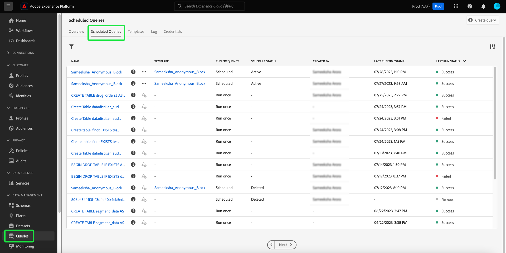
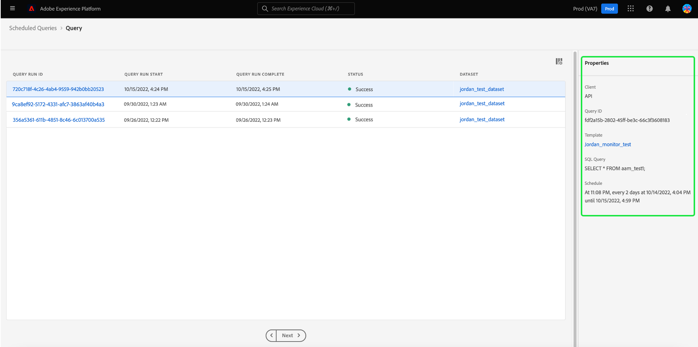

# Monitorización de consultas programadas

Adobe Experience Platform proporciona una visibilidad mejorada para el estado de todos los trabajos de consulta a través de la IU. Desde [!UICONTROL Consultas programadas] pestaña ahora puede encontrar información importante acerca de las ejecuciones de consultas que incluye el estado, los detalles de la programación y los mensajes/códigos de error en caso de que fallen. También puede suscribirse a alertas para consultas en función de su estado a través de la interfaz de usuario para cualquiera de estas consultas mediante [!UICONTROL Consultas programadas] pestaña.

## [!UICONTROL Consultas programadas]

El [!UICONTROL Consultas programadas] proporciona una visión general de todas sus consultas de CTAS e ITAS programadas. Se pueden encontrar detalles de ejecución para todas las consultas programadas, así como códigos de error y mensajes para cualquier consulta fallida.

Para ir a [!UICONTROL Consultas programadas] pestaña, seleccione **[!UICONTROL Consultas]** desde la barra de navegación izquierda seguida de **[!UICONTROL Consultas programadas]**

La siguiente tabla describe cada columna disponible.

>[!NOTE]
>
>El icono de suscripciones de alerta está contenido en cada fila de una columna sin título. Consulte la [suscripciones de alerta](#alert-subscription) para obtener más información.

| Columna | Descripción |
|---|---|
| **[!UICONTROL Nombre]** | El campo de nombre es el nombre de la plantilla o los primeros caracteres de la consulta SQL. Cualquier consulta creada a través de la interfaz de usuario con el Editor de consultas recibe el nombre al principio. Si la consulta se creó a través de la API, su nombre se convierte en un fragmento del SQL inicial utilizado para crear la consulta. Seleccione cualquier elemento de la [!UICONTROL Nombre] para ver una lista de todas las ejecuciones asociadas con la consulta. Para obtener más información, consulte [query ejecuta detalles de programación](#query-runs) sección. |
| **[!UICONTROL Plantilla]** | Nombre de plantilla de la consulta. Seleccione un nombre de plantilla para navegar hasta el Editor de consultas. La plantilla de consulta se muestra en el Editor de consultas para mayor comodidad. Si no hay ningún nombre de plantilla, la fila se marca con un guión y no se puede redirigir al Editor de consultas para ver la consulta. |
| **[!UICONTROL SQL]** | Un fragmento de la consulta SQL. |
| **[!UICONTROL Frecuencia de ejecución]** | Cadencia con la que se configura la ejecución de la consulta. Los valores disponibles son `Run once` y `Scheduled`. Las consultas se pueden filtrar según su frecuencia de ejecución. |
| **[!UICONTROL Creado por]** | El nombre del usuario que creó la consulta. |
| **[!UICONTROL Creado]** | La marca de tiempo cuando se creó la consulta, en formato UTC. |
| **[!UICONTROL Marca de tiempo de última ejecución]** | La marca de tiempo más reciente cuando se ejecutó la consulta. Esta columna resalta si una consulta se ha ejecutado según su programación actual. |
| **[!UICONTROL Último estado de ejecución]** | El estado de la ejecución de consulta más reciente. Los valores de estado son: `Success`, `Failed`, `In progress`, y `No runs`. |

>[!TIP]
>
>Si va al Editor de consultas, puede seleccionar **[!UICONTROL Consultas]** para volver a la [!UICONTROL Plantillas] pestaña.

### Personalizar la configuración de tablas para consultas programadas

Puede ajustar las columnas en la [!UICONTROL Consultas programadas] a sus necesidades. Seleccione el icono de configuración () para abrir [!UICONTROL Personalizar tabla] diálogo de configuración y editar las columnas disponibles.

Active las casillas de verificación correspondientes para quitar o agregar una columna de tabla. A continuación, seleccione **[!UICONTROL Aplicar]** para confirmar sus opciones.

>[!NOTE]
>
>Cualquier consulta creada a través de la interfaz de usuario de se convierte en una plantilla con nombre como parte del proceso de creación. El nombre de la plantilla se ve en la columna de plantilla. Si la consulta se creó mediante la API, la columna de la plantilla está en blanco.

### Suscribirse a alertas {#alert-subscription}

Puede suscribirse a las alertas desde el [!UICONTROL Consultas programadas] pestaña. Seleccione el icono de notificación de alerta () junto al nombre de una consulta para abrir [!UICONTROL Alertas] diálogo. El [!UICONTROL Alertas] Este cuadro de diálogo se suscribe a las notificaciones de IU y a las alertas de correo electrónico. Las alertas se basan en el estado de la consulta. Hay tres opciones disponibles: `start`, `success`, y `failure`. Marque las casillas correspondientes y seleccione **[!UICONTROL Guardar]** para suscribirse.

Consulte la [documentación de API de suscripciones de alerta](../api/alert-subscriptions.md) para obtener más información.

### Filtrar consultas {#filter}

Puede filtrar las consultas en función de la frecuencia de ejecución. Desde el [!UICONTROL Consultas programadas] pestaña, seleccione el icono de filtro () para abrir la barra lateral del filtro.

Seleccione la opción **[!UICONTROL Programado]** o **[!UICONTROL Ejecutar una vez]** ejecute las casillas de verificación del filtro de frecuencia para filtrar la lista de consultas.

>[!NOTE]
>
>Cualquier consulta que se haya ejecutado pero no programada cumple los requisitos para [!UICONTROL Ejecutar una vez].

Una vez activados los criterios de filtro, seleccione **[!UICONTROL Ocultar filtros]** para cerrar el panel de filtro.

## La consulta ejecuta detalles de programación {#query-runs}

Seleccione un nombre de consulta para navegar a la página de detalles de programación. Esta vista proporciona una lista de todas las ejecuciones ejecutadas como parte de esa consulta programada. La información proporcionada incluye la hora de inicio y finalización, el estado y el conjunto de datos utilizado.

Esta información se proporciona en una tabla de cinco columnas. Cada fila indica una ejecución de consulta.

| El nombre de la columna | Descripción |
|---|---|
| **[!UICONTROL ID de ejecución de consulta]** | ID de ejecución de consulta para la ejecución diaria. Seleccione el **[!UICONTROL ID de ejecución de consulta]** para ir al [!UICONTROL Resumen de ejecución de consultas]. |
| **[!UICONTROL Inicio de ejecución de consulta]** | La marca de tiempo cuando se ejecutó la consulta. Está en formato UTC. |
| **[!UICONTROL Ejecución de consulta completa]** | La marca de tiempo cuando se completó la consulta. Está en formato UTC. |
| **[!UICONTROL Estado]** | El estado de la ejecución de consulta más reciente. Los tres valores de estado son: `successful` `failed` o `in progress`. |
| **[!UICONTROL Conjunto de datos]** | El conjunto de datos involucrado en la ejecución. |

Los detalles de la consulta que se está programando se pueden ver en la [!UICONTROL Propiedades] panel. Este panel incluye el ID de consulta inicial, el tipo de cliente, el nombre de la plantilla, el SQL de consulta y la cadencia de la programación.

Seleccione un ID de ejecución de consulta para navegar a la página de detalles de ejecución y ver la información de la consulta.

## Resumen de ejecución de consultas {#query-run-overview}

El [!UICONTROL Resumen de ejecución de consultas] proporciona información sobre ejecuciones individuales para esta consulta programada y un desglose más detallado del estado de ejecución. Esta página también incluye la información del cliente y los detalles de cualquier error que pueda haber causado un error en la consulta.

La sección de estado de la consulta proporciona el código de error y el mensaje de error en caso de que la consulta haya fallado.

Puede copiar la consulta SQL en el portapapeles desde esta vista. Seleccione el icono de copia en la parte superior derecha del fragmento SQL para copiar la consulta. Un mensaje emergente confirma que el código se ha copiado.

### Ejecutar detalles para consultas con bloque anónimo {#anonymous-block-queries}

Las consultas que utilizan bloques anónimos para comprender sus instrucciones SQL se separan en sus subconsultas individuales. Esto le permite inspeccionar los detalles de ejecución de cada bloque de consulta individualmente.

>[!NOTE]
>
>Los detalles de ejecución de un bloque anónimo que utiliza el comando DROP **no** como una subconsulta independiente. Hay disponibles detalles de ejecución independientes para consultas CTAS, consultas ITAS e instrucciones COPY utilizadas como subconsultas de bloque anónimas. Actualmente no se admiten los detalles de ejecución del comando DROP.

Los bloques anónimos se identifican mediante el uso de una `$$` prefijo antes de la consulta. Consulte la [documento de bloque anónimo](../essential-concepts/anonymous-block.md) para obtener más información sobre los bloques anónimos en el servicio de consultas.

Las subconsultas de bloque anónimas tienen pestañas a la izquierda del estado de ejecución. Seleccione una pestaña para mostrar los detalles de la ejecución.

En el caso de que falle una consulta de bloque anónimo, puede encontrar el código de error de ese bloque en particular a través de esta interfaz de usuario.

Seleccionar **[!UICONTROL Consulta]** para volver a la pantalla de detalles de la programación, o **[!UICONTROL Consultas programadas]** para volver a la [!UICONTROL Consultas programadas] pestaña.

<!-- Details required to complete this section below:
### Run details for queries with parameterized queries {#parameterized-queries}

Queries that use parameterized values to make up the SQL statement are ... 
-->
