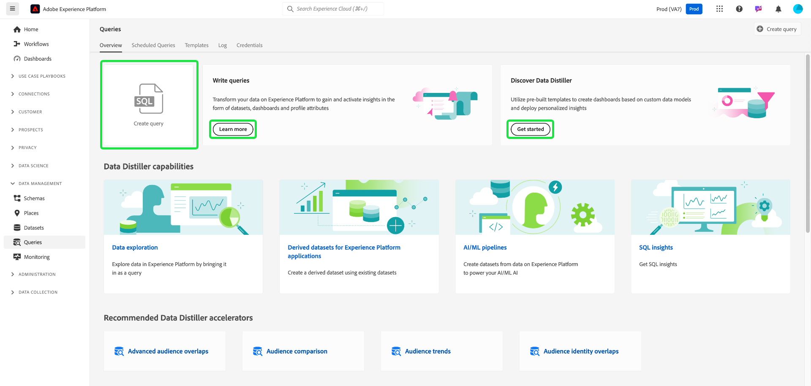
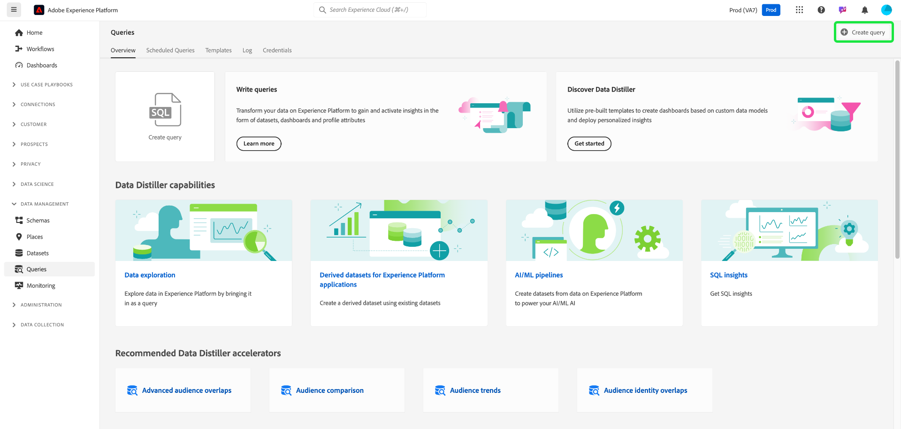

# Guía de IU del servicio de consultas

El servicio de consultas de Adobe Experience Platform proporciona una interfaz de usuario que se puede utilizar para escribir y ejecutar consultas, ver consultas ejecutadas anteriormente y acceder a las guardadas por usuarios de su organización. Para acceder a la interfaz de usuario en [Adobe Experience Platform](https://platform.adobe.com), seleccione **[!UICONTROL Consultas]** en el panel de navegación izquierdo. Aparece [!UICONTROL Consultas] [!UICONTROL Información general].

## Información general {#overview}

La pestaña [!UICONTROL Información general] proporciona un punto de entrada optimizado para trabajar con consultas y plantillas de Data Distiller. Aquí puede acceder a todas las funciones necesarias para escribir consultas, explorar conjuntos de datos y analizar datos de audiencias para garantizar un flujo de trabajo fluido para el análisis de datos y las perspectivas de audiencia. Utilice esta descripción general para conocer lo que puede lograr con Data Distiller y descubrir métricas clave sobre el uso del servicio de consultas.

### Paneles principales {#main-panels}

La página [!UICONTROL Información general] contiene varias secciones principales para ayudarle a empezar:

1. Seleccione **[!UICONTROL Crear consulta]** para navegar rápidamente al Editor de consultas y escribir y ejecutar nuevas consultas.
2. Seleccione **[!UICONTROL Más información]** para ver la documentación detallada sobre cómo **[!UICONTROL escribir consultas]**.
3. Seleccione **[!UICONTROL Introducción]** en la sección **[!UICONTROL Discover datos Distiller]** para abrir la descripción general de Data Distiller y obtener más información sobre las funciones disponibles.

### Capacidades de Data Distiller {#data-distiller-capabilities}

La sección [!UICONTROL Funciones de Data Distiller] proporciona vínculos de documentación a funciones de Data Distiller más avanzadas:

- **[[!UICONTROL Exploración de datos]](../use-cases/data-exploration.md)**: Aprenda a explorar, solucionar problemas y comprobar datos ingeridos por lotes mediante SQL.
- **[[!UICONTROL Conjuntos de datos derivados para aplicaciones de Experience Platform]](../data-distiller/derived-datasets/overview.md)**: aprenda a crear conjuntos de datos derivados para admitir casos de uso complejos y diversos que maximicen su utilidad de datos.
- **[[!UICONTROL Canalizaciones AI/ML]](../data-distiller/ml-feature-pipelines/overview.md)**: Obtenga información acerca de conceptos importantes detrás de sus herramientas de aprendizaje automático preferidas y cómo crear modelos personalizados que admitan sus casos prácticos de marketing. En esta serie de guías se describen los pasos necesarios para crear canalizaciones de funciones que preparen los datos de Experience Platform para alimentar los modelos personalizados en su entorno de aprendizaje automático.
- **[[!UICONTROL Datos SQL]](../data-distiller/sql-insights/overview.md)**: Obtenga información acerca de las funcionalidades clave y los pasos necesarios para desarrollar un panel de datos desde SQL con Data Distiller.

### Aceleradores recomendados de Data Distiller {#recommended-accelerators}

Seleccione un enlace rápido para ir a los paneles de Data Distiller correspondientes [!UICONTROL Plantillas]. Cada acelerador proporciona potentes herramientas y visualizaciones que le ayudarán a analizar los datos de audiencia, optimizar la segmentación y mejorar las estrategias de segmentación.

- **[[!UICONTROL Superposiciones de audiencias avanzadas]](../../dashboards/sql-insights-query-pro-mode/templates/overlaps.md)**: desde este panel puede analizar intersecciones de audiencias entre varios segmentos de audiencias para descubrir información valiosa y optimizar estrategias de segmentación. También puede exportar sus perspectivas para realizar más análisis sin conexión o generar informes.
- **[[!UICONTROL Comparación de audiencias]](../../dashboards/sql-insights-query-pro-mode/templates/comparison.md)**: desde este panel, puede comparar y contrastar métricas clave de audiencia en paralelo para analizar dos grupos de audiencias en detalle. Estas perspectivas le ayudan a comprender el tamaño de la audiencia, el crecimiento y otros indicadores de rendimiento clave, lo que le permite refinar la segmentación y optimizar las estrategias de segmentación con decisiones basadas en datos.
- **[[!UICONTROL Tendencias de audiencia]](../../dashboards/sql-insights-query-pro-mode/templates/trends.md)**: use el panel [!UICONTROL Tendencias de audiencia] para visualizar cómo evolucionan las audiencias a lo largo del tiempo mediante métricas clave como el crecimiento de la audiencia, los recuentos de identidad y los perfiles de identidad únicos. Realice un seguimiento de las tendencias para descubrir perspectivas valiosas sobre el comportamiento de la audiencia, lo que le permite refinar la segmentación, mejorar la participación y optimizar las estrategias de segmentación para campañas más eficaces.
Realice un seguimiento de las métricas de audiencia a lo largo del tiempo para monitorizar los cambios en el tamaño de la audiencia, el crecimiento de la identidad y la participación general.
- **[[!UICONTROL Superposiciones de identidad de audiencia]](../../dashboards/sql-insights-query-pro-mode/templates/identity-overlaps.md)**: use el panel Superposiciones de identidad de audiencia para analizar las superposiciones de identidad dentro de las audiencias seleccionadas. Las visualizaciones y los datos tabulados proporcionan perspectivas para optimizar la vinculación de identidad, reducir la redundancia y mejorar la segmentación. Estas perspectivas permiten una segmentación más eficaz, una personalización mejorada y unas interacciones con los clientes optimizadas.

### Ejemplos de Data Distiller {#data-distiller-examples}

Seleccione una tarjeta para abrir guías de documentación y ejemplos que le ayuden a sacar el máximo partido a Data Distiller:

- **[[!UICONTROL Conjuntos de datos derivados basados en deciles]](../use-cases/deciles-use-case.md)**: Aprenda a crear conjuntos de datos derivados basados en deciles para la segmentación y la creación de audiencias en Adobe Experience Platform. Con un escenario de lealtad de la aerolínea, abarca el diseño de esquemas, los cálculos de deciles y ejemplos de consultas para clasificar y agregar datos.
- **[[!UICONTROL Valor de duración del cliente]](../use-cases/customer-lifetime-value.md)**: Aprenda a rastrear y visualizar el valor de duración del cliente con Real-Time CDP y los paneles personalizados. Utilice estas perspectivas para desarrollar estrategias para adquirir nuevos clientes, conservar los existentes y maximizar los márgenes de beneficio.
- **[[!UICONTROL Puntuación de tendencia]](../use-cases/propensity-score.md)**: Aprenda a determinar las puntuaciones de tendencia mediante modelos predictivos de aprendizaje automático. Esta guía cubre el envío de datos para formación, la aplicación de modelos formados con SQL y la predicción de la probabilidad de compra de los clientes.
- **[[!UICONTROL Análisis de consentimiento]](../../dashboards/insights-use-cases/consent-analysis.md)**: Obtenga información sobre cómo analizar y rastrear el consentimiento del cliente mediante Real-Time CDP, Query Service y Data Distiller. Esta guía cubre la creación de paneles de consentimiento, el refinamiento de la segmentación, el seguimiento de tendencias y la garantía del cumplimiento, lo que le ayuda a generar confianza y a ofrecer experiencias personalizadas.
- **[[!UICONTROL Coincidencia difusa]](../use-cases/fuzzy-match.md)**: Aprenda a hacer una coincidencia &quot;difusa&quot; en los datos de Experience Platform para encontrar coincidencias aproximadas y analizar la similitud de cadenas en los conjuntos de datos. Siga esta guía para ahorrar tiempo y hacer que sus datos sean más accesibles. El ejemplo muestra cómo hacer coincidir los atributos de habitación de hotel entre dos conjuntos de datos de agencias de viajes, y cómo hacer coincidir, comparar y reconciliar de forma eficaz conjuntos de datos grandes y complejos para mantener la coherencia y la precisión.

### Métricas clave {#key-metrics}

La sección de métricas clave muestra visualizaciones de datos importantes que le ayudan a monitorizar el uso del servicio de consultas. Para cada gráfico, puede seleccionar los puntos suspensivos (`...`) en la parte superior derecha seguidos de [!UICONTROL Ver más] para ver un formulario tabulado de los resultados o descargar los datos como un archivo CSV para verlos en una hoja de cálculo. Para obtener más información, consulte la [Guía para ver más](../../dashboards/sql-insights-query-pro-mode/view-more.md).

#### Establecer un filtro de fecha {#set-date-filter}

Para aplicar un filtro de fecha global a estas visualizaciones, seleccione el icono de filtro () y ajuste el intervalo de fechas en el cuadro de diálogo **[!UICONTROL Filtros]**. Aplique este filtro para adaptar las métricas mostradas para un lapso de tiempo específico y mejorar la relevancia del análisis.

#### [!UICONTROL consultas por lotes de Distiller] {#distiller-batch-queries}

El gráfico [!UICONTROL consultas por lotes de Distiller] proporciona un desglose de la actividad de consultas por día, destacando el número de consultas CTAS y ITAS (interactivas y programadas) procesadas. El gráfico resalta patrones, como los picos en consultas interactivas en determinados días y el uso poco frecuente de consultas programadas. Utilice estas perspectivas para optimizar el rendimiento identificando los periodos de actividad máxima, refinando las estrategias de programación y equilibrando la ejecución de consultas para mejorar la eficacia del flujo de trabajo y la utilización de recursos.

#### [!UICONTROL Calcular horas consumidas] {#compute-hours-consumed}

El gráfico [!UICONTROL Calcular horas consumidas] proporciona una visualización diaria de las horas calculadas utilizadas para procesar las operaciones del Servicio de consultas. Utilice estas tendencias de hora calculadas para monitorizar el consumo de recursos, identificar períodos de alta demanda y optimizar la ejecución de consultas para garantizar una asignación de recursos y un rendimiento eficientes.

#### [!UICONTROL Consultas de exploración de datos]

El gráfico [!UICONTROL Consultas exploratorias de datos] muestra el número de consultas SELECT procesadas a petición cada día. Esta visualización resalta las tendencias de la actividad de la consulta, como los picos en el uso en días específicos, para ayudarle a comprender cuándo los esfuerzos de exploración de datos son más activos. Utilice estas perspectivas para monitorizar los patrones de uso de las consultas, equilibrar las cargas de trabajo y optimizar la asignación de recursos para el análisis exploratorio de datos. Este análisis garantiza un uso más eficiente del servicio de consultas y una mejor planificación para períodos de alta demanda.

## Editor de consultas

Utilice el Editor de consultas para escribir y ejecutar consultas sin utilizar un cliente externo. Seleccione **[!UICONTROL Crear consulta]** para abrir el Editor de consultas y crear una nueva consulta. También puede obtener acceso al Editor de consultas si selecciona una consulta en las fichas **[!UICONTROL Registro]** o **[!UICONTROL Plantillas]**. Si selecciona una consulta guardada o ejecutada anteriormente, se abrirá el Editor de consultas, que mostrará el SQL de la consulta seleccionada.

A medida que escribe en el Editor de consultas, el editor completa automáticamente las palabras reservadas de SQL, las tablas y los nombres de campo dentro de las tablas. Cuando termine de escribir la consulta, seleccione el icono de reproducción () para ejecutar la consulta. La pestaña **[!UICONTROL Consola]** debajo del editor muestra lo que el Servicio de consultas está haciendo actualmente e indica cuándo se ha devuelto una consulta. La ficha **[!UICONTROL Result]**, junto a la [!UICONTROL Consola], muestra los resultados de la consulta. Consulte la [guía del Editor de consultas](./user-guide.md) para obtener más información sobre cómo usar el Editor de consultas.

### Acerca de la pestaña Resultados {#results-tab}

La pestaña [!UICONTROL Result] muestra el resultado tabular de la consulta después de la ejecución. Utilice esta pestaña para revisar los resultados, validar los resultados y realizar acciones de seguimiento directamente en la interfaz. Desde esta vista, puede:

- Descargue los resultados en formato CSV, XLSX o JSON para análisis sin conexión. Ver [Descargar resultados de la consulta](./user-guide.md#download-query-results).
- Ver los resultados en pantalla completa para examinar tablas grandes o conjuntos de datos anchos en un diseño de cuadrícula redimensionable. Ver [Ver resultados en pantalla completa](./user-guide.md#view-results).
- Copie los resultados en el portapapeles en formato CSV para pegarlos rápidamente en aplicaciones de hoja de cálculo. Ver [Copiar resultados](./user-guide.md#copy-results).

Estas funciones están diseñadas para admitir flujos de trabajo de validación, creación de informes y uso compartido de datos sin problemas, todo sin salir del Editor de consultas.

### Consultas parametrizadas {#parameterized-queries}

El Editor de consultas admite consultas parametrizadas, que permiten insertar variables en las instrucciones SQL y asignar valores dinámicamente durante la ejecución. Esta función ayuda a simplificar las consultas reutilizables y a mejorar la flexibilidad de los flujos de trabajo.

Puede definir parámetros al escribir consultas y, a continuación, asignar valores mediante la ficha [!UICONTROL Parámetros de consulta] antes de ejecutarlos. Las consultas parametrizadas son especialmente útiles para consultas programadas o plantillas de consulta compartidas en la organización.

Para aprender a definir y utilizar parámetros, vea [Consultas parametrizadas en el Editor de consultas](./parameterized-queries.md).

## Consultas programadas {#scheduled-queries}

Las consultas que ya se han guardado como plantilla se pueden programar para ejecutarse en una cadencia normal. Al programar una consulta, puede elegir la frecuencia de ejecuciones, la fecha de inicio y finalización, el día de la semana en que se ejecuta la consulta programada, así como el conjunto de datos al que exportar la consulta. Las programaciones de consultas se establecen mediante el Editor de consultas.

Para obtener información sobre cómo programar una consulta a través de la interfaz de usuario, consulte la [guía de consultas programadas](./user-guide.md#scheduled-queries). Para obtener información sobre cómo agregar programaciones mediante la API, lea la [guía de extremo de consultas programadas](../api/scheduled-queries.md).

Una vez programada una consulta, aparece en la lista de consultas programadas de la ficha [!UICONTROL Consultas programadas]. Para obtener todos los detalles sobre la consulta, las ejecuciones, el creador y los tiempos, seleccione una consulta programada en la lista.

| Columna | Descripción |
| --- | --- |
| **[!UICONTROL Nombre]** | El campo de nombre es el nombre de la plantilla o los primeros caracteres de la consulta SQL. Cualquier consulta creada a través de la interfaz de usuario con el Editor de consultas recibe el nombre al principio. Si la consulta se creó mediante la API, el nombre de la consulta es un fragmento del SQL inicial utilizado para crear la consulta. |
| **[!UICONTROL Plantilla]** | Nombre de plantilla de la consulta. Seleccione un nombre de plantilla para navegar hasta el Editor de consultas. La plantilla de consulta se muestra en el Editor de consultas para mayor comodidad. Si no hay ningún nombre de plantilla, la fila se marca con un guión y no se puede redirigir al Editor de consultas para ver la consulta. |
| **[!UICONTROL SQL]** | Un fragmento de la consulta SQL. |
| **[!UICONTROL Frecuencia de ejecución]** | Esta columna indica la cadencia con la que se ha configurado la ejecución de la consulta. Los valores disponibles son `Run once` y `Scheduled`. Las consultas se pueden filtrar según su frecuencia de ejecución. |
| **[!UICONTROL Creado por]** | El nombre del usuario que creó la consulta. |
| **[!UICONTROL Creado]** | La marca de tiempo cuando se creó la consulta, en formato UTC. |
| **[!UICONTROL Marca de tiempo de la última ejecución]** | La marca de tiempo más reciente cuando se ejecutó la consulta. Esta columna resalta si una consulta se ha ejecutado según su programación actual. |
| **[!UICONTROL Último estado de ejecución]** | El estado de la ejecución de consulta más reciente. Los tres valores de estado son: `successful` `failed` o `in progress`. |

Consulte la documentación para obtener más información sobre cómo [supervisar consultas a través de la IU del servicio de consultas](./monitor-queries.md).

## Plantillas {#browse}

La ficha **[!UICONTROL Plantillas]** muestra las consultas guardadas por los usuarios de su organización. Es útil considerarlas como proyectos de consulta, ya que las consultas guardadas aquí pueden estar aún en construcción. Las consultas mostradas en la ficha **[!UICONTROL Plantillas]** también se muestran como consultas de ejecución en la ficha **[!UICONTROL Registro]** si el servicio de consultas las ha ejecutado anteriormente.

| Columna | Descripción |
| --- | --- |
| **[!UICONTROL Nombre]** | El campo de nombre es el nombre de la consulta creado por el usuario o los primeros caracteres de la consulta SQL. Cualquier consulta creada a través de la interfaz de usuario con el Editor de consultas recibe el nombre al principio. Si la consulta se creó a través de la API, el nombre de la consulta es un fragmento del SQL inicial utilizado para crear la consulta. Puede seleccionar el nombre de la consulta para abrirla en el Editor de consultas. También puede usar la barra de búsqueda para buscar [!UICONTROL Name] de una consulta. Las búsquedas distinguen entre mayúsculas y minúsculas. |
| **[!UICONTROL SQL]** | Los primeros caracteres de la consulta SQL. Al pasar el ratón por encima del código, se muestra la consulta completa. |
| **[!UICONTROL Modificado por]** | El último usuario que modificó la consulta. Cualquier usuario de la organización con acceso al servicio de consultas puede modificar las consultas. |
| **[!UICONTROL Última modificación]** | La fecha y la hora de la última modificación de la consulta, en el huso horario del explorador. |

Consulte la documentación de [plantillas de consulta](./query-templates.md) para obtener más información sobre las plantillas en la interfaz de usuario de Experience Platform.

## Registro {#log}

La pestaña **[!UICONTROL Log]** proporciona una lista de consultas que se han ejecutado anteriormente. De forma predeterminada, el registro muestra las consultas en cronología inversa.

| Columna | Descripción |
| --- | --- |
| **[!UICONTROL Nombre]** | El nombre de la consulta, que consta de los primeros caracteres de la consulta SQL. Seleccione el nombre de la plantilla para abrir la vista [!UICONTROL Detalles del registro de consultas] para esa ejecución. Puede utilizar la barra de búsqueda para buscar el nombre de una consulta. Las búsquedas distinguen entre mayúsculas y minúsculas. |
| **[!UICONTROL Hora de inicio]** | Hora a la que se ejecutó la consulta. |
| **[!UICONTROL Tiempo completo]** | Hora a la que se completó la ejecución de la consulta. |
| **[!UICONTROL Estado]** | El estado actual de la consulta. |
| **[!UICONTROL Conjunto de datos]** | Conjunto de datos de entrada utilizado por la consulta. Seleccione el conjunto de datos para ir a la pantalla de detalles del conjunto de datos de entrada. |
| **[!UICONTROL Cliente]** | El cliente utilizado para la consulta. |
| **[!UICONTROL Creado por]** | El nombre de la persona que creó la consulta. |

>
>
>Seleccione el icono de lápiz () desde cualquier fila del registro de consultas para navegar hasta el Editor de consultas. La consulta se rellena previamente para facilitar la edición.

Consulte la [documentación de registros de consulta](./query-logs.md) para obtener más información sobre los archivos de registro generados automáticamente por un evento de consulta.

## Credenciales

La ficha **[!UICONTROL Credenciales]** muestra tanto las credenciales que caducan como las que no caducan. Para obtener más información sobre cómo usar estas credenciales para conectarse con clientes externos, lea la [guía de credenciales](../clients/overview.md).

## Pasos siguientes

Ahora que está familiarizado con la interfaz de usuario del Servicio de consultas en [!DNL Experience Platform], puede acceder al Editor de consultas para empezar a crear sus propios proyectos de consultas y compartirlos con otros usuarios de su organización. Para obtener más información sobre la creación y ejecución de consultas en el Editor de consultas, consulte la [guía del usuario del Editor de consultas](./user-guide.md).
