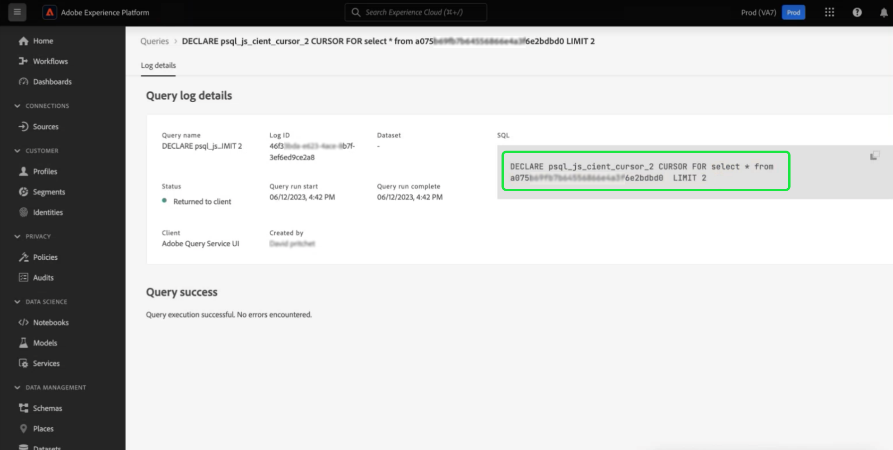

# Consultas paramétricas

>[!IMPORTANT]
>
>La función de IU de consulta parametrizada está disponible en un **solo versión limitada** y no está disponible para todos los clientes.

El servicio de consultas admite el uso de consultas parametrizadas en el Editor de consultas. Con las consultas con parámetros, ahora puede utilizar marcadores de posición para parámetros y agregar los valores de parámetro en el momento de la ejecución. Los marcadores de posición permiten trabajar con datos dinámicos en los que no sabe cuáles serán los valores hasta que se ejecute la instrucción. También puede preparar sus consultas con antelación y reutilizarlas para fines similares. La reutilización de consultas ahorra un esfuerzo considerable ya que evita la creación de consultas SQL distintas para cada caso de uso.

## Requisitos previos

Antes de continuar con esta guía, lea la [Guía de IU del Editor de consultas](./user-guide.md). La guía del Editor de consultas proporciona información detallada sobre cómo escribir, validar y ejecutar consultas para datos de experiencia del cliente en la interfaz de usuario de Experience Platform.

>
>
>Las consultas parametrizadas no se admiten dentro de plantillas en línea más allá de su nivel principal inmediato. Las consultas parametrizadas solo funcionan cuando se utilizan en la plantilla original o dentro de una plantilla en línea secundaria directa.

## Sintaxis de consulta parametrizada {#syntax}

Las consultas parametrizadas utilizan el formato `'$YOUR_PARAMETER_NAME'` y se pueden concatenar con notación de puntos. A continuación se muestra un ejemplo de una instrucción SQL que utiliza consultas parametrizadas.

```sql
INSERT INTO
   $Database_Name.Schema_Name.adwh_lkup_process_delta_log
   (process_name, merge_policy_id, process_status, process_date, create_ts, change_ts)
SELECT
   '$Table_Process_Name' process_name,
   hash('$Merge_PolicyID') merge_policy_id,
   '$process_status' process_status,
   to_date('$date_key') process_date,
   CURRENT_TIMESTAMP create_ts,
   CURRENT_TIMESTAMP change_ts;
```

## Creación de una consulta con parámetros {#create}

Para crear la consulta parametrizada en la interfaz de usuario de, vaya al Editor de consultas. Consulte la sección sobre [acceso al Editor de consultas](./user-guide.md#accessing-query-editor) para obtener más instrucciones.

Utilice el `'$'` para introducir un parámetro de consulta en la consulta en el editor de texto. A continuación, añada el valor que falta para la clave en la variable [!UICONTROL Parámetros de consulta] debajo del editor. La consulta no se puede ejecutar si no agrega un valor a ninguna de las claves requeridas. Un icono de alerta () aparece en la sección Parámetros de consulta junto a cualquier campo vacío [!UICONTROL Valor] campos de entrada.


>[!TIP]
>
>Cambiar pestañas de [!UICONTROL Parámetros de consulta] hasta [!UICONTROL Consola] para ver el resultado de la consola de la consulta.

Si elimina un parámetro e intenta ejecutar la consulta de nuevo después de ejecutarla, aparece un mensaje de error en la variable [!UICONTROL Parámetros de consulta] para avisarle.


## Utilice los detalles de registros de consulta para comprobar los valores de parámetros {#check-parameter-values}

No se pueden guardar parámetros dentro de las plantillas porque los valores utilizados no son persistentes. Sin embargo, puede consultar la [!UICONTROL Detalles del registro de consultas] para buscar los valores de parámetro utilizados en una ejecución de consulta. En este caso, los registros no indican que la consulta fuera una consulta parametrizada. Consulte la [documentación de registros de consultas](./query-logs.md) para obtener instrucciones sobre cómo encontrar los valores utilizados.



<!-- improve screenshot above ^ I am waiting for a scheduled run to complete -->

## Programar una consulta parametrizada {#schedule}

Los valores de parámetro se guardan al programar una consulta parametrizada. Para programar una consulta parametrizada, siga el proceso típico para crear una consulta programada como se describe en la guía de [crear una programación de consultas](./query-schedules.md#create-schedule)A continuación, introduzca los valores de parámetro que se utilizarán en la ejecución de la consulta. Esta sección de la interfaz de usuario solo aparece para consultas parametrizadas. Consulte la sección sobre [definición de parámetros para una consulta parametrizada programada](./query-schedules.md#set-parameters) para obtener instrucciones específicas.

>[!TIP]
>
>El servicio de consulta admite instrucciones preparadas mediante el uso de consultas parametrizadas. Consulte la [guía de sintaxis de instrucciones preparadas](../sql/prepared-statements.md) para obtener más información sobre la sintaxis SQL implicada.

## Pasos siguientes

Al leer este documento, ha aprendido a parametrizar consultas en la interfaz de usuario de Adobe Experience Platform y a utilizarlas en ejecuciones de consultas programadas. El documento también resaltaba cómo comprobar los registros para los valores de parámetro utilizados en las ejecuciones de consultas.

Si aún no lo ha hecho, se recomienda leer la guía en [supervisión de consultas programadas](./monitor-queries.md) para comprender mejor el estado de todos los trabajos de consulta a través de la IU de Platform.
