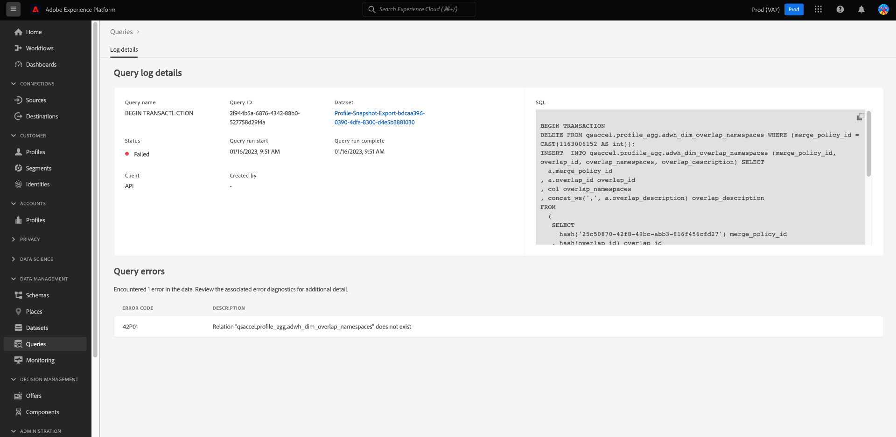

# Registros de consultas

>[!IMPORTANT]
>
>Ciertas funciones de registros de consultas están actualmente en una versión limitada y no están disponibles para todos los clientes. La interfaz de usuario puede aparecer de forma ligeramente diferente sin un icono de edición. Además, el proceso de selección de un nombre de consulta puede llevar al Editor de consultas en lugar de al Editor de consultas [!UICONTROL Detalles del registro de consultas] vista.

Adobe Experience Platform mantiene un registro de todos los eventos de consulta que se producen a través de la API y la interfaz de usuario. Esta información está disponible en la interfaz de usuario del servicio de consultas desde [!UICONTROL Registros] pestaña.

Los archivos de registro se generan automáticamente mediante cualquier evento de consulta y contienen información como el SQL utilizado, el estado de la consulta, cuánto tiempo tardó y el último tiempo de ejecución. Puede utilizar los datos de registro de consultas como una herramienta potente para solucionar consultas ineficientes o problemáticas. La información de registro más completa se conserva como parte de la función de registro de auditoría y se puede encontrar en la [documentación del registro de auditoría](../../landing/governance-privacy-security/audit-logs/overview.md).

## Comprobar registros de consultas

Para comprobar los registros de consultas, seleccione [!UICONTROL Consultas] para navegar al espacio de trabajo del servicio de consultas y seleccionar [!UICONTROL Registro] en las opciones disponibles.

## Personalizar y buscar {#customize-and-search}

Los registros del servicio de consultas se presentan en un formato de tabla personalizable. Para personalizar las columnas de la tabla, seleccione el icono de configuración () a la derecha de la pantalla. A [!UICONTROL Personalizar tabla] aparece un cuadro de diálogo donde se puede anular la selección de cada columna.

También puede buscar registros relacionados con plantillas de consulta específicas escribiendo el nombre de la plantilla en el campo de búsqueda.

A [descripción de cada una de las columnas de la tabla de registro](./overview.md#log) se encuentra en la sección Registro de la descripción general del servicio de consultas.

## Detectar datos de registro

Cada fila representa los datos de registro de una ejecución de consulta asociada a una plantilla de consulta. Seleccione cualquier fila de la tabla para rellenar la barra lateral derecha con los datos de registro de esa ejecución.

En el panel de detalles del registro, puede seleccionar un nuevo conjunto de datos de salida y ver o copiar la consulta SQL completa que se utilizó en la ejecución.

>[!IMPORTANT]
>
>Ciertas funciones de registros de consultas están actualmente en una versión limitada y no están disponibles para todos los clientes.

También puede seleccionar un nombre de plantilla de consulta en la [!UICONTROL Nombre] para ir directamente a la columna [!UICONTROL Detalles del registro de consultas] vista.

>[!NOTE]
>
>Si la consulta se creó con la API y no se proporcionó ningún nombre de plantilla durante la inicialización, se muestran las primeras docenas de caracteres de la consulta SQL en su lugar.

## Editar registros {#edit-logs}

Junto al nombre de plantilla o fragmento SQL de cada fila hay un icono de lápiz () que puede utilizar para desplazarse al Editor de consultas. A continuación, la consulta se rellena previamente en el editor para su edición.

## Filtrar registros {#filter-logs}

Puede filtrar la lista de registros de consultas en función de diferentes configuraciones. Seleccione el icono de filtro (), en la parte superior izquierda del espacio de trabajo, para abrir un conjunto de opciones de filtro en el carril izquierdo.

Se muestra la lista de filtros disponibles.

La siguiente tabla muestra una descripción de cada filtro.

| Filtro | Descripción |
| ------ | ----------- |
| [!UICONTROL Excluir consultas de panel] | Esta casilla de verificación está activada de forma predeterminada y excluye los registros generados por las consultas utilizadas para generar perspectivas. Estas consultas son generadas por el sistema y oscurecen los registros generados por el usuario necesarios para monitorizar, administrar y solucionar problemas. Para ver los registros generados por el sistema, desactive la casilla de verificación. |
| [!UICONTROL Fecha de inicio] | Para filtrar los registros de las consultas creadas durante un periodo específico, establezca el [!UICONTROL Inicio] y [!UICONTROL Fin] fechas en la [!UICONTROL Fecha de inicio] sección. |
| [!UICONTROL Fecha de finalización] | Para filtrar los registros de las consultas que se completaron durante un período específico, establezca el [!UICONTROL Inicio] y [!UICONTROL Fin] fechas en la [!UICONTROL Fecha de finalización] sección. |
| [!UICONTROL Estado] | Para filtrar registros basados en el [!UICONTROL Estado] de la consulta, seleccione el botón de opción adecuado. Las opciones disponibles incluyen [!UICONTROL Enviado], [!UICONTROL En curso], [!UICONTROL Correcto], y [!UICONTROL Error]. Solo puede filtrar registros en función de una condición de estado a la vez. |
| [!UICONTROL Cliente] | Para filtrar los registros en función de la consulta utilizada por el cliente, introduzca uno de los siguientes valores aceptados en el campo de texto libre: `API`, `Adobe Query Service UI`, o `QsAccel`. |
| [!UICONTROL Mis consultas] | Utilice el [!UICONTROL Mis consultas] alterne para filtrar los registros de las consultas ejecutadas por usted. |
| [!UICONTROL ID de registro de consultas] | Para filtrar según el ID de registro único de una consulta, introduzca el ID de registro en el campo de texto libre. Esta información se encuentra en [!UICONTROL Detalles de registro]. |

Todos los filtros aplicados se muestran encima de los resultados del registro filtrado.

## Pasos siguientes

Al leer este documento, ahora comprende mejor cómo se accede a los registros de consulta y cómo se utilizan en la interfaz de usuario del servicio de consultas.

Consulte la [Información general de IU](./overview.md), o el [Guía de API del servicio de consultas](../api/getting-started.md) para obtener más información sobre las funcionalidades del servicio de consultas.

Consulte la [documento de monitorización de consultas](./monitor-queries.md) para conocer cómo el servicio de consultas mejora la visibilidad de las ejecuciones de consultas programadas.
