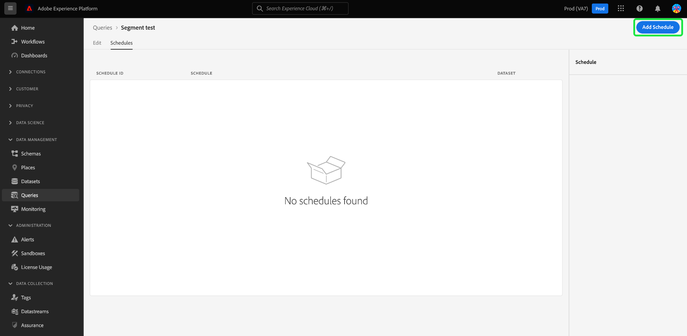

# Programaciones de consultas

Puede automatizar las ejecuciones de consultas creando programaciones de consultas. Las consultas programadas se ejecutan en una cadencia personalizada para administrar los datos en función de la frecuencia, la fecha y la hora. También puede elegir un conjunto de datos de salida para los resultados si es necesario. Las consultas que se han guardado como plantilla se pueden programar desde el Editor de consultas.

>[!IMPORTANT]
>
>Solo puede agregar una programación a una consulta que ya se ha creado y guardado.

## Requisitos de cuenta para consultas programadas {#technical-account-user-requirements}

Para que las consultas programadas se ejecuten de forma fiable, Adobe recomienda que los administradores proporcionen una cuenta técnica (con credenciales de servidor a servidor de OAuth) para crear consultas programadas. Las consultas programadas también se pueden crear con una cuenta de usuario personal, pero las consultas creadas de esta manera dejarán de ejecutarse si se elimina o deshabilita el acceso de ese usuario.

Para obtener más información sobre cómo configurar cuentas técnicas y asignar los permisos necesarios, consulte los [requisitos previos de la guía de credenciales](./credentials.md#prerequisites) y la [autenticación de API](../../landing/api-authentication.md).

Para obtener instrucciones adicionales sobre la creación y configuración de una cuenta técnica, consulte:

- [Configuración de Developer Console](https://experienceleague.adobe.com/es/docs/platform-learn/getting-started-for-data-architects-and-data-engineers/set-up-developer-console-and-postman): instrucciones paso a paso para configurar Adobe Developer Console y obtener credenciales de OAuth.
- [Configuración de cuenta técnica de extremo a extremo](https://experienceleague.adobe.com/es/docs/platform-learn/tutorial-comprehensive-technical/setup): Un tutorial completo para crear y configurar una cuenta técnica en Adobe Experience Platform.

Si solo utiliza la interfaz de usuario del servicio de consultas, asegúrese de que tiene los permisos necesarios o coordínelo con un administrador que administre cuentas técnicas. Todas las consultas programadas se agregan a la lista de la ficha [!UICONTROL Consultas programadas], donde puede supervisar el estado, programar detalles y mensajes de error para todos los trabajos de consulta programados, así como suscribirse a alertas. Para obtener más información sobre la supervisión y administración de las consultas, consulte el [documento de supervisión de consultas programadas](./monitor-queries.md).

Este flujo de trabajo cubre el proceso de programación en la interfaz de usuario del servicio de consultas. Para aprender a agregar programaciones mediante la API, consulte la [guía de extremo de consultas programadas](../api/scheduled-queries.md).

>[!NOTE]
>
>Utilice una cuenta técnica para asegurarse de que las consultas programadas se siguen ejecutando aunque los usuarios abandonen la organización o sus funciones cambien. Elija una cuenta técnica siempre que sea posible para la automatización ininterrumpida de consultas.

## Creación de una programación de consultas {#create-schedule}

Para programar una consulta, seleccione una plantilla de consulta de la ficha [!UICONTROL Plantillas] o de la columna [!UICONTROL Plantilla] de la ficha [!UICONTROL Consultas programadas]. Al seleccionar el nombre de la plantilla, accederá al Editor de consultas.

Si accede a una consulta guardada desde el Editor de consultas, puede crear una programación para la consulta o ver la programación de la consulta desde el panel de detalles.

>[!TIP]
>
>Seleccione **[!UICONTROL Ver programación]** para navegar al área de trabajo de programaciones y ver cualquier consulta programada que se ejecute de un vistazo.

![Se ha resaltado el editor de consultas con [!UICONTROL Ver programación] y [!UICONTROL Agregar programación].](../images/ui/query-schedules/view-add-schedule.png)

Seleccione **[!UICONTROL Agregar programación]** para navegar a la [página de detalles de programación](#schedule-details).

También puede seleccionar la ficha **[!UICONTROL Programas]** debajo del nombre de la consulta.

Aparecerá el espacio de trabajo programaciones. La interfaz de usuario muestra una lista de las ejecuciones programadas a las que está asociada la plantilla. Seleccione **[!UICONTROL Agregar programación]** para crear una programación.

### Añadir detalles de programación {#schedule-details}

Aparecerá la página de detalles de la programación. En esta página, puede editar diversos detalles para la consulta programada. Los detalles incluyen la [frecuencia y el día de la semana de la ejecución programada de la consulta](#scheduled-query-frequency), la fecha de inicio y finalización, el conjunto de datos al que exportar los resultados y [alertas de estado de la consulta](#alerts-for-query-status).

>[!IMPORTANT]
>
>La IU del programador de consultas no admite la programación indefinida o perpetua. Se debe especificar una fecha de finalización. No hay límite superior para la fecha de finalización.

#### Frecuencia de consulta programada {#scheduled-query-frequency}

Puede elegir las siguientes opciones para **[!UICONTROL Frecuencia]**:

- **[!UICONTROL Cada hora]**: la consulta programada se ejecutará cada hora durante el período de fecha seleccionado.
- **[!UICONTROL Diario]**: la consulta programada se ejecutará cada X días a la hora y en el período de fecha que seleccionó. Tenga en cuenta que la hora seleccionada se encuentra en **UTC**, y no en la zona horaria local.
- **[!UICONTROL Semanal]**: la consulta seleccionada se ejecutará los días de la semana, la hora y el período de fecha que haya seleccionado. Tenga en cuenta que la hora seleccionada se encuentra en **UTC**, y no en la zona horaria local.
- **[!UICONTROL Mensual]**: la consulta seleccionada se ejecutará todos los meses en el día, la hora y el período de fecha que haya seleccionado. Tenga en cuenta que la hora seleccionada se encuentra en **UTC**, y no en la zona horaria local.
- **[!UICONTROL Anualmente]**: la consulta seleccionada se ejecutará cada año en el día, mes, hora y período de fecha que haya seleccionado. Tenga en cuenta que la hora seleccionada se encuentra en **UTC**, y no en la zona horaria local.

### Proporcionar detalles del conjunto de datos {#dataset-details}

Administre los resultados de la consulta añadiendo los datos a un conjunto de datos existente o creando un nuevo conjunto de datos y anexándole los datos.

Seleccione **[!UICONTROL Crear y anexar a nuevo conjunto de datos]** para crear un conjunto de datos cuando ejecute una consulta por primera vez. Las ejecuciones posteriores siguen insertando datos en ese conjunto de datos. Por último, proporcione un nombre y una descripción para el conjunto de datos.

>[!IMPORTANT]
>
> Dado que está usando un conjunto de datos existente o creando uno nuevo, **no** necesita incluir `INSERT INTO` o `CREATE TABLE AS SELECT` como parte de la consulta, ya que los conjuntos de datos ya están configurados. Si incluye `INSERT INTO` o `CREATE TABLE AS SELECT` como parte de las consultas programadas, se producirá un error.

![Se han resaltado las opciones del panel Detalles de programación con detalles del conjunto de datos y [!UICONTROL Crear y anexar al nuevo conjunto de datos].](../images/ui/query-schedules/dataset-details-create-and-append.png)

También puede seleccionar **[!UICONTROL Anexar al conjunto de datos existente]** seguido del icono del conjunto de datos ().

Aparecerá el cuadro de diálogo **[!UICONTROL Seleccionar conjunto de datos de salida]**.

A continuación, examine los conjuntos de datos existentes o utilice el campo de búsqueda para filtrar las opciones. Seleccione la fila del conjunto de datos que desee utilizar. Los detalles del conjunto de datos se muestran en el panel de la derecha. Seleccione **[!UICONTROL Listo]** para confirmar su elección.

### Poner en cuarentena las consultas si fallan continuamente {#quarantine}

Al crear una programación, puede inscribir la consulta en la función de cuarentena para salvaguardar los recursos del sistema y evitar posibles interrupciones. La característica de cuarentena identifica y aísla automáticamente las consultas que fallan repetidamente poniéndolas en estado [!UICONTROL En cuarentena]. Al poner en cuarentena las consultas después de diez errores consecutivos, puede intervenir, revisar y corregir los problemas antes de permitir más ejecuciones. Esto contribuye a mantener la eficacia operativa y la integridad de los datos.

![El área de trabajo Programaciones de consultas con [!UICONTROL Cuarentena de consultas] resaltada y seleccionada como Sí.](../images/ui/query-schedules/quarantine-enroll.png)

Una vez que una consulta está inscrita para la función de cuarentena, puede suscribirse a alertas para este cambio de estado de consulta. Si una consulta programada no está inscrita en cuarentena, no aparece como una opción en [el cuadro de diálogo Alertas](./monitor-queries.md#alert-subscription).

También puede inscribir una consulta programada en la función de cuarentena desde las acciones en línea de la ficha [!UICONTROL Consultas programadas]. Consulte la [documentación de consultas de monitor](./monitor-queries.md#alert-subscription) para obtener más detalles.

### Definir alertas para un estado de consulta programado {#alerts-for-query-status}

También puede suscribirse a alertas de consulta como parte de la configuración de consultas programadas. Puede configurar los ajustes para recibir notificaciones en diversas situaciones. Las alertas se pueden configurar para un estado en cuarentena, retrasos en el procesamiento de consultas o un cambio en el estado de la consulta. Las opciones de alerta de estado de consulta disponibles incluyen inicio, éxito y error. Las alertas se pueden recibir como notificaciones emergentes o por correo electrónico. Seleccione la casilla de verificación para suscribirse a las alertas de ese estado de consulta programada.

En la tabla siguiente se explican los tipos de alertas de consulta admitidos:

| Tipo de alerta | Descripción |
|---|---|
| `start` | Esta alerta le avisa cuando se inicia o comienza a procesarse una ejecución de consulta programada. |
| `success` | Esta alerta le informa cuando una ejecución de consulta programada se completa correctamente, lo que indica que la consulta se ejecutó sin errores. |
| `failed` | Esta alerta déclencheur cuando una ejecución de consulta programada encuentra un error o no se ejecuta correctamente. Le ayuda a identificar y abordar los problemas con prontitud. |
| `quarantine` | Esta alerta se activa cuando una ejecución de consulta programada se pone en estado de cuarentena. Una vez que una consulta está [inscrita en la función de cuarentena](#quarantine), cualquier consulta programada que falle diez ejecuciones consecutivas se pone automáticamente en estado [!UICONTROL En cuarentena]. A continuación, una consulta en cuarentena requiere su intervención para que se puedan llevar a cabo más ejecuciones. Nota: Las consultas deben estar inscritas para la función de cuarentena para que pueda suscribirse a las alertas de cuarentena. |
| `delay` | Esta alerta le notifica si hay un [retraso en el resultado de una ejecución de consulta programada](./monitor-queries.md#query-run-delay) más allá de un umbral especificado. Puede establecer una hora personalizada que almacene en déclencheur la alerta cuando la consulta se ejecute durante ese tiempo sin completarse ni producirse errores. El comportamiento predeterminado establece una alerta durante 150 minutos después de que la consulta comience a procesarse. |

>[!NOTE]
>
>Si decide establecer una alerta [!UICONTROL Retraso en la ejecución de la consulta], debe establecer el tiempo de retraso deseado en minutos en la interfaz de usuario de Experience Platform. Introduzca la duración en minutos. El retraso máximo es de 24 horas (1440 minutos).

Para obtener una descripción general de las alertas en Adobe Experience Platform, incluida la estructura de cómo se definen las reglas de alerta, consulte la [descripción general de las alertas](../../observability/alerts/overview.md). Para obtener instrucciones sobre la administración de alertas y reglas de alerta en la interfaz de usuario de Adobe Experience Platform, consulte la [Guía de la interfaz de usuario de alertas](../../observability/alerts/ui.md).

### Definir parámetros para una consulta parametrizada programada {#set-parameters}

Si está creando una consulta programada para una consulta parametrizada, debe establecer los valores de parámetro para estas ejecuciones de consulta.

Después de confirmar los detalles de la programación, selecciona **[!UICONTROL Guardar]** para crear una programación. Volverá a la pestaña de programaciones de la plantilla. Esta área de trabajo muestra detalles de la programación recién creada, incluido el ID de programación, la propia programación y el conjunto de datos de salida de la programación.

## Ver ejecuciones de consulta programadas {#scheduled-query-runs}

En la ficha [!UICONTROL Programaciones] de la plantilla, seleccione el identificador de programación para ir a la lista de ejecuciones de consulta de la consulta recién programada.

Como alternativa, para ver una lista de las ejecuciones programadas de una plantilla de consulta, vaya a la pestaña **[!UICONTROL Consultas programadas]** y seleccione un nombre de plantilla en la lista disponible.

Aparecerá la lista de ejecuciones de consulta para esa consulta programada.

### Calcular horas en el nivel de trabajo {#compute-hours}

Rastree las horas calculadas consumidas en el nivel de ejecución de consultas para sus consultas por lotes CTAS/ITAS. Esta función ofrece perspectivas sobre el uso de computación, lo que le ayuda a optimizar la asignación de recursos y mejorar el rendimiento de las consultas.

>[!AVAILABILITY]
>
>La funcionalidad Calcular horas es exclusiva para los usuarios que hayan adquirido el [SKU de Distiller de datos](../data-distiller/overview.md). Póngase en contacto con su representante de Adobe para obtener más información.

En la tabla siguiente se describen las columnas disponibles en la sección de detalles que enumera las ejecuciones de consultas programadas.

| Título de columna | Descripción |
|---------------------|----------------------------------|
| [!UICONTROL ID de ejecución de consulta] | Muestra un identificador único para cada ejecución de consulta, lo que permite realizar un seguimiento y hacer referencia a ejecuciones individuales de consultas programadas. |
| [!UICONTROL Inicio de ejecución de consulta] | Indica la fecha y hora de inicio de la ejecución de la consulta para ayudarle a monitorizar cuándo comenzó cada ejecución. |
| [!UICONTROL Ejecución de consulta completa] | Muestra la fecha y hora de finalización de la ejecución de la consulta para proporcionar a insight la duración y el estado de ejecución. |
| [!UICONTROL Estado] | Muestra el estado actual de la ejecución de la consulta, como `Completed,` `Running,` o `Failed,` para evaluar el resultado rápidamente. |
| [!UICONTROL Conjuntos de datos] | Enumera los conjuntos de datos utilizados en la ejecución de la consulta para mostrar qué fuentes de datos participaron en la ejecución. |
| [!UICONTROL Calcular horas] | Muestra el tiempo de cálculo utilizado para cada ejecución de consulta, medido en horas. Esto ayuda a realizar un seguimiento del uso de los recursos y optimizar el rendimiento de las consultas. |

{style="table-layout:auto"}

>[!NOTE]
>
>Los datos de horas calculadas están disponibles a partir del 15/08/2024. Los datos anteriores a esta fecha aparecen como &quot;No disponible&quot;.

Consulte la [guía de consulta programada de monitor](./monitor-queries.md#inline-actions) para obtener información completa sobre cómo supervisar el estado de todos los trabajos de consulta a través de la interfaz de usuario.

Seleccione un **[!UICONTROL ID de ejecución de consulta]** de la lista para navegar a la descripción general de ejecución de consulta. Para obtener un desglose completo de la información disponible en la [descripción general de la ejecución de consultas](./monitor-queries.md#query-run-overview), consulte la documentación de supervisión de consultas programadas.

Para supervisar las consultas programadas mediante la API del servicio de consultas, consulte la [guía de extremos de ejecución de consultas programadas](../api/runs-scheduled-queries.md).

## Habilitar, deshabilitar o eliminar una programación {#delete-schedule}

Puede habilitar, deshabilitar o eliminar una programación del área de trabajo de programaciones de una consulta concreta o del área de trabajo [!UICONTROL Consultas programadas] que enumera todas las consultas programadas.

Para obtener acceso a la ficha [!UICONTROL Programaciones] de la consulta elegida, debe seleccionar el nombre de una plantilla de consulta en la ficha [!UICONTROL Plantillas] o en la ficha [!UICONTROL Consultas programadas]. Se desplaza al Editor de consultas de esa consulta. En el Editor de consultas, seleccione **[!UICONTROL Horarios]** para tener acceso al área de trabajo de programaciones.

Seleccione una programación de las filas de programaciones disponibles para rellenar el panel de detalles. Utilice el conmutador para desactivar (o activar) la consulta programada.

### Eliminar consultas deshabilitadas

>[!IMPORTANT]
>
>Debe deshabilitar la programación para poder eliminar una programación de una consulta.

Aparecerá un cuadro de diálogo de confirmación. Seleccione **[!UICONTROL Deshabilitar]** para confirmar la acción.

Seleccione **[!UICONTROL Eliminar una programación]** para eliminar la programación deshabilitada.

Como alternativa, la pestaña [!UICONTROL Consultas programadas] ofrece una colección de acciones en línea para cada consulta programada. Las acciones en línea disponibles incluyen [!UICONTROL Deshabilitar programación] o [!UICONTROL Habilitar programación], [!UICONTROL Eliminar programación] y [!UICONTROL Suscribirse] a alertas para la consulta programada. Para obtener instrucciones completas sobre cómo eliminar o deshabilitar una consulta programada a través de la ficha Consultas programadas, consulte la [guía de supervisión de consultas programadas](./monitor-queries.md#inline-actions).
